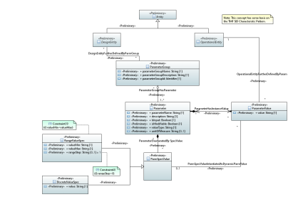

.. Copyright 2020
.. This file is licensed under the CREATIVE COMMONS ATTRIBUTION 4.0 INTERNATIONAL LICENSE
.. Full license text at https://creativecommons.org/licenses/by/4.0/legalcode

Dynamic Parameters Model
========================

Diagrams
--------

Dynamic Parameters 
~~~~~~~~~~~~~~~~~~~

Classes
-------

DiscreteValueSpec
~~~~~~~~~~~~~~~~~

DiscreteValueSpec represents a specific valid value that a given Parameter can take on.

**Parent class:** ParmSpecValue

Applied stereotypes:

-  OpenModelClass

-  **support: MANDATORY**

-  Preliminary

================== ======== ========= ================================== ================================================
**Attribute Name** **Type** **Mult.** **Stereotypes**                    **Description**
value              String   1         Preliminary                        A discrete value that the Parameter can take on.
                                                                        
                                      OpenModelAttribute                
                                                                        
                                      -  isInvariant: false             
                                                                        
                                      -  valueRange: no range constraint
                                                                        
                                      -  support: MANDATORY             
================== ======== ========= ================================== ================================================

Parameter
~~~~~~~~~

Some parameter that is part of a ParameterGroup. If parameter can only hold certain values, those values are specified via ParameterSpecValue (design time). The actual value is specified via ParameterValue (runtime).

Applied stereotypes:

-  OpenModelClass

-  **support: MANDATORY**

-  Preliminary

================== ============== ========= ================================== ==================================================================================================================================================================================================================================================================================================================
**Attribute Name** **Type**       **Mult.** **Stereotypes**                    **Description**
parameterName      String         1         Preliminary                        Name of parameter.
                                                                              
                                            OpenModelAttribute                
                                                                              
                                            -  isInvariant: false             
                                                                              
                                            -  valueRange: no range constraint
                                                                              
                                            -  support: MANDATORY             
IsInput            Boolean        1         Preliminary                        Boolean that specifices if this parameter is an input parameter.
                                                                              
                                            OpenModelAttribute                
                                                                              
                                            -  isInvariant: false             
                                                                              
                                            -  valueRange: no range constraint
                                                                              
                                            -  support: MANDATORY             
paramvalue         ParameterValue 0..\*     OpenModelAttribute                 Parameter can have some number of runtime ParameterValues. Each ParameterValue is also associated with some OperationalEntity (VnfInstance, ServiceInstance, ...).
                                                                              
                                            -  isInvariant: false             
                                                                              
                                            -  valueRange: no range constraint
                                                                              
                                            -  support: MANDATORY             
isModifiable       Boolean        1         Preliminary                        Bolean that specifices if the value can be modified or changed during the life of this parameter.
                                                                              
                                            OpenModelAttribute                
                                                                              
                                            -  isInvariant: false             
                                                                              
                                            -  valueRange: no range constraint
                                                                              
                                            -  support: MANDATORY             
valueType          String         1         Preliminary                        The type of this parameter (integer, string, ...).
                                                                              
                                            OpenModelAttribute                
                                                                              
                                            -  isInvariant: false             
                                                                              
                                            -  valueRange: no range constraint
                                                                              
                                            -  support: MANDATORY             
unitOfMeasure      String         0..1      Preliminary                        A length, surface, volume, dry measure, liquid measure, money, weight, time, and the like. In general, a determinate quantity or magnitude of the kind designated, taken as a standard of comparison for others of the same kind, in assigning to them numerical values, as 1 foot, 1 yard, 1 mile, 1 square foot.
                                                                              
                                            OpenModelAttribute                
                                                                              
                                            -  isInvariant: false             
                                                                              
                                            -  valueRange: no range constraint
                                                                              
                                            -  support: MANDATORY             
description        String         1         Preliminary                        Description of the parameter.
                                                                              
                                            OpenModelAttribute                
                                                                              
                                            -  isInvariant: false             
                                                                              
                                            -  valueRange: no range constraint
                                                                              
                                            -  support: MANDATORY             
================== ============== ========= ================================== ==================================================================================================================================================================================================================================================================================================================

ParameterGroup
~~~~~~~~~~~~~~

A group of parameters that somehow relate or work together.

Applied stereotypes:

-  OpenModelClass

-  **support: MANDATORY**

-  Preliminary

========================= ========== ========= ================================== ==============================
**Attribute Name**        **Type**   **Mult.** **Stereotypes**                    **Description**
parameterGroupName        String     1         Preliminary                        Name of ParameterGroup
                                                                                 
                                               OpenModelAttribute                
                                                                                 
                                               -  isInvariant: false             
                                                                                 
                                               -  valueRange: no range constraint
                                                                                 
                                               -  support: MANDATORY             
parameterGroupDescription String     1         Preliminary                        Description of ParameterGroup.
                                                                                 
                                               OpenModelAttribute                
                                                                                 
                                               -  isInvariant: false             
                                                                                 
                                               -  valueRange: no range constraint
                                                                                 
                                               -  support: MANDATORY             
parameterGroupId          Identifier 1         Preliminary                        ID of ParameterGroup.
                                                                                 
                                               OpenModelAttribute                
                                                                                 
                                               -  isInvariant: false             
                                                                                 
                                               -  valueRange: no range constraint
                                                                                 
                                               -  support: MANDATORY             
========================= ========== ========= ================================== ==============================

ParameterValue
~~~~~~~~~~~~~~

The actual value of Parameter (runtime).

Applied stereotypes:

-  OpenModelClass

-  **support: MANDATORY**

-  Preliminary

================== ========= ========= ================================== ===========================================================================================================================
**Attribute Name** **Type**  **Mult.** **Stereotypes**                    **Description**
parameter          Parameter 1         OpenModelAttribute                 Runtime ParameterValue is associated with exactly one Parameter. Parameter can have some number of runtime ParameterValues.
                                                                         
                                       -  isInvariant: false             
                                                                         
                                       -  valueRange: no range constraint
                                                                         
                                       -  support: MANDATORY             
value              String    1         Preliminary                        The actual value of Parameter (runtime).
                                                                         
                                       OpenModelAttribute                
                                                                         
                                       -  isInvariant: false             
                                                                         
                                       -  valueRange: no range constraint
                                                                         
                                       -  support: MANDATORY             
================== ========= ========= ================================== ===========================================================================================================================

ParmSpecValue
~~~~~~~~~~~~~

A valid value of parameter (design time). Values can be either a range (RangeValueSpec) or discrete (DiscreteValueSpec).

Applied stereotypes:

-  OpenModelClass

-  **support: MANDATORY**

-  Preliminary

RangeValueSpec
~~~~~~~~~~~~~~

RangeValueSpec is generally expected to be of valueType integer or

RangeValueSpec generally should have a valueType of either integer or real. valueFrom, valueTo, and rangeStep should all be of the same valuetype for some Parameter.

rangeStep should be greater than zero.

valueTo should be greater than valueFrom

**Parent class:** ParmSpecValue

Applied stereotypes:

-  OpenModelClass

-  **support: MANDATORY**

-  Preliminary

================== ======== ========= ================================== ==============================================================================================================================================================================================================================
**Attribute Name** **Type** **Mult.** **Stereotypes**                    **Description**
valueMin           String   1         Preliminary                        The minimum value that a Parameter can take on.
                                                                        
                                      OpenModelAttribute                
                                                                        
                                      -  isInvariant: false             
                                                                        
                                      -  valueRange: no range constraint
                                                                        
                                      -  support: MANDATORY             
valueMax           String   1         Preliminary                        The maximum value that the parameter can take on.
                                                                        
                                      OpenModelAttribute                
                                                                        
                                      -  isInvariant: false             
                                                                        
                                      -  valueRange: no range constraint
                                                                        
                                      -  support: MANDATORY             
rangeStep          String   0..1      Preliminary                        The specification that a range of values increases in steps, such as a range from 0 to 100 in steps of 5 with the resulting permitted values being 0, 5, 10, 15,...100. This complements the valueFrom and valueTo attributes.
                                                                        
                                      OpenModelAttribute                
                                                                        
                                      -  isInvariant: false             
                                                                        
                                      -  valueRange: no range constraint
                                                                        
                                      -  support: MANDATORY             
================== ======== ========= ================================== ==============================================================================================================================================================================================================================

Associations
------------

ParameterGroupHasParameter
~~~~~~~~~~~~~~~~~~~~~~~~~~

A Parameter can be in more than one ParameterGroup, and a ParameterGroup can have some number of Parameters.

Applied stereotypes:

-  Preliminary

================== =========== ========== ========= ============== =============== =====================
**Attribute Name** **Aggreg.** **Navig.** **Mult.** **Type**       **Description** **Stereotypes**
parameter          shared      Not navig. 1..\*     Parameter                      OpenModelAttribute
                                                                                  
                                                                                   -  partOfObjectKey: 0
                                                                                  
                                                                                   -  uniqueSet:
                                                                                  
                                                                                   -  isInvariant: false
                                                                                  
                                                                                   -  unsigned: false
                                                                                  
                                                                                   -  counter: NA
                                                                                  
                                                                                   -  support: MANDATORY
dynamicparameter   none        Not navig. 0..\*     ParameterGroup                 OpenModelAttribute
                                                                                  
                                                                                   -  partOfObjectKey: 0
                                                                                  
                                                                                   -  uniqueSet:
                                                                                  
                                                                                   -  isInvariant: false
                                                                                  
                                                                                   -  unsigned: false
                                                                                  
                                                                                   -  counter: NA
                                                                                  
                                                                                   -  support: MANDATORY
================== =========== ========== ========= ============== =============== =====================

ParameterHasInstanceValue
~~~~~~~~~~~~~~~~~~~~~~~~~

Applied stereotypes:

-  Preliminary

================== =========== ========== ========= ============== ================================================================================================================================================================== =====================
**Attribute Name** **Aggreg.** **Navig.** **Mult.** **Type**       **Description**                                                                                                                                                    **Stereotypes**
paramvalue         composite   Navig.     0..\*     ParameterValue Parameter can have some number of runtime ParameterValues. Each ParameterValue is also associated with some OperationalEntity (VnfInstance, ServiceInstance, ...). OpenModelAttribute
                                                                                                                                                                                                                                     
                                                                                                                                                                                                                                      -  partOfObjectKey: 0
                                                                                                                                                                                                                                     
                                                                                                                                                                                                                                      -  uniqueSet:
                                                                                                                                                                                                                                     
                                                                                                                                                                                                                                      -  isInvariant: false
                                                                                                                                                                                                                                     
                                                                                                                                                                                                                                      -  unsigned: false
                                                                                                                                                                                                                                     
                                                                                                                                                                                                                                      -  counter: NA
                                                                                                                                                                                                                                     
                                                                                                                                                                                                                                      -  support: MANDATORY
parameter          none        Navig.     1         Parameter      Runtime ParameterValue is associated with exactly one Parameter. Parameter can have some number of runtime ParameterValues.                                        OpenModelAttribute
                                                                                                                                                                                                                                     
                                                                                                                                                                                                                                      -  partOfObjectKey: 0
                                                                                                                                                                                                                                     
                                                                                                                                                                                                                                      -  uniqueSet:
                                                                                                                                                                                                                                     
                                                                                                                                                                                                                                      -  isInvariant: false
                                                                                                                                                                                                                                     
                                                                                                                                                                                                                                      -  unsigned: false
                                                                                                                                                                                                                                     
                                                                                                                                                                                                                                      -  counter: NA
                                                                                                                                                                                                                                     
                                                                                                                                                                                                                                      -  support: MANDATORY
================== =========== ========== ========= ============== ================================================================================================================================================================== =====================

OperationalEntityFurtherDefinedByParam
~~~~~~~~~~~~~~~~~~~~~~~~~~~~~~~~~~~~~~

Applied stereotypes:

-  Preliminary

================== =========== ========== ========= ================= =============== =====================
**Attribute Name** **Aggreg.** **Navig.** **Mult.** **Type**          **Description** **Stereotypes**
dynamicparamvalue  none        Not navig. 0..\*     ParameterValue                    OpenModelAttribute
                                                                                     
                                                                                      -  partOfObjectKey: 0
                                                                                     
                                                                                      -  uniqueSet:
                                                                                     
                                                                                      -  isInvariant: false
                                                                                     
                                                                                      -  unsigned: false
                                                                                     
                                                                                      -  counter: NA
                                                                                     
                                                                                      -  support: MANDATORY
operationalentity  none        Not navig. 1         OperationalEntity                 OpenModelAttribute
                                                                                     
                                                                                      -  partOfObjectKey: 0
                                                                                     
                                                                                      -  uniqueSet:
                                                                                     
                                                                                      -  isInvariant: false
                                                                                     
                                                                                      -  unsigned: false
                                                                                     
                                                                                      -  counter: NA
                                                                                     
                                                                                      -  support: MANDATORY
================== =========== ========== ========= ================= =============== =====================

DesignEntityFurtherDefinedByParmGroup
~~~~~~~~~~~~~~~~~~~~~~~~~~~~~~~~~~~~~

Applied stereotypes:

-  Preliminary

================== =========== ========== ========= ============== =============== =====================
**Attribute Name** **Aggreg.** **Navig.** **Mult.** **Type**       **Description** **Stereotypes**
dynamicparameter   none        Not navig. 0..\*     ParameterGroup                 OpenModelAttribute
                                                                                  
                                                                                   -  partOfObjectKey: 0
                                                                                  
                                                                                   -  uniqueSet:
                                                                                  
                                                                                   -  isInvariant: false
                                                                                  
                                                                                   -  unsigned: false
                                                                                  
                                                                                   -  counter: NA
                                                                                  
                                                                                   -  support: MANDATORY
designentity       none        Not navig. 0..\*     DesignEntity                   OpenModelAttribute
                                                                                  
                                                                                   -  partOfObjectKey: 0
                                                                                  
                                                                                   -  uniqueSet:
                                                                                  
                                                                                   -  isInvariant: false
                                                                                  
                                                                                   -  unsigned: false
                                                                                  
                                                                                   -  counter: NA
                                                                                  
                                                                                   -  support: MANDATORY
================== =========== ========== ========= ============== =============== =====================

ParmSpecValueIntantiatedAsDynamicParmValue
~~~~~~~~~~~~~~~~~~~~~~~~~~~~~~~~~~~~~~~~~~

Applied stereotypes:

-  Preliminary

================== =========== ========== ========= ============== =============== =====================
**Attribute Name** **Aggreg.** **Navig.** **Mult.** **Type**       **Description** **Stereotypes**
\_parametervalue   none        Not navig. 0..\*     ParameterValue                 OpenModelAttribute
                                                                                  
                                                                                   -  partOfObjectKey: 0
                                                                                  
                                                                                   -  uniqueSet:
                                                                                  
                                                                                   -  isInvariant: false
                                                                                  
                                                                                   -  unsigned: false
                                                                                  
                                                                                   -  counter: NA
                                                                                  
                                                                                   -  support: MANDATORY
parmspecvalueii    none        Not navig. 0..1      ParmSpecValue                  OpenModelAttribute
                                                                                  
                                                                                   -  partOfObjectKey: 0
                                                                                  
                                                                                   -  uniqueSet:
                                                                                  
                                                                                   -  isInvariant: false
                                                                                  
                                                                                   -  unsigned: false
                                                                                  
                                                                                   -  counter: NA
                                                                                  
                                                                                   -  support: MANDATORY
================== =========== ========== ========= ============== =============== =====================

ParameterEnumeratedBy SpecValue
~~~~~~~~~~~~~~~~~~~~~~~~~~~~~~~

Applied stereotypes:

-  Preliminary

================== =========== ========== ========= ============= =============== =====================
**Attribute Name** **Aggreg.** **Navig.** **Mult.** **Type**      **Description** **Stereotypes**
parameter          none        Not navig. 1         Parameter                     OpenModelAttribute
                                                                                 
                                                                                  -  partOfObjectKey: 0
                                                                                 
                                                                                  -  uniqueSet:
                                                                                 
                                                                                  -  isInvariant: false
                                                                                 
                                                                                  -  unsigned: false
                                                                                 
                                                                                  -  counter: NA
                                                                                 
                                                                                  -  support: MANDATORY
parmspecvalueii    composite   Not navig. 0..\*     ParmSpecValue                 OpenModelAttribute
                                                                                 
                                                                                  -  partOfObjectKey: 0
                                                                                 
                                                                                  -  uniqueSet:
                                                                                 
                                                                                  -  isInvariant: false
                                                                                 
                                                                                  -  unsigned: false
                                                                                 
                                                                                  -  counter: NA
                                                                                 
                                                                                  -  support: MANDATORY
================== =========== ========== ========= ============= =============== =====================
