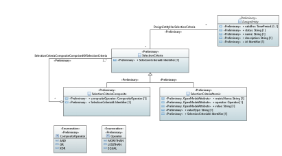

.. Copyright 2020
.. This file is licensed under the CREATIVE COMMONS ATTRIBUTION 4.0 INTERNATIONAL LICENSE
.. Full license text at https://creativecommons.org/licenses/by/4.0/legalcode

Selection Criteria Model
========================

Diagrams
--------

SelectionCriteria 
~~~~~~~~~~~~~~~~~~

Classes
-------

.. _selectioncriteria-1:

SelectionCriteria
~~~~~~~~~~~~~~~~~

SelectionCriteria finds descriptors and instances according to specific properties of those entities.

Applied stereotypes:

-  OpenModelClass

-  **support: MANDATORY**

-  Preliminary

=================== ========== ========= ================================== =============================================
**Attribute Name**  **Type**   **Mult.** **Stereotypes**                    **Description**
SelectionCriteriaId Identifier 1         Preliminary                        Unique indentifier of this SelectionCriteria.
                                                                           
                                         OpenModelAttribute                
                                                                           
                                         -  isInvariant: false             
                                                                           
                                         -  valueRange: no range constraint
                                                                           
                                         -  support: MANDATORY             
=================== ========== ========= ================================== =============================================

SelectionCriteriaAtomic
~~~~~~~~~~~~~~~~~~~~~~~

A simple (atomic) selection criteria that holds a specific attribute comparision expression.

**Parent class:** SelectionCriteria

Applied stereotypes:

-  OpenModelClass

-  **support: MANDATORY**

-  Preliminary

=================== ========== ========= ================================== ==================================================================
**Attribute Name**  **Type**   **Mult.** **Stereotypes**                    **Description**
metricName          String     1         Preliminary                        Name of compared parameter or attribute.
                                                                           
                                         OpenModelAttribute                 Name of compared parameter or attribute.
                                                                           
                                         -  isInvariant: false             
                                                                           
                                         -  valueRange: no range constraint
                                                                           
                                         -  support: MANDATORY             
operator            Operator   1         Preliminary                        Comparison operator, e.g. equal, less than, greater or etc.
                                                                           
                                         OpenModelAttribute                
                                                                           
                                         -  isInvariant: false             
                                                                           
                                         -  valueRange: no range constraint
                                                                           
                                         -  support: MANDATORY             
value               String     1         Preliminary                        Compared value (can be a name of a parameter in referenced class).
                                                                           
                                         OpenModelAttribute                
                                                                           
                                         -  isInvariant: false             
                                                                           
                                         -  valueRange: no range constraint
                                                                           
                                         -  support: MANDATORY             
valueType           String     1         Preliminary                        The type of the value property (String, Integer, Real, ...).
                                                                           
                                         OpenModelAttribute                
                                                                           
                                         -  isInvariant: false             
                                                                           
                                         -  valueRange: no range constraint
                                                                           
                                         -  support: MANDATORY             
SelectionCriteriaId Identifier 1         Preliminary                        Unique indentifier of this SelectionCriteria.
                                                                           
                                         OpenModelAttribute                
                                                                           
                                         -  isInvariant: false             
                                                                           
                                         -  valueRange: no range constraint
                                                                           
                                         -  support: MANDATORY             
=================== ========== ========= ================================== ==================================================================

SelectionCriteriaComposite
~~~~~~~~~~~~~~~~~~~~~~~~~~

A SelectionCriteria that is an aggregation of multiple selection criterias. Agregation can be for example AND, OR, or XOR logical operations.

**Parent class:** SelectionCriteria

Applied stereotypes:

-  OpenModelClass

-  **support: MANDATORY**

-  Preliminary

=================== ================= ========= ================================== =====================================================================
**Attribute Name**  **Type**          **Mult.** **Stereotypes**                    **Description**
compositeOperator   CompositeOperator 1         Preliminary                        Logical operation for filters composition, e.g. logical AND, OR, XOR.
                                                                                  
                                                OpenModelAttribute                
                                                                                  
                                                -  isInvariant: false             
                                                                                  
                                                -  valueRange: no range constraint
                                                                                  
                                                -  support: MANDATORY             
SelectionCriteriaId Identifier        1         Preliminary                        Unique indentifier of this SelectionCriteria.
                                                                                  
                                                OpenModelAttribute                
                                                                                  
                                                -  isInvariant: false             
                                                                                  
                                                -  valueRange: no range constraint
                                                                                  
                                                -  support: MANDATORY             
=================== ================= ========= ================================== =====================================================================

Associations
------------

DesignEntityHasSelectionCriteria
~~~~~~~~~~~~~~~~~~~~~~~~~~~~~~~~

Applied stereotypes:

-  Preliminary

================== =========== ========== ========= ================= =============== =====================
**Attribute Name** **Aggreg.** **Navig.** **Mult.** **Type**          **Description** **Stereotypes**
designentity       none        Not navig. 0..\*     DesignEntity                      OpenModelAttribute
                                                                                     
                                                                                      -  partOfObjectKey: 0
                                                                                     
                                                                                      -  uniqueSet:
                                                                                     
                                                                                      -  isInvariant: false
                                                                                     
                                                                                      -  unsigned: false
                                                                                     
                                                                                      -  counter: NA
                                                                                     
                                                                                      -  support: MANDATORY
selectioncriteria  none        Not navig. 0..\*     SelectionCriteria                 OpenModelAttribute
                                                                                     
                                                                                      -  partOfObjectKey: 0
                                                                                     
                                                                                      -  uniqueSet:
                                                                                     
                                                                                      -  isInvariant: false
                                                                                     
                                                                                      -  unsigned: false
                                                                                     
                                                                                      -  counter: NA
                                                                                     
                                                                                      -  support: MANDATORY
================== =========== ========== ========= ================= =============== =====================

SelectionCriteriaCompositeComprisedOfSelectionCriteria
~~~~~~~~~~~~~~~~~~~~~~~~~~~~~~~~~~~~~~~~~~~~~~~~~~~~~~

Applied stereotypes:

-  Preliminary

========================== =========== ========== ========= ========================== =============== =====================
**Attribute Name**         **Aggreg.** **Navig.** **Mult.** **Type**                   **Description** **Stereotypes**
selectioncriteria          shared      Not navig. 2..\*     SelectionCriteria                          OpenModelAttribute
                                                                                                      
                                                                                                       -  partOfObjectKey: 0
                                                                                                      
                                                                                                       -  uniqueSet:
                                                                                                      
                                                                                                       -  isInvariant: false
                                                                                                      
                                                                                                       -  unsigned: false
                                                                                                      
                                                                                                       -  counter: NA
                                                                                                      
                                                                                                       -  support: MANDATORY
selectioncriteriacomposite none        Not navig. 0..\*     SelectionCriteriaComposite                 OpenModelAttribute
                                                                                                      
                                                                                                       -  partOfObjectKey: 0
                                                                                                      
                                                                                                       -  uniqueSet:
                                                                                                      
                                                                                                       -  isInvariant: false
                                                                                                      
                                                                                                       -  unsigned: false
                                                                                                      
                                                                                                       -  counter: NA
                                                                                                      
                                                                                                       -  support: MANDATORY
========================== =========== ========== ========= ========================== =============== =====================

Enumerations
------------

CompositeOperator
~~~~~~~~~~~~~~~~~

The operator being applied to to some group of selectoin critiera.

Contains Enumeration Literals:

-  AND:

-  OR:

-  XOR:

Operator
~~~~~~~~

The operator being applied to some atomic selection critera.

Contains Enumeration Literals:

-  MORETHAN:

-  LESSTHAN:

-  EQUAL:
