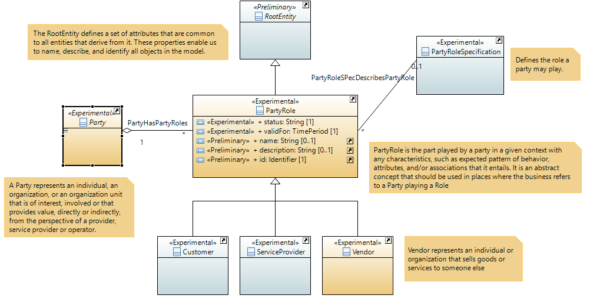
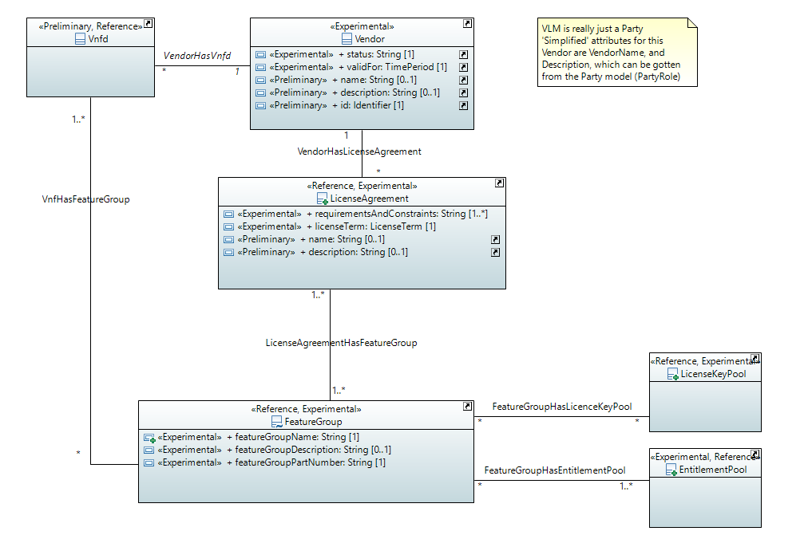
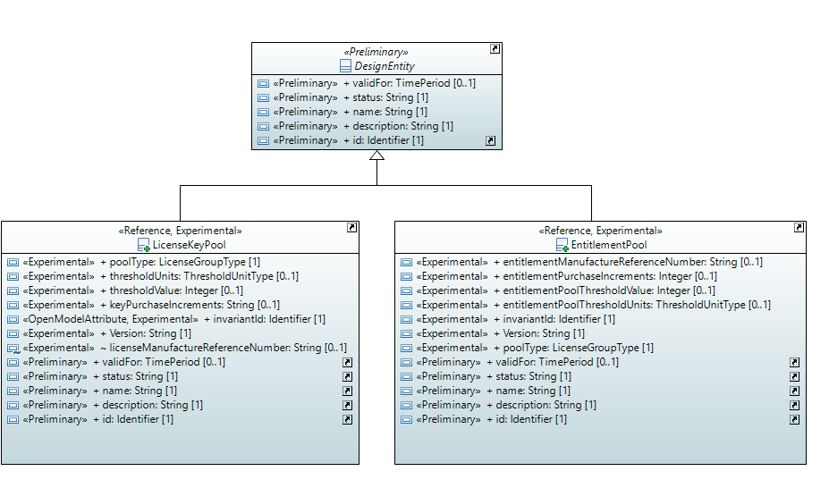
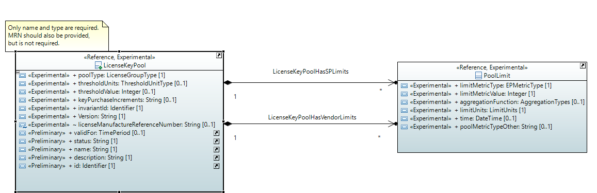
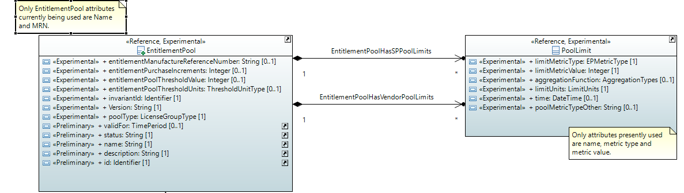

.. Copyright 2020
.. This file is licensed under the CREATIVE COMMONS ATTRIBUTION 4.0 INTERNATIONAL LICENSE
.. Full license text at https://creativecommons.org/licenses/by/4.0/legalcode

License Management Model
========================

Diagrams
--------

Root Entity Hierarchy 
~~~~~~~~~~~~~~~~~~~~~~

License 
~~~~~~~~

Rooting License 
~~~~~~~~~~~~~~~~

License Keys
~~~~~~~~~~~~

Entitlements 
~~~~~~~~~~~~~

Classes
-------

EntitlementPool
~~~~~~~~~~~~~~~

Note: description is required according to the inherited attribute, but it presently is optional.

An EntitlementPool is created for each type of Entitlement that is required for the VNFs. Each Entitlement Pool is assigned a Name and Description for modeling purposes and is uniquely identified by a UUID. In addition, a list of characteristics of the Entitlement Pool are defined.
An EntitlementPool is not specific to a Feature Group. An Entitlement Pool may be related to multiple Feature Groups containing a VNF or even to multiple VNFs.
Purchased entitlements are inventoried in the Entitlement Pools.
Multiple pools for the same type of entitlement may be created based on the constraints.

**Parent class:** DesignEntity

Applied stereotypes:

-  Reference

-  **reference: As Built in SDC; Not related to any release usecase.**

-  Preliminary

-  OpenModelClass

-  **support: MANDATORY**

===================================== ================= ========= ================================== ======================================================================================================================================================================================================================================================================================================================================================================
**Attribute Name**                    **Type**          **Mult.** **Stereotypes**                    **Description**
\_spPoolLimit                         PoolLimit         0..\*     OpenModelAttribute                 Pool limits applied by the service provider
                                                                                                    
                                                                  -  isInvariant: false             
                                                                                                    
                                                                  -  valueRange: no range constraint
                                                                                                    
                                                                  -  support: MANDATORY             
\_vendorPoolLimit                     PoolLimit         0..\*     OpenModelAttribute                 Pool limits applied by the vendor.
                                                                                                    
                                                                  -  isInvariant: false             
                                                                                                    
                                                                  -  valueRange: no range constraint
                                                                                                    
                                                                  -  support: MANDATORY             
entitlementManufactureReferenceNumber String            0..1      OpenModelAttribute                 Reference number for the entitlement as described by the vendor in their price list / catalog /contract.
                                                                                                    
                                                                  -  isInvariant: false             
                                                                                                    
                                                                  -  valueRange: no range constraint
                                                                                                    
                                                                  -  support: MANDATORY             
                                                                                                    
                                                                  Preliminary                       
entitlementPurchaseIncrements         Integer           0..1      OpenModelAttribute                 This field contains information to tell a Designer how the entitlement must be purchased. For example, if the entitlement must be purchased in blocks of 1000, the increment would be 1000.
                                                                                                    
                                                                  -  isInvariant: false             
                                                                                                    
                                                                  -  valueRange: no range constraint
                                                                                                    
                                                                  -  support: MANDATORY             
                                                                                                    
                                                                  Preliminary                       
entitlementPoolThresholdValue         Integer           0..1      OpenModelAttribute                 A description of a threshold that will be assessed for some business purpose (e.g. 20% of entitlement pool remains available). (The threshold of interest to DCAE or Capacity Planning, etc.) This may be an absolute value or a percentage. For example:
                                                                                                     when 90% of the pool is in-use, trigger an additional purchase of inventory.
                                                                  -  isInvariant: false             
                                                                                                     A description of a threshold that will be assessed for some business purpose (e.g. 20% of entitlement pool remains available). (The threshold of interest to DCAE or Capacity Planning, etc.) This may be an absolute value or a percentage. For example:
                                                                  -  valueRange: no range constraint when 90% of the pool is in-use, trigger an additional purchase of inventory.
                                                                                                    
                                                                  -  support: MANDATORY             
                                                                                                    
                                                                  Preliminary                       
entitlementPoolThresholdUnits         ThresholdUnitType 0..1      OpenModelAttribute                 Specifies the Units for the ThresholdValue.
                                                                                                    
                                                                  -  isInvariant: false             
                                                                                                    
                                                                  -  valueRange: no range constraint
                                                                                                    
                                                                  -  support: MANDATORY             
                                                                                                    
                                                                  Preliminary                       
invariantId                           Identifier        1         OpenModelAttribute                 Identifier that stays the same irrespective of version.
                                                                                                    
                                                                  -  isInvariant: false              Identifier that stays the same irrespective of version.
                                                                                                    
                                                                  -  valueRange: no range constraint
                                                                                                    
                                                                  -  support: MANDATORY             
                                                                                                    
                                                                  Preliminary                       
Version                               String            1         OpenModelAttribute                 The version of this entity.
                                                                                                    
                                                                  -  isInvariant: false             
                                                                                                    
                                                                  -  valueRange: no range constraint
                                                                                                    
                                                                  -  support: MANDATORY             
                                                                                                    
                                                                  Preliminary                       
poolType                              LicenseGroupType  1         OpenModelAttribute                 The license key may be 'universal' or 'unique' or 'one-time'.
                                                                                                     - A 'universal' value indicates that the same exact license key (string) may be associated with all instances of the VNF.
                                                                  -  isInvariant: false              - A 'unique' value indicates that each instance of the VNF must be related to a unique license key (string). When no longer needed, the key may be returned to the license key pool for reuse.
                                                                                                     - A 'one-time' value indicates that each instance of the VNF must be related to a unique license key (string). When no longer needed, the key may not be reused.
                                                                  -  valueRange: no range constraint
                                                                                                    
                                                                  -  support: MANDATORY             
                                                                                                    
                                                                  Preliminary                       
validFor                              TimePeriod        0..1      Preliminary                        The period during which the design entity is valid.
                                                                                                    
                                                                  OpenModelAttribute                
                                                                                                    
                                                                  -  isInvariant: false             
                                                                                                    
                                                                  -  valueRange: no range constraint
                                                                                                    
                                                                  -  support: MANDATORY             
status                                String            1         Preliminary                        The condition of the specification, such s active, inactive, or planned.
                                                                                                    
                                                                  OpenModelAttribute                
                                                                                                    
                                                                  -  isInvariant: false             
                                                                                                    
                                                                  -  valueRange: no range constraint
                                                                                                    
                                                                  -  support: MANDATORY             
name                                  String            1         Preliminary                        Represents a user-friendly identifier of an object. It is a (possibly ambiguous) name by which the object is commonly known in some limited scope (such as an organization) and conforms to the naming conventions of the country or culture with which it is associated. It is NOT used as a naming attribute (i.e., to uniquely identify an instance of the object).
                                                                                                    
                                                                  OpenModelAttribute                
                                                                                                    
                                                                  -  isInvariant: false             
                                                                                                    
                                                                  -  valueRange: no range constraint
                                                                                                    
                                                                  -  support: MANDATORY             
description                           String            1         Preliminary                        Defines a textual free-form description of the object.
                                                                                                    
                                                                  OpenModelAttribute                
                                                                                                    
                                                                  -  isInvariant: false             
                                                                                                    
                                                                  -  valueRange: no range constraint
                                                                                                    
                                                                  -  support: MANDATORY             
id                                    Identifier        1         Preliminary                        Identifier of this information element. This attribute shall be globally unique.
                                                                                                    
                                                                  OpenModelAttribute                 Unambiguously distinguishes different object instances. It is the naming attribute of the object.
                                                                                                    
                                                                  -  isInvariant: false             
                                                                                                    
                                                                  -  valueRange: no range constraint
                                                                                                    
                                                                  -  support: MANDATORY             
===================================== ================= ========= ================================== ======================================================================================================================================================================================================================================================================================================================================================================

FeatureGroup
~~~~~~~~~~~~

Feature groups represent a set of the features of one or more VNFs. Feature groups may be defined by the vendor and/or by the service provider. A VNF may be related to multiple feature groups. At least one feature group will be related to a VNF. If no sub-sets are needed, a single feature group will be defined that represents the base or core capabilities of the VNF(s) in it.
If an Entitlement Pool or License Key Group is associated with a particular Feature Group, the Feature Group becomes a "constraint" for the pool/group.

Applied stereotypes:

-  Reference

-  **reference: As Built in SDC; Not related to any release usecase.**

-  Preliminary

-  OpenModelClass

-  **support: MANDATORY**

======================= ======== ========= ================================== ======================================================================================================================================
**Attribute Name**      **Type** **Mult.** **Stereotypes**                    **Description**
featureGroupName        String   1         OpenModelAttribute                 Name of the feature group
                                                                             
                                           -  isInvariant: false             
                                                                             
                                           -  valueRange: no range constraint
                                                                             
                                           -  support: MANDATORY             
                                                                             
                                           Preliminary                       
featureGroupDescription String   0..1      OpenModelAttribute                 Description of the feature group.
                                                                             
                                           -  isInvariant: false             
                                                                             
                                           -  valueRange: no range constraint
                                                                             
                                           -  support: MANDATORY             
                                                                             
                                           Preliminary                       
featureGroupPartNumber  String   1         OpenModelAttribute                 The featureGroupPartNumber specifies the Vnf that this FeatureGroup is related to.
                                                                             
                                           -  isInvariant: false              The featureGroupPartNumber specifies the SKU or reference number that the Vendor has for the Vnf that this FeatureGroup is related to.
                                                                             
                                           -  valueRange: no range constraint
                                                                             
                                           -  support: MANDATORY             
                                                                             
                                           Preliminary                       
======================= ======== ========= ================================== ======================================================================================================================================

LicenseAgreement
~~~~~~~~~~~~~~~~

An agreement between the service provider and a given vendor granting the service provider to use the vendor's products. Generally the license agreement is specific to a family of vendor products and/or to some service provider's project/product or product family.

**Parent class:** Agreement

Applied stereotypes:

-  Reference

-  **reference: As Built in SDC; Not related to any release usecase.**

-  Preliminary

-  OpenModelClass

-  **support: MANDATORY**

========================== =========== ========= ================================== ======================================================================================================================================================================================================================================================================================================================================================================
**Attribute Name**         **Type**    **Mult.** **Stereotypes**                    **Description**
requirementsAndConstraints String      1..\*     OpenModelAttribute                 Free form text. Includes information such as operating system or hypervisor required for the VNF. This may also contain factors to be considered in deployment/placement of the VNF instances. These requirements and constraints may need to be abstracted as policies or other business rules.
                                                                                   
                                                 -  isInvariant: false              Free form text. Includes information such as operating system or hypervisor required for the VNF. This may also contain factors to be considered in deployment/placement of the VNF instances. These requirements and constraints may need to be abstracted as policies or other business rules.
                                                                                   
                                                 -  valueRange: no range constraint
                                                                                   
                                                 -  support: MANDATORY             
                                                                                   
                                                 Preliminary                       
licenseTerm                LicenseTerm 1         OpenModelAttribute                 Term of the license:
                                                                                    -fixed term
                                                 -  isInvariant: false              -perpetual
                                                                                    -unlimited
                                                 -  valueRange: no range constraint -subscription
                                                                                   
                                                 -  support: MANDATORY             
                                                                                   
                                                 Preliminary                       
documentNumber             String      1         Preliminary                        A reference number assigned to an Agreement that follows a prescribed numbering system.
                                                                                   
                                                 OpenModelAttribute                
                                                                                   
                                                 -  isInvariant: false             
                                                                                   
                                                 -  valueRange: no range constraint
                                                                                   
                                                 -  support: MANDATORY             
statementOfIntent          String      1         Preliminary                        An overview and goals of the Agreement.
                                                                                   
                                                 OpenModelAttribute                
                                                                                   
                                                 -  isInvariant: false             
                                                                                   
                                                 -  valueRange: no range constraint
                                                                                   
                                                 -  support: MANDATORY             
StartDate                  DateTime    1         Preliminary                        Date interaction initiated
                                                                                   
                                                 OpenModelAttribute                
                                                                                   
                                                 -  isInvariant: false             
                                                                                   
                                                 -  valueRange: no range constraint
                                                                                   
                                                 -  support: MANDATORY             
endDate                    DateTime    1         Preliminary                        The date on which an interaction is closed or completed.
                                                                                   
                                                 OpenModelAttribute                
                                                                                   
                                                 -  isInvariant: false             
                                                                                   
                                                 -  valueRange: no range constraint
                                                                                   
                                                 -  support: MANDATORY             
Status                     String      0..1      Preliminary                        The current condition of an interaction, such as open, in research, closed, and so forth
                                                                                   
                                                 OpenModelAttribute                
                                                                                   
                                                 -  isInvariant: false             
                                                                                   
                                                 -  valueRange: no range constraint
                                                                                   
                                                 -  support: MANDATORY             
name                       String      0..1      Preliminary                        Represents a user-friendly identifier of an object. It is a (possibly ambiguous) name by which the object is commonly known in some limited scope (such as an organization) and conforms to the naming conventions of the country or culture with which it is associated. It is NOT used as a naming attribute (i.e., to uniquely identify an instance of the object).
                                                                                   
                                                 OpenModelAttribute                
                                                                                   
                                                 -  isInvariant: false             
                                                                                   
                                                 -  valueRange: no range constraint
                                                                                   
                                                 -  support: MANDATORY             
description                String      0..1      Preliminary                        Defines a textual free-form description of the object.
                                                                                   
                                                 OpenModelAttribute                
                                                                                   
                                                 -  isInvariant: false             
                                                                                   
                                                 -  valueRange: no range constraint
                                                                                   
                                                 -  support: MANDATORY             
id                         Identifier  1         Preliminary                        Identifier of this information element. This attribute shall be globally unique.
                                                                                   
                                                 OpenModelAttribute                 Unambiguously distinguishes different object instances. It is the naming attribute of the object.
                                                                                   
                                                 -  isInvariant: false             
                                                                                   
                                                 -  valueRange: no range constraint
                                                                                   
                                                 -  support: MANDATORY             
========================== =========== ========= ================================== ======================================================================================================================================================================================================================================================================================================================================================================

LicenseKeyPool
~~~~~~~~~~~~~~

A License Key Pool is created for each type of License Key that is required for the VNF.
Each License Key Pool is assigned a Name and Description for modeling purposes and is uniquely identified by a UUID. In addition, a list of characteristics of the License Key Pool are defined.
The license key Pool model provides a description to interested systems for the license keys that are provided by a vendor.
A license key Pool is not specific to a feature group. A license key Pool may be related to multiple feature groups that a VNF belongs to or even to multiple VNFs.

**Parent class:** DesignEntity

Applied stereotypes:

-  Reference

-  **reference: As Built in SDC; Not related to any release usecase.**

-  Preliminary

-  OpenModelClass

-  **support: MANDATORY**

================================= ================= ========= ================================== ======================================================================================================================================================================================================================================================================================================================================================================
**Attribute Name**                **Type**          **Mult.** **Stereotypes**                    **Description**
\_spPooLlimit                     PoolLimit         0..\*     OpenModelAttribute                 Pool limits applied by the service provider
                                                                                                
                                                              -  isInvariant: false             
                                                                                                
                                                              -  valueRange: no range constraint
                                                                                                
                                                              -  support: MANDATORY             
\_vendorPoollimit                 PoolLimit         0..\*     OpenModelAttribute                 Pool limits applied by the vendor.
                                                                                                
                                                              -  isInvariant: false             
                                                                                                
                                                              -  valueRange: no range constraint
                                                                                                
                                                              -  support: MANDATORY             
poolType                          LicenseGroupType  1         OpenModelAttribute                 The license key may be 'universal' or 'unique' or 'one-time'.
                                                                                                 - A 'universal' value indicates that the same exact license key (string) may be associated with all instances of the VNF.
                                                              -  isInvariant: false              - A 'unique' value indicates that each instance of the VNF must be related to a unique license key (string). When no longer needed, the key may be returned to the license key pool for reuse.
                                                                                                 - A 'one-time' value indicates that each instance of the VNF must be related to a unique license key (string). When no longer needed, the key may not be reused.
                                                              -  valueRange: no range constraint
                                                                                                
                                                              -  support: MANDATORY             
                                                                                                
                                                              Preliminary                       
thresholdUnits                    ThresholdUnitType 0..1      OpenModelAttribute                 Units can be either absolute or a percentage (%).
                                                                                                
                                                              -  isInvariant: false             
                                                                                                
                                                              -  valueRange: no range constraint
                                                                                                
                                                              -  support: MANDATORY             
                                                                                                
                                                              Preliminary                       
thresholdValue                    Integer           0..1      OpenModelAttribute                 Specified threshold value for the license key pool.
                                                                                                
                                                              -  isInvariant: false             
                                                                                                
                                                              -  valueRange: no range constraint
                                                                                                
                                                              -  support: MANDATORY             
                                                                                                
                                                              Preliminary                       
keyPurchaseIncrements             String            0..1      OpenModelAttribute                 Specifies how the key must be purchased. If in blocks of 1000, the increment would be 1000.
                                                                                                
                                                              -  isInvariant: false             
                                                                                                
                                                              -  valueRange: no range constraint
                                                                                                
                                                              -  support: MANDATORY             
                                                                                                
                                                              Preliminary                       
invariantId                       Identifier        1         OpenModelAttribute                 Identifier that stays the same irrespective of version.
                                                                                                
                                                              -  isInvariant: false             
                                                                                                
                                                              -  valueRange: no range constraint
                                                                                                
                                                              -  support: MANDATORY             
                                                                                                
                                                              Preliminary                       
Version                           String            1         OpenModelAttribute                 The version of this entity.
                                                                                                
                                                              -  isInvariant: false             
                                                                                                
                                                              -  valueRange: no range constraint
                                                                                                
                                                              -  support: MANDATORY             
                                                                                                
                                                              Preliminary                       
licenseManufactureReferenceNumber String            0..1      OpenModelAttribute                 Identifier for the entitlement as described by the vendor in their price list / catalog /contract.
                                                                                                
                                                              -  isInvariant: false             
                                                                                                
                                                              -  valueRange: no range constraint
                                                                                                
                                                              -  support: MANDATORY             
                                                                                                
                                                              Preliminary                       
validFor                          TimePeriod        0..1      Preliminary                        The period during which the design entity is valid.
                                                                                                
                                                              OpenModelAttribute                
                                                                                                
                                                              -  isInvariant: false             
                                                                                                
                                                              -  valueRange: no range constraint
                                                                                                
                                                              -  support: MANDATORY             
status                            String            1         Preliminary                        The condition of the specification, such s active, inactive, or planned.
                                                                                                
                                                              OpenModelAttribute                
                                                                                                
                                                              -  isInvariant: false             
                                                                                                
                                                              -  valueRange: no range constraint
                                                                                                
                                                              -  support: MANDATORY             
name                              String            1         Preliminary                        Represents a user-friendly identifier of an object. It is a (possibly ambiguous) name by which the object is commonly known in some limited scope (such as an organization) and conforms to the naming conventions of the country or culture with which it is associated. It is NOT used as a naming attribute (i.e., to uniquely identify an instance of the object).
                                                                                                
                                                              OpenModelAttribute                
                                                                                                
                                                              -  isInvariant: false             
                                                                                                
                                                              -  valueRange: no range constraint
                                                                                                
                                                              -  support: MANDATORY             
description                       String            1         Preliminary                        Defines a textual free-form description of the object.
                                                                                                
                                                              OpenModelAttribute                
                                                                                                
                                                              -  isInvariant: false             
                                                                                                
                                                              -  valueRange: no range constraint
                                                                                                
                                                              -  support: MANDATORY             
id                                Identifier        1         Preliminary                        Identifier of this information element. This attribute shall be globally unique.
                                                                                                
                                                              OpenModelAttribute                 Unambiguously distinguishes different object instances. It is the naming attribute of the object.
                                                                                                
                                                              -  isInvariant: false             
                                                                                                
                                                              -  valueRange: no range constraint
                                                                                                
                                                              -  support: MANDATORY             
================================= ================= ========= ================================== ======================================================================================================================================================================================================================================================================================================================================================================

PoolLimit
~~~~~~~~~

A variable set of values that identify the limits that may be imposed by an entitlement instance in the pool. Multiple constraints may be applicable for an instance of entitlement in the pool. For example, an entitlement based on GB and number of sessions. Increments, aggregation function, time scope, threshold value may repeat for each metric in the list.
Limits can be applied by the vendor or the service provider.

Applied stereotypes:

-  Reference

-  **reference: As Built in SDC; Not related to any release usecase.**

-  Preliminary

-  OpenModelClass

-  **support: MANDATORY**

=================== ================ ========= ================================== ===================================================================================================================================================
**Attribute Name**  **Type**         **Mult.** **Stereotypes**                    **Description**
limitMetricType     EPMetricType     1         OpenModelAttribute                 Specifies if this pool holds entitlements based on usage of the VNF instance (number of users), number of sessions, country, line of business, etc.
                                                                                 
                                               -  isInvariant: false             
                                                                                 
                                               -  valueRange: no range constraint
                                                                                 
                                               -  support: MANDATORY             
                                                                                 
                                               Preliminary                       
limitMetricValue    Integer          1         OpenModelAttribute                 The value of some limit being applied.
                                                                                 
                                               -  isInvariant: false             
                                                                                 
                                               -  valueRange: no range constraint
                                                                                 
                                               -  support: MANDATORY             
                                                                                 
                                               Preliminary                       
aggregationFunction AggregationTypes 0..1      OpenModelAttribute                 Type of aggregation being performed (Peak or Average)
                                                                                 
                                               -  isInvariant: false             
                                                                                 
                                               -  valueRange: no range constraint
                                                                                 
                                               -  support: MANDATORY             
                                                                                 
                                               Preliminary                       
limitUnits          LimitUnits       1         OpenModelAttribute                 The units of the limit (Trunks, Users, Subscribers, Sessions, tentants, Tokens, Seats, TB, GB, MB, ...)
                                                                                 
                                               -  isInvariant: false             
                                                                                 
                                               -  valueRange: no range constraint
                                                                                 
                                               -  support: MANDATORY             
                                                                                 
                                               Preliminary                       
time                DateTime         0..1      OpenModelAttribute                 Units time is specified in (day, month, hour, minute, second, millisecond.
                                                                                 
                                               -  isInvariant: false             
                                                                                 
                                               -  valueRange: no range constraint
                                                                                 
                                               -  support: MANDATORY             
                                                                                 
                                               Preliminary                       
poolMetricTypeOther String           0..1      OpenModelAttribute                 LimitMetricType if Other enumeration is selected.
                                                                                 
                                               -  isInvariant: false             
                                                                                 
                                               -  valueRange: no range constraint
                                                                                 
                                               -  support: MANDATORY             
                                                                                 
                                               Preliminary                       
=================== ================ ========= ================================== ===================================================================================================================================================

Associations
------------

LicenseKeyPoolHasSPLimits
~~~~~~~~~~~~~~~~~~~~~~~~~

LicenseKey can have some number of service provider based limits applied to it.

Applied stereotypes:

================== =========== ========== ========= ============== ============================================================================= =====================
**Attribute Name** **Aggreg.** **Navig.** **Mult.** **Type**       **Description**                                                               **Stereotypes**
\_spPooLlimit      composite   Navig.     0..\*     PoolLimit      Pool limits applied by the service provider                                   OpenModelAttribute
                                                                                                                                                
                                                                                                                                                 -  partOfObjectKey: 0
                                                                                                                                                
                                                                                                                                                 -  uniqueSet:
                                                                                                                                                
                                                                                                                                                 -  isInvariant: false
                                                                                                                                                
                                                                                                                                                 -  unsigned: false
                                                                                                                                                
                                                                                                                                                 -  counter: NA
                                                                                                                                                
                                                                                                                                                 -  support: MANDATORY
licencekeypool     none        Not navig. 1         LicenseKeyPool lLicenseKeyPool can have some number of service provider specified PoolLimits OpenModelAttribute
                                                                                                                                                
                                                                                                                                                 -  partOfObjectKey: 0
                                                                                                                                                
                                                                                                                                                 -  uniqueSet:
                                                                                                                                                
                                                                                                                                                 -  isInvariant: false
                                                                                                                                                
                                                                                                                                                 -  unsigned: false
                                                                                                                                                
                                                                                                                                                 -  counter: NA
                                                                                                                                                
                                                                                                                                                 -  support: MANDATORY
================== =========== ========== ========= ============== ============================================================================= =====================

LicenseKeyPoolHasVendorLimits
~~~~~~~~~~~~~~~~~~~~~~~~~~~~~

LicenseKey can have some number of vendor based limits applied to it.

Applied stereotypes:

================== =========== ========== ========= ============== ================================== =====================
**Attribute Name** **Aggreg.** **Navig.** **Mult.** **Type**       **Description**                    **Stereotypes**
\_vendorPoollimit  composite   Navig.     0..\*     PoolLimit      Pool limits applied by the vendor. OpenModelAttribute
                                                                                                     
                                                                                                      -  partOfObjectKey: 0
                                                                                                     
                                                                                                      -  uniqueSet:
                                                                                                     
                                                                                                      -  isInvariant: false
                                                                                                     
                                                                                                      -  unsigned: false
                                                                                                     
                                                                                                      -  counter: NA
                                                                                                     
                                                                                                      -  support: MANDATORY
licencekeypooldesc none        Not navig. 1         LicenseKeyPool                                    OpenModelAttribute
                                                                                                     
                                                                                                      -  partOfObjectKey: 0
                                                                                                     
                                                                                                      -  uniqueSet:
                                                                                                     
                                                                                                      -  isInvariant: false
                                                                                                     
                                                                                                      -  unsigned: false
                                                                                                     
                                                                                                      -  counter: NA
                                                                                                     
                                                                                                      -  support: MANDATORY
================== =========== ========== ========= ============== ================================== =====================

EntitlementPoolHasSPPoolLimits
~~~~~~~~~~~~~~~~~~~~~~~~~~~~~~

An EntitlementPool and the associated Entitlements can have some number of Service Provider based limits.

Applied stereotypes:

================== =========== ========== ========= =============== ========================================================================== =====================
**Attribute Name** **Aggreg.** **Navig.** **Mult.** **Type**        **Description**                                                            **Stereotypes**
\_spPoolLimit      composite   Navig.     0..\*     PoolLimit       Pool limits applied by the service provider                                OpenModelAttribute
                                                                                                                                              
                                                                                                                                               -  partOfObjectKey: 0
                                                                                                                                              
                                                                                                                                               -  uniqueSet:
                                                                                                                                              
                                                                                                                                               -  isInvariant: false
                                                                                                                                              
                                                                                                                                               -  unsigned: false
                                                                                                                                              
                                                                                                                                               -  counter: NA
                                                                                                                                              
                                                                                                                                               -  support: MANDATORY
entitlementpool    none        Not navig. 1         EntitlementPool EntitlementPool can have some number of service provider specified limits. OpenModelAttribute
                                                                                                                                              
                                                                                                                                               -  partOfObjectKey: 0
                                                                                                                                              
                                                                                                                                               -  uniqueSet:
                                                                                                                                              
                                                                                                                                               -  isInvariant: false
                                                                                                                                              
                                                                                                                                               -  unsigned: false
                                                                                                                                              
                                                                                                                                               -  counter: NA
                                                                                                                                              
                                                                                                                                               -  support: MANDATORY
================== =========== ========== ========= =============== ========================================================================== =====================

EntitlementPoolHasVendorPoolLimits
~~~~~~~~~~~~~~~~~~~~~~~~~~~~~~~~~~

An EntitlementPool and the associated Entitlements can have some number of Vendor based limits.

Applied stereotypes:

================== =========== ========== ========= =============== ==================================================================== =====================
**Attribute Name** **Aggreg.** **Navig.** **Mult.** **Type**        **Description**                                                      **Stereotypes**
\_vendorPoolLimit  composite   Navig.     0..\*     PoolLimit       Pool limits applied by the vendor.                                   OpenModelAttribute
                                                                                                                                        
                                                                                                                                         -  partOfObjectKey: 0
                                                                                                                                        
                                                                                                                                         -  uniqueSet:
                                                                                                                                        
                                                                                                                                         -  isInvariant: false
                                                                                                                                        
                                                                                                                                         -  unsigned: false
                                                                                                                                        
                                                                                                                                         -  counter: NA
                                                                                                                                        
                                                                                                                                         -  support: MANDATORY
entitlementpool    none        Not navig. 1         EntitlementPool The EntitlementPool can have some number of Vendor specified limits. OpenModelAttribute
                                                                                                                                        
                                                                                                                                         -  partOfObjectKey: 0
                                                                                                                                        
                                                                                                                                         -  uniqueSet:
                                                                                                                                        
                                                                                                                                         -  isInvariant: false
                                                                                                                                        
                                                                                                                                         -  unsigned: false
                                                                                                                                        
                                                                                                                                         -  counter: NA
                                                                                                                                        
                                                                                                                                         -  support: MANDATORY
================== =========== ========== ========= =============== ==================================================================== =====================

FeatureGroupHasEntitlementPool
~~~~~~~~~~~~~~~~~~~~~~~~~~~~~~

A FeatureGroup can have one or more EntitlementPools associated with it.

Applied stereotypes:

================== =========== ========== ========= =============== =============================================================== =====================
**Attribute Name** **Aggreg.** **Navig.** **Mult.** **Type**        **Description**                                                 **Stereotypes**
entitlementpool    none        Not navig. 1..\*     EntitlementPool The EntitlementPool can be related to one FeatureGroup          OpenModelAttribute
                                                                                                                                   
                                                                                                                                    -  partOfObjectKey: 0
                                                                                                                                   
                                                                                                                                    -  uniqueSet:
                                                                                                                                   
                                                                                                                                    -  isInvariant: false
                                                                                                                                   
                                                                                                                                    -  unsigned: false
                                                                                                                                   
                                                                                                                                    -  counter: NA
                                                                                                                                   
                                                                                                                                    -  support: MANDATORY
featuregroup       none        Not navig. 0..\*     FeatureGroup    FeatureGroup can be related to some number of EntitlementPools. OpenModelAttribute
                                                                                                                                   
                                                                                                                                    -  partOfObjectKey: 0
                                                                                                                                   
                                                                                                                                    -  uniqueSet:
                                                                                                                                   
                                                                                                                                    -  isInvariant: false
                                                                                                                                   
                                                                                                                                    -  unsigned: false
                                                                                                                                   
                                                                                                                                    -  counter: NA
                                                                                                                                   
                                                                                                                                    -  support: MANDATORY
================== =========== ========== ========= =============== =============================================================== =====================

FeatureGroupHasLicenceKeyPool
~~~~~~~~~~~~~~~~~~~~~~~~~~~~~

FeatureGroup can have 1 or more LicenseKeyPools and related LicenseKeys related to it.

Applied stereotypes:

================== =========== ========== ========= ============== ================================================================ =====================
**Attribute Name** **Aggreg.** **Navig.** **Mult.** **Type**       **Description**                                                  **Stereotypes**
licencekeypool     none        Not navig. 0..\*     LicenseKeyPool LicenseKeyPool is related to one FeatureGroup                    OpenModelAttribute
                                                                                                                                   
                                                                                                                                    -  partOfObjectKey: 0
                                                                                                                                   
                                                                                                                                    -  uniqueSet:
                                                                                                                                   
                                                                                                                                    -  isInvariant: false
                                                                                                                                   
                                                                                                                                    -  unsigned: false
                                                                                                                                   
                                                                                                                                    -  counter: NA
                                                                                                                                   
                                                                                                                                    -  support: MANDATORY
featuregroup       none        Not navig. 0..\*     FeatureGroup   A feature group can be related to some number of LicenseKeyPools OpenModelAttribute
                                                                                                                                   
                                                                                                                                    -  partOfObjectKey: 0
                                                                                                                                   
                                                                                                                                    -  uniqueSet:
                                                                                                                                   
                                                                                                                                    -  isInvariant: false
                                                                                                                                   
                                                                                                                                    -  unsigned: false
                                                                                                                                   
                                                                                                                                    -  counter: NA
                                                                                                                                   
                                                                                                                                    -  support: MANDATORY
================== =========== ========== ========= ============== ================================================================ =====================

LicenseAgreementHasFeatureGroup
~~~~~~~~~~~~~~~~~~~~~~~~~~~~~~~

Applied stereotypes:

================== =========== ========== ========= ================ =============== =====================
**Attribute Name** **Aggreg.** **Navig.** **Mult.** **Type**         **Description** **Stereotypes**
featuregroup       none        Not navig. 1..\*     FeatureGroup                     OpenModelAttribute
                                                                                    
                                                                                     -  partOfObjectKey: 0
                                                                                    
                                                                                     -  uniqueSet:
                                                                                    
                                                                                     -  isInvariant: false
                                                                                    
                                                                                     -  unsigned: false
                                                                                    
                                                                                     -  counter: NA
                                                                                    
                                                                                     -  support: MANDATORY
licenseagreement   none        Not navig. 1..\*     LicenseAgreement                 OpenModelAttribute
                                                                                    
                                                                                     -  partOfObjectKey: 0
                                                                                    
                                                                                     -  uniqueSet:
                                                                                    
                                                                                     -  isInvariant: false
                                                                                    
                                                                                     -  unsigned: false
                                                                                    
                                                                                     -  counter: NA
                                                                                    
                                                                                     -  support: MANDATORY
================== =========== ========== ========= ================ =============== =====================

VendorHasVnfd
~~~~~~~~~~~~~

Applied stereotypes:

================== =========== ========== ========= ======== =============== =====================
**Attribute Name** **Aggreg.** **Navig.** **Mult.** **Type** **Description** **Stereotypes**
vendor             none        Not navig. 1         Vendor                  
vnfd               none        Not navig. 0..\*     Vnfd                     OpenModelAttribute
                                                                            
                                                                             -  partOfObjectKey: 0
                                                                            
                                                                             -  uniqueSet:
                                                                            
                                                                             -  isInvariant: false
                                                                            
                                                                             -  unsigned: false
                                                                            
                                                                             -  counter: NA
                                                                            
                                                                             -  support: MANDATORY
================== =========== ========== ========= ======== =============== =====================

VendorHasLicenseAgreement
~~~~~~~~~~~~~~~~~~~~~~~~~

Applied stereotypes:

================== =========== ========== ========= ================ =================================================== =====================
**Attribute Name** **Aggreg.** **Navig.** **Mult.** **Type**         **Description**                                     **Stereotypes**
vendor             none        Not navig. 1         Vendor           A Vendor can have some number of LicenseAgreements. OpenModelAttribute
                                                                                                                        
                                                                                                                         -  partOfObjectKey: 0
                                                                                                                        
                                                                                                                         -  uniqueSet:
                                                                                                                        
                                                                                                                         -  isInvariant: false
                                                                                                                        
                                                                                                                         -  unsigned: false
                                                                                                                        
                                                                                                                         -  counter: NA
                                                                                                                        
                                                                                                                         -  support: MANDATORY
licenseagreement   none        Not navig. 0..\*     LicenseAgreement A LicenseAgreement is related to some vendor.       OpenModelAttribute
                                                                                                                        
                                                                                                                         -  partOfObjectKey: 0
                                                                                                                        
                                                                                                                         -  uniqueSet:
                                                                                                                        
                                                                                                                         -  isInvariant: false
                                                                                                                        
                                                                                                                         -  unsigned: false
                                                                                                                        
                                                                                                                         -  counter: NA
                                                                                                                        
                                                                                                                         -  support: MANDATORY
================== =========== ========== ========= ================ =================================================== =====================

VnfHasFeatureGroup
~~~~~~~~~~~~~~~~~~

A Vnf can have some number of feature groups. A feature group can apply to one or more Vnfs.

Applied stereotypes:

================== =========== ========== ========= ============ =============== =====================
**Attribute Name** **Aggreg.** **Navig.** **Mult.** **Type**     **Description** **Stereotypes**
featuregroup       none        Not navig. 0..\*     FeatureGroup                
vnfd               none        Not navig. 1..\*     Vnfd                         OpenModelAttribute
                                                                                
                                                                                 -  partOfObjectKey: 0
                                                                                
                                                                                 -  uniqueSet:
                                                                                
                                                                                 -  isInvariant: false
                                                                                
                                                                                 -  unsigned: false
                                                                                
                                                                                 -  counter: NA
                                                                                
                                                                                 -  support: MANDATORY
================== =========== ========== ========= ============ =============== =====================

Data Types
----------

Enumerations
------------

AggregationTypes
~~~~~~~~~~~~~~~~

Contains Enumeration Literals:

-  PEAK:

-  AVERAGE:

EPMetricType
~~~~~~~~~~~~

Contains Enumeration Literals:

-  BWTH:

-  COUNTRY:

-  SESSION:

-  LOB:

-  SITE:

-  USAGE:

-  OTHER:

LicenseDuration
~~~~~~~~~~~~~~~

Units of the entitlement/license term. Valid values: year, quarter, month, day.

Contains Enumeration Literals:

-  YEAR:

-  QUARTER:

-  MONTH:

-  DAY:

LicenseGroupType
~~~~~~~~~~~~~~~~

Contains Enumeration Literals:

-  UNIVERSAL:

-  UNIQUE:

-  ONE_TIME:

LicenseTerm
~~~~~~~~~~~

Valid values:
year, quarter, month, day.
Not applicable when license type is Perpetual.

Contains Enumeration Literals:

-  FIXED_TERM:

-  PERPETUAL:

-  UNLIMITED:

-  OTHER:

-  TRIAL:

-  SUBSCRIPTION:

LimitUnits
~~~~~~~~~~

Contains Enumeration Literals:

-  TRUNKS:

-  USERS:

-  SUBSCRIBERS:

-  SESSIONS:

-  TENANTS:

-  TOKENS:

-  SEATS:

-  TB:

-  GB:

-  MB:

-  OTHER:

ThresholdUnitType
~~~~~~~~~~~~~~~~~

Contains Enumeration Literals:

-  ABSOLUTE:

-  %:
