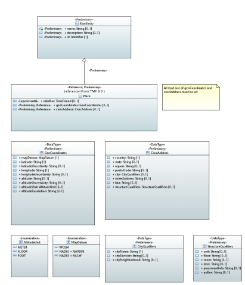

.. Copyright 2021
.. This file is licensed under the CREATIVE COMMONS ATTRIBUTION 4.0 INTERNATIONAL LICENSE
.. Full license text at https://creativecommons.org/licenses/by/4.0/legalcode

Location Model 
==============

.. contents::
   :depth: 3
..

Diagrams
--------

Place
~~~~~

Classes
-------

Place
~~~~~

**Parent class:** RootEntity

Applied stereotypes:

-  Reference

-  **reference: From TMF SID**

-  Preliminary

-  OpenModelClass

-  **support: MANDATORY**

================== ============== ========= ================================== ====================================================================================================================================================================================================================================================================================================================================================================== ========================================================
**Attribute Name** **Type**       **Mult.** **Stereotypes**                    **Description**                                                                                                                                                                                                                                                                                                                                                        **Defined in**
validFor           TimePeriod     0..1      OpenModelAttribute                                                                                                                                                                                                                                                                                                                                                                                        Common::Location::ObjectClasses::Place::validFor
                                                                                                                                                                                                                                                                                                                                                                                                                                                     
                                            -  isInvariant: false                                                                                                                                                                                                                                                                                                                                                                                    
                                                                                                                                                                                                                                                                                                                                                                                                                                                     
                                            -  valueRange: no range constraint                                                                                                                                                                                                                                                                                                                                                                       
                                                                                                                                                                                                                                                                                                                                                                                                                                                     
                                            -  support: MANDATORY                                                                                                                                                                                                                                                                                                                                                                                    
                                                                                                                                                                                                                                                                                                                                                                                                                                                     
                                            Experimental                                                                                                                                                                                                                                                                                                                                                                                             
geoCoordinates     GeoCoordinates 0..1      Reference                          Geographical coordinates                                                                                                                                                                                                                                                                                                                                               Common::Location::ObjectClasses::Place::geoCoordinates
                                                                                                                                                                                                                                                                                                                                                                                                                                                     
                                            -  reference:RFC6225                                                                                                                                                                                                                                                                                                                                                                                     
                                                                                                                                                                                                                                                                                                                                                                                                                                                     
                                            Preliminary                                                                                                                                                                                                                                                                                                                                                                                              
                                                                                                                                                                                                                                                                                                                                                                                                                                                     
                                            OpenModelAttribute                                                                                                                                                                                                                                                                                                                                                                                       
                                                                                                                                                                                                                                                                                                                                                                                                                                                     
                                            -  isInvariant: false                                                                                                                                                                                                                                                                                                                                                                                    
                                                                                                                                                                                                                                                                                                                                                                                                                                                     
                                            -  valueRange: no range constraint                                                                                                                                                                                                                                                                                                                                                                       
                                                                                                                                                                                                                                                                                                                                                                                                                                                     
                                            -  support: MANDATORY                                                                                                                                                                                                                                                                                                                                                                                    
civicAddress       CivicAddress   0..1      Reference                          Civic address                                                                                                                                                                                                                                                                                                                                                          Common::Location::ObjectClasses::Place::civicAddress
                                                                                                                                                                                                                                                                                                                                                                                                                                                     
                                            -  reference:RFC4776                                                                                                                                                                                                                                                                                                                                                                                     
                                                                                                                                                                                                                                                                                                                                                                                                                                                     
                                            Preliminary                                                                                                                                                                                                                                                                                                                                                                                              
                                                                                                                                                                                                                                                                                                                                                                                                                                                     
                                            OpenModelAttribute                                                                                                                                                                                                                                                                                                                                                                                       
                                                                                                                                                                                                                                                                                                                                                                                                                                                     
                                            -  isInvariant: false                                                                                                                                                                                                                                                                                                                                                                                    
                                                                                                                                                                                                                                                                                                                                                                                                                                                     
                                            -  valueRange: no range constraint                                                                                                                                                                                                                                                                                                                                                                       
                                                                                                                                                                                                                                                                                                                                                                                                                                                     
                                            -  support: MANDATORY                                                                                                                                                                                                                                                                                                                                                                                    
name               String         0..1      Preliminary                        Represents a user-friendly identifier of an object. It is a (possibly ambiguous) name by which the object is commonly known in some limited scope (such as an organization) and conforms to the naming conventions of the country or culture with which it is associated. It is NOT used as a naming attribute (i.e., to uniquely identify an instance of the object). Common::Root::RootObjectClasses::RootEntity::name
                                                                                                                                                                                                                                                                                                                                                                                                                                                     
                                            OpenModelAttribute                                                                                                                                                                                                                                                                                                                                                                                       
                                                                                                                                                                                                                                                                                                                                                                                                                                                     
                                            -  isInvariant: false                                                                                                                                                                                                                                                                                                                                                                                    
                                                                                                                                                                                                                                                                                                                                                                                                                                                     
                                            -  valueRange: no range constraint                                                                                                                                                                                                                                                                                                                                                                       
                                                                                                                                                                                                                                                                                                                                                                                                                                                     
                                            -  support: MANDATORY                                                                                                                                                                                                                                                                                                                                                                                    
description        String         0..1      Preliminary                        Defines a textual free-form description of the object.                                                                                                                                                                                                                                                                                                                 Common::Root::RootObjectClasses::RootEntity::description
                                                                                                                                                                                                                                                                                                                                                                                                                                                     
                                            OpenModelAttribute                                                                                                                                                                                                                                                                                                                                                                                       
                                                                                                                                                                                                                                                                                                                                                                                                                                                     
                                            -  isInvariant: false                                                                                                                                                                                                                                                                                                                                                                                    
                                                                                                                                                                                                                                                                                                                                                                                                                                                     
                                            -  valueRange: no range constraint                                                                                                                                                                                                                                                                                                                                                                       
                                                                                                                                                                                                                                                                                                                                                                                                                                                     
                                            -  support: MANDATORY                                                                                                                                                                                                                                                                                                                                                                                    
id                 Identifier     1         Preliminary                        Identifier of this information element. This attribute shall be globally unique.                                                                                                                                                                                                                                                                                       Common::Root::RootObjectClasses::RootEntity::id
                                                                                                                                                                                                                                                                                                                                                                                                                                                     
                                            OpenModelAttribute                 Unambiguously distinguishes different object instances. It is the naming attribute of the object.                                                                                                                                                                                                                                                                     
                                                                                                                                                                                                                                                                                                                                                                                                                                                     
                                            -  isInvariant: false                                                                                                                                                                                                                                                                                                                                                                                    
                                                                                                                                                                                                                                                                                                                                                                                                                                                     
                                            -  valueRange: no range constraint                                                                                                                                                                                                                                                                                                                                                                       
                                                                                                                                                                                                                                                                                                                                                                                                                                                     
                                            -  support: MANDATORY                                                                                                                                                                                                                                                                                                                                                                                    
================== ============== ========= ================================== ====================================================================================================================================================================================================================================================================================================================================================================== ========================================================

RootEntity
~~~~~~~~~~

This is the top of the ONAP class hierarchy. The purpose of the RootEntity is to define a set of attributes that are common to all entities that derive from it. These properties enable us to name, describe, and identify all objects in the environment.

Applied stereotypes:

-  Preliminary

-  OpenModelClass

-  **support: MANDATORY**

================== ========== ========= ================================== ====================================================================================================================================================================================================================================================================================================================================================================== ========================================================
**Attribute Name** **Type**   **Mult.** **Stereotypes**                    **Description**                                                                                                                                                                                                                                                                                                                                                        **Defined in**
name               String     0..1      Preliminary                        Represents a user-friendly identifier of an object. It is a (possibly ambiguous) name by which the object is commonly known in some limited scope (such as an organization) and conforms to the naming conventions of the country or culture with which it is associated. It is NOT used as a naming attribute (i.e., to uniquely identify an instance of the object). Common::Root::RootObjectClasses::RootEntity::name
                                                                                                                                                                                                                                                                                                                                                                                                                                                 
                                        OpenModelAttribute                                                                                                                                                                                                                                                                                                                                                                                       
                                                                                                                                                                                                                                                                                                                                                                                                                                                 
                                        -  isInvariant: false                                                                                                                                                                                                                                                                                                                                                                                    
                                                                                                                                                                                                                                                                                                                                                                                                                                                 
                                        -  valueRange: no range constraint                                                                                                                                                                                                                                                                                                                                                                       
                                                                                                                                                                                                                                                                                                                                                                                                                                                 
                                        -  support: MANDATORY                                                                                                                                                                                                                                                                                                                                                                                    
description        String     0..1      Preliminary                        Defines a textual free-form description of the object.                                                                                                                                                                                                                                                                                                                 Common::Root::RootObjectClasses::RootEntity::description
                                                                                                                                                                                                                                                                                                                                                                                                                                                 
                                        OpenModelAttribute                                                                                                                                                                                                                                                                                                                                                                                       
                                                                                                                                                                                                                                                                                                                                                                                                                                                 
                                        -  isInvariant: false                                                                                                                                                                                                                                                                                                                                                                                    
                                                                                                                                                                                                                                                                                                                                                                                                                                                 
                                        -  valueRange: no range constraint                                                                                                                                                                                                                                                                                                                                                                       
                                                                                                                                                                                                                                                                                                                                                                                                                                                 
                                        -  support: MANDATORY                                                                                                                                                                                                                                                                                                                                                                                    
id                 Identifier 1         Preliminary                        Identifier of this information element. This attribute shall be globally unique.                                                                                                                                                                                                                                                                                       Common::Root::RootObjectClasses::RootEntity::id
                                                                                                                                                                                                                                                                                                                                                                                                                                                 
                                        OpenModelAttribute                 Unambiguously distinguishes different object instances. It is the naming attribute of the object.                                                                                                                                                                                                                                                                     
                                                                                                                                                                                                                                                                                                                                                                                                                                                 
                                        -  isInvariant: false                                                                                                                                                                                                                                                                                                                                                                                    
                                                                                                                                                                                                                                                                                                                                                                                                                                                 
                                        -  valueRange: no range constraint                                                                                                                                                                                                                                                                                                                                                                       
                                                                                                                                                                                                                                                                                                                                                                                                                                                 
                                        -  support: MANDATORY                                                                                                                                                                                                                                                                                                                                                                                    
================== ========== ========= ================================== ====================================================================================================================================================================================================================================================================================================================================================================== ========================================================

Data Types
----------

CityQualifiers
~~~~~~~~~~~~~~

Applied stereotypes:

-  Preliminary

================== ======== ========= ========== ================================== ========================================================
**Attribute Name** **Type** **Mult.** **Access** **Stereotypes**                    **Description**
cityName           String   1         RW         Reference                          Name of City, Township, or Parish
                                                                                   
                                                 Preliminary                       
                                                                                   
                                                 OpenModelAttribute                
                                                                                   
                                                 -  isInvariant: false             
                                                                                   
                                                 -  valueRange: no range constraint
                                                                                   
                                                 -  support: MANDATORY             
cityDivision       String   0..1      RW         Reference                          Name of city division, ex. Borough, District, Ward, Chou
                                                                                   
                                                 Preliminary                       
                                                                                   
                                                 OpenModelAttribute                
                                                                                   
                                                 -  isInvariant: false             
                                                                                   
                                                 -  valueRange: no range constraint
                                                                                   
                                                 -  support: MANDATORY             
cityNeighborhood   String   0..1      RW         Reference                          Name of neighborhood, ex. Block, Street group
                                                                                   
                                                 Preliminary                       
                                                                                   
                                                 OpenModelAttribute                
                                                                                   
                                                 -  isInvariant: false             
                                                                                   
                                                 -  valueRange: no range constraint
                                                                                   
                                                 -  support: MANDATORY             
================== ======== ========= ========== ================================== ========================================================

CivicAddress
~~~~~~~~~~~~

Applied stereotypes:

-  Preliminary

=================== =================== ========= ========== ================================== ==============================================================================================================================================================================================================================
**Attribute Name**  **Type**            **Mult.** **Access** **Stereotypes**                    **Description**
country             String              1         RW         Reference                          The name of the country
                                                                                               
                                                             Preliminary                       
                                                                                               
                                                             OpenModelAttribute                
                                                                                               
                                                             -  isInvariant: false             
                                                                                               
                                                             -  valueRange: no range constraint
                                                                                               
                                                             -  support: MANDATORY             
state               String              0..1      RW         Reference                          The name of the state or province
                                                                                               
                                                             Preliminary                       
                                                                                               
                                                             OpenModelAttribute                
                                                                                               
                                                             -  isInvariant: false             
                                                                                               
                                                             -  valueRange: no range constraint
                                                                                               
                                                             -  support: MANDATORY             
region              String              0..1      RW         Reference                          The name of the region
                                                                                               
                                                             Preliminary                       
                                                                                               
                                                             OpenModelAttribute                
                                                                                               
                                                             -  isInvariant: false             
                                                                                               
                                                             -  valueRange: no range constraint
                                                                                               
                                                             -  support: MANDATORY             
postalCode          String              0..1      RW         Reference                          The postal code or zip code
                                                                                               
                                                             Preliminary                       
                                                                                               
                                                             OpenModelAttribute                
                                                                                               
                                                             -  isInvariant: false             
                                                                                               
                                                             -  valueRange: no range constraint
                                                                                               
                                                             -  support: MANDATORY             
city                CityQualifiers      0..1      RW         Preliminary                        The name of the metropolitan area, city, township, borough, district, or ward. Allows further specific city sub-divisions to be specified, such as: division, borough, district, ward, chou, neighborhood, block, street group
                                                                                               
                                                             OpenModelAttribute                
                                                                                               
                                                             -  isInvariant: false             
                                                                                               
                                                             -  valueRange: no range constraint
                                                                                               
                                                             -  support: MANDATORY             
streetAddress       String              0..1      RW         Reference                          The street address
                                                                                               
                                                             Preliminary                       
                                                                                               
                                                             OpenModelAttribute                
                                                                                               
                                                             -  isInvariant: false             
                                                                                               
                                                             -  valueRange: no range constraint
                                                                                               
                                                             -  support: MANDATORY             
lata                String              0..1      RW         Preliminary                        Local access and transport area (LATA) represents a geographical area of the United States, used in U.S. telecommunications regulation.
                                                                                               
                                                             OpenModelAttribute                
                                                                                               
                                                             -  isInvariant: false             
                                                                                               
                                                             -  valueRange: no range constraint
                                                                                               
                                                             -  support: MANDATORY             
structureQualifiers StructureQualifiers 0..1      RW         Preliminary                        Additional pre-defined qualifier fields for a structure including: unit, floor, room, desk
                                                                                               
                                                             OpenModelAttribute                
                                                                                               
                                                             -  isInvariant: false             
                                                                                               
                                                             -  valueRange: no range constraint
                                                                                               
                                                             -  support: MANDATORY             
=================== =================== ========= ========== ================================== ==============================================================================================================================================================================================================================

GeoCoordinates
~~~~~~~~~~~~~~

Applied stereotypes:

-  Preliminary

==================== ============ ========= ========== ================================== ======================================================================================================================
**Attribute Name**   **Type**     **Mult.** **Access** **Stereotypes**                    **Description**
mapDatum             MapDatum     1         RW         Reference                          Map Datum used for the coordinates given in this option.
                                                                                         
                                                       Preliminary                       
                                                                                         
                                                       OpenModelAttribute                
                                                                                         
                                                       -  isInvariant: false             
                                                                                         
                                                       -  valueRange: no range constraint
                                                                                         
                                                       -  support: MANDATORY             
latitude             String       1         RW         Reference                          Latitude in binary geodetic form. A 34-bit fixed-point value consisting of 9 bits of integer and 25 bits of fraction.
                                                                                         
                                                       Preliminary                       
                                                                                         
                                                       OpenModelAttribute                
                                                                                         
                                                       -  isInvariant: false             
                                                                                         
                                                       -  valueRange: no range constraint
                                                                                         
                                                       -  support: MANDATORY             
latitudeUncertainty  String       0..1      RW         Reference                          When mapDatum = WGS84, this field represents latitude uncertainty.
                                                                                          Uncertainty = 2 ^ ( 21 - x )
                                                       Preliminary                        x = 21 - ceil( log2( uncertainty ) )
                                                                                         
                                                       OpenModelAttribute                
                                                                                         
                                                       -  isInvariant: false             
                                                                                         
                                                       -  valueRange: no range constraint
                                                                                         
                                                       -  support: MANDATORY             
longitude            String       1         RW         Reference                          Longitude in binary geodetic form. A 34-bit fixed-point value consisting of 9 bits of integer and 25 bits of fraction.
                                                                                         
                                                       Preliminary                       
                                                                                         
                                                       OpenModelAttribute                
                                                                                         
                                                       -  isInvariant: false             
                                                                                         
                                                       -  valueRange: no range constraint
                                                                                         
                                                       -  support: MANDATORY             
longitudeUncertainty String       0..1      RW         Reference                          When mapDatum = WGS84, this field represents longitude uncertainty.
                                                                                          Uncertainty = 2 ^ ( 21 - x )
                                                       Preliminary                        x = 21 - ceil( log2( uncertainty ) )
                                                                                         
                                                       OpenModelAttribute                
                                                                                         
                                                       -  isInvariant: false             
                                                                                         
                                                       -  valueRange: no range constraint
                                                                                         
                                                       -  support: MANDATORY             
altitude             String       0..1      RW         Reference                          A 30-bit value defined by the Altitude Type field.
                                                                                         
                                                       Preliminary                       
                                                                                         
                                                       OpenModelAttribute                
                                                                                         
                                                       -  isInvariant: false             
                                                                                         
                                                       -  valueRange: no range constraint
                                                                                         
                                                       -  support: MANDATORY             
altitudeUncertainty  String       0..1      RW         Reference                          When mapDatum = WGS84, this field represents altitude uncertainty.
                                                                                         
                                                       Preliminary                       
                                                                                         
                                                       OpenModelAttribute                
                                                                                         
                                                       -  isInvariant: false             
                                                                                         
                                                       -  valueRange: no range constraint
                                                                                         
                                                       -  support: MANDATORY             
altitudeUnit         AltitudeUnit 0..1      RW         Reference                          Defines the unit for the altitude value.
                                                                                         
                                                       Preliminary                       
                                                                                         
                                                       OpenModelAttribute                
                                                                                         
                                                       -  isInvariant: false             
                                                                                         
                                                       -  valueRange: no range constraint
                                                                                         
                                                       -  support: MANDATORY             
altitudeResolution   String       0..1      RW         Reference                          Encodes the number of high-order altitude bits that should be considered valid.
                                                                                         
                                                       Preliminary                       
                                                                                         
                                                       OpenModelAttribute                
                                                                                         
                                                       -  isInvariant: false             
                                                                                         
                                                       -  valueRange: no range constraint
                                                                                         
                                                       -  support: MANDATORY             
==================== ============ ========= ========== ================================== ======================================================================================================================

Identifier
~~~~~~~~~~

Applied stereotypes:

-  Preliminary

StructureQualifiers
~~~~~~~~~~~~~~~~~~~

Applied stereotypes:

-  Preliminary

================== ======== ========= ========== ================================== =================================================
**Attribute Name** **Type** **Mult.** **Access** **Stereotypes**                    **Description**
unit               String   0..1      RW         Reference                          Unit (apartment, suite)
                                                                                   
                                                 Preliminary                       
                                                                                   
                                                 OpenModelAttribute                
                                                                                   
                                                 -  isInvariant: false             
                                                                                   
                                                 -  valueRange: no range constraint
                                                                                   
                                                 -  support: MANDATORY             
floor              String   0..1      RW         Reference                          Floor
                                                                                   
                                                 Preliminary                       
                                                                                   
                                                 OpenModelAttribute                
                                                                                   
                                                 -  isInvariant: false             
                                                                                   
                                                 -  valueRange: no range constraint
                                                                                   
                                                 -  support: MANDATORY             
room               String   0..1      RW         Reference                          Room
                                                                                   
                                                 Preliminary                       
                                                                                   
                                                 OpenModelAttribute                
                                                                                   
                                                 -  isInvariant: false             
                                                                                   
                                                 -  valueRange: no range constraint
                                                                                   
                                                 -  support: MANDATORY             
desk               String   0..1      RW         Reference                          Seat, desk, cubicle, workstation
                                                                                   
                                                 Preliminary                       
                                                                                   
                                                 OpenModelAttribute                
                                                                                   
                                                 -  isInvariant: false             
                                                                                   
                                                 -  valueRange: no range constraint
                                                                                   
                                                 -  support: MANDATORY             
placementInfo      String   0..1      RW         Reference                          Additional placement information, ex. shelf, rack
                                                                                   
                                                 Preliminary                       
                                                                                   
                                                 OpenModelAttribute                
                                                                                   
                                                 -  isInvariant: false             
                                                                                   
                                                 -  valueRange: no range constraint
                                                                                   
                                                 -  support: MANDATORY             
poBox              String   0..1      RW         Reference                          Post office box number
                                                                                   
                                                 Preliminary                       
                                                                                   
                                                 OpenModelAttribute                
                                                                                   
                                                 -  isInvariant: false             
                                                                                   
                                                 -  valueRange: no range constraint
                                                                                   
                                                 -  support: MANDATORY             
================== ======== ========= ========== ================================== =================================================

TimePeriod
~~~~~~~~~~

A base / value business entity used to represent a period of time, between two timepoints

Applied stereotypes:

-  Preliminary

================== ======== ========= ========== ================================== =================================================
**Attribute Name** **Type** **Mult.** **Access** **Stereotypes**                    **Description**
startDateTime      DateTime 1         RW         OpenModelAttribute                 An instant of time, starting at the TimePeriod
                                                                                    Notes:
                                                 -  isInvariant: false              If null, then represents to the beginning of time
                                                                                   
                                                 -  valueRange: no range constraint
                                                                                   
                                                 -  support: MANDATORY             
endDateTime        DateTime 1         RW         OpenModelAttribute                 An instant of time, ending at the TimePeriod:
                                                                                    Notes:
                                                 -  isInvariant: false              If null, then represents to the end of time
                                                                                   
                                                 -  valueRange: no range constraint
                                                                                   
                                                 -  support: MANDATORY             
================== ======== ========= ========== ================================== =================================================

Enumerations
------------

AltitudeUnit
~~~~~~~~~~~~

Contains Enumeration Literals:

-  METER:

-  FLOOR:

-  FOOT:

MapDatum
~~~~~~~~

Contains Enumeration Literals:

-  WGS84:

-  NAD83 + NAVD88:

-  NAD83 + MLLW:
