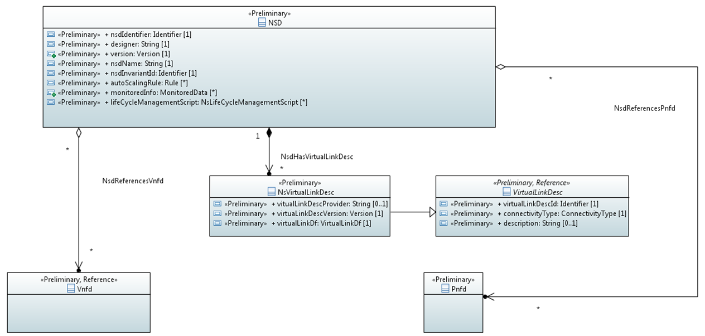

.. Copyright 2018 (China Mobile)
.. This file is licensed under the CREATIVE COMMONS ATTRIBUTION 4.0 INTERNATIONAL LICENSE
.. Full license text at https://creativecommons.org/licenses/by/4.0/legalcode

NetworkServiceDescriptorModel 
===============================

.. contents::
   :depth: 3
..

Diagram
-------

NetworkServiceDescriptor
------------------------

The NSD class is a deployment template whose instances are used by the
NFVO for the lifecycle management of NSs. For all attributes in this
class, the Producer is SDC and the Consumer is SDC/UUI/VFC

Applied stereotypes:

-  OpenModelClass

-  support: MANDATORY

-  Preliminaryry

+--------------------------+----------------------------+-------------+-------------------+----------------+
| **AttributeName**        | **Type**                   | **Mult.**   | **Stereotypes**   | **Description**|
|                          |                            |             |                   |                |
+==========================+============================+=============+===================+================+
| nsdIdentifier            | Identifier                 | 1           | Preliminary       | Identifier     |
|                          |                            |             |                   | of this NSD    |
|                          |                            |             | OpenModelAttribute| class. It      |
|                          |                            |             |                   | globally       |
|                          |                            |             |                   | uniquely       |
|                          |                            |             | -  isInvariant:   | identifies     |
|                          |                            |             |       true        | an instance    |
|                          |                            |             |                   | of the NSD.    |
|                          |                            |             |                   |                |
|                          |                            |             | -  valueRange:    |                |
|                          |                            |             |       no          |                |
|                          |                            |             |       range       |                |
|                          |                            |             |       constraint  |                |
|                          |                            |             |                   |                |
|                          |                            |             | -  support:       |                |
|                          |                            |             |       MANDATORY   |                |
+--------------------------+----------------------------+-------------+-------------------+----------------+
| designer                 | String                     | 1           | Preliminary       | Identifies     |
|                          |                            |             |                   | the            |
|                          |                            |             | OpenModelAttribute| designer of    |
|                          |                            |             |                   | the NSD.       |
|                          |                            |             |                   |                |
|                          |                            |             | -  isInvariant:   |                |
|                          |                            |             |       false       |                |
|                          |                            |             |                   |                |
|                          |                            |             | -  valueRange:    |                |
|                          |                            |             |       no          |                |
|                          |                            |             |       range       |                |
|                          |                            |             |       constraint  |                |
|                          |                            |             |                   |                |
|                          |                            |             | -  support:       |                |
|                          |                            |             |       MANDATORY   |                |
+--------------------------+----------------------------+-------------+-------------------+----------------+
| version                  | Version                    | 1           | Preliminary       | Identifies     |
|                          |                            |             |                   | the version    |
|                          |                            |             | OpenModelAttribute| of the NSD.    |
|                          |                            |             |                   |                |
|                          |                            |             |                   |                |
|                          |                            |             | -  isInvariant:   |                |
|                          |                            |             |       false       |                |
|                          |                            |             |                   |                |
|                          |                            |             | -  valueRange:    |                |
|                          |                            |             |       no          |                |
|                          |                            |             |       range       |                |
|                          |                            |             |       constraint  |                |
|                          |                            |             |                   |                |
|                          |                            |             | -  support:       |                |
|                          |                            |             |       MANDATORY   |                |
+--------------------------+----------------------------+-------------+-------------------+----------------+
| nsdName                  | String                     | 1           | Preliminary       | Provides       |
|                          |                            |             |                   | the human      |
|                          |                            |             | OpenModelAttribute| readable       |
|                          |                            |             |                   | name of the    |
|                          |                            |             |                   | NSD.           |
|                          |                            |             | -  isInvariant:   |                |
|                          |                            |             |       false       |                |
|                          |                            |             |                   |                |
|                          |                            |             | -  valueRange:    |                |
|                          |                            |             |       no          |                |
|                          |                            |             |       range       |                |
|                          |                            |             |       constraint  |                |
|                          |                            |             |                   |                |
|                          |                            |             | -  support:       |                |
|                          |                            |             |       MANDATORY   |                |
+--------------------------+----------------------------+-------------+-------------------+----------------+
| nsdInvariantId           | Identifier                 | 1           | Preliminary       | Identifies     |
|                          |                            |             |                   | an NSD in a    |
|                          |                            |             | OpenModelAttribute| version        |
|                          |                            |             |                   | independent    |
|                          |                            |             |                   | manner.        |
|                          |                            |             | -  isInvariant:   | This           |
|                          |                            |             |      false        | attribute is   |
|                          |                            |             |                   | invariant      |
|                          |                            |             | -  valueRange:    | across         |
|                          |                            |             |       no          | versions of    |
|                          |                            |             |       range       | NSD.           |
|                          |                            |             |       constraint  |                |
|                          |                            |             |                   |                |
|                          |                            |             | -  support:       |                |
|                          |                            |             |       MANDATORY   |                |
+--------------------------+----------------------------+-------------+-------------------+----------------+
| autoScalingRule          | Rule                       | 0..\*       | Preliminary       | Specifies a    |
|                          |                            |             |                   | rule to        |
|                          |                            |             | OpenModelAttribute| trigger a      |
|                          |                            |             |                   | scaling        |
|                          |                            |             |                   | action on a    |
|                          |                            |             | -  isInvariant:   | NS             |
|                          |                            |             |        false      | instantiated   |
|                          |                            |             |                   | according      |
|                          |                            |             | -  valueRange:    | to the NSD.    |
|                          |                            |             |       no          | NOTE 1: The    |
|                          |                            |             |       range       | rule is        |
|                          |                            |             |       constraint  | based on a     |
|                          |                            |             |                   | combination    |
|                          |                            |             |                   | of             |
|                          |                            |             |                   | assertions     |
|                          |                            |             | -  support:       | on the         |
|                          |                            |             |       MANDATORY   | values of      |
|                          |                            |             |                   | virtualised    |
|                          |                            |             |                   | resource-      |
|                          |                            |             |                   | related        |
|                          |                            |             |                   | performance    |
|                          |                            |             |                   | metrics and    |
|                          |                            |             |                   | VNF            |
|                          |                            |             |                   | Indicators     |
|                          |                            |             |                   | identified     |
|                          |                            |             |                   | by the         |
|                          |                            |             |                   | monitoredInfo  |
|                          |                            |             |                   | attribute.     |
|                          |                            |             |                   | NOTE 2:        |
|                          |                            |             |                   | There may      |
|                          |                            |             |                   | be multiple    |
|                          |                            |             |                   | data           |
|                          |                            |             |                   | sources        |
|                          |                            |             |                   | (each          |
|                          |                            |             |                   | identified     |
|                          |                            |             |                   | as             |
|                          |                            |             |                   | monitoredInfo) |
|                          |                            |             |                   | per rule       |
+--------------------------+----------------------------+-------------+-------------------+----------------+
| monitoredInfo            | MonitoredData              | 0..\*       | Preliminary       | Identifies     |
|                          |                            |             |                   | either a       |
|                          |                            |             | OpenModelAttribute| virtualised    |
|                          |                            |             |                   | resource-      |
|                          |                            |             |                   | related        |
|                          |                            |             | -  isInvariant:   | performance    |
|                          |                            |             |       false       | metric or a    |
|                          |                            |             |                   | VNF            |
|                          |                            |             |                   | Indicator.     |
|                          |                            |             | -  valueRange:    |                |
|                          |                            |             |       no          |                |
|                          |                            |             |       range       |                |
|                          |                            |             |       constraint  |                |
|                          |                            |             |                   |                |
|                          |                            |             | -  support:       |                |
|                          |                            |             |       MANDATORY   |                |
+--------------------------+----------------------------+-------------+-------------------+----------------+
| lifeCycleManagementScript| NsLifeCycleManagementScript| 0..\*       | Preliminary       | Provides a     |
|                          |                            |             |                   | life cycle     |
|                          |                            |             | OpenModelAttribute| management     |
|                          |                            |             |                   | script         |
|                          |                            |             |                   | written in     |
|                          |                            |             | -  isInvariant:   | a Domain       |
|                          |                            |             |       false       | Specific       |
|                          |                            |             |                   | Language       |
|                          |                            |             | -  valueRange:    | (DSL).         |
|                          |                            |             |       no          |                |
|                          |                            |             |       range       |                |
|                          |                            |             |       constraint  |                |
|                          |                            |             |                   |                |
|                          |                            |             | -  support:       |                |
|                          |                            |             |       MANDATORY   |                |
+--------------------------+----------------------------+-------------+-------------------+----------------+
| \_virtualLinkDesc        | NsVirtualLinkDesc          | 0..\*       | Preliminary       | Provides       |
|                          |                            |             |                   | the            |
|                          |                            |             | OpenModelAttribute| constituent    |
|                          |                            |             |                   | VLDs.          |
|                          |                            |             |                   | Cardinality    |
|                          |                            |             | -  isInvariant:   | of 0 means     |
|                          |                            |             |       false       | that the NS    |
|                          |                            |             |                   | is a NF set    |
|                          |                            |             |                   | with           |
|                          |                            |             | -  valueRange:    | unspecified    |
|                          |                            |             |       no          | connectivity.  |
|                          |                            |             |       range       |                |
|                          |                            |             |       constraint  |                |
|                          |                            |             |                   |                |
|                          |                            |             | -  support:       |                |
|                          |                            |             |       MANDATORY   |                |
+--------------------------+----------------------------+-------------+-------------------+----------------+
| \_vnfdId                 | Vnfd                       | 0..\*       | Preliminary       | References     |
|                          |                            |             |                   | the VNFD of    |
|                          |                            |             | OpenModelAttribute| a              |
|                          |                            |             |                   | constituent    |
|                          |                            |             |                   | VNF.           |
|                          |                            |             | -  isInvariant:   |                |
|                          |                            |             |       false       |                |
|                          |                            |             |                   |                |
|                          |                            |             | -  valueRange:    |                |
|                          |                            |             |       no          |                |
|                          |                            |             |       range       |                |
|                          |                            |             |       constraint  |                |
|                          |                            |             |                   |                |
|                          |                            |             | -  support:       |                |
|                          |                            |             |       MANDATORY   |                |
|                          |                            |             |                   |                |
|                          |                            |             | PassedByReference |                |
+--------------------------+----------------------------+-------------+-------------------+----------------+
| \_pnfdId                 | Pnfd                       | 0..\*       | Experimental      | References     |
|                          |                            |             |                   | the PNFD of    |
|                          |                            |             |                   | a              |
|                          |                            |             | OpenModelAttribute| constituent    |
|                          |                            |             |                   | PNF.           |
|                          |                            |             |                   |                |
|                          |                            |             | -  isInvariant:   |                |
|                          |                            |             |       false       |                |
|                          |                            |             |                   |                |
|                          |                            |             | -  valueRange:    |                |
|                          |                            |             |       no          |                |
|                          |                            |             |       range       |                |
|                          |                            |             |       constraint  |                |
|                          |                            |             |                   |                |
|                          |                            |             | -  support:       |                |
|                          |                            |             |       MANDATORY   |                |
|                          |                            |             |                   |                |
|                          |                            |             | PassedByReference |                |
+--------------------------+----------------------------+-------------+-------------------+----------------+

NsVirtualLinkDesc
-----------------

The NsVirtualLinkDesc class provides general information enabling the
instantiation of virtual links. For all attributes in this class the
Producer is SDC and the Consumer is SDC/UUI/VFC.

**Parent class:** VirtualLinkDesc

Applied stereotypes:

-  OpenModelClass

-  support: MANDATORY

-  Preliminaryry

+------------------------+-----------------+-------------+-------------------+----------------+
| **Attribute Name**     | **Type**        | **Mult.**   | **Stereotypes**   | **Description**|
+========================+=================+=============+===================+================+
| vitualLinkDescProvider | String          | 0..1        | Preliminary       | Defines the    |
|                        |                 |             |                   | organization   |
|                        |                 |             | OpenModelAttribute| generating     |
|                        |                 |             |                   | the VLD.       |
|                        |                 |             |                   |                |
|                        |                 |             | -  isInvariant:   |                |
|                        |                 |             |       false       |                |
|                        |                 |             |                   |                |
|                        |                 |             | -  valueRange:    |                |
|                        |                 |             |       no          |                |
|                        |                 |             |       range       |                |
|                        |                 |             |       constraint  |                |
|                        |                 |             |                   |                |
|                        |                 |             | -  support:       |                |
|                        |                 |             |       MANDATORY   |                |
+------------------------+-----------------+-------------+-------------------+----------------+
| virtuaLinkDescVersion  | Version         | 1           | Preliminary       | Specifies      |
|                        |                 |             |                   | the version    |
|                        |                 |             | OpenModelAttribute| of the VLD.    |
|                        |                 |             |                   |                |
|                        |                 |             | -  isInvariant:   |                |
|                        |                 |             |       false       |                |
|                        |                 |             |                   |                |
|                        |                 |             | -  valueRange:    |                |
|                        |                 |             |       no          |                |
|                        |                 |             |       range       |                |
|                        |                 |             |       constraint  |                |
|                        |                 |             |                   |                |
|                        |                 |             | -  support:       |                |
|                        |                 |             |       MANDATORY   |                |
+------------------------+-----------------+-------------+-------------------+----------------+
| VirtualLinkDf          | VirtualLinkDf   | 1           | Preliminary       | Specifies      |
|                        |                 |             |                   | properties     |
|                        |                 |             | OpenModelAttribute| for            |
|                        |                 |             |                   | instantiating  |
|                        |                 |             | -  isInvariant:   | a VL           |
|                        |                 |             |       false       | according      |
|                        |                 |             |                   | to a           |
|                        |                 |             |                   | specific       |
|                        |                 |             | -  valueRange:    | flavour.       |
|                        |                 |             |       no          |                |
|                        |                 |             |       range       |                |
|                        |                 |             |       constraint  |                |
|                        |                 |             |                   |                |
|                        |                 |             | -  support:       |                |
|                        |                 |             |       MANDATORY   |                |
+------------------------+-----------------+-------------+-------------------+----------------+
| virtualLinkDescId      | Identifier      | 1           | Preliminary       | Uniquely       |
|                        |                 |             |                   | identifies     |
|                        |                 |             | OpenModelAttribute| a VLD in       |
|                        |                 |             |                   | the parent     |
|                        |                 |             |                   | descriptor.    |
|                        |                 |             | -  isInvariant:   | For            |
|                        |                 |             |       false       | VnfVirtualL    |
|                        |                 |             |                   | inkDesc,       |
|                        |                 |             |                   | the parent     |
|                        |                 |             |                   | descriptor     |
|                        |                 |             | -  valueRange:    | is the         |
|                        |                 |             |       no          | VNFD. For      |
|                        |                 |             |       range       | NsVirtualLi-   |
|                        |                 |             |       constraint  | nkDesc,        |
|                        |                 |             |                   | the parent     |
|                        |                 |             |                   | descriptor     |
|                        |                 |             | -  support:       | is the NSD.    |
|                        |                 |             |       MANDATORY   | Note: the      |
|                        |                 |             |                   | description    |
|                        |                 |             |                   | of this        |
|                        |                 |             |                   | class are      |
|                        |                 |             |                   | different      |
|                        |                 |             |                   | in ETSI GS     |
|                        |                 |             |                   | NFV IFA 011    |
|                        |                 |             |                   | and ETSI GS    |
|                        |                 |             |                   | NFV IFA        |
|                        |                 |             |                   | 014. The       |
|                        |                 |             |                   | present        |
|                        |                 |             |                   | definition     |
|                        |                 |             |                   | merges the 2   |
|                        |                 |             |                   | definitions.   |
+------------------------+-----------------+-------------+-------------------+----------------+
| connectivityType       | ConnectivityType| 1           | Preliminary       | Specifies      |
|                        |                 |             |                   | the            |
|                        |                 |             | OpenModelAttribute| protocol       |
|                        |                 |             |                   | exposed by     |
|                        |                 |             |                   | a VL and       |
|                        |                 |             | -  isInvariant:   | the flow       |
|                        |                 |             |       false       | pattern        |
|                        |                 |             |                   | supported      |
|                        |                 |             |                   | by the VL.     |
|                        |                 |             | -  valueRange:    |                |
|                        |                 |             |       no          |                |
|                        |                 |             |       range       |                |
|                        |                 |             |       constraint  |                |
|                        |                 |             |                   |                |
|                        |                 |             | -  support:       |                |
|                        |                 |             |       MANDATORY   |                |
+------------------------+-----------------+-------------+-------------------+----------------+
| description            | String          | 0..1        | Preliminary       | Provides       |
|                        |                 |             |                   | human-readable |
|                        |                 |             | OpenModelAttribute| information    |
|                        |                 |             |                   | on the         |
|                        |                 |             | -  isInvariant:   | purpose of     |
|                        |                 |             |       false       | the VL         |
|                        |                 |             |                   | (e.g.          |
|                        |                 |             |                   | control        |
|                        |                 |             | -  valueRange:    | plane          |
|                        |                 |             |       no          | traffic).      |
|                        |                 |             |       range       |                |
|                        |                 |             |       constraint  |                |
|                        |                 |             |                   |                |
|                        |                 |             | -  support:       |                |
|                        |                 |             |       MANDATORY   |                |
+------------------------+-----------------+-------------+-------------------+----------------+

Pnfd
----

The Pnfd class is a deployment template enabling on-boarding PNFs and
referencing them from an NSD. It focuses on connectivity aspects only.

**Parent class:** NetworkFunctionDesc

Applied stereotypes:

-  OpenModelClass

-  support: MANDATORY

-  Experimental

Vnfd
----

The Vnfd class is a deployment template enabling on-boarding VNFs and
referencing them from an NSD. 

ConnectivityType
----------------

The ConnectivityType datatype specifies the protocol exposed by a VL and
the flow pattern supported by the VL.

+--------------+--------------+-----------+-----------+-------------------+----------------+
| **Attribute  | **Type**     | **Mult.** | **Access**| **Stereotypes**   | **Description**|
| Name**       |              |           |           |                   |                |
+==============+==============+===========+===========+===================+================+
| layerProtocol| LayerProtocol| 1         | RW        | Preliminary       | identifies     |
|              |              |           |           |                   | the            |
|              |              |           |           | OpenModelAttribute| protocol       |
|              |              |           |           |                   | this VL        |
|              |              |           |           |                   | gives          |
|              |              |           |           | -  isInvariant:   | access to      |
|              |              |           |           |       false       | (IPV4, IPV6).  |
|              |              |           |           |                   |                |
|              |              |           |           | -  valueRange:    |                |
|              |              |           |           |       no          |                |
|              |              |           |           |       range       |                |
|              |              |           |           |       constraint  |                |
|              |              |           |           |                   |                |
|              |              |           |           | -  support:       |                |
|              |              |           |           |       MANDATORY   |                |
+--------------+--------------+-----------+-----------+-------------------+----------------+
| flowPatternrn| String       | 0..1      | RW        | Preliminary       | Identifies     |
|              |              |           |           |                   | the flow       |
|              |              |           |           | OpenModelAttribute| pattern        |
|              |              |           |           |                   | of the         |
|              |              |           |           | -  isInvariant:   | connectivity   |
|              |              |           |           |       false       | (Line,         |
|              |              |           |           |                   | Tree,          |
|              |              |           |           |                   | Mesh).         |
|              |              |           |           | -  valueRange:    |                |
|              |              |           |           |       no          |                |
|              |              |           |           |       range       |                |
|              |              |           |           |       constraint  |                |
|              |              |           |           |                   |                |
|              |              |           |           | -  support:       |                |
|              |              |           |           |       MANDATORY   |                |
+--------------+--------------+-----------+-----------+-------------------+----------------+

MonitoredData(TBD)
------------------

The MonitoredData datatype identifies information to be monitored during
the lifetime of a network service instance.

NsLifeCycleManagementScript
---------------------------

The LifeCycleManagementScript information element specifies a script for
the NS.

+-------------+-----------+-----------+-----------+-------------------+----------------+
| **Attribute | **Type**  | **Mult.** | **Access**| **Stereotypes**   | **Description**|
| Name**      |           |           |           |                   |                |
+=============+===========+===========+===========+===================+================+
| event       | String    | 1..\*     | RW        | OpenModelAttribute| Describes  NS  |
|             |           |           |           |                   | lifecycle      |
|             |           |           |           | -  isInvarriant:  | event(s)       |
|             |           |           |           |       false       | or an          |
|             |           |           |           |                   | external       |
|             |           |           |           |                   | stimulus       |
|             |           |           |           |                   | detected       |
|             |           |           |           |                   | on an          |
|             |           |           |           | -  valueRange:    | NFVO           |
|             |           |           |           |       no          | reference      |
|             |           |           |           |       range       | point.         |
|             |           |           |           |       constraint  | NOTE 1: A      |
|             |           |           |           |                   | minimum        |
|             |           |           |           |                   | set of NS      |
|             |           |           |           |                   | lifecycle      |
|             |           |           |           | -  support:       | events         |
|             |           |           |           |                   | triggered      |
|             |           |           |           |       MANDATORY   | internally     |
|             |           |           |           |                   | by the NFVO    |
|             |           |           |           |                   | includes:      |
|             |           |           |           |                   | start          |
|             |           |           |           |                   | instantiation, |
|             |           |           |           |                   | end            |
|             |           |           |           |                   | instantiation, |
|             |           |           |           |                   | start          |
|             |           |           |           |                   | scaling,       |
|             |           |           |           |                   | end            |
|             |           |           |           |                   | scaling,       |
|             |           |           |           |                   | start          |
|             |           |           |           |                   | healing,       |
|             |           |           |           |                   | end            |
|             |           |           |           |                   | healing,       |
|             |           |           |           |                   | start          |
|             |           |           |           |                   | termination,   |
|             |           |           |           |                   | end            |
|             |           |           |           |                   | termination,   |
|             |           |           |           |                   | start          |
|             |           |           |           |                   | update,        |
|             |           |           |           |                   | end            |
|             |           |           |           |                   | update.        |
|             |           |           |           |                   | NOTE 2: A      |
|             |           |           |           |                   | minimum        |
|             |           |           |           |                   | set of         |
|             |           |           |           |                   | external       |
|             |           |           |           |                   | stimulus       |
|             |           |           |           |                   | includes:      |
|             |           |           |           |                   | the            |
|             |           |           |           |                   | receipt        |
|             |           |           |           |                   | of             |
|             |           |           |           |                   | request        |
|             |           |           |           |                   | message        |
|             |           |           |           |                   | of             |
|             |           |           |           |                   | instantiation, |
|             |           |           |           |                   | scaling,       |
|             |           |           |           |                   | healing,       |
|             |           |           |           |                   | termination,   |
|             |           |           |           |                   | update of NS.  |
+-------------+-----------+-----------+-----------+-------------------+----------------+
| script      | String    | 1         | RW        | OpenModelAttribute| Includes       |
|             |           |           |           |                   | an NS LCM      |
|             |           |           |           |                   | script         |
|             |           |           |           | -  isInvarriant:  | (e.g.,         |
|             |           |           |           |       false       | written        |
|             |           |           |           |                   | in a DSL)      |
|             |           |           |           |                   | triggered      |
|             |           |           |           |                   | to react       |
|             |           |           |           | -  valueRange:    | to one of the  |
|             |           |           |           |       no          | events         |
|             |           |           |           |       range       | listed in      |
|             |           |           |           |       constraint  | the event      |
|             |           |           |           |                   | attribute.     |
|             |           |           |           | -  support:       |                |
|             |           |           |           |       MANDATORY   |                |
+-------------+-----------+-----------+-----------+-------------------+----------------+

NsQoS
-----

The NsQoS datatype specifies quality of service parameters applicable to
a NS VL.

+---------------------+-----------+-----------+-----------+-------------------+----------------+
| **Attribute Name**  | **Type**  | **Mult.** | **Access**|**Stereotypes**    | **Description**|
+=====================+===========+===========+===========+===================+================+
| priority            | Integer   | 0..1      | RW        | Preliminary       | Specifies      |
|                     |           |           |           |                   | the            |
|                     |           |           |           |                   | priority       |
|                     |           |           |           | OpenModelAttribute| level in       |
|                     |           |           |           |                   | case of        |
|                     |           |           |           |                   | congestion     |
|                     |           |           |           | -  isInvariant:   | on the         |
|                     |           |           |           |       false       | underlying     |
|                     |           |           |           |                   | physical       |
|                     |           |           |           | -  valueRange:    | links.         |
|                     |           |           |           |       no          |                |
|                     |           |           |           |       range       |                |
|                     |           |           |           |       constraint  |                |
|                     |           |           |           |                   |                |
|                     |           |           |           | -  support:       |                |
|                     |           |           |           |       MANDATORY   |                |
+---------------------+-----------+-----------+-----------+-------------------+----------------+
| latency             | Number    | 1         | RW        | Preliminary       | Maximum        |
|                     |           |           |           |                   | latency        |
|                     |           |           |           |                   | in ms.         |
|                     |           |           |           | OpenModelAttribute|                |
|                     |           |           |           |                   |                |
|                     |           |           |           | -  isInvariant:   |                |
|                     |           |           |           |       false       |                |
|                     |           |           |           |                   |                |
|                     |           |           |           | -  valueRange:    |                |
|                     |           |           |           |       no          |                |
|                     |           |           |           |       range       |                |
|                     |           |           |           |       constraint  |                |
|                     |           |           |           |                   |                |
|                     |           |           |           | -  support:       |                |
|                     |           |           |           |       MANDATORY   |                |
+---------------------+-----------+-----------+-----------+-------------------+----------------+
| packetDelayVariation| Number    | 1         | RW        | Preliminary       | Maximum        |
|                     |           |           |           |                   | jitter in      |
|                     |           |           |           |                   | ms.            |
|                     |           |           |           | OpenModelAttribute|                |
|                     |           |           |           |                   |                |
|                     |           |           |           | -  isInvariant:   |                |
|                     |           |           |           |       false       |                |
|                     |           |           |           |                   |                |
|                     |           |           |           | -  valueRange:    |                |
|                     |           |           |           |       no          |                |
|                     |           |           |           |       range       |                |
|                     |           |           |           |       constraint  |                |
|                     |           |           |           |                   |                |
|                     |           |           |           | -  support:       |                |
|                     |           |           |           |       MANDATORY   |                |
+---------------------+-----------+-----------+-----------+-------------------+----------------+
| packetLossRatio     | Number    | 0..1      | RW        | Preliminary       | Maximum        |
|                     |           |           |           |                   | packet         |
|                     |           |           |           |                   | loss           |
|                     |           |           |           | OpenModelAttribute| ratio.         |
|                     |           |           |           |                   | Cardinality    |
|                     |           |           |           | -  isInvariant:   | is 0 if        |
|                     |           |           |           |       false       | no             |
|                     |           |           |           |                   | packetLossRatio|
|                     |           |           |           |                   | requirement    |
|                     |           |           |           | -  valueRange:    | exists.        |
|                     |           |           |           |       no          |                |
|                     |           |           |           |       range       |                |
|                     |           |           |           |       constraint  |                |
|                     |           |           |           |                   |                |
|                     |           |           |           | -  support:       |                |
|                     |           |           |           |       MANDATORY   |                |
+---------------------+-----------+-----------+-----------+-------------------+----------------+

VirtualLinkDf
-------------

The VirtualLinkDf datatype specifies properties for instantiating a VL
according to a specific flavour.

+-----------------------+--------------------------+-----------+-----------+-------------------+----------------+
| **Attribute Name**    | **Type**                 | **Mult.** | **Access**|**Stereotypes**    | **Description**|
+=======================+==========================+===========+===========+===================+================+
| flavourId             | Identifier               | 1         | RW        | Preliminary       | Identifies     |
|                       |                          |           |           |                   | this           |
|                       |                          |           |           | OpenModelAttribute| VirtualLinkDF  |
|                       |                          |           |           |                   | datatype       |
|                       |                          |           |           | -  isInvariant:   | within a       |
|                       |                          |           |           |       false       | VLD.           |
|                       |                          |           |           |                   |                |
|                       |                          |           |           | -  valueRange:    |                |
|                       |                          |           |           |       no          |                |
|                       |                          |           |           |       range       |                |
|                       |                          |           |           |       constraint  |                |
|                       |                          |           |           |                   |                |
|                       |                          |           |           | -  support:       |                |
|                       |                          |           |           |       MANDATORY   |                |
+-----------------------+--------------------------+-----------+-----------+-------------------+----------------+
| qos                   | NsQoS                    | 0..1      | RW        | Preliminary       | Specifies      |
|                       |                          |           |           |                   | quality        |
|                       |                          |           |           |                   | of             |
|                       |                          |           |           | OpenModelAttribute| service        |
|                       |                          |           |           |                   | parameters     |
|                       |                          |           |           | -  isInvariant:   | applicable     |
|                       |                          |           |           |       false       | to a VL.       |
|                       |                          |           |           |                   |                |
|                       |                          |           |           | -  valueRange:    |                |
|                       |                          |           |           |       no          |                |
|                       |                          |           |           |       range       |                |
|                       |                          |           |           |       constraint  |                |
|                       |                          |           |           |                   |                |
|                       |                          |           |           | -  support:       |                |
|                       |                          |           |           |       MANDATORY   |                |
+-----------------------+--------------------------+-----------+-----------+-------------------+----------------+
| serviceAvaibilityLevel| ServiceAvailabilityLevel | 0..1      | RW        | Preliminary       | Specifies      |
|                       |                          |           |           |                   | one of         |
|                       |                          |           |           |                   | the three      |
|                       |                          |           |           | OpenModelAttribute| levels         |
|                       |                          |           |           |                   | defined        |
|                       |                          |           |           |                   | in ETSI        |
|                       |                          |           |           | -  isInvariant:   | GS NFV-REL     |
|                       |                          |           |           |       false       | 001:           |
|                       |                          |           |           |                   |                |
|                       |                          |           |           |                   | - Level1       |
|                       |                          |           |           |                   |                |
|                       |                          |           |           | -  valueRange:    | - Level2       |
|                       |                          |           |           |       no          |                |
|                       |                          |           |           |       range       | - Level3       |
|                       |                          |           |           |       constraint  |                |
|                       |                          |           |           |                   |                |
|                       |                          |           |           | -  support:       |                |
|                       |                          |           |           |       MANDATORY   |                |
+-----------------------+--------------------------+-----------+-----------+-------------------+----------------+

ServiceAvailabilityLevel
------------------------

Specifies one of the three levels defined in ETSI GS NFV-REL 001: 
Level 1  Level 2  Level 3

Contains Enumeration Literals:

-  LEVEL_1:

-  LEVEL_2:

-  LEVEL_3:

.. |image0| image:: NSD1.PNG
