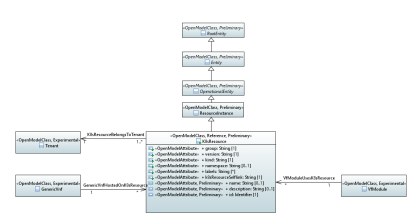

.. Copyright 2021
.. This file is licensed under the CREATIVE COMMONS ATTRIBUTION 4.0 INTERNATIONAL LICENSE
.. Full license text at https://creativecommons.org/licenses/by/4.0/legalcode

Simplified K8S Resource Model 
=============================

.. contents::
   :depth: 3
..

Diagrams
--------

K8S Resource 
~~~~~~~~~~~~

Classes
-------

GenericVnf
~~~~~~~~~~

Applied stereotypes:

-  Experimental

-  OpenModelClass

-  **support: MANDATORY**

K8sResource
~~~~~~~~~~~

A&AI object that represents a resource in K8S

**Parent class:** ResourceInstance

Applied stereotypes:

-  Reference

-  OpenModelClass

-  **support: MANDATORY**

-  Preliminary

=================== ========== ========= ================================== ====================================================================================================================================================================================================================================================================================================================================================================== ========================================================
**Attribute Name**  **Type**   **Mult.** **Stereotypes**                    **Description**                                                                                                                                                                                                                                                                                                                                                        **Defined in**
group               String     1         OpenModelAttribute                 API group of the K8S resource, e.g., "apps"                                                                                                                                                                                                                                                                                                                            Vnf::ObjectClasses::K8sResource::group
                                                                                                                                                                                                                                                                                                                                                                                                                                                  
                                         -  isInvariant: false                                                                                                                                                                                                                                                                                                                                                                                    
                                                                                                                                                                                                                                                                                                                                                                                                                                                  
                                         -  valueRange: no range constraint                                                                                                                                                                                                                                                                                                                                                                       
                                                                                                                                                                                                                                                                                                                                                                                                                                                  
                                         -  support: MANDATORY                                                                                                                                                                                                                                                                                                                                                                                    
version             String     1         OpenModelAttribute                 API version of the K8S resource, e.g., "v1"                                                                                                                                                                                                                                                                                                                            Vnf::ObjectClasses::K8sResource::version
                                                                                                                                                                                                                                                                                                                                                                                                                                                  
                                         -  isInvariant: false                                                                                                                                                                                                                                                                                                                                                                                    
                                                                                                                                                                                                                                                                                                                                                                                                                                                  
                                         -  valueRange: no range constraint                                                                                                                                                                                                                                                                                                                                                                       
                                                                                                                                                                                                                                                                                                                                                                                                                                                  
                                         -  support: MANDATORY                                                                                                                                                                                                                                                                                                                                                                                    
kind                String     1         OpenModelAttribute                 type of the K8S resource, e.g., "Deployment"                                                                                                                                                                                                                                                                                                                           Vnf::ObjectClasses::K8sResource::kind
                                                                                                                                                                                                                                                                                                                                                                                                                                                  
                                         -  isInvariant: false                                                                                                                                                                                                                                                                                                                                                                                    
                                                                                                                                                                                                                                                                                                                                                                                                                                                  
                                         -  valueRange: no range constraint                                                                                                                                                                                                                                                                                                                                                                       
                                                                                                                                                                                                                                                                                                                                                                                                                                                  
                                         -  support: MANDATORY                                                                                                                                                                                                                                                                                                                                                                                    
namespace           String     0..1      OpenModelAttribute                 namespace of the K8S resource                                                                                                                                                                                                                                                                                                                                          Vnf::ObjectClasses::K8sResource::namespace
                                                                                                                                                                                                                                                                                                                                                                                                                                                  
                                         -  isInvariant: false                                                                                                                                                                                                                                                                                                                                                                                    
                                                                                                                                                                                                                                                                                                                                                                                                                                                  
                                         -  valueRange: no range constraint                                                                                                                                                                                                                                                                                                                                                                       
                                                                                                                                                                                                                                                                                                                                                                                                                                                  
                                         -  support: MANDATORY                                                                                                                                                                                                                                                                                                                                                                                    
labels              String     0..\*     OpenModelAttribute                 labels of the K8S resource                                                                                                                                                                                                                                                                                                                                             Vnf::ObjectClasses::K8sResource::labels
                                                                                                                                                                                                                                                                                                                                                                                                                                                  
                                         -  isInvariant: false                                                                                                                                                                                                                                                                                                                                                                                    
                                                                                                                                                                                                                                                                                                                                                                                                                                                  
                                         -  valueRange: no range constraint                                                                                                                                                                                                                                                                                                                                                                       
                                                                                                                                                                                                                                                                                                                                                                                                                                                  
                                         -  support: MANDATORY                                                                                                                                                                                                                                                                                                                                                                                    
k8sResourceSelflink String     1         OpenModelAttribute                 URI of the K8S resource                                                                                                                                                                                                                                                                                                                                                Vnf::ObjectClasses::K8sResource::k8sResourceSelflink
                                                                                                                                                                                                                                                                                                                                                                                                                                                  
                                         -  isInvariant: false                                                                                                                                                                                                                                                                                                                                                                                    
                                                                                                                                                                                                                                                                                                                                                                                                                                                  
                                         -  valueRange: no range constraint                                                                                                                                                                                                                                                                                                                                                                       
                                                                                                                                                                                                                                                                                                                                                                                                                                                  
                                         -  support: MANDATORY                                                                                                                                                                                                                                                                                                                                                                                    
name                String     0..1      OpenModelAttribute                 Represents a user-friendly identifier of an object. It is a (possibly ambiguous) name by which the object is commonly known in some limited scope (such as an organization) and conforms to the naming conventions of the country or culture with which it is associated. It is NOT used as a naming attribute (i.e., to uniquely identify an instance of the object). Common::Root::RootObjectClasses::RootEntity::name
                                                                                                                                                                                                                                                                                                                                                                                                                                                  
                                         -  isInvariant: false                                                                                                                                                                                                                                                                                                                                                                                    
                                                                                                                                                                                                                                                                                                                                                                                                                                                  
                                         -  valueRange: no range constraint                                                                                                                                                                                                                                                                                                                                                                       
                                                                                                                                                                                                                                                                                                                                                                                                                                                  
                                         -  support: MANDATORY                                                                                                                                                                                                                                                                                                                                                                                    
                                                                                                                                                                                                                                                                                                                                                                                                                                                  
                                         Preliminary                                                                                                                                                                                                                                                                                                                                                                                              
description         String     0..1      OpenModelAttribute                 Defines a textual free-form description of the object.                                                                                                                                                                                                                                                                                                                 Common::Root::RootObjectClasses::RootEntity::description
                                                                                                                                                                                                                                                                                                                                                                                                                                                  
                                         -  isInvariant: false                                                                                                                                                                                                                                                                                                                                                                                    
                                                                                                                                                                                                                                                                                                                                                                                                                                                  
                                         -  valueRange: no range constraint                                                                                                                                                                                                                                                                                                                                                                       
                                                                                                                                                                                                                                                                                                                                                                                                                                                  
                                         -  support: MANDATORY                                                                                                                                                                                                                                                                                                                                                                                    
                                                                                                                                                                                                                                                                                                                                                                                                                                                  
                                         Preliminary                                                                                                                                                                                                                                                                                                                                                                                              
id                  Identifier 1         OpenModelAttribute                 Unambiguously distinguishes different object instances. It is the naming attribute of the object.                                                                                                                                                                                                                                                                      Common::Root::RootObjectClasses::RootEntity::id
                                                                                                                                                                                                                                                                                                                                                                                                                                                  
                                         -  isInvariant: false              Identifier of this information element. This attribute shall be globally unique.                                                                                                                                                                                                                                                                                      
                                                                                                                                                                                                                                                                                                                                                                                                                                                  
                                         -  valueRange: no range constraint                                                                                                                                                                                                                                                                                                                                                                       
                                                                                                                                                                                                                                                                                                                                                                                                                                                  
                                         -  support: MANDATORY                                                                                                                                                                                                                                                                                                                                                                                    
                                                                                                                                                                                                                                                                                                                                                                                                                                                  
                                         Preliminary                                                                                                                                                                                                                                                                                                                                                                                              
=================== ========== ========= ================================== ====================================================================================================================================================================================================================================================================================================================================================================== ========================================================

Tenant
~~~~~~

Applied stereotypes:

-  Experimental

-  OpenModelClass

-  **support: MANDATORY**

VfModule
~~~~~~~~

Applied stereotypes:

-  Experimental

-  OpenModelClass

-  **support: MANDATORY**

Associations
------------

K8sResourceBelongsToTenant
~~~~~~~~~~~~~~~~~~~~~~~~~~

Applied stereotypes:

================== =========== ========== =========== ========= ===============
**Attribute Name** **Aggreg.** **Navig.** **Type**    **Mult.** **Description**
tenant             none        Navig.     Tenant      1        
k8sresource        none        Not navig. K8sResource 1..\*    
================== =========== ========== =========== ========= ===============

GenericVnfHostedOnK8sResource
~~~~~~~~~~~~~~~~~~~~~~~~~~~~~

Applied stereotypes:

================== =========== ========== =========== ========= ===============
**Attribute Name** **Aggreg.** **Navig.** **Type**    **Mult.** **Description**
k8sresource        none        Navig.     K8sResource 0..\*    
genericvnf         none        Not navig. GenericVnf  1        
================== =========== ========== =========== ========= ===============

VfModuleUsesK8sResource
~~~~~~~~~~~~~~~~~~~~~~~

Applied stereotypes:

================== =========== ========== =========== ========= ===============
**Attribute Name** **Aggreg.** **Navig.** **Type**    **Mult.** **Description**
k8sresource        none        Navig.     K8sResource 0..\*    
vfmodule           none        Not navig. VfModule    1        
================== =========== ========== =========== ========= ===============