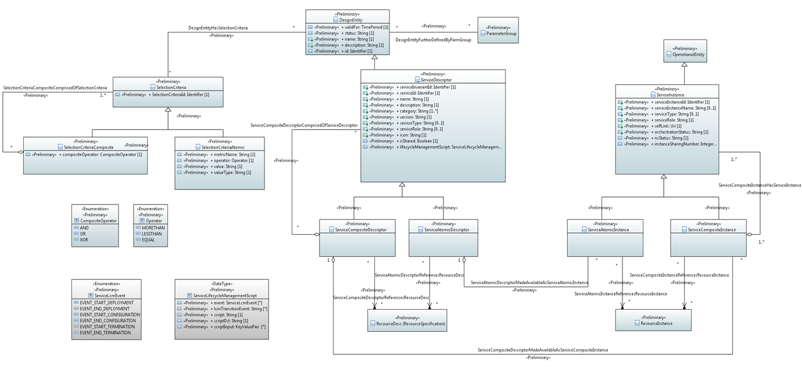

Enhanced Nested Service Model
=============================

Diagrams
--------

Enhanced Nested Service Model 
~~~~~~~~~~~~~~~~~~~~~~~~~~~~~~

Classes
-------

ServiceAtomicDescriptor
~~~~~~~~~~~~~~~~~~~~~~~

**Parent class:** ServiceDescriptor

Applied stereotypes:

-  OpenModelClass

-  **support: MANDATORY**

-  Preliminary

====================================== ================================ ========= ================================== ======================================================================================================================================================================================================================================================================================================================================================================
**Attribute Name**                     **Type**                         **Mult.** **Stereotypes**                    **Description**
\_serviceAtomicInstance                ServiceAtomicInstance            0..\*     OpenModelAttribute                 An implementation of atomic Service corresponding to a ServicecAtomicDescriptor.
                                                                                                                    
                                                                                  -  isInvariant: false             
                                                                                                                    
                                                                                  -  valueRange: no range constraint
                                                                                                                    
                                                                                  -  support: MANDATORY             
\_resourceDesc (resourcespecification) ResourceDesc                     0..\*     OpenModelAttribute                 Resource components of constituting a serivce descriptor.
                                                                                                                    
                                                                                  -  isInvariant: false             
                                                                                                                    
                                                                                  -  valueRange: no range constraint
                                                                                                                    
                                                                                  -  support: MANDATORY             
serviceInvariantId                     Identifier                       1         OpenModelAttribute                 Constant identifier of the service model.
                                                                                                                    
                                                                                  -  isInvariant: false             
                                                                                                                    
                                                                                  -  valueRange: no range constraint
                                                                                                                    
                                                                                  -  support: MANDATORY             
                                                                                                                    
                                                                                  Preliminary                       
serviceId                              Identifier                       1         OpenModelAttribute                 Versioned identifier of the service model (this uuid is changed for every major version of the service)
                                                                                                                    
                                                                                  -  isInvariant: false             
                                                                                                                    
                                                                                  -  valueRange: no range constraint
                                                                                                                    
                                                                                  -  support: MANDATORY             
                                                                                                                    
                                                                                  Preliminary                       
name                                   String                           1         OpenModelAttribute                 The name of the service model designed.
                                                                                                                    
                                                                                  -  isInvariant: false             
                                                                                                                    
                                                                                  -  valueRange: no range constraint
                                                                                                                    
                                                                                  -  support: MANDATORY             
                                                                                                                    
                                                                                  Preliminary                       
description                            String                           1         OpenModelAttribute                 The description of the service model designed.
                                                                                                                    
                                                                                  -  isInvariant: false             
                                                                                                                    
                                                                                  -  valueRange: no range constraint
                                                                                                                    
                                                                                  -  support: MANDATORY             
                                                                                                                    
                                                                                  Preliminary                       
category                               String                           1..\*     OpenModelAttribute                 A predefined list which identifies the construct's category. There is a predefined list of service categories.
                                                                                                                    
                                                                                  -  isInvariant: false             
                                                                                                                    
                                                                                  -  valueRange: no range constraint
                                                                                                                    
                                                                                  -  support: MANDATORY             
                                                                                                                    
                                                                                  Preliminary                       
version                                String                           1         OpenModelAttribute                 The service model version.
                                                                                                                    
                                                                                  -  isInvariant: false             
                                                                                                                    
                                                                                  -  valueRange: no range constraint
                                                                                                                    
                                                                                  -  support: MANDATORY             
                                                                                                                    
                                                                                  Preliminary                       
serviceType                            String                           0..1      OpenModelAttribute                 An optional string field defining a generic type (like category) of the service. E.g. this field can be used for defining the service as "TRANSPORT".
                                                                                                                    
                                                                                  -  isInvariant: false             
                                                                                                                    
                                                                                  -  valueRange: no range constraint
                                                                                                                    
                                                                                  -  support: MANDATORY             
                                                                                                                    
                                                                                  Preliminary                       
serviceRole                            String                           0..1      OpenModelAttribute                 An optional string field for shortcode that defines the function that the service is providing. E.g. "MISVPN" or "AIM".
                                                                                                                    
                                                                                  -  isInvariant: false             
                                                                                                                    
                                                                                  -  valueRange: no range constraint
                                                                                                                    
                                                                                  -  support: MANDATORY             
                                                                                                                    
                                                                                  Preliminary                       
icon                                   String                           1         OpenModelAttribute                 The icon path of the service.
                                                                                                                    
                                                                                  -  isInvariant: false             
                                                                                                                    
                                                                                  -  valueRange: no range constraint
                                                                                                                    
                                                                                  -  support: MANDATORY             
                                                                                                                    
                                                                                  Preliminary                       
attachment                             Attachment                       0..\*     OpenModelAttribute                
                                                                                                                    
                                                                                  -  isInvariant: false             
                                                                                                                    
                                                                                  -  valueRange: no range constraint
                                                                                                                    
                                                                                  -  support: MANDATORY             
                                                                                                                    
                                                                                  Preliminary                       
isShared                               Boolean                          1         OpenModelAttribute                 Describe whether this service descriptor is shared or not in the service design.
                                                                                                                    
                                                                                  -  isInvariant: false             
                                                                                                                    
                                                                                  -  valueRange: no range constraint
                                                                                                                    
                                                                                  -  support: MANDATORY             
                                                                                                                    
                                                                                  Preliminary                       
lifecycleManagementScript              ServiceLifecycleManagementScript 0..\*     OpenModelAttribute                 Includes a list of events and corresponding management scripts performed for the
                                                                                                                     Service.
                                                                                  -  isInvariant: false             
                                                                                                                    
                                                                                  -  valueRange: no range constraint
                                                                                                                    
                                                                                  -  support: OPTIONAL              
                                                                                                                    
                                                                                  Preliminary                       
class8                                 CustomizedKPIGroup               0..1      OpenModelAttribute                
                                                                                                                    
                                                                                  -  isInvariant: false             
                                                                                                                    
                                                                                  -  valueRange: no range constraint
                                                                                                                    
                                                                                  -  support: MANDATORY             
SNSSAIId                               Identifier                       0..1      OpenModelAttribute                
                                                                                                                    
                                                                                  -  isInvariant: false             
                                                                                                                    
                                                                                  -  valueRange: no range constraint
                                                                                                                    
                                                                                  -  support: MANDATORY             
                                                                                                                    
                                                                                  Experimental                      
validFor                               TimePeriod                       0..1      OpenModelAttribute                 The period during which the design entity is valid.
                                                                                                                    
                                                                                  -  isInvariant: false             
                                                                                                                    
                                                                                  -  valueRange: no range constraint
                                                                                                                    
                                                                                  -  support: MANDATORY             
                                                                                                                    
                                                                                  Preliminary                       
status                                 String                           1         OpenModelAttribute                 The condition of the specification, such s active, inactive, or planned.
                                                                                                                    
                                                                                  -  isInvariant: false             
                                                                                                                    
                                                                                  -  valueRange: no range constraint
                                                                                                                    
                                                                                  -  support: MANDATORY             
                                                                                                                    
                                                                                  Preliminary                       
name                                   String                           1         OpenModelAttribute                 Represents a user-friendly identifier of an object. It is a (possibly ambiguous) name by which the object is commonly known in some limited scope (such as an organization) and conforms to the naming conventions of the country or culture with which it is associated. It is NOT used as a naming attribute (i.e., to uniquely identify an instance of the object).
                                                                                                                    
                                                                                  -  isInvariant: false             
                                                                                                                    
                                                                                  -  valueRange: no range constraint
                                                                                                                    
                                                                                  -  support: MANDATORY             
                                                                                                                    
                                                                                  Preliminary                       
description                            String                           1         OpenModelAttribute                 Defines a textual free-form description of the object.
                                                                                                                    
                                                                                  -  isInvariant: false             
                                                                                                                    
                                                                                  -  valueRange: no range constraint
                                                                                                                    
                                                                                  -  support: MANDATORY             
                                                                                                                    
                                                                                  Preliminary                       
id                                     Identifier                       1         OpenModelAttribute                 Identifier of this information element. This attribute shall be globally unique.
                                                                                                                    
                                                                                  -  isInvariant: false              Unambiguously distinguishes different object instances. It is the naming attribute of the object.
                                                                                                                    
                                                                                  -  valueRange: no range constraint
                                                                                                                    
                                                                                  -  support: MANDATORY             
                                                                                                                    
                                                                                  Preliminary                       
====================================== ================================ ========= ================================== ======================================================================================================================================================================================================================================================================================================================================================================

ServiceAtomicInstance
~~~~~~~~~~~~~~~~~~~~~

**Parent class:** ServiceInstance

Applied stereotypes:

-  OpenModelClass

-  **support: MANDATORY**

-  Preliminary

===================== ================ ========= ================================== ======================================================================================================================================================================================================================================================================================================================================================================
**Attribute Name**    **Type**         **Mult.** **Stereotypes**                    **Description**
\_resourceInstance    ResourceInstance 0..\*     OpenModelAttribute                 Resource instance components of constituting a service instance.
                                                                                   
                                                 -  isInvariant: false             
                                                                                   
                                                 -  valueRange: no range constraint
                                                                                   
                                                 -  support: MANDATORY             
serviceInstanceId     Identifier       1         OpenModelAttribute                 Uniquely identifies this instance of a service.
                                                                                   
                                                 -  isInvariant: false              Uniquely identifies this instance of a service.
                                                                                   
                                                 -  valueRange: no range constraint
                                                                                   
                                                 -  support: MANDATORY             
                                                                                   
                                                 Preliminary                       
serviceInstanceName   String           0..1      OpenModelAttribute                 The name assigned to the service-instance.
                                                                                   
                                                 -  isInvariant: false             
                                                                                   
                                                 -  valueRange: no range constraint
                                                                                   
                                                 -  support: OPTIONAL              
                                                                                   
                                                 Preliminary                       
serviceType           String           0..1      OpenModelAttribute                 An optional string field defining a generic type (like category) of the service. E.g. this field can be used for defining the service as "TRANSPORT".
                                                                                   
                                                 -  isInvariant: false             
                                                                                   
                                                 -  valueRange: no range constraint
                                                                                   
                                                 -  support: MANDATORY             
                                                                                   
                                                 Preliminary                       
serviceRole           String           1         OpenModelAttribute                 An optional string field for shortcode that defines the function that the service is providing. E.g. "MISVPN" or "AIM".
                                                                                   
                                                 -  isInvariant: false             
                                                                                   
                                                 -  valueRange: no range constraint
                                                                                   
                                                 -  support: MANDATORY             
                                                                                   
                                                 Preliminary                       
selfLink              Uri              1         OpenModelAttribute                 URL to endpoint where more details can be gotten.
                                                                                   
                                                 -  isInvariant: false             
                                                                                   
                                                 -  valueRange: no range constraint
                                                                                   
                                                 -  support: MANDATORY             
                                                                                   
                                                 Preliminary                       
orchestrationStatus   String           1         OpenModelAttribute                 Orchestration status of the service instance.
                                                                                   
                                                 -  isInvariant: false             
                                                                                   
                                                 -  valueRange: no range constraint
                                                                                   
                                                 -  support: MANDATORY             
                                                                                   
                                                 Preliminary                       
nsStatus              String           1         OpenModelAttribute                 Describe NS instance staus: instantiating(creating the Networek Service instance), active(the existed Network Service instance is under using), terminating(the existed Network Service instance stops using) or etc(healing and other possible status).
                                                                                   
                                                 -  isInvariant: false             
                                                                                   
                                                 -  valueRange: no range constraint
                                                                                   
                                                 -  support: MANDATORY             
                                                                                   
                                                 Preliminary                       
instanceSharingNumber Integer          0..1      OpenModelAttribute                 Record the number of services that are using this service instance.
                                                                                    Note: This attribute can be used when a service instance is prepared to be deleted, the detected number will help to find how many services are using this instance. If number is greater than 1, it shows this instance is used by other service(s), otherwise it can be deleted.
                                                 -  isInvariant: false             
                                                                                   
                                                 -  valueRange: no range constraint
                                                                                   
                                                 -  support: MANDATORY             
                                                                                   
                                                 Preliminary                       
name                  String           0..1      OpenModelAttribute                 Represents a user-friendly identifier of an object. It is a (possibly ambiguous) name by which the object is commonly known in some limited scope (such as an organization) and conforms to the naming conventions of the country or culture with which it is associated. It is NOT used as a naming attribute (i.e., to uniquely identify an instance of the object).
                                                                                   
                                                 -  isInvariant: false             
                                                                                   
                                                 -  valueRange: no range constraint
                                                                                   
                                                 -  support: MANDATORY             
                                                                                   
                                                 Preliminary                       
description           String           0..1      OpenModelAttribute                 Defines a textual free-form description of the object.
                                                                                   
                                                 -  isInvariant: false             
                                                                                   
                                                 -  valueRange: no range constraint
                                                                                   
                                                 -  support: MANDATORY             
                                                                                   
                                                 Preliminary                       
id                    Identifier       1         OpenModelAttribute                 Identifier of this information element. This attribute shall be globally unique.
                                                                                   
                                                 -  isInvariant: false              Unambiguously distinguishes different object instances. It is the naming attribute of the object.
                                                                                   
                                                 -  valueRange: no range constraint
                                                                                   
                                                 -  support: MANDATORY             
                                                                                   
                                                 Preliminary                       
===================== ================ ========= ================================== ======================================================================================================================================================================================================================================================================================================================================================================

ServiceCompositeDescriptor
~~~~~~~~~~~~~~~~~~~~~~~~~~

ServcieCompositeDescriptor is used to model the design time representation of a service component or network service.

**Parent class:** ServiceDescriptor

Applied stereotypes:

-  OpenModelClass

-  **support: MANDATORY**

-  Preliminary

====================================== ================================ ========= ================================== ======================================================================================================================================================================================================================================================================================================================================================================
**Attribute Name**                     **Type**                         **Mult.** **Stereotypes**                    **Description**
\_serviceDescriptor                    ServiceDescriptor                0..\*     OpenModelAttribute                 Describe the nested relationship between multiple Service Descriptors.
                                                                                                                    
                                                                                  -  isInvariant: false             
                                                                                                                    
                                                                                  -  valueRange: no range constraint
                                                                                                                    
                                                                                  -  support: MANDATORY             
\_serviceCompositeInstance             ServiceCompositeInstance         0..\*     OpenModelAttribute                 An implementation of composite Service corresponding to a ServiceCompositeDescriptor.
                                                                                                                    
                                                                                  -  isInvariant: false             
                                                                                                                    
                                                                                  -  valueRange: no range constraint
                                                                                                                    
                                                                                  -  support: MANDATORY             
\_resourceDesc (resourcespecification) ResourceDesc                     0..\*     OpenModelAttribute                 Resource components of constituting a serivce descriptor.
                                                                                                                    
                                                                                  -  isInvariant: false             
                                                                                                                    
                                                                                  -  valueRange: no range constraint
                                                                                                                    
                                                                                  -  support: MANDATORY             
serviceInvariantId                     Identifier                       1         OpenModelAttribute                 Constant identifier of the service model.
                                                                                                                    
                                                                                  -  isInvariant: false             
                                                                                                                    
                                                                                  -  valueRange: no range constraint
                                                                                                                    
                                                                                  -  support: MANDATORY             
                                                                                                                    
                                                                                  Preliminary                       
serviceId                              Identifier                       1         OpenModelAttribute                 Versioned identifier of the service model (this uuid is changed for every major version of the service)
                                                                                                                    
                                                                                  -  isInvariant: false             
                                                                                                                    
                                                                                  -  valueRange: no range constraint
                                                                                                                    
                                                                                  -  support: MANDATORY             
                                                                                                                    
                                                                                  Preliminary                       
name                                   String                           1         OpenModelAttribute                 The name of the service model designed.
                                                                                                                    
                                                                                  -  isInvariant: false             
                                                                                                                    
                                                                                  -  valueRange: no range constraint
                                                                                                                    
                                                                                  -  support: MANDATORY             
                                                                                                                    
                                                                                  Preliminary                       
description                            String                           1         OpenModelAttribute                 The description of the service model designed.
                                                                                                                    
                                                                                  -  isInvariant: false             
                                                                                                                    
                                                                                  -  valueRange: no range constraint
                                                                                                                    
                                                                                  -  support: MANDATORY             
                                                                                                                    
                                                                                  Preliminary                       
category                               String                           1..\*     OpenModelAttribute                 A predefined list which identifies the construct's category. There is a predefined list of service categories.
                                                                                                                    
                                                                                  -  isInvariant: false             
                                                                                                                    
                                                                                  -  valueRange: no range constraint
                                                                                                                    
                                                                                  -  support: MANDATORY             
                                                                                                                    
                                                                                  Preliminary                       
version                                String                           1         OpenModelAttribute                 The service model version.
                                                                                                                    
                                                                                  -  isInvariant: false             
                                                                                                                    
                                                                                  -  valueRange: no range constraint
                                                                                                                    
                                                                                  -  support: MANDATORY             
                                                                                                                    
                                                                                  Preliminary                       
serviceType                            String                           0..1      OpenModelAttribute                 An optional string field defining a generic type (like category) of the service. E.g. this field can be used for defining the service as "TRANSPORT".
                                                                                                                    
                                                                                  -  isInvariant: false             
                                                                                                                    
                                                                                  -  valueRange: no range constraint
                                                                                                                    
                                                                                  -  support: MANDATORY             
                                                                                                                    
                                                                                  Preliminary                       
serviceRole                            String                           0..1      OpenModelAttribute                 An optional string field for shortcode that defines the function that the service is providing. E.g. "MISVPN" or "AIM".
                                                                                                                    
                                                                                  -  isInvariant: false             
                                                                                                                    
                                                                                  -  valueRange: no range constraint
                                                                                                                    
                                                                                  -  support: MANDATORY             
                                                                                                                    
                                                                                  Preliminary                       
icon                                   String                           1         OpenModelAttribute                 The icon path of the service.
                                                                                                                    
                                                                                  -  isInvariant: false             
                                                                                                                    
                                                                                  -  valueRange: no range constraint
                                                                                                                    
                                                                                  -  support: MANDATORY             
                                                                                                                    
                                                                                  Preliminary                       
attachment                             Attachment                       0..\*     OpenModelAttribute                
                                                                                                                    
                                                                                  -  isInvariant: false             
                                                                                                                    
                                                                                  -  valueRange: no range constraint
                                                                                                                    
                                                                                  -  support: MANDATORY             
                                                                                                                    
                                                                                  Preliminary                       
isShared                               Boolean                          1         OpenModelAttribute                 Describe whether this service descriptor is shared or not in the service design.
                                                                                                                    
                                                                                  -  isInvariant: false             
                                                                                                                    
                                                                                  -  valueRange: no range constraint
                                                                                                                    
                                                                                  -  support: MANDATORY             
                                                                                                                    
                                                                                  Preliminary                       
lifecycleManagementScript              ServiceLifecycleManagementScript 0..\*     OpenModelAttribute                 Includes a list of events and corresponding management scripts performed for the
                                                                                                                     Service.
                                                                                  -  isInvariant: false             
                                                                                                                    
                                                                                  -  valueRange: no range constraint
                                                                                                                    
                                                                                  -  support: OPTIONAL              
                                                                                                                    
                                                                                  Preliminary                       
class8                                 CustomizedKPIGroup               0..1      OpenModelAttribute                
                                                                                                                    
                                                                                  -  isInvariant: false             
                                                                                                                    
                                                                                  -  valueRange: no range constraint
                                                                                                                    
                                                                                  -  support: MANDATORY             
SNSSAIId                               Identifier                       0..1      OpenModelAttribute                
                                                                                                                    
                                                                                  -  isInvariant: false             
                                                                                                                    
                                                                                  -  valueRange: no range constraint
                                                                                                                    
                                                                                  -  support: MANDATORY             
                                                                                                                    
                                                                                  Experimental                      
validFor                               TimePeriod                       0..1      OpenModelAttribute                 The period during which the design entity is valid.
                                                                                                                    
                                                                                  -  isInvariant: false             
                                                                                                                    
                                                                                  -  valueRange: no range constraint
                                                                                                                    
                                                                                  -  support: MANDATORY             
                                                                                                                    
                                                                                  Preliminary                       
status                                 String                           1         OpenModelAttribute                 The condition of the specification, such s active, inactive, or planned.
                                                                                                                    
                                                                                  -  isInvariant: false             
                                                                                                                    
                                                                                  -  valueRange: no range constraint
                                                                                                                    
                                                                                  -  support: MANDATORY             
                                                                                                                    
                                                                                  Preliminary                       
name                                   String                           1         OpenModelAttribute                 Represents a user-friendly identifier of an object. It is a (possibly ambiguous) name by which the object is commonly known in some limited scope (such as an organization) and conforms to the naming conventions of the country or culture with which it is associated. It is NOT used as a naming attribute (i.e., to uniquely identify an instance of the object).
                                                                                                                    
                                                                                  -  isInvariant: false             
                                                                                                                    
                                                                                  -  valueRange: no range constraint
                                                                                                                    
                                                                                  -  support: MANDATORY             
                                                                                                                    
                                                                                  Preliminary                       
description                            String                           1         OpenModelAttribute                 Defines a textual free-form description of the object.
                                                                                                                    
                                                                                  -  isInvariant: false             
                                                                                                                    
                                                                                  -  valueRange: no range constraint
                                                                                                                    
                                                                                  -  support: MANDATORY             
                                                                                                                    
                                                                                  Preliminary                       
id                                     Identifier                       1         OpenModelAttribute                 Identifier of this information element. This attribute shall be globally unique.
                                                                                                                    
                                                                                  -  isInvariant: false              Unambiguously distinguishes different object instances. It is the naming attribute of the object.
                                                                                                                    
                                                                                  -  valueRange: no range constraint
                                                                                                                    
                                                                                  -  support: MANDATORY             
                                                                                                                    
                                                                                  Preliminary                       
====================================== ================================ ========= ================================== ======================================================================================================================================================================================================================================================================================================================================================================

ServiceCompositeInstance
~~~~~~~~~~~~~~~~~~~~~~~~

**Parent class:** ServiceInstance

Applied stereotypes:

-  OpenModelClass

-  **support: MANDATORY**

-  Preliminary

===================== ================ ========= ================================== ======================================================================================================================================================================================================================================================================================================================================================================
**Attribute Name**    **Type**         **Mult.** **Stereotypes**                    **Description**
\_resourceInstance    ResourceInstance 0..\*     OpenModelAttribute                 Resource instance components of constituting a service instance.
                                                                                   
                                                 -  isInvariant: false             
                                                                                   
                                                 -  valueRange: no range constraint
                                                                                   
                                                 -  support: MANDATORY             
serviceInstanceId     Identifier       1         OpenModelAttribute                 Uniquely identifies this instance of a service.
                                                                                   
                                                 -  isInvariant: false              Uniquely identifies this instance of a service.
                                                                                   
                                                 -  valueRange: no range constraint
                                                                                   
                                                 -  support: MANDATORY             
                                                                                   
                                                 Preliminary                       
serviceInstanceName   String           0..1      OpenModelAttribute                 The name assigned to the service-instance.
                                                                                   
                                                 -  isInvariant: false             
                                                                                   
                                                 -  valueRange: no range constraint
                                                                                   
                                                 -  support: OPTIONAL              
                                                                                   
                                                 Preliminary                       
serviceType           String           0..1      OpenModelAttribute                 An optional string field defining a generic type (like category) of the service. E.g. this field can be used for defining the service as "TRANSPORT".
                                                                                   
                                                 -  isInvariant: false             
                                                                                   
                                                 -  valueRange: no range constraint
                                                                                   
                                                 -  support: MANDATORY             
                                                                                   
                                                 Preliminary                       
serviceRole           String           1         OpenModelAttribute                 An optional string field for shortcode that defines the function that the service is providing. E.g. "MISVPN" or "AIM".
                                                                                   
                                                 -  isInvariant: false             
                                                                                   
                                                 -  valueRange: no range constraint
                                                                                   
                                                 -  support: MANDATORY             
                                                                                   
                                                 Preliminary                       
selfLink              Uri              1         OpenModelAttribute                 URL to endpoint where more details can be gotten.
                                                                                   
                                                 -  isInvariant: false             
                                                                                   
                                                 -  valueRange: no range constraint
                                                                                   
                                                 -  support: MANDATORY             
                                                                                   
                                                 Preliminary                       
orchestrationStatus   String           1         OpenModelAttribute                 Orchestration status of the service instance.
                                                                                   
                                                 -  isInvariant: false             
                                                                                   
                                                 -  valueRange: no range constraint
                                                                                   
                                                 -  support: MANDATORY             
                                                                                   
                                                 Preliminary                       
nsStatus              String           1         OpenModelAttribute                 Describe NS instance staus: instantiating(creating the Networek Service instance), active(the existed Network Service instance is under using), terminating(the existed Network Service instance stops using) or etc(healing and other possible status).
                                                                                   
                                                 -  isInvariant: false             
                                                                                   
                                                 -  valueRange: no range constraint
                                                                                   
                                                 -  support: MANDATORY             
                                                                                   
                                                 Preliminary                       
instanceSharingNumber Integer          0..1      OpenModelAttribute                 Record the number of services that are using this service instance.
                                                                                    Note: This attribute can be used when a service instance is prepared to be deleted, the detected number will help to find how many services are using this instance. If number is greater than 1, it shows this instance is used by other service(s), otherwise it can be deleted.
                                                 -  isInvariant: false             
                                                                                   
                                                 -  valueRange: no range constraint
                                                                                   
                                                 -  support: MANDATORY             
                                                                                   
                                                 Preliminary                       
name                  String           0..1      OpenModelAttribute                 Represents a user-friendly identifier of an object. It is a (possibly ambiguous) name by which the object is commonly known in some limited scope (such as an organization) and conforms to the naming conventions of the country or culture with which it is associated. It is NOT used as a naming attribute (i.e., to uniquely identify an instance of the object).
                                                                                   
                                                 -  isInvariant: false             
                                                                                   
                                                 -  valueRange: no range constraint
                                                                                   
                                                 -  support: MANDATORY             
                                                                                   
                                                 Preliminary                       
description           String           0..1      OpenModelAttribute                 Defines a textual free-form description of the object.
                                                                                   
                                                 -  isInvariant: false             
                                                                                   
                                                 -  valueRange: no range constraint
                                                                                   
                                                 -  support: MANDATORY             
                                                                                   
                                                 Preliminary                       
id                    Identifier       1         OpenModelAttribute                 Identifier of this information element. This attribute shall be globally unique.
                                                                                   
                                                 -  isInvariant: false              Unambiguously distinguishes different object instances. It is the naming attribute of the object.
                                                                                   
                                                 -  valueRange: no range constraint
                                                                                   
                                                 -  support: MANDATORY             
                                                                                   
                                                 Preliminary                       
===================== ================ ========= ================================== ======================================================================================================================================================================================================================================================================================================================================================================

ServiceDescriptor
~~~~~~~~~~~~~~~~~

ServiceDescriptor is used to model the design time representation of a service.

**Parent class:** DesignEntity

Applied stereotypes:

-  OpenModelClass

-  **support: MANDATORY**

-  Preliminary

========================= ================================ ========= ================================== ======================================================================================================================================================================================================================================================================================================================================================================
**Attribute Name**        **Type**                         **Mult.** **Stereotypes**                    **Description**
serviceInvariantId        Identifier                       1         OpenModelAttribute                 Constant identifier of the service model.
                                                                                                       
                                                                     -  isInvariant: false             
                                                                                                       
                                                                     -  valueRange: no range constraint
                                                                                                       
                                                                     -  support: MANDATORY             
                                                                                                       
                                                                     Preliminary                       
serviceId                 Identifier                       1         OpenModelAttribute                 Versioned identifier of the service model (this uuid is changed for every major version of the service)
                                                                                                       
                                                                     -  isInvariant: false             
                                                                                                       
                                                                     -  valueRange: no range constraint
                                                                                                       
                                                                     -  support: MANDATORY             
                                                                                                       
                                                                     Preliminary                       
name                      String                           1         OpenModelAttribute                 The name of the service model designed.
                                                                                                       
                                                                     -  isInvariant: false             
                                                                                                       
                                                                     -  valueRange: no range constraint
                                                                                                       
                                                                     -  support: MANDATORY             
                                                                                                       
                                                                     Preliminary                       
description               String                           1         OpenModelAttribute                 The description of the service model designed.
                                                                                                       
                                                                     -  isInvariant: false             
                                                                                                       
                                                                     -  valueRange: no range constraint
                                                                                                       
                                                                     -  support: MANDATORY             
                                                                                                       
                                                                     Preliminary                       
category                  String                           1..\*     OpenModelAttribute                 A predefined list which identifies the construct's category. There is a predefined list of service categories.
                                                                                                       
                                                                     -  isInvariant: false             
                                                                                                       
                                                                     -  valueRange: no range constraint
                                                                                                       
                                                                     -  support: MANDATORY             
                                                                                                       
                                                                     Preliminary                       
version                   String                           1         OpenModelAttribute                 The service model version.
                                                                                                       
                                                                     -  isInvariant: false             
                                                                                                       
                                                                     -  valueRange: no range constraint
                                                                                                       
                                                                     -  support: MANDATORY             
                                                                                                       
                                                                     Preliminary                       
serviceType               String                           0..1      OpenModelAttribute                 An optional string field defining a generic type (like category) of the service. E.g. this field can be used for defining the service as "TRANSPORT".
                                                                                                       
                                                                     -  isInvariant: false             
                                                                                                       
                                                                     -  valueRange: no range constraint
                                                                                                       
                                                                     -  support: MANDATORY             
                                                                                                       
                                                                     Preliminary                       
serviceRole               String                           0..1      OpenModelAttribute                 An optional string field for shortcode that defines the function that the service is providing. E.g. "MISVPN" or "AIM".
                                                                                                       
                                                                     -  isInvariant: false             
                                                                                                       
                                                                     -  valueRange: no range constraint
                                                                                                       
                                                                     -  support: MANDATORY             
                                                                                                       
                                                                     Preliminary                       
icon                      String                           1         OpenModelAttribute                 The icon path of the service.
                                                                                                       
                                                                     -  isInvariant: false             
                                                                                                       
                                                                     -  valueRange: no range constraint
                                                                                                       
                                                                     -  support: MANDATORY             
                                                                                                       
                                                                     Preliminary                       
attachment                Attachment                       0..\*     OpenModelAttribute                
                                                                                                       
                                                                     -  isInvariant: false             
                                                                                                       
                                                                     -  valueRange: no range constraint
                                                                                                       
                                                                     -  support: MANDATORY             
                                                                                                       
                                                                     Preliminary                       
isShared                  Boolean                          1         OpenModelAttribute                 Describe whether this service descriptor is shared or not in the service design.
                                                                                                       
                                                                     -  isInvariant: false             
                                                                                                       
                                                                     -  valueRange: no range constraint
                                                                                                       
                                                                     -  support: MANDATORY             
                                                                                                       
                                                                     Preliminary                       
lifecycleManagementScript ServiceLifecycleManagementScript 0..\*     OpenModelAttribute                 Includes a list of events and corresponding management scripts performed for the
                                                                                                        Service.
                                                                     -  isInvariant: false             
                                                                                                       
                                                                     -  valueRange: no range constraint
                                                                                                       
                                                                     -  support: OPTIONAL              
                                                                                                       
                                                                     Preliminary                       
class8                    CustomizedKPIGroup               0..1      OpenModelAttribute                
                                                                                                       
                                                                     -  isInvariant: false             
                                                                                                       
                                                                     -  valueRange: no range constraint
                                                                                                       
                                                                     -  support: MANDATORY             
SNSSAIId                  Identifier                       0..1      OpenModelAttribute                
                                                                                                       
                                                                     -  isInvariant: false             
                                                                                                       
                                                                     -  valueRange: no range constraint
                                                                                                       
                                                                     -  support: MANDATORY             
                                                                                                       
                                                                     Experimental                      
validFor                  TimePeriod                       0..1      OpenModelAttribute                 The period during which the design entity is valid.
                                                                                                       
                                                                     -  isInvariant: false             
                                                                                                       
                                                                     -  valueRange: no range constraint
                                                                                                       
                                                                     -  support: MANDATORY             
                                                                                                       
                                                                     Preliminary                       
status                    String                           1         OpenModelAttribute                 The condition of the specification, such s active, inactive, or planned.
                                                                                                       
                                                                     -  isInvariant: false             
                                                                                                       
                                                                     -  valueRange: no range constraint
                                                                                                       
                                                                     -  support: MANDATORY             
                                                                                                       
                                                                     Preliminary                       
name                      String                           1         OpenModelAttribute                 Represents a user-friendly identifier of an object. It is a (possibly ambiguous) name by which the object is commonly known in some limited scope (such as an organization) and conforms to the naming conventions of the country or culture with which it is associated. It is NOT used as a naming attribute (i.e., to uniquely identify an instance of the object).
                                                                                                       
                                                                     -  isInvariant: false             
                                                                                                       
                                                                     -  valueRange: no range constraint
                                                                                                       
                                                                     -  support: MANDATORY             
                                                                                                       
                                                                     Preliminary                       
description               String                           1         OpenModelAttribute                 Defines a textual free-form description of the object.
                                                                                                       
                                                                     -  isInvariant: false             
                                                                                                       
                                                                     -  valueRange: no range constraint
                                                                                                       
                                                                     -  support: MANDATORY             
                                                                                                       
                                                                     Preliminary                       
id                        Identifier                       1         OpenModelAttribute                 Identifier of this information element. This attribute shall be globally unique.
                                                                                                       
                                                                     -  isInvariant: false              Unambiguously distinguishes different object instances. It is the naming attribute of the object.
                                                                                                       
                                                                     -  valueRange: no range constraint
                                                                                                       
                                                                     -  support: MANDATORY             
                                                                                                       
                                                                     Preliminary                       
========================= ================================ ========= ================================== ======================================================================================================================================================================================================================================================================================================================================================================

ServiceInstance
~~~~~~~~~~~~~~~

ServiceInstance is used to model the run time representation of a service.

**Parent class:** OperationalEntity

Applied stereotypes:

-  OpenModelClass

-  **support: MANDATORY**

-  Preliminary

===================== ========== ========= ================================== ======================================================================================================================================================================================================================================================================================================================================================================
**Attribute Name**    **Type**   **Mult.** **Stereotypes**                    **Description**
serviceInstanceId     Identifier 1         OpenModelAttribute                 Uniquely identifies this instance of a service.
                                                                             
                                           -  isInvariant: false              Uniquely identifies this instance of a service.
                                                                             
                                           -  valueRange: no range constraint
                                                                             
                                           -  support: MANDATORY             
                                                                             
                                           Preliminary                       
serviceInstanceName   String     0..1      OpenModelAttribute                 The name assigned to the service-instance.
                                                                             
                                           -  isInvariant: false             
                                                                             
                                           -  valueRange: no range constraint
                                                                             
                                           -  support: OPTIONAL              
                                                                             
                                           Preliminary                       
serviceType           String     0..1      OpenModelAttribute                 An optional string field defining a generic type (like category) of the service. E.g. this field can be used for defining the service as "TRANSPORT".
                                                                             
                                           -  isInvariant: false             
                                                                             
                                           -  valueRange: no range constraint
                                                                             
                                           -  support: MANDATORY             
                                                                             
                                           Preliminary                       
serviceRole           String     1         OpenModelAttribute                 An optional string field for shortcode that defines the function that the service is providing. E.g. "MISVPN" or "AIM".
                                                                             
                                           -  isInvariant: false             
                                                                             
                                           -  valueRange: no range constraint
                                                                             
                                           -  support: MANDATORY             
                                                                             
                                           Preliminary                       
selfLink              Uri        1         OpenModelAttribute                 URL to endpoint where more details can be gotten.
                                                                             
                                           -  isInvariant: false             
                                                                             
                                           -  valueRange: no range constraint
                                                                             
                                           -  support: MANDATORY             
                                                                             
                                           Preliminary                       
orchestrationStatus   String     1         OpenModelAttribute                 Orchestration status of the service instance.
                                                                             
                                           -  isInvariant: false             
                                                                             
                                           -  valueRange: no range constraint
                                                                             
                                           -  support: MANDATORY             
                                                                             
                                           Preliminary                       
nsStatus              String     1         OpenModelAttribute                 Describe NS instance staus: instantiating(creating the Networek Service instance), active(the existed Network Service instance is under using), terminating(the existed Network Service instance stops using) or etc(healing and other possible status).
                                                                             
                                           -  isInvariant: false             
                                                                             
                                           -  valueRange: no range constraint
                                                                             
                                           -  support: MANDATORY             
                                                                             
                                           Preliminary                       
instanceSharingNumber Integer    0..1      OpenModelAttribute                 Record the number of services that are using this service instance.
                                                                              Note: This attribute can be used when a service instance is prepared to be deleted, the detected number will help to find how many services are using this instance. If number is greater than 1, it shows this instance is used by other service(s), otherwise it can be deleted.
                                           -  isInvariant: false             
                                                                             
                                           -  valueRange: no range constraint
                                                                             
                                           -  support: MANDATORY             
                                                                             
                                           Preliminary                       
name                  String     0..1      OpenModelAttribute                 Represents a user-friendly identifier of an object. It is a (possibly ambiguous) name by which the object is commonly known in some limited scope (such as an organization) and conforms to the naming conventions of the country or culture with which it is associated. It is NOT used as a naming attribute (i.e., to uniquely identify an instance of the object).
                                                                             
                                           -  isInvariant: false             
                                                                             
                                           -  valueRange: no range constraint
                                                                             
                                           -  support: MANDATORY             
                                                                             
                                           Preliminary                       
description           String     0..1      OpenModelAttribute                 Defines a textual free-form description of the object.
                                                                             
                                           -  isInvariant: false             
                                                                             
                                           -  valueRange: no range constraint
                                                                             
                                           -  support: MANDATORY             
                                                                             
                                           Preliminary                       
id                    Identifier 1         OpenModelAttribute                 Identifier of this information element. This attribute shall be globally unique.
                                                                             
                                           -  isInvariant: false              Unambiguously distinguishes different object instances. It is the naming attribute of the object.
                                                                             
                                           -  valueRange: no range constraint
                                                                             
                                           -  support: MANDATORY             
                                                                             
                                           Preliminary                       
===================== ========== ========= ================================== ======================================================================================================================================================================================================================================================================================================================================================================

Associations
------------

ServiceCompositeInstanceHasServiceInstance
~~~~~~~~~~~~~~~~~~~~~~~~~~~~~~~~~~~~~~~~~~

Applied stereotypes:

-  Preliminary

========================== =========== ========== ========= ======================== =============== =====================
**Attribute Name**         **Aggreg.** **Navig.** **Mult.** **Type**                 **Description** **Stereotypes**
\_serviceInstance          shared      Not navig. 1..\*     ServiceInstance                          OpenModelAttribute
                                                                                                    
                                                                                                     -  partOfObjectKey: 0
                                                                                                    
                                                                                                     -  uniqueSet:
                                                                                                    
                                                                                                     -  isInvariant: false
                                                                                                    
                                                                                                     -  unsigned: false
                                                                                                    
                                                                                                     -  counter: NA
                                                                                                    
                                                                                                     -  support: MANDATORY
\_servicecompositeinstance none        Not navig. 1..\*     ServiceCompositeInstance                 OpenModelAttribute
                                                                                                    
                                                                                                     -  partOfObjectKey: 0
                                                                                                    
                                                                                                     -  uniqueSet:
                                                                                                    
                                                                                                     -  isInvariant: false
                                                                                                    
                                                                                                     -  unsigned: false
                                                                                                    
                                                                                                     -  counter: NA
                                                                                                    
                                                                                                     -  support: MANDATORY
========================== =========== ========== ========= ======================== =============== =====================

SerivceCompositeDescriptorMadeAvailableAsServiceCompositeInstance
~~~~~~~~~~~~~~~~~~~~~~~~~~~~~~~~~~~~~~~~~~~~~~~~~~~~~~~~~~~~~~~~~

An implementation of composite Service corresponding to a ServiceCompositeDescriptor.

Applied stereotypes:

-  Preliminary

============================ =========== ========== ========= ========================== =============== =====================
**Attribute Name**           **Aggreg.** **Navig.** **Mult.** **Type**                   **Description** **Stereotypes**
\_serviceCompositeInstance   shared      Not navig. 0..\*     ServiceCompositeInstance                   OpenModelAttribute
                                                                                                        
                                                                                                         -  partOfObjectKey: 0
                                                                                                        
                                                                                                         -  uniqueSet:
                                                                                                        
                                                                                                         -  isInvariant: false
                                                                                                        
                                                                                                         -  unsigned: false
                                                                                                        
                                                                                                         -  counter: NA
                                                                                                        
                                                                                                         -  support: MANDATORY
\_servicecompositedescriptor none        Not navig. 1         ServiceCompositeDescriptor                 OpenModelAttribute
                                                                                                        
                                                                                                         -  partOfObjectKey: 0
                                                                                                        
                                                                                                         -  uniqueSet:
                                                                                                        
                                                                                                         -  isInvariant: false
                                                                                                        
                                                                                                         -  unsigned: false
                                                                                                        
                                                                                                         -  counter: NA
                                                                                                        
                                                                                                         -  support: MANDATORY
============================ =========== ========== ========= ========================== =============== =====================

ServiceCompositeDescriptorComprisedOfServiceDescriptor
~~~~~~~~~~~~~~~~~~~~~~~~~~~~~~~~~~~~~~~~~~~~~~~~~~~~~~

Describe the nested relationship between multiple Serive Descriptors.

Applied stereotypes:

-  Preliminary

========================== =========== ========== ========= ========================== =============== =====================
**Attribute Name**         **Aggreg.** **Navig.** **Mult.** **Type**                   **Description** **Stereotypes**
\_serviceDescriptor        shared      Not navig. 0..\*     ServiceDescriptor                          OpenModelAttribute
                                                                                                      
                                                                                                       -  partOfObjectKey: 0
                                                                                                      
                                                                                                       -  uniqueSet:
                                                                                                      
                                                                                                       -  isInvariant: false
                                                                                                      
                                                                                                       -  unsigned: false
                                                                                                      
                                                                                                       -  counter: NA
                                                                                                      
                                                                                                       -  support: MANDATORY
servicecompositedescriptor none        Not navig. 0..\*     ServiceCompositeDescriptor                 OpenModelAttribute
                                                                                                      
                                                                                                       -  partOfObjectKey: 0
                                                                                                      
                                                                                                       -  uniqueSet:
                                                                                                      
                                                                                                       -  isInvariant: false
                                                                                                      
                                                                                                       -  unsigned: false
                                                                                                      
                                                                                                       -  counter: NA
                                                                                                      
                                                                                                       -  support: MANDATORY
========================== =========== ========== ========= ========================== =============== =====================

ServiceAtomicDescriptorMadeAvailableAsServiceAtomicInstance
~~~~~~~~~~~~~~~~~~~~~~~~~~~~~~~~~~~~~~~~~~~~~~~~~~~~~~~~~~~

An implementation of atomic Service corresponding to a ServicecAtomicDescriptor.

Applied stereotypes:

-  Preliminary

========================= =========== ========== ========= ======================= =============== =====================
**Attribute Name**        **Aggreg.** **Navig.** **Mult.** **Type**                **Description** **Stereotypes**
\_serviceAtomicInstance   shared      Not navig. 0..\*     ServiceAtomicInstance                   OpenModelAttribute
                                                                                                  
                                                                                                   -  partOfObjectKey: 0
                                                                                                  
                                                                                                   -  uniqueSet:
                                                                                                  
                                                                                                   -  isInvariant: false
                                                                                                  
                                                                                                   -  unsigned: false
                                                                                                  
                                                                                                   -  counter: NA
                                                                                                  
                                                                                                   -  support: MANDATORY
\_serviceatomicdescriptor none        Not navig. 1         ServiceAtomicDescriptor                 OpenModelAttribute
                                                                                                  
                                                                                                   -  partOfObjectKey: 0
                                                                                                  
                                                                                                   -  uniqueSet:
                                                                                                  
                                                                                                   -  isInvariant: false
                                                                                                  
                                                                                                   -  unsigned: false
                                                                                                  
                                                                                                   -  counter: NA
                                                                                                  
                                                                                                   -  support: MANDATORY
========================= =========== ========== ========= ======================= =============== =====================

ServiceAtomicDescriptorReferencesResourceDesc
~~~~~~~~~~~~~~~~~~~~~~~~~~~~~~~~~~~~~~~~~~~~~

Resource components of constituting a serivce descriptor.

Applied stereotypes:

-  Preliminary

====================================== =========== ========== ========= ======================= ========================================================= =====================
**Attribute Name**                     **Aggreg.** **Navig.** **Mult.** **Type**                **Description**                                           **Stereotypes**
\_resourceDesc (resourcespecification) none        Navig.     0..\*     ResourceDesc            Resource components of constituting a serivce descriptor. OpenModelAttribute
                                                                                                                                                         
                                                                                                                                                          -  partOfObjectKey: 0
                                                                                                                                                         
                                                                                                                                                          -  uniqueSet:
                                                                                                                                                         
                                                                                                                                                          -  isInvariant: false
                                                                                                                                                         
                                                                                                                                                          -  unsigned: false
                                                                                                                                                         
                                                                                                                                                          -  counter: NA
                                                                                                                                                         
                                                                                                                                                          -  support: MANDATORY
\_serviceatomicdescriptor              none        Not navig. 0..\*     ServiceAtomicDescriptor                                                           OpenModelAttribute
                                                                                                                                                         
                                                                                                                                                          -  partOfObjectKey: 0
                                                                                                                                                         
                                                                                                                                                          -  uniqueSet:
                                                                                                                                                         
                                                                                                                                                          -  isInvariant: false
                                                                                                                                                         
                                                                                                                                                          -  unsigned: false
                                                                                                                                                         
                                                                                                                                                          -  counter: NA
                                                                                                                                                         
                                                                                                                                                          -  support: MANDATORY
====================================== =========== ========== ========= ======================= ========================================================= =====================

ServiceAtomicInstanceReferencesResourceInstance
~~~~~~~~~~~~~~~~~~~~~~~~~~~~~~~~~~~~~~~~~~~~~~~

Resource instance components of constituting a serivce instance.

Applied stereotypes:

-  Preliminary

======================= =========== ========== ========= ===================== ================================================================ =====================
**Attribute Name**      **Aggreg.** **Navig.** **Mult.** **Type**              **Description**                                                  **Stereotypes**
\_resourceInstance      none        Navig.     0..\*     ResourceInstance      Resource instance components of constituting a service instance. OpenModelAttribute
                                                                                                                                               
                                                                                                                                                -  partOfObjectKey: 0
                                                                                                                                               
                                                                                                                                                -  uniqueSet:
                                                                                                                                               
                                                                                                                                                -  isInvariant: false
                                                                                                                                               
                                                                                                                                                -  unsigned: false
                                                                                                                                               
                                                                                                                                                -  counter: NA
                                                                                                                                               
                                                                                                                                                -  support: MANDATORY
\_serviceatomicinstance none        Not navig. 0..\*     ServiceAtomicInstance                                                                  OpenModelAttribute
                                                                                                                                               
                                                                                                                                                -  partOfObjectKey: 0
                                                                                                                                               
                                                                                                                                                -  uniqueSet:
                                                                                                                                               
                                                                                                                                                -  isInvariant: false
                                                                                                                                               
                                                                                                                                                -  unsigned: false
                                                                                                                                               
                                                                                                                                                -  counter: NA
                                                                                                                                               
                                                                                                                                                -  support: MANDATORY
======================= =========== ========== ========= ===================== ================================================================ =====================

ServiceCompositeInstanceReferencesResourceInstance
~~~~~~~~~~~~~~~~~~~~~~~~~~~~~~~~~~~~~~~~~~~~~~~~~~

Resource instance components of constituting a serivce instance.

Applied stereotypes:

-  Preliminary

========================== =========== ========== ========= ======================== ================================================================ =====================
**Attribute Name**         **Aggreg.** **Navig.** **Mult.** **Type**                 **Description**                                                  **Stereotypes**
\_resourceInstance         none        Navig.     0..\*     ResourceInstance         Resource instance components of constituting a service instance. OpenModelAttribute
                                                                                                                                                     
                                                                                                                                                      -  partOfObjectKey: 0
                                                                                                                                                     
                                                                                                                                                      -  uniqueSet:
                                                                                                                                                     
                                                                                                                                                      -  isInvariant: false
                                                                                                                                                     
                                                                                                                                                      -  unsigned: false
                                                                                                                                                     
                                                                                                                                                      -  counter: NA
                                                                                                                                                     
                                                                                                                                                      -  support: MANDATORY
\_servicecompositeinstance none        Not navig. 0..\*     ServiceCompositeInstance                                                                  OpenModelAttribute
                                                                                                                                                     
                                                                                                                                                      -  partOfObjectKey: 0
                                                                                                                                                     
                                                                                                                                                      -  uniqueSet:
                                                                                                                                                     
                                                                                                                                                      -  isInvariant: false
                                                                                                                                                     
                                                                                                                                                      -  unsigned: false
                                                                                                                                                     
                                                                                                                                                      -  counter: NA
                                                                                                                                                     
                                                                                                                                                      -  support: MANDATORY
========================== =========== ========== ========= ======================== ================================================================ =====================

ServiceCompositeDescriptorReferencesResourceDesc
~~~~~~~~~~~~~~~~~~~~~~~~~~~~~~~~~~~~~~~~~~~~~~~~

Resource components of constituting a serivce descriptor.

Applied stereotypes:

-  Preliminary

====================================== =========== ========== ========= ========================== ========================================================= =====================
**Attribute Name**                     **Aggreg.** **Navig.** **Mult.** **Type**                   **Description**                                           **Stereotypes**
\_resourceDesc (resourcespecification) none        Navig.     0..\*     ResourceDesc               Resource components of constituting a serivce descriptor. OpenModelAttribute
                                                                                                                                                            
                                                                                                                                                             -  partOfObjectKey: 0
                                                                                                                                                            
                                                                                                                                                             -  uniqueSet:
                                                                                                                                                            
                                                                                                                                                             -  isInvariant: false
                                                                                                                                                            
                                                                                                                                                             -  unsigned: false
                                                                                                                                                            
                                                                                                                                                             -  counter: NA
                                                                                                                                                            
                                                                                                                                                             -  support: MANDATORY
\_service compositedescriptor          none        Not navig. 0..\*     ServiceCompositeDescriptor                                                           OpenModelAttribute
                                                                                                                                                            
                                                                                                                                                             -  partOfObjectKey: 0
                                                                                                                                                            
                                                                                                                                                             -  uniqueSet:
                                                                                                                                                            
                                                                                                                                                             -  isInvariant: false
                                                                                                                                                            
                                                                                                                                                             -  unsigned: false
                                                                                                                                                            
                                                                                                                                                             -  counter: NA
                                                                                                                                                            
                                                                                                                                                             -  support: MANDATORY
====================================== =========== ========== ========= ========================== ========================================================= =====================

Data Types
----------

ServiceLifecycleManagementScript
~~~~~~~~~~~~~~~~~~~~~~~~~~~~~~~~

The LifeCycleManagementScript information element specifies a script for the service.

Applied stereotypes:

-  Preliminary

================== =============== ========= ========== ================================== ==========================================================================================================================================================================================================================================================================================================
**Attribute Name** **Type**        **Mult.** **Access** **Stereotypes**                    **Description**
event              ServiceLcmEvent 0..\*     RW         OpenModelAttribute                 Describes Service lifecycle event(s) or an external stimulus detected on an orchestrator
                                                                                           reference point.
                                                        -  isInvariant: false             
                                                                                           Describes Service lifecycle event(s) or an external stimulus detected on an orchestrator
                                                        -  valueRange: no range constraint reference point.
                                                                                          
                                                        -  support: MANDATORY             
                                                                                          
                                                        Preliminary                       
lcmTransitionEvent String          0..\*     RW         OpenModelAttribute                 Describes the transition Service lifecycle event(s) that cannot be mapped to any of the enumerated values defined for the event attribute.
                                                                                          
                                                        -  isInvariant: false             
                                                                                          
                                                        -  valueRange: no range constraint
                                                                                          
                                                        -  support: MANDATORY             
                                                                                          
                                                        Preliminary                       
script             String          1         RW         OpenModelAttribute                 Includes a Service LCM script (e.g. written in a DSL) triggered to react to one of the events listed in the event attribute.
                                                                                          
                                                        -  isInvariant: false             
                                                                                          
                                                        -  valueRange: no range constraint
                                                                                          
                                                        -  support: MANDATORY             
                                                                                          
                                                        Preliminary                       
scriptDsl          String          1         RW         OpenModelAttribute                 Defines the domain specific language (i.e. the type) of script that is provided. Types of scripts could include bash, python, etc.
                                                                                          
                                                        -  isInvariant: false             
                                                                                          
                                                        -  valueRange: no range constraint
                                                                                          
                                                        -  support: MANDATORY             
                                                                                          
                                                        Preliminary                       
scriptInput        KeyValuePair    0..\*     RW         OpenModelAttribute                 Array of KVP requirements with the key as the parameter name and the value as the parameter that need to be passed as an input to the script. Note: The scriptInput values are passed to the scripts in addition to the parameters received in the operation invocation request or indicator value change.
                                                                                          
                                                        -  isInvariant: false             
                                                                                          
                                                        -  valueRange: no range constraint
                                                                                          
                                                        -  support: MANDATORY             
                                                                                          
                                                        Preliminary                       
================== =============== ========= ========== ================================== ==========================================================================================================================================================================================================================================================================================================

Enumerations
------------

ServiceLcmEvent
~~~~~~~~~~~~~~~

Contains Enumeration Literals:

-  EVENT_START_DEPLOYMENT:

-  EVENT_END_DEPLOYMENT:

-  EVENT_START_CONFIGURATION:

-  EVENT_END_CONFIGURATION:

-  EVENT_START_TERMINATION:

-  EVENT_END_TERMINATION:

-  EVENT_START_DEPLOYMENT:

-  EVENT_END_DEPLOYMENT:

-  EVENT_START_CONFIGURATION:

-  EVENT_END_CONFIGURATION:

-  EVENT_START_TERMINATION:

-  EVENT_END_TERMINATION:
