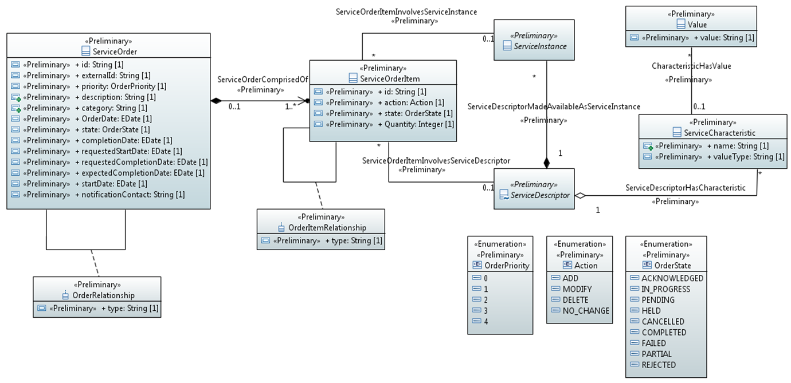

.. Copyright 2020 (China Mobile)
.. This file is licensed under the CREATIVE COMMONS ATTRIBUTION 4.0 INTERNATIONAL LICENSE
.. Full license text at https://creativecommons.org/licenses/by/4.0/legalcode

Service Order
~~~~~~~~~~~~~

.. contents::
   :depth: 3
..

Diagrams
========

Classes
=======

OrderItemRelationship
---------------------

Enables specifying any kind of relationships between ServiceOrderItems

Applied stereotypes:

-  Preliminary

-  OpenModelClass

-  **support: MANDATORY**

================== ======== ========= ================================== =====================================================
**Attribute Name** **Type** **Mult.** **Stereotypes**                    **Description**
================== ======== ========= ================================== =====================================================
type               String   1         Preliminary                        The type of relationship such as contains, relies on.
                                                                        
                                      OpenModelAttribute                
                                                                        
                                      -  isInvariant: false             
                                                                        
                                      -  valueRange: no range constraint
                                                                        
                                      -  support: MANDATORY             
================== ======== ========= ================================== =====================================================

OrderRelationship
-----------------

An association between two ServiceOrders.

Applied stereotypes:

-  Preliminary

-  OpenModelClass

-  **support: MANDATORY**

================== ======== ========= ================================== ===============================================================================
**Attribute Name** **Type** **Mult.** **Stereotypes**                    **Description**
================== ======== ========= ================================== ===============================================================================
type               String   1         Preliminary                        A categorization of the relationship, such as bulk, parent/child, and so forth.
                                                                        
                                      OpenModelAttribute                
                                                                        
                                      -  isInvariant: false             
                                                                        
                                      -  valueRange: no range constraint
                                                                        
                                      -  support: MANDATORY             
================== ======== ========= ================================== ===============================================================================

ServiceCharacteristic
---------------------

A quality or distinctive feature that defines an entity, including the
name of this feature (attribute), and the type of the actual value.

Applied stereotypes:

-  Preliminary

-  OpenModelClass

-  **support: MANDATORY**

================== ======== ========= ================================== ===========================================
**Attribute Name** **Type** **Mult.** **Stereotypes**                    **Description**
================== ======== ========= ================================== ===========================================
name               String   1         Preliminary                        Name of dynamic characteristic (attribute).
                                                                        
                                      OpenModelAttribute                
                                                                        
                                      -  isInvariant: false             
                                                                        
                                      -  valueRange: no range constraint
                                                                        
                                      -  support: MANDATORY             
valueType          String   1         Preliminary                        Type of the dynamic characteristic value.
                                                                        
                                      OpenModelAttribute                
                                                                        
                                      -  isInvariant: false             
                                                                        
                                      -  valueRange: no range constraint
                                                                        
                                      -  support: MANDATORY             
================== ======== ========= ================================== ===========================================

ServiceOrder
------------

A type of Request that represents a Customer Order's products decomposed
into the services through which the products are realized.

**Parent class:** Request

Applied stereotypes:

-  Preliminary

-  OpenModelClass

-  **support: MANDATORY**

======================= ================ ========= ================================== =============================================================================================================================================================================
**Attribute Name**      **Type**         **Mult.** **Stereotypes**                    **Description**
======================= ================ ========= ================================== =============================================================================================================================================================================
id                      String           1         OpenModelAttribute                 Unique identifier for Interaction.
                                                                                     
                                                   -  isInvariant: false             
                                                                                     
                                                   -  valueRange: no range constraint
                                                                                     
                                                   -  support: MANDATORY             
                                                                                     
                                                   Preliminary                       
externalId              String           1         OpenModelAttribute                 ID given by the order requester and only understandable by him (to facilitate his searches afterwards). It could an order number reference from the triggering system (OM)
                                                                                     
                                                   -  isInvariant: false             
                                                                                     
                                                   -  valueRange: no range constraint
                                                                                     
                                                   -  support: MANDATORY             
                                                                                     
                                                   Preliminary                       
priority                OrderPriority    1         OpenModelAttribute                 A way that can be used by order requester to prioritize orders in Service Order
                                                                                     
                                                   -  isInvariant: false             
                                                                                     
                                                   -  valueRange: no range constraint
                                                                                     
                                                   -  support: MANDATORY             
                                                                                     
                                                   Preliminary                       
description             String           1         OpenModelAttribute                 Narrative that explains the interaction and details about the interaction, such as why the interaction is taking place.
                                                                                     
                                                   -  isInvariant: false             
                                                                                     
                                                   -  valueRange: no range constraint
                                                                                     
                                                   -  support: MANDATORY             
                                                                                     
                                                   Preliminary                       
category                String           1         OpenModelAttribute                 Used to categorize the order - Requester valued it and this category can be useful for the Service Order Management system and/or requester (e.g. "broadband", "TV option",).
                                                                                     
                                                   -  isInvariant: false             
                                                                                     
                                                   -  valueRange: no range constraint
                                                                                     
                                                   -  support: MANDATORY             
                                                                                     
                                                   Preliminary                       
state                   OrderState       1         OpenModelAttribute                 State of the order
                                                                                     
                                                   -  isInvariant: false             
                                                                                     
                                                   -  valueRange: no range constraint
                                                                                     
                                                   -  support: MANDATORY             
                                                                                     
                                                   Preliminary                       
completionDate          EDate            1         OpenModelAttribute                 The date on which an interaction is closed or completed.
                                                                                     
                                                   -  isInvariant: false             
                                                                                     
                                                   -  valueRange: no range constraint
                                                                                     
                                                   -  support: MANDATORY             
                                                                                     
                                                   Preliminary                       
requestedStartDate      EDate            1         OpenModelAttribute                 The date that was requested to start processing the order.
                                                                                     
                                                   -  isInvariant: false             
                                                                                     
                                                   -  valueRange: no range constraint
                                                                                     
                                                   -  support: MANDATORY             
                                                                                     
                                                   Preliminary                       
requestedCompletionDate EDate            1         OpenModelAttribute                 The date on which an interaction is closed or completed.
                                                                                     
                                                   -  isInvariant: false             
                                                                                     
                                                   -  valueRange: no range constraint
                                                                                     
                                                   -  support: MANDATORY             
                                                                                     
                                                   Preliminary                       
expectedCompletionDate  EDate            1         OpenModelAttribute                 The date on which an interaction is expected to be completed.
                                                                                     
                                                   -  isInvariant: false             
                                                                                     
                                                   -  valueRange: no range constraint
                                                                                     
                                                   -  support: MANDATORY             
                                                                                     
                                                   Preliminary                       
startDate               EDate            1         OpenModelAttribute                 The date on which an interaction is started.
                                                                                     
                                                   -  isInvariant: false             
                                                                                     
                                                   -  valueRange: no range constraint
                                                                                     
                                                   -  support: MANDATORY             
                                                                                     
                                                   Preliminary                       
notificationContact     String           1         OpenModelAttribute                 Contact attached to the order to send back information regarding this order
                                                                                     
                                                   -  isInvariant: false             
                                                                                     
                                                   -  valueRange: no range constraint
                                                                                     
                                                   -  support: MANDATORY             
                                                                                     
                                                   Preliminary                       
\_serviceOrderItem      ServiceOrderItem 1..\*     OpenModelAttribute                 Reference to ServiceOrderItem
                                                                                     
                                                   -  isInvariant: false             
                                                                                     
                                                   -  valueRange: no range constraint
                                                                                     
                                                   -  support: MANDATORY             
OrderDate               EDate            1         OpenModelAttribute                 The date the order was placed.
                                                                                     
                                                   -  isInvariant: false             
                                                                                     
                                                   -  valueRange: no range constraint
                                                                                     
                                                   -  support: MANDATORY             
                                                                                     
                                                   Preliminary                       
======================= ================ ========= ================================== =============================================================================================================================================================================

ServiceOrderItem
----------------

The purpose for the ServiceOrder expressed in terms of a
ServiceSpecification or a Service.

Applied stereotypes:

-  Preliminary

-  OpenModelClass

-  **support: MANDATORY**

================== ========== ========= ================================== =============================================================================================
**Attribute Name** **Type**   **Mult.** **Stereotypes**                    **Description**
================== ========== ========= ================================== =============================================================================================
id                 String     1         Preliminary                        Identifier of the line item (generally it is a sequence number 01, 02, 03, ...).
                                                                          
                                        OpenModelAttribute                
                                                                          
                                        -  isInvariant: false             
                                                                          
                                        -  valueRange: no range constraint
                                                                          
                                        -  support: MANDATORY             
action             Action     1         Preliminary                        The action to take for an InteractionItem, such as add, change, remove.
                                                                          
                                        OpenModelAttribute                
                                                                          
                                        -  isInvariant: false             
                                                                          
                                        -  valueRange: no range constraint
                                                                          
                                        -  support: MANDATORY             
state              OrderState 1         Preliminary                        State of the order item: described in the state machine diagram. This is the requested state.
                                                                          
                                        OpenModelAttribute                
                                                                          
                                        -  isInvariant: false             
                                                                          
                                        -  valueRange: no range constraint
                                                                          
                                        -  support: MANDATORY             
Quantity           Integer    1         Preliminary                        Quantity of an interaction item involved in an interaction.
                                                                          
                                        OpenModelAttribute                
                                                                          
                                        -  isInvariant: false             
                                                                          
                                        -  valueRange: no range constraint
                                                                          
                                        -  support: MANDATORY             
================== ========== ========= ================================== =============================================================================================

Value
-----

Applied stereotypes:

-  Preliminary

-  OpenModelClass

-  **support: MANDATORY**

================== ======== ========= ================================== ===========================================
**Attribute Name** **Type** **Mult.** **Stereotypes**                    **Description**
================== ======== ========= ================================== ===========================================
value              String   1         Preliminary                        The value of a given ServiceCharacteristic.
                                                                        
                                      OpenModelAttribute                
                                                                        
                                      -  isInvariant: false             
                                                                        
                                      -  valueRange: no range constraint
                                                                        
                                      -  support: MANDATORY             
================== ======== ========= ================================== ===========================================

Enumerations
============

Action
------

Contains Enumeration Literals:

-  ADD:

-  MODIFY:

-  DELETE:

-  NO_CHANGE:

OrderPriority
-------------

A way that can be used by order requester to prioritize orders in
Service Order Management system (from 0 to 4: 0 is the highest priority,
and 4 the lowest). It could be for example valued by BSS based on
customer order requested priority.

Contains Enumeration Literals:

-  0:

-  1:

-  2:

-  3:

-  4:

OrderState
----------

Contains Enumeration Literals:

-  ACKNOWLEDGED:

-  IN_PROGRESS:

-  PENDING:

-  HELD:

-  CANCELLED:

-  COMPLETED:

-  FAILED:

-  PARTIAL:

-  REJECTED:

