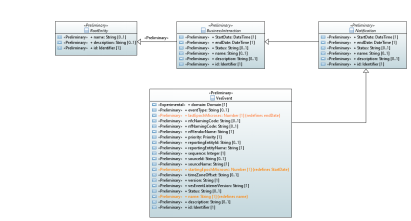
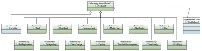
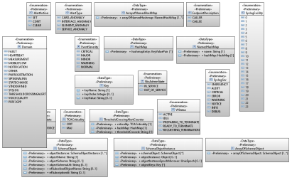
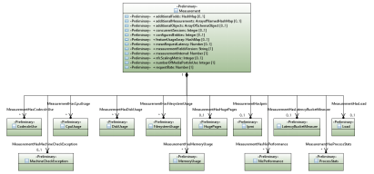
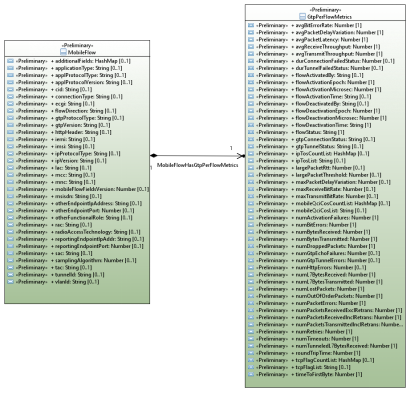
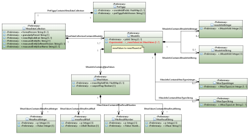
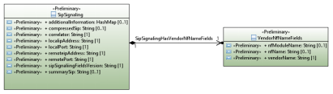
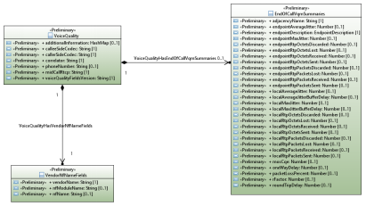
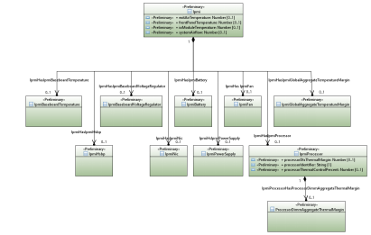

.. Copyright 2021
.. This file is licensed under the CREATIVE COMMONS ATTRIBUTION 4.0 INTERNATIONAL LICENSE
.. Full license text at https://creativecommons.org/licenses/by/4.0/legalcode

VES Model Diagram
-----------------

Rooting VES 
~~~~~~~~~~~

Event - High Level 
~~~~~~~~~~~~~~~~~~

Event Datatypes 
~~~~~~~~~~~~~~~

Measurement Domain Entities 
~~~~~~~~~~~~~~~~~~~~~~~~~~~

Mobile Flow Entities 
~~~~~~~~~~~~~~~~~~~~

Perf3gpp Entities 
~~~~~~~~~~~~~~~~~

SipSignaling Entities 
~~~~~~~~~~~~~~~~~~~~~

Voice Quality Entities 
~~~~~~~~~~~~~~~~~~~~~~

ipmi 
~~~~

