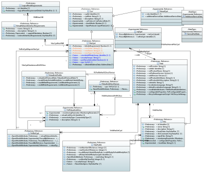

.. Copyright 2020
.. This file is licensed under the CREATIVE COMMONS ATTRIBUTION 4.0 INTERNATIONAL LICENSE
.. Full license text at https://creativecommons.org/licenses/by/4.0/legalcode

ONAP Vnfd Model
===============

.. contents::
   :depth: 3
..

Diagrams
--------

Vnfd View
~~~~~~~~~

.. image:: VNFD.png

Vnfd Topology View
~~~~~~~~~~~~~~~~~~

Vnfd Deployment Flavor
~~~~~~~~~~~~~~~~~~~~~~

Classes
-------

ChecksumData
~~~~~~~~~~~~

The ChecksumData information element supports providing information about the result of performing a checksum operation over some arbitrary data.

Applied stereotypes:

-  OpenModelClass

-  **support: MANDATORY**

-  Reference

-  **reference: IFA011 v2.7.1**

-  Experimental

================== ======== ========= ================================== =================================================================================================================================
**Attribute Name** **Type** **Mult.** **Stereotypes**                    **Description**
algorithm          String   1         OpenModelAttribute                 Species the algorithm used to obtain the checksum value.
                                                                        
                                      -  isInvariant: false             
                                                                        
                                      -  valueRange: no range constraint
                                                                        
                                      -  support: MANDATORY             
                                                                        
                                      Experimental                      
hash               String   1         OpenModelAttribute                 Contains the result of applying the algorithm indicated by the algorithm attribute to the data to which this ChecksumData refers.
                                                                        
                                      -  isInvariant: false             
                                                                        
                                      -  valueRange: no range constraint
                                                                        
                                      -  support: MANDATORY             
                                                                        
                                      Experimental                      
================== ======== ========= ================================== =================================================================================================================================

InstantiationLevel
~~~~~~~~~~~~~~~~~~

The InstantiationLevel class describes a given level of resources to be instantiated within a DF in term of the number of VNFC instances to be created from each VDU.
All the VDUs referenced in the level shall be part of the corresponding DF and their number shall be within the range (min/max) for this DF.

Applied stereotypes:

-  OpenModelClass

-  **support: MANDATORY**

-  Preliminary

-  Reference

-  **reference: IFA011 v2.7.1**

======================= ======================= ========= ================================== ==================================================================================================================================================================================================================================================================================================
**Attribute Name**      **Type**                **Mult.** **Stereotypes**                    **Description**
levelId                 Identifier              1         Preliminary                        Uniquely identifies a level with the DF.
                                                                                            
                                                          OpenModelAttribute                
                                                                                            
                                                          -  isInvariant: true              
                                                                                            
                                                          -  valueRange: no range constraint
                                                                                            
                                                          -  support: MANDATORY             
description             String                  1         Preliminary                        Human readable description of the level.
                                                                                            
                                                          OpenModelAttribute                
                                                                                            
                                                          -  isInvariant: false             
                                                                                            
                                                          -  valueRange: no range constraint
                                                                                            
                                                          -  support: MANDATORY             
scaleInfo               ScaleInfo               0..\*     Preliminary                        Represents for each aspect the scale level that corresponds to this instantiation level. scaleInfo shall be present if the VNF supports scaling.
                                                                                            
                                                          OpenModelAttribute                
                                                                                            
                                                          -  isInvariant: false             
                                                                                            
                                                          -  valueRange: no range constraint
                                                                                            
                                                          -  support: MANDATORY             
\_vduLevel              VduLevel                1..\*     Preliminary                        Indicates the number of instance of this VDU to deploy for this level.
                                                                                            
                                                          OpenModelAttribute                
                                                                                            
                                                          -  isInvariant: false             
                                                                                            
                                                          -  valueRange: no range constraint
                                                                                            
                                                          -  support: MANDATORY             
virtualLinkBitRateLevel VirtualLinkBitRateLevel 0..\*     Preliminary                        Specifies bitrate requirements applicable to virtual links created from particular virtual link descriptors for this level.
                                                                                             NOTE: If not present, it is assumed that the bitrate requirements can be derived from those specified in the VduCpd instances applicable to the internal VL. If present in both the InstantiationLevel and the VduCpd instances applicable to the internal VL, the highest value takes precedence.
                                                          OpenModelAttribute                
                                                                                            
                                                          -  isInvariant: false             
                                                                                            
                                                          -  valueRange: no range constraint
                                                                                            
                                                          -  support: MANDATORY             
======================= ======================= ========= ================================== ==================================================================================================================================================================================================================================================================================================

LogicalNodeRequirements
~~~~~~~~~~~~~~~~~~~~~~~

This information element describes compute, memory and I/O requirements that are to be associated with the logical node of infrastructure. The logical node requirements are a sub-component of the VDU level requirements. As an example for illustration purposes, a logical node correlates to the concept of a NUMA cell in libvirt terminology.

Applied stereotypes:

-  OpenModelClass

-  **support: MANDATORY**

-  Preliminary

-  Reference

-  **reference: IFA011 v2.7.1**

============================ ============ ========= ================================== ===========================================================================================================================================================================================================================================================================
**Attribute Name**           **Type**     **Mult.** **Stereotypes**                    **Description**
id                           Identifier   1         Preliminary                        Identifies this set of logical node requirements.
                                                                                      
                                                    OpenModelAttribute                
                                                                                      
                                                    -  isInvariant: true              
                                                                                      
                                                    -  valueRange: no range constraint
                                                                                      
                                                    -  support: MANDATORY             
logicalNodeRequirementDetail KeyValuePair 1..\*     Preliminary                        The logical node-level compute, memory and I/O requirements. An array of key-value pairs that articulate the deployment requirements.
                                                                                       This could include the number of CPU cores on this logical node, a memory configuration specific to a logical node (e.g. such as available in the Linux kernel via the libnuma library) or a requirement related to the association of an I/O device with the logical node.
                                                    OpenModelAttribute                
                                                                                      
                                                    -  isInvariant: false             
                                                                                      
                                                    -  valueRange: no range constraint
                                                                                      
                                                    -  support: MANDATORY             
============================ ============ ========= ================================== ===========================================================================================================================================================================================================================================================================

ScalingAspect
~~~~~~~~~~~~~

The ScalingAspect class describes the details of an aspect used for horizontal scaling.

Applied stereotypes:

-  OpenModelClass

-  **support: MANDATORY**

-  Reference

-  **reference: IFA011 v2.7.1**

-  Experimental

================== ======== ========= ================================== =============================================
**Attribute Name** **Type** **Mult.** **Stereotypes**                    **Description**
id                 String   1         OpenModelAttribute                 Unique identifier of this aspect in the VNFD.
                                                                        
                                      -  isInvariant: true              
                                                                        
                                      -  valueRange: no range constraint
                                                                        
                                      -  support: MANDATORY             
                                                                        
                                      Experimental                      
name               String   1         OpenModelAttribute                 Human readable name of the aspect.
                                                                        
                                      -  isInvariant: false             
                                                                        
                                      -  valueRange: no range constraint
                                                                        
                                      -  support: MANDATORY             
                                                                        
                                      Experimental                      
description        String   1         OpenModelAttribute                 Human readable description of the aspect.
                                                                        
                                      -  isInvariant: false             
                                                                        
                                      -  valueRange: no range constraint
                                                                        
                                      -  support: MANDATORY             
                                                                        
                                      Experimental                      
================== ======== ========= ================================== =============================================

SecurityGroupRule
~~~~~~~~~~~~~~~~~

Security group rule specifies the matching criteria for the ingress and/or egress traffic to/from the visited connection points. If an ingress traffic is accepted, the corresponding egress response shall be allowed, regardless of the security group rules on the egress direction. If an egress traffic is allowed, the corresponding ingress response shall be accepted, regardless of the security group rules on the ingress direction. The design of security group rule follows a permissive model where all security group rules applied to a CP are dealt with in an "OR" logic fashion, i.e. the traffic is allowed if it matches any security group rule applied to this CP.

Applied stereotypes:

-  OpenModelClass

-  **support: MANDATORY**

-  Preliminary

-  Reference

-  **reference: IFA011 V2.7.1**

=================== ========== ========= ================================== =============================================================================================================================================================================================================================
**Attribute Name**  **Type**   **Mult.** **Stereotypes**                    **Description**
securityGroupRuleId Identifier 1         Preliminary                        Identifier of the security group rule.
                                                                           
                                         OpenModelAttribute                
                                                                           
                                         -  isInvariant: true              
                                                                           
                                         -  valueRange: no range constraint
                                                                           
                                         -  support: MANDATORY             
description         String     0..1      Preliminary                        Human readable description of the security group rule
                                                                           
                                         OpenModelAttribute                
                                                                           
                                         -  isInvariant: false             
                                                                           
                                         -  valueRange: no range constraint
                                                                           
                                         -  support: MANDATORY             
direction           Direction  0..1      Preliminary                        The direction in which the security group rule is applied.
                                                                           
                                         OpenModelAttribute                
                                                                           
                                         -  isInvariant: false             
                                                                           
                                         -  valueRange: no range constraint
                                                                           
                                         -  support: MANDATORY             
etherType           IpVersion  0..1      Preliminary                        Indicates the protocol carried over the Ethernet layer.
                                                                           
                                         OpenModelAttribute                
                                                                           
                                         -  isInvariant: false             
                                                                           
                                         -  valueRange: no range constraint
                                                                           
                                         -  support: MANDATORY             
protocol            String     0..1      Preliminary                        Indicates the protocol carried over the IP layer. Permitted values: any protocol defined in the IANA protocol registry, e.g. TCP, UDP, ICMP, etc.
                                                                            See https://www.iana.org/assignments/protocol-numbers/protocol-numbers.xhtml
                                         OpenModelAttribute                 Note: IFA011 defines this as an enum, but as the list is not complete, made this a string.
                                                                           
                                         -  isInvariant: false             
                                                                           
                                         -  valueRange: no range constraint
                                                                           
                                         -  support: MANDATORY             
portRangeMin        Integer    0..1      Preliminary                        Indicates minimum port number in the range that is matched by the security group rule. If a value is provided at design-time, this value may be overridden at run-time based on other deployment requirements or constraints.
                                                                           
                                         OpenModelAttribute                
                                                                           
                                         -  isInvariant: false             
                                                                           
                                         -  valueRange: no range constraint
                                                                           
                                         -  support: MANDATORY             
portRangeMax        Integer    0..1      Preliminary                        Indicates maximum port number in the range that is matched by the security group rule. If a value is provided at design-time, this value may be overridden at run-time based on other deployment requirements or constraints.
                                                                           
                                         OpenModelAttribute                
                                                                           
                                         -  isInvariant: false             
                                                                           
                                         -  valueRange: no range constraint
                                                                           
                                         -  support: MANDATORY             
=================== ========== ========= ================================== =============================================================================================================================================================================================================================

SwImage
~~~~~~~

A software image

Applied stereotypes:

-  OpenModelClass

-  **support: MANDATORY**

-  Preliminary

-  Reference

-  **reference: IFA011 v2.7.1**

SwImageDesc
~~~~~~~~~~~

The SwImageDesc information element describes requested additional capability for a particular VDU. Such a capability may be for acceleration or specific tasks. Storage not necessarily related to the compute, may be Network Attached Storage (NAS)

Applied stereotypes:

-  OpenModelClass

-  **support: MANDATORY**

-  Preliminary

-  Reference

-  **reference: IFA011 v2.7.1**

================================== ============ ========= ================================== ==============================================================================================================================================================================================================
**Attribute Name**                 **Type**     **Mult.** **Stereotypes**                    **Description**
id                                 Identifier   1         Preliminary                        The identifier of this software image.
                                                                                            
                                                          OpenModelAttribute                
                                                                                            
                                                          -  isInvariant: false             
                                                                                            
                                                          -  valueRange: no range constraint
                                                                                            
                                                          -  support: MANDATORY             
name                               String       1         Preliminary                        The name of this software image.
                                                                                            
                                                          OpenModelAttribute                
                                                                                            
                                                          -  isInvariant: false             
                                                                                            
                                                          -  valueRange: no range constraint
                                                                                            
                                                          -  support: MANDATORY             
version                            Version      1         Preliminary                        The version of this software image.
                                                                                            
                                                          OpenModelAttribute                
                                                                                            
                                                          -  isInvariant: false             
                                                                                            
                                                          -  valueRange: no range constraint
                                                                                            
                                                          -  support: MANDATORY             
provider                           String       0..1      OpenModelAttribute                 The provider of this software image. If not present the provider of the software image is assumed to be same as the VNF provider.
                                                                                            
                                                          -  isInvariant: false             
                                                                                            
                                                          -  valueRange: no range constraint
                                                                                            
                                                          -  support: MANDATORY             
                                                                                            
                                                          Experimental                      
containerFormat                    String       1         Preliminary                        The container format describes the container file format in which software image is provided.
                                                                                            
                                                          OpenModelAttribute                
                                                                                            
                                                          -  isInvariant: false             
                                                                                            
                                                          -  valueRange: no range constraint
                                                                                            
                                                          -  support: MANDATORY             
diskFormat                         String       1         Preliminary                        The disk format of a software image is the format of the underlying disk image.
                                                                                            
                                                          OpenModelAttribute                
                                                                                            
                                                          -  isInvariant: false             
                                                                                            
                                                          -  valueRange: no range constraint
                                                                                            
                                                          -  support: MANDATORY             
minRam                             Number       0..1      Preliminary                        The minimal RAM requirement for this software image. The value of the "size" attribute of VirtualMemoryData of the Vdu referencing this SwImageDesc shall not be smaller than the value of minRam.
                                                                                            
                                                          OpenModelAttribute                
                                                                                            
                                                          -  isInvariant: false             
                                                                                            
                                                          -  valueRange: no range constraint
                                                                                            
                                                          -  support: MANDATORY             
minDisk                            Number       1         Preliminary                        The minimal disk size requirement for this software image. The value of the "size of storage" attribute of the VirtualStorageDesc referencing this SwImageDesc shall not be smaller than the value of minDisk.
                                                                                            
                                                          OpenModelAttribute                
                                                                                            
                                                          -  isInvariant: false             
                                                                                            
                                                          -  valueRange: no range constraint
                                                                                            
                                                          -  support: MANDATORY             
size                               Number       1         Preliminary                        The size of the software image.
                                                                                            
                                                          OpenModelAttribute                
                                                                                            
                                                          -  isInvariant: false             
                                                                                            
                                                          -  valueRange: no range constraint
                                                                                            
                                                          -  support: MANDATORY             
operatingSystem                    String       0..1      Preliminary                        Identifies the operating system used in the software image. This attribute may also identify if a 32 bit or 64 bit software image is used.
                                                                                            
                                                          OpenModelAttribute                
                                                                                            
                                                          -  isInvariant: false             
                                                                                            
                                                          -  valueRange: no range constraint
                                                                                            
                                                          -  support: MANDATORY             
supportedVirtualisationEnvironment String       0..\*     Preliminary                        Identifies the virtualisation environments (e.g. hypervisor) compatible with this software image.
                                                                                            
                                                          OpenModelAttribute                
                                                                                            
                                                          -  isInvariant: false             
                                                                                            
                                                          -  valueRange: no range constraint
                                                                                            
                                                          -  support: MANDATORY             
\_swImage                          SwImage      1         Preliminary                        This is a reference to the actual software image. The reference can be relative to the root of the VNF Package or can be a URL
                                                                                            
                                                          PassedByReference                 
                                                                                            
                                                          OpenModelAttribute                
                                                                                            
                                                          -  isInvariant: false             
                                                                                            
                                                          -  valueRange: no range constraint
                                                                                            
                                                          -  support: MANDATORY             
checksumdata                       ChecksumData 1         OpenModelAttribute                
                                                                                            
                                                          -  isInvariant: false             
                                                                                            
                                                          -  valueRange: no range constraint
                                                                                            
                                                          -  support: MANDATORY             
                                                                                            
                                                          Experimental                      
================================== ============ ========= ================================== ==============================================================================================================================================================================================================

Vdu
~~~

The Virtualisation Deployment Unit (VDU) is a construct supporting the description of the deployment and operational behavior of a VNFC.
A VNFC instance created based on the VDU maps to a single virtualisation container (e.g. a VM).
A VNFC will only be in one VNFDesc. If a vendor wants to use the VNFC in mupliple VNFDesc (their product) they can do so, but it will be 'repeated'.

Applied stereotypes:

-  OpenModelClass

-  **support: MANDATORY**

-  Preliminary

-  Reference

-  **reference: IFA011 v2.7.1**

====================== ========================== ========= ================================== ====================================================================================================================================================================================================================================================================================================================================================================================================================================================================================================================================================================================================================================================
**Attribute Name**     **Type**                   **Mult.** **Stereotypes**                    **Description**
id                     Identifier                 1         Preliminary                        Unique identifier of this Vdu in VNFD.
                                                                                              
                                                            OpenModelAttribute                
                                                                                              
                                                            -  isInvariant: true              
                                                                                              
                                                            -  valueRange: no range constraint
                                                                                              
                                                            -  support: MANDATORY             
name                   String                     1         Preliminary                        Human readable name of the Vdu.
                                                                                              
                                                            OpenModelAttribute                
                                                                                              
                                                            -  isInvariant: false             
                                                                                              
                                                            -  valueRange: no range constraint
                                                                                              
                                                            -  support: MANDATORY             
description            String                     1         Preliminary                        Human readable description of the Vdu.
                                                                                              
                                                            OpenModelAttribute                
                                                                                              
                                                            -  isInvariant: false             
                                                                                              
                                                            -  valueRange: no range constraint
                                                                                              
                                                            -  support: MANDATORY             
bootOrder              KeyValuePair               0..\*     Preliminary                        Boot order of valid boot devices. "key/name" indicates the the boot index "value" references a descriptor from which a valid boot device is created e.g. VirtualStorageDesc from which a VirtualStorage instance is created.
                                                                                               NOTE: If no boot order is defined the default boot order defined in the VIM or NFVI shall be used.
                                                            OpenModelAttribute                
                                                                                              
                                                            -  isInvariant: false             
                                                                                              
                                                            -  valueRange: no range constraint
                                                                                              
                                                            -  support: MANDATORY             
nfviConstraint         KeyValuePair               0..\*     Preliminary                        Describes constraints on the NFVI for the VNFC instance(s) created from this Vdu. For example, aspects of a secure hosting environment for the VNFC instance that involve additional entities or processes. "key/name" includes "AvailabilityZone", "HostAggregates".
                                                                                               NOTE: These are constraints other than stipulating that a VNFC instance has access to a certain resource, as a prerequisite to instantiation. The attributes virtualComputeDesc and virtualStorageDesc define the resources required for instantiation of the VNFC instance.
                                                            OpenModelAttribute                
                                                                                              
                                                            -  isInvariant: false             
                                                                                              
                                                            -  valueRange: no range constraint
                                                                                              
                                                            -  support: MANDATORY             
monitoringParameter    MonitoringParameter        0..\*     Preliminary                        Defines the virtualised resources monitoring parameters on VDU level.
                                                                                              
                                                            OpenModelAttribute                
                                                                                              
                                                            -  isInvariant: false             
                                                                                              
                                                            -  valueRange: no range constraint
                                                                                              
                                                            -  support: MANDATORY             
injectFiles            String                     0..\*     Preliminary                        Describes the information (e.g. URL) about the scripts, config drive metadata, etc. which can be used during Vdu booting process.
                                                                                              
                                                            OpenModelAttribute                
                                                                                              
                                                            -  isInvariant: false             
                                                                                              
                                                            -  valueRange: no range constraint
                                                                                              
                                                            -  support: MANDATORY             
configurableProperties VnfcConfigurableProperties 0..1      OpenModelAttribute                 Describes the configurable properties of all VNFC instances based on this VDU.
                                                                                              
                                                            -  isInvariant: false             
                                                                                              
                                                            -  valueRange: no range constraint
                                                                                              
                                                            -  support: MANDATORY             
                                                                                              
                                                            Experimental                      
bootData               String                     0..1      OpenModelAttribute                 Contains a string or a URL to a file contained in the VNF package used to customize a virtualised compute resource at boot time. The bootData may contain variable parts that are replaced by deployment specific values before being sent to the VIM.
                                                                                               NOTE: The parameters of each variable part shall be declared in the VnfLcmOperationsConfiguration information element as "volatile" parameters available to the bootData template during the respective VNF lifecycle management operation execution and/or in the extension attribute of the VnfInfoModifiableAttributes information element as "persistent" parameters available to the bootData template during the lifetime of the VNF instance. For VNF lifecycle management operations resulting in multiple VNFC instantiations, the VNFM supports the means to provide the appropriate parameters to appropriate VNFC instances Experimental
                                                            -  isInvariant: false             
                                                                                              
                                                            -  valueRange: no range constraint
                                                                                              
                                                            -  support: MANDATORY             
                                                                                              
                                                            Experimental                      
\_intCpd               VduCpd                     1         Preliminary                        Describes network connectivity between a VNFC instance (based on this Vdu) and an internal Virtual Link (VL).
                                                                                              
                                                            OpenModelAttribute                
                                                                                              
                                                            -  isInvariant: false             
                                                                                              
                                                            -  valueRange: no range constraint
                                                                                              
                                                            -  support: MANDATORY             
\_virtualComputeDesc   VirtualComputeDesc         1..\*     Preliminary                        Describes CPU, Memory and acceleration requirements of the Virtualisation Container realising this Vdu.
                                                                                              
                                                            PassedByReference                 
                                                                                              
                                                            OpenModelAttribute                
                                                                                              
                                                            -  isInvariant: false             
                                                                                              
                                                            -  valueRange: no range constraint
                                                                                              
                                                            -  support: MANDATORY             
\_virtualStorageDesc   VirtualStorageDesc         0..\*     Preliminary                        Describes storage requirements for a VirtualStorage instance attached to the virtualisation container created from virtualComputeDesc defined for this Vdu.
                                                                                              
                                                            PassedByReference                 
                                                                                              
                                                            OpenModelAttribute                
                                                                                              
                                                            -  isInvariant: false             
                                                                                              
                                                            -  valueRange: no range constraint
                                                                                              
                                                            -  support: MANDATORY             
\_swImageDesc          SwImageDesc                0..1      Preliminary                        Describes the software image which is directly loaded on the virtualisation container realising this Vdu.
                                                                                               NOTE: More software images can be attached to the virtualisation container using VirtualStorage resources.
                                                            PassedByReference                 
                                                                                              
                                                            OpenModelAttribute                
                                                                                              
                                                            -  isInvariant: false             
                                                                                              
                                                            -  valueRange: no range constraint
                                                                                              
                                                            -  support: MANDATORY             
\_dependOn             Vdu                        0..\*     Future                            
                                                                                              
                                                            OpenModelAttribute                
                                                                                              
                                                            -  isInvariant: false             
                                                                                              
                                                            -  valueRange: no range constraint
                                                                                              
                                                            -  support: MANDATORY             
====================== ========================== ========= ================================== ====================================================================================================================================================================================================================================================================================================================================================================================================================================================================================================================================================================================================================================================

VduCpd 
~~~~~~~

A VduCpd information element is a type of Cpd and describes network connectivity between a VNFC instance (based on this VDU) and an internal VL.

**Parent class:** Cpd

Applied stereotypes:

-  OpenModelClass

-  **support: MANDATORY**

-  Preliminary

-  Reference

-  **reference: IFA011 v2.7.1**

===================================== =================================== ========= ================================== ====================================================================================================================================================================================================================================
**Attribute Name**                    **Type**                            **Mult.** **Stereotypes**                    **Description**
bitrateRequirement                    Number                              0..1      Preliminary                        Bitrate requirement on this CP.
                                                                                                                      
                                                                                    OpenModelAttribute                
                                                                                                                      
                                                                                    -  isInvariant: false             
                                                                                                                      
                                                                                    -  valueRange: no range constraint
                                                                                                                      
                                                                                    -  support: MANDATORY             
vnicName                              String                              0..1      Preliminary                        Describes the name of the vNIC this CP attaches to, e.g. eth0. It will be configured during the Vdu booting process.
                                                                                                                      
                                                                                    OpenModelAttribute                
                                                                                                                      
                                                                                    -  isInvariant: false             
                                                                                                                      
                                                                                    -  valueRange: no range constraint
                                                                                                                      
                                                                                    -  support: MANDATORY             
vnicOrder                             String                              0..1      Preliminary                        Describes the order to create the vNIC within the scope of this Vdu.
                                                                                                                      
                                                                                    OpenModelAttribute                
                                                                                                                      
                                                                                    -  isInvariant: false             
                                                                                                                      
                                                                                    -  valueRange: no range constraint
                                                                                                                      
                                                                                    -  support: MANDATORY             
vnicType                              VnicType                            0..1      Preliminary                        Describes the type of the vNIC this CP attaches to.
                                                                                                                      
                                                                                    OpenModelAttribute                
                                                                                                                      
                                                                                    -  isInvariant: false             
                                                                                                                      
                                                                                    -  valueRange: no range constraint
                                                                                                                      
                                                                                    -  support: MANDATORY             
\_virtualNetworkInterfaceRequirements VirtualNetworkInterfaceRequirements 0..\*     Preliminary                        Specifies requirements on a virtual network interface realising the CPs instantiated from this CPD.
                                                                                                                      
                                                                                    OpenModelAttribute                
                                                                                                                      
                                                                                    -  isInvariant: false             
                                                                                                                      
                                                                                    -  valueRange: no range constraint
                                                                                                                      
                                                                                    -  support: MANDATORY             
sriovAntiAffinityGroup                Identifier                          0..1      Future                             Define the port anti-affinity group ID for each SR-IOV type vNIC. Multiple vNICs in the same anti-affinity group must belong to the same virtual network, and the number of vNICs in the same anti-affinity group cannot exceed two.
                                                                                                                      
                                                                                    OpenModelAttribute                
                                                                                                                      
                                                                                    -  isInvariant: false             
                                                                                                                      
                                                                                    -  valueRange: no range constraint
                                                                                                                      
                                                                                    -  support: OPTIONAL              
securityGroups                        String                              0..\*     Future                             VNFD needs to specify the security group name {security_groups} for each vNic.
                                                                                                                      
                                                                                    OpenModelAttribute                
                                                                                                                      
                                                                                    -  isInvariant: false             
                                                                                                                      
                                                                                    -  valueRange: no range constraint
                                                                                                                      
                                                                                    -  support: MANDATORY             
portSecurityEnabled                   Boolean                             0..1      Future                             VNFD needs to specify whether to enable security group for the vNic.
                                                                                                                      
                                                                                    OpenModelAttribute                
                                                                                                                      
                                                                                    -  isInvariant: false             
                                                                                                                      
                                                                                    -  valueRange: no range constraint
                                                                                                                      
                                                                                    -  support: MANDATORY             
qos                                   QoS                                 0..1      Future                             Describe the Qos requirements of the VduCpd.
                                                                                                                      
                                                                                    OpenModelAttribute                
                                                                                                                      
                                                                                    -  isInvariant: false             
                                                                                                                      
                                                                                    -  valueRange: no range constraint
                                                                                                                      
                                                                                    -  support: MANDATORY             
\_intVirtualLinkDesc                  VnfVirtualLinkDesc                  0..1      PassedByReference                  Reference(s) of the Virtual Link Descriptor to which this Connection Point Descriptor(s) connects.
                                                                                                                      
                                                                                    OpenModelAttribute                
                                                                                                                      
                                                                                    -  isInvariant: false             
                                                                                                                      
                                                                                    -  valueRange: no range constraint
                                                                                                                      
                                                                                    -  support: MANDATORY             
                                                                                                                      
                                                                                    Experimental                      
allowedAddressData                    AddressData                         0..\*     Preliminary                        For specifying floating IP(s) to be shared among Cpds, which are reserved for vnfReservedCpd described in the VNFD.
                                                                                                                      
                                                                                    OpenModelAttribute                
                                                                                                                      
                                                                                    -  isInvariant: false             
                                                                                                                      
                                                                                    -  valueRange: no range constraint
                                                                                                                      
                                                                                    -  support: MANDATORY             
cpdId                                 Identifier                          1         Preliminary                        Identifier of this Cpd information element.
                                                                                                                      
                                                                                    OpenModelAttribute                
                                                                                                                      
                                                                                    -  isInvariant: true              
                                                                                                                      
                                                                                    -  valueRange: no range constraint
                                                                                                                      
                                                                                    -  support: MANDATORY             
cpdRole                               String                              0..1      Preliminary                        Identifies the role of the port in the context of the traffic flow patterns in the VNF or parent NS.
                                                                                                                       For example a VNF with a tree flow pattern within the VNF will have legal cpRoles of ROOT and LEAF.
                                                                                    OpenModelAttribute                
                                                                                                                      
                                                                                    -  isInvariant: false             
                                                                                                                      
                                                                                    -  valueRange: no range constraint
                                                                                                                      
                                                                                    -  support: MANDATORY             
description                           String                              0..1      Preliminary                        Provides human-readable information on the purpose of the CP (e.g. CP for control plane traffic).
                                                                                                                      
                                                                                    OpenModelAttribute                
                                                                                                                      
                                                                                    -  isInvariant: false             
                                                                                                                      
                                                                                    -  valueRange: no range constraint
                                                                                                                      
                                                                                    -  support: MANDATORY             
cpProtocol                            CpProtocolData                      0..\*     OpenModelAttribute                 Identifies the protocol layering information the CP uses for connectivity purposes and associated information. There shall be one cpProtocol for each layer protocol as indicated by the attribute layerProtocol.
                                                                                                                       Editor's note: the attribute "layerProtocol" still needs further discussion and not included in this table.
                                                                                    -  isInvariant: false             
                                                                                                                      
                                                                                    -  valueRange: no range constraint
                                                                                                                      
                                                                                    -  support: MANDATORY             
                                                                                                                      
                                                                                    Experimental                      
trunkMode                             Boolean                             0..1      OpenModelAttribute                 Information about whether the CP instantiated from this CPD is in Trunk mode (802.1Q or other).
                                                                                                                      
                                                                                    -  isInvariant: false             
                                                                                                                      
                                                                                    -  valueRange: no range constraint
                                                                                                                      
                                                                                    -  support: MANDATORY             
                                                                                                                      
                                                                                    Experimental                      
layerProtocol                         LayerProtocol                       1..\*     OpenModelAttribute                 Identifies which protocol the CP uses for connectivity purposes (Ethernet, MPLS, ODU2, IPV4, IPV6, Pseudo-Wire, etc.).
                                                                                                                      
                                                                                    -  isInvariant: false             
                                                                                                                      
                                                                                    -  valueRange: no range constraint
                                                                                                                      
                                                                                    -  support: MANDATORY             
                                                                                                                      
                                                                                    Experimental                      
securityGroupRuleId                   Identifier                          0..\*     OpenModelAttribute                 Reference of the security group rules bound to this CPD.
                                                                                                                      
                                                                                    -  isInvariant: false             
                                                                                                                      
                                                                                    -  valueRange: no range constraint
                                                                                                                      
                                                                                    -  support: MANDATORY             
                                                                                                                      
                                                                                    Experimental                      
===================================== =================================== ========= ================================== ====================================================================================================================================================================================================================================

VduLevel
~~~~~~~~

The VduLevel information element indicates for a given VDU in a given level the number of instances to deploy.

Applied stereotypes:

-  OpenModelClass

-  **support: MANDATORY**

-  Preliminary

-  Reference

-  **reference: IFA011 v2.7.1**

================== ======== ========= ================================== ==========================================================================================================
**Attribute Name** **Type** **Mult.** **Stereotypes**                    **Description**
numberOfInstances  Integer  1         Preliminary                        Number of instances of VNFC based on this VDU to deploy for an instantiation level or for a scaling delta.
                                                                        
                                      OpenModelAttribute                
                                                                        
                                      -  isInvariant: false             
                                                                        
                                      -  valueRange: no range constraint
                                                                        
                                      -  support: MANDATORY             
\_vduId            Vdu      1         PassedByReference                  Uniquely identifies a VDU.
                                                                        
                                      OpenModelAttribute                
                                                                        
                                      -  isInvariant: false             
                                                                        
                                      -  valueRange: no range constraint
                                                                        
                                      -  support: MANDATORY             
                                                                        
                                      Experimental                      
================== ======== ========= ================================== ==========================================================================================================

VduProfile
~~~~~~~~~~

The VduProfile describes additional instantiation data for a given VDU used in a DF.

Applied stereotypes:

-  OpenModelClass

-  **support: MANDATORY**

-  Preliminary

-  Reference

-  **reference: IFA011 v2.7.1**

=============================== =============================== ========= ================================== ====================================================================================================================================================================================================================================================================================================================================================================================================================================================================
**Attribute Name**              **Type**                        **Mult.** **Stereotypes**                    **Description**
minNumberOfInstances            Integer                         1         Preliminary                        Minimum number of instances of the VNFC based on this VDU that is permitted to exist for this flavour. Shall be zero or greater.
                                                                                                            
                                                                          OpenModelAttribute                
                                                                                                            
                                                                          -  isInvariant: false             
                                                                                                            
                                                                          -  valueRange: no range constraint
                                                                                                            
                                                                          -  support: MANDATORY             
maxNumberOfInstances            Integer                         1         Preliminary                        Maximum number of instances of the VNFC based on this VDU that is permitted to exist for this flavour. Shall be zero or greater.
                                                                                                            
                                                                          OpenModelAttribute                
                                                                                                            
                                                                          -  isInvariant: false             
                                                                                                            
                                                                          -  valueRange: no range constraint
                                                                                                            
                                                                          -  support: MANDATORY             
localAffinityOrAntiAffinityRule LocalAffinityOrAntiAffinityRule 0..\*     Preliminary                        Specifies affinity or anti-affinity rules applicable between the virtualization containers (e.g. virtual machines) to be created based on this VDU. When the cardinality is greater than 1, both affinity rule(s) and anti-affinity rule(s) with different scopes (e.g. "Affinity with the scope resource zone and anti-affinity with the scope NFVI node") are applicable to the virtualization containers (e.g. virtual machines) to be created based on this VDU.
                                                                                                             When the cardinality is greater than 1, both affinity rule(s) and anti-affinity rule(s) with different scopes (e.g. "Affinity with the scope resource zone and anti-affinity with the scope NFVI node") are applicable to the virtualization containers (e.g. virtual machines) to be created based on this VDU.
                                                                          OpenModelAttribute                
                                                                                                            
                                                                          -  isInvariant: false             
                                                                                                            
                                                                          -  valueRange: no range constraint
                                                                                                            
                                                                          -  support: MANDATORY             
affinityOrAntiAffinityGroupId   Identifier                      0..\*     Preliminary                        Identifier(s) of the affinity or anti-affinity group(s) the VDU belongs to.
                                                                                                             NOTE: Each identifier references an affinity or anti-affinity group which expresses affinity or anti-affinity relationships between the virtualisation container(s) (e.g. virtual machine(s)) to be created using this VDU and the virtualisation container(s) (e.g. virtual machine(s)) to be created using other VDU(s) in the same group.
                                                                          OpenModelAttribute                
                                                                                                            
                                                                          -  isInvariant: false             
                                                                                                            
                                                                          -  valueRange: no range constraint
                                                                                                            
                                                                          -  support: MANDATORY             
watchdog                        String                          0..1      Preliminary                        Watchdog action to be triggered by the VIM for the VNF in case the heart beat fails, e.g. reset or hard shutdown, etc.
                                                                                                            
                                                                          OpenModelAttribute                
                                                                                                            
                                                                          -  isInvariant: false             
                                                                                                            
                                                                          -  valueRange: no range constraint
                                                                                                            
                                                                          -  support: MANDATORY             
vmBootUpTimeOut                 Integer                         0..1      Preliminary                        Timeout value for the VNFM to wait before the successful booting up of the VDU.
                                                                                                            
                                                                          OpenModelAttribute                
                                                                                                            
                                                                          -  isInvariant: false             
                                                                                                            
                                                                          -  valueRange: no range constraint
                                                                                                            
                                                                          -  support: MANDATORY             
securityGroups                  String                          0..\*     Future                             VNFD needs to specify the security group name {security_groups} for each VDU.
                                                                                                            
                                                                          OpenModelAttribute                
                                                                                                            
                                                                          -  isInvariant: false             
                                                                                                            
                                                                          -  valueRange: no range constraint
                                                                                                            
                                                                          -  support: MANDATORY             
flavorExtraSpecs                KeyValuePair                    0..\*     Future                             Additional expansion requirements for Infrastructure layer, e.g. HA property (Host Aggregate ).
                                                                                                            
                                                                          OpenModelAttribute                
                                                                                                            
                                                                          -  isInvariant: false             
                                                                                                            
                                                                          -  valueRange: no range constraint
                                                                                                            
                                                                          -  support: MANDATORY             
\_vduId                         Vdu                             1         Preliminary                       
                                                                                                            
                                                                          PassedByReference                 
                                                                                                            
                                                                          OpenModelAttribute                
                                                                                                            
                                                                          -  isInvariant: false             
                                                                                                            
                                                                          -  valueRange: no range constraint
                                                                                                            
                                                                          -  support: MANDATORY             
=============================== =============================== ========= ================================== ====================================================================================================================================================================================================================================================================================================================================================================================================================================================================

VirtualComputeDesc 
~~~~~~~~~~~~~~~~~~~

The VirtualComputeDesc information element supports the specification of requirements related to virtual compute resources.

Applied stereotypes:

-  OpenModelClass

-  **support: MANDATORY**

-  Preliminary

-  Reference

-  **reference: IFA011 v2.7.1**

============================= ================================= ========= ================================== ===========================================================================================================================================
**Attribute Name**            **Type**                          **Mult.** **Stereotypes**                    **Description**
virtualComputeDescId          Identifier                        1         Preliminary                        Unique identifier of this VirtualComputeDesc in the VNFD
                                                                                                            
                                                                          OpenModelAttribute                
                                                                                                            
                                                                          -  isInvariant: false             
                                                                                                            
                                                                          -  valueRange: no range constraint
                                                                                                            
                                                                          -  support: MANDATORY             
requestAdditionalCapabilities RequestedAdditionalCapabilityData 0..\*     Deprecated                         Specifies requirements for additional capabilities. These may be for a range of purposes. One example is acceleration related capabilities.
                                                                                                            
                                                                          OpenModelAttribute                
                                                                                                            
                                                                          -  isInvariant: false             
                                                                                                            
                                                                          -  valueRange: no range constraint
                                                                                                            
                                                                          -  support: MANDATORY             
computeRequirements           KeyValuePair                      0..\*     Preliminary                        Specifies compute requirements.
                                                                                                            
                                                                          OpenModelAttribute                
                                                                                                            
                                                                          -  isInvariant: false             
                                                                                                            
                                                                          -  valueRange: no range constraint
                                                                                                            
                                                                          -  support: MANDATORY             
virtualMemory                 VirtualMemoryData                 1         Preliminary                        The virtual memory of the virtualised compute.
                                                                                                            
                                                                          OpenModelAttribute                
                                                                                                            
                                                                          -  isInvariant: false             
                                                                                                            
                                                                          -  valueRange: no range constraint
                                                                                                            
                                                                          -  support: MANDATORY             
virtualCpu                    VirtualCpuData                    1         Preliminary                        The virtual CPU(s) of the virtualised compute.
                                                                                                            
                                                                          OpenModelAttribute                
                                                                                                            
                                                                          -  isInvariant: false             
                                                                                                            
                                                                          -  valueRange: no range constraint
                                                                                                            
                                                                          -  support: MANDATORY             
\_logicalNodeRequirements     LogicalNodeRequirements           0..\*     OpenModelAttribute                 The associated logical node requirements.
                                                                                                            
                                                                          -  isInvariant: false             
                                                                                                            
                                                                          -  valueRange: no range constraint
                                                                                                            
                                                                          -  support: MANDATORY             
                                                                                                            
                                                                          Experimental                      
virtualDisk                   BlockStorageData                  0..\*     OpenModelAttribute                 The local or ephemeral disk(s) of the virtualised compute.
                                                                                                            
                                                                          -  isInvariant: false             
                                                                                                            
                                                                          -  valueRange: no range constraint
                                                                                                            
                                                                          -  support: MANDATORY             
                                                                                                            
                                                                          Experimental                      
============================= ================================= ========= ================================== ===========================================================================================================================================

VirtualLinkDescFlavour
~~~~~~~~~~~~~~~~~~~~~~

The VirtualLinkDescFlavour describes additional instantiation data for a given internal VL used in a DF.

Applied stereotypes:

-  OpenModelClass

-  **support: MANDATORY**

-  Preliminary

-  Reference

-  **reference: IFA011 v2.7.1**

================== ========== ========= ================================== =================================================
**Attribute Name** **Type**   **Mult.** **Stereotypes**                    **Description**
qos                VnfQoS     0..1      Preliminary                        QoS of the VL.
                                                                          
                                        OpenModelAttribute                
                                                                          
                                        -  isInvariant: false             
                                                                          
                                        -  valueRange: no range constraint
                                                                          
                                        -  support: MANDATORY             
flavourId          Identifier 1         Preliminary                        Identifies a flavour within a VnfVirtualLinkDesc.
                                                                          
                                        OpenModelAttribute                
                                                                          
                                        -  isInvariant: false             
                                                                          
                                        -  valueRange: no range constraint
                                                                          
                                        -  support: MANDATORY             
================== ========== ========= ================================== =================================================

VirtualLinkProfile
~~~~~~~~~~~~~~~~~~

The VirtualLinkProfile describes additional instantiation data for a given VL used in a DF.

Applied stereotypes:

-  OpenModelClass

-  **support: MANDATORY**

-  Preliminary

-  Reference

-  **reference: IFA011 v2.7.1**

=============================== =============================== ========= ================================== ==============================================================================================================================================================================================================================================
**Attribute Name**              **Type**                        **Mult.** **Stereotypes**                    **Description**
virtualLinkProfileId            Identifier                      1         OpenModelAttribute                 Uniquely identifies this VirtualLinkProfile class
                                                                                                            
                                                                          -  isInvariant: true              
                                                                                                            
                                                                          -  valueRange: no range constraint
                                                                                                            
                                                                          -  support: MANDATORY             
                                                                                                            
                                                                          Experimental                      
localAffinityOrAntiAffinityRule LocalAffinityOrAntiAffinityRule 0..\*     Preliminary                        Specifies affinity or anti-affinity rules applicable between the VLs based on this VnfVirtualLinkDesc.
                                                                                                             When the cardinality is greater than 1, both affinity rule(s) and anti-affinity rule(s) with different scopes are applicable to the VLs based on this VnfVirtualLinkDesc.
                                                                          OpenModelAttribute                
                                                                                                            
                                                                          -  isInvariant: false             
                                                                                                            
                                                                          -  valueRange: no range constraint
                                                                                                            
                                                                          -  support: MANDATORY             
maxBitRateRequirements          LinkBitrateRequirements         1         Preliminary                        Specifies the minimum bitrate requirements for a VL instantiated according to this profile.
                                                                                                            
                                                                          OpenModelAttribute                
                                                                                                            
                                                                          -  isInvariant: false             
                                                                                                            
                                                                          -  valueRange: no range constraint
                                                                                                            
                                                                          -  support: MANDATORY             
minBitRateRequirements          LinkBitrateRequirements         1         Preliminary                        Specifies the minimum bitrate requirements for a VL instantiated according to this profile.
                                                                                                            
                                                                          OpenModelAttribute                
                                                                                                            
                                                                          -  isInvariant: false             
                                                                                                            
                                                                          -  valueRange: no range constraint
                                                                                                            
                                                                          -  support: MANDATORY             
\_flavourId                     VirtualLinkDescFlavour          1         Preliminary                        Identifies a flavour within the VnfVirtualLinkDesc.
                                                                                                            
                                                                          OpenModelAttribute                
                                                                                                            
                                                                          -  isInvariant: false             
                                                                                                            
                                                                          -  valueRange: no range constraint
                                                                                                            
                                                                          -  support: MANDATORY             
\_affinityOrAntiAffinityGroupId AffinityOrAntiAffinityGroup     0..\*     PassedByReference                  Identifies an affinity or anti-affinity group the VLs instantiated according to the VlProfile belong to.
                                                                                                             NOTE : Each identifier references an affinity or anti-affinity group which expresses affinity or anti-affinity relationship between the VL(s) using this VirtualLinkProfile and the VL(s) using other VirtualLinkProfile(s) in the same group.
                                                                          OpenModelAttribute                
                                                                                                            
                                                                          -  isInvariant: false             
                                                                                                            
                                                                          -  valueRange: no range constraint
                                                                                                            
                                                                          -  support: MANDATORY             
                                                                                                            
                                                                          Experimental                      
\_vnfVirtualLinkDescId          VnfVirtualLinkDesc              1         Preliminary                        Uniquely references a VLD.
                                                                                                            
                                                                          PassedByReference                 
                                                                                                            
                                                                          OpenModelAttribute                
                                                                                                            
                                                                          -  isInvariant: false             
                                                                                                            
                                                                          -  valueRange: no range constraint
                                                                                                            
                                                                          -  support: MANDATORY             
virtualLinkProtocolData         VirtualLinkProtocolData         0..\*     Preliminary                        Specifies the protocol data for a VL instantiated according to this profile. Cardinality 0 is used when no protocol data needs to be specified.
                                                                                                            
                                                                          OpenModelAttribute                
                                                                                                            
                                                                          -  isInvariant: false             
                                                                                                            
                                                                          -  valueRange: no range constraint
                                                                                                            
                                                                          -  support: MANDATORY             
=============================== =============================== ========= ================================== ==============================================================================================================================================================================================================================================

VirtualNetworkInterfaceRequirements
~~~~~~~~~~~~~~~~~~~~~~~~~~~~~~~~~~~

This class specifies requirements on a virtual network interface.

Applied stereotypes:

-  OpenModelClass

-  **support: MANDATORY**

-  Preliminary

-  Reference

-  **reference: IFA011 v2.7.1**

============================ ======================= ========= ================================== ==========================================================================================================================================================================================================================================================================================================================================
**Attribute Name**           **Type**                **Mult.** **Stereotypes**                    **Description**
name                         String                  0..1      Preliminary                        Provides a human readable name for the requirement.
                                                                                                 
                                                               OpenModelAttribute                
                                                                                                 
                                                               -  isInvariant: false             
                                                                                                 
                                                               -  valueRange: no range constraint
                                                                                                 
                                                               -  support: MANDATORY             
description                  String                  0..1      Preliminary                        Provides a human readable description of the requirement.
                                                                                                 
                                                               OpenModelAttribute                
                                                                                                 
                                                               -  isInvariant: false             
                                                                                                 
                                                               -  valueRange: no range constraint
                                                                                                 
                                                               -  support: MANDATORY             
supportMandatory             Boolean                 1         Deprecated                         Indicates whether fulfilling the constraint is mandatory (TRUE) for successful operation or desirable (FALSE).
                                                                                                 
                                                               Preliminary                       
                                                                                                 
                                                               OpenModelAttribute                
                                                                                                 
                                                               -  isInvariant: false             
                                                                                                 
                                                               -  valueRange: no range constraint
                                                                                                 
                                                               -  support: MANDATORY             
networkInterfaceRequirements KeyValuePair            0..\*     Preliminary                        The network interface requirements. An element from an array of key-value pairs that articulate the network interface deployment requirements
                                                                                                 
                                                               OpenModelAttribute                
                                                                                                 
                                                               -  isInvariant: false             
                                                                                                 
                                                               -  valueRange: no range constraint
                                                                                                 
                                                               -  support: MANDATORY             
\_nicIoRequirements          LogicalNodeRequirements 0..1      PassedByReference                  This references (couples) the CPD with any logical node I/O requirements (for network devices) that may have been created. Linking these attributes is necessary so that so that I/O requirements that need to be articulated at the logical node level can be associated with the network interface requirements associated with the CPD.
                                                                                                 
                                                               OpenModelAttribute                
                                                                                                 
                                                               -  isInvariant: false             
                                                                                                 
                                                               -  valueRange: no range constraint
                                                                                                 
                                                               -  support: MANDATORY             
============================ ======================= ========= ================================== ==========================================================================================================================================================================================================================================================================================================================================

VirtualStorageDesc
~~~~~~~~~~~~~~~~~~

The VirtualStorageDesc information element supports the specifications of requirements related to persistent virtual storage resources. Ephemeral virtual storage is specified in VirtualComputeDesc information element.

Applied stereotypes:

-  OpenModelClass

-  **support: MANDATORY**

-  Preliminary

-  Reference

-  **reference: IFA011 v2.7.1**

================== ================= ========= ================================== ===============================================================================================================================================
**Attribute Name** **Type**          **Mult.** **Stereotypes**                    **Description**
id                 Identifier        1         Preliminary                        Unique identifier of this VirtualStorageDesc in the VNFD.
                                                                                 
                                               OpenModelAttribute                
                                                                                 
                                               -  isInvariant: false             
                                                                                 
                                               -  valueRange: no range constraint
                                                                                 
                                               -  support: MANDATORY             
typeOfStorage      String            1         Preliminary                        Type of virtualised storage resource (BLOCK, OBJECT, FILE).
                                                                                 
                                               OpenModelAttribute                
                                                                                 
                                               -  isInvariant: false             
                                                                                 
                                               -  valueRange: no range constraint
                                                                                 
                                               -  support: MANDATORY             
sizeOfStorage      Number            1         Preliminary                        Size of virtualised storage resource
                                                                                  (e.g. size of volume, in GB).
                                               OpenModelAttribute                
                                                                                 
                                               -  isInvariant: false             
                                                                                 
                                               -  valueRange: no range constraint
                                                                                 
                                               -  support: MANDATORY             
blockStorageData   BlockStorageData  0..1      Preliminary                        Specifies the details of block storage. It shall be present when the "typeOfStorage" attribute is set to "BLOCK". It shall be absent otherwise.
                                                                                 
                                               OpenModelAttribute                
                                                                                 
                                               -  isInvariant: false             
                                                                                 
                                               -  valueRange: no range constraint
                                                                                 
                                               -  support: MANDATORY             
objectStorageData  ObjectStorageData 0..1      Preliminary                        Specifies the details of object storage. It shall be present when the "typeOfStorage" attribute is set to "OBJECT". It shall be absent
                                                                                 
                                               OpenModelAttribute                
                                                                                 
                                               -  isInvariant: false             
                                                                                 
                                               -  valueRange: no range constraint
                                                                                 
                                               -  support: MANDATORY             
fileStorageData    FileStorageData   0..1      Preliminary                        Specifies the details of file storage. It shall be present when the "typeOfStorage" attribute is set to "FILE". It shall be absent otherwise.
                                                                                 
                                               OpenModelAttribute                
                                                                                 
                                               -  isInvariant: false             
                                                                                 
                                               -  valueRange: no range constraint
                                                                                 
                                               -  support: MANDATORY             
multiAttach        Boolean           0..1      Future                             Indicating whether a vDisk is a shared volume in VNFD.
                                                                                 
                                               OpenModelAttribute                
                                                                                 
                                               -  isInvariant: false             
                                                                                 
                                               -  valueRange: no range constraint
                                                                                 
                                               -  support: MANDATORY             
storageQos         StorageQos        0..1      Future                             Describe storage Qos requirements.
                                                                                 
                                               OpenModelAttribute                
                                                                                 
                                               -  isInvariant: false             
                                                                                 
                                               -  valueRange: no range constraint
                                                                                 
                                               -  support: MANDATORY             
volumeType         VolumeType        0..1      Future                             Describe volume type.
                                                                                 
                                               OpenModelAttribute                
                                                                                 
                                               -  isInvariant: false             
                                                                                 
                                               -  valueRange: no range constraint
                                                                                 
                                               -  support: MANDATORY             
================== ================= ========= ================================== ===============================================================================================================================================

VnfDf 
~~~~~~

The VnfDf describes a specific deployment version of a VNF.

Applied stereotypes:

-  OpenModelClass

-  **support: MANDATORY**

-  Preliminary

-  Reference

-  **reference: IFA011 v2.7.1**

============================= =========================== ========= ================================== =====================================================================================================================================================================================================================================================================================================
**Attribute Name**            **Type**                    **Mult.** **Stereotypes**                    **Description**
flavorId                      Identifier                  1         Preliminary                        Identifier of this DF within the VNFD.
                                                                                                      
                                                                    OpenModelAttribute                
                                                                                                      
                                                                    -  isInvariant: true              
                                                                                                      
                                                                    -  valueRange: no range constraint
                                                                                                      
                                                                    -  support: MANDATORY             
description                   String                      1         Preliminary                        Human readable description of the DF.
                                                                                                      
                                                                    OpenModelAttribute                
                                                                                                      
                                                                    -  isInvariant: false             
                                                                                                      
                                                                    -  valueRange: no range constraint
                                                                                                      
                                                                    -  support: MANDATORY             
defaultInstantiationLevel     Identifier                  0..1      OpenModelAttribute                 This attribute references the "instantiationLevel" entry which defines the default instantiation level for this DF. It shall be present if there are multiple "instantiationLevel" entries.
                                                                                                      
                                                                    -  isInvariant: false             
                                                                                                      
                                                                    -  valueRange: no range constraint
                                                                                                      
                                                                    -  support: MANDATORY             
                                                                                                      
                                                                    Experimental                      
monitoringParameter           MonitoringParameter         0..\*     OpenModelAttribute                 Specifies the virtualised resource related performance metrics to be tracked by the VNFM.
                                                                                                      
                                                                    -  isInvariant: false             
                                                                                                      
                                                                    -  valueRange: no range constraint
                                                                                                      
                                                                    -  support: MANDATORY             
                                                                                                      
                                                                    Experimental                      
\_virtuaLlinkProfile          VirtualLinkProfile          0..\*     Preliminary                        Defines the internal VLD along with additional data which is used in this DF.
                                                                                                       NOTE 1: This allows for different VNF internal topologies between DFs.
                                                                    OpenModelAttribute                 NOTE 2: virtualLinkProfile needs to be provided for all VLs that the CPs of the VDUs in the VDU profiles connect to.
                                                                                                      
                                                                    -  isInvariant: false             
                                                                                                      
                                                                    -  valueRange: no range constraint
                                                                                                      
                                                                    -  support: MANDATORY             
\_instantiationLevel          InstantiationLevel          1..\*     Preliminary                        Describes the various levels of resources that can be used to instantiate the VNF using this flavour.
                                                                                                       Examples: Small, Medium, Large.
                                                                    OpenModelAttribute                 If there is only one "instantiationLevel" entry, it shall be treated as the default instantiation level for this DF.
                                                                                                      
                                                                    -  isInvariant: false             
                                                                                                      
                                                                    -  valueRange: no range constraint
                                                                                                      
                                                                    -  support: MANDATORY             
\_affinityOrAntiAffinityGroup AffinityOrAntiAffinityGroup 0..\*     Preliminary                        Specifies affinity or anti-affinity relationship applicable between the virtualisation containers (e.g. virtual machines) to be created using different VDUs or internal VLs to be created using different VnfVirtualLinkDesc(s) in the same affinity or anti-affinity group.
                                                                                                       NOTE: In the present specification, including either VDU(s) or VnfVirtualLinkDesc(s) into the same affinity or anti-affinity group is supported. Extension to support including both VDU(s) and VnfVirtualLinkDesc(s) into the same affinity or anti-affinity group is left for future specification.
                                                                    OpenModelAttribute                
                                                                                                      
                                                                    -  isInvariant: false             
                                                                                                      
                                                                    -  valueRange: no range constraint
                                                                                                      
                                                                    -  support: MANDATORY             
\_scalingAspect               ScalingAspect               0..\*     Preliminary                        The scaling aspects supported by this DF of the VNF. scalingAspect shall be present if the VNF supports scaling.
                                                                                                      
                                                                    OpenModelAttribute                
                                                                                                      
                                                                    -  isInvariant: false             
                                                                                                      
                                                                    -  valueRange: no range constraint
                                                                                                      
                                                                    -  support: MANDATORY             
\_vduProfile                  VduProfile                  1..\*     Preliminary                        Describes additional instantiation data for the VDUs used in this flavor.
                                                                                                      
                                                                    OpenModelAttribute                
                                                                                                      
                                                                    -  isInvariant: false             
                                                                                                      
                                                                    -  valueRange: no range constraint
                                                                                                      
                                                                    -  support: MANDATORY             
\_placementGroup              PlacementGroup              0..\*     Preliminary                        Determine where VNFC's (VDU's) are placed with respect to the VNF
                                                                                                      
                                                                    OpenModelAttribute                
                                                                                                      
                                                                    -  isInvariant: false             
                                                                                                      
                                                                    -  valueRange: no range constraint
                                                                                                      
                                                                    -  support: MANDATORY             
\_baseConfigGroup             BaseConfigGroup             1         Preliminary                        BaseConfigGroup may set Access Control Lists (ACL's) and establish security groups and server groups.
                                                                                                       BaseConfigGroup creates/establishs storage for the VM's (OpenStack Cinder).
                                                                    OpenModelAttribute                 BaseConfigGroup may establish internal networks such as OAM (VNF Mgmt) or MNS (Maintenance & Surveillance) established.
                                                                                                      
                                                                    -  isInvariant: false             
                                                                                                      
                                                                    -  valueRange: no range constraint
                                                                                                      
                                                                    -  support: MANDATORY             
\_deploymentGroup             DeploymentGroup             0..\*     Preliminary                        DeploymentGroup provides the minimum viable VDU and associated VNFC configuration for a useable VNF.
                                                                                                      
                                                                    OpenModelAttribute                
                                                                                                      
                                                                    -  isInvariant: false             
                                                                                                      
                                                                    -  valueRange: no range constraint
                                                                                                      
                                                                    -  support: MANDATORY             
\_scalinggroup                ScalingGroup                0..\*     Preliminary                        Identifies the vaious scaling groups within the VNF which identify which vnfcs that need to be scaled together.
                                                                                                      
                                                                    OpenModelAttribute                
                                                                                                      
                                                                    -  isInvariant: false             
                                                                                                      
                                                                    -  valueRange: no range constraint
                                                                                                      
                                                                    -  support: MANDATORY             
\_vnfIndicator                VnfIndicator                0..\*     OpenModelAttribute                 Declares the VNF indicators that are supported by this VNF (specific to this DF).
                                                                                                      
                                                                    -  isInvariant: false             
                                                                                                      
                                                                    -  valueRange: no range constraint
                                                                                                      
                                                                    -  support: MANDATORY             
                                                                                                      
                                                                    Experimental                      
supportedVnfInterface         VnfInterfaceDetails         0..\*     OpenModelAttribute                 Indicates which interfaces the VNF produces and provides additional details on how to access the interface endpoints.
                                                                                                      
                                                                    -  isInvariant: false             
                                                                                                      
                                                                    -  valueRange: no range constraint
                                                                                                      
                                                                    -  support: MANDATORY             
                                                                                                      
                                                                    Experimental                      
============================= =========================== ========= ================================== =====================================================================================================================================================================================================================================================================================================

VnfExtCp
~~~~~~~~

Describes an external CP exposed by a VNF.

**Parent class:** Cp

Applied stereotypes:

-  OpenModelClass

-  **support: MANDATORY**

VnfExtCpd 
~~~~~~~~~~

A VnfExtCpd is a type of Cpd and describes an external interface, a.k.a external CP, exposed by this VNF enabling connection with a VL.
When the VnfExtCpd is mapped to a VduCpd, the values for the attributes type, subType and description shall be identical for both elements.

Applied stereotypes:

-  OpenModelClass

-  **support: MANDATORY**

-  Preliminary

-  Reference

-  **reference: IFA011 v2.7.1**

=================================== =================================== ========= ================================================================== ===========================================================================================================================================================================================================================================================================
**Attribute Name**                  **Type**                            **Mult.** **Stereotypes**                                                    **Description**
\_intVirtualLinkDesc                VnfVirtualLinkDesc                  0..1      PassedByReference                                                  References the internal Virtual Link Descriptor (VLD) to which CPs instantiated from this external CP Descriptor (CPD) connect.
                                                                                                                                                     One and only one of the following attributes shall be present: intVirtualLinkDesc or intCpd or vipCpd.
                                                                                  OpenModelAttribute                                                
                                                                                                                                                    
                                                                                  -  isInvariant: false                                             
                                                                                                                                                    
                                                                                  -  valueRange: no range constraint                                
                                                                                                                                                    
                                                                                  -  support: CONDITIONAL_MANDATORY                                 
                                                                                                                                                    
                                                                                  -  condition:Either intVirtualLinkDesc or intCpd shall be present.
                                                                                                                                                    
                                                                                  Experimental                                                      
\_intCpd                            VduCpd                              0..1      Preliminary                                                        References the internal VDU CPD which is used to instantiate internal CPs. These internal CPs are, in turn, exposed as external CPs defined by this external CPD.
                                                                                                                                                     One and only one of the following attributes shall be present: intVirtualLinkDesc or intCpd or vipCpd.
                                                                                  PassedByReference                                                 
                                                                                                                                                    
                                                                                  OpenModelAttribute                                                
                                                                                                                                                    
                                                                                  -  isInvariant: false                                             
                                                                                                                                                    
                                                                                  -  valueRange: no range constraint                                
                                                                                                                                                    
                                                                                  -  support: CONDITIONAL_MANDATORY                                 
                                                                                                                                                    
                                                                                  -  condition:Either intVirtualLinkDesc or intCpd shall be present.
vipCpd                              Identifier                          0..1      PassedByReference                                                  References the VIP CPD which is used to instantiate CPs to hold virtual IP addresses. These CPs are, in turn, exposed as external CPs defined by this external CPD. One and only one of the following attributes shall be present: intVirtualLinkDesc or intCpd or vipCpd .
                                                                                                                                                    
                                                                                  OpenModelAttribute                                                
                                                                                                                                                    
                                                                                  -  isInvariant: false                                             
                                                                                                                                                    
                                                                                  -  valueRange: no range constraint                                
                                                                                                                                                    
                                                                                  -  support: MANDATORY                                             
                                                                                                                                                    
                                                                                  Experimental                                                      
virtualNetworkInterfaceRequirements VirtualNetworkInterfaceRequirements 0..\*     Preliminary                                                        Specifies requirements on a virtual network interface realising the CPs instantiated from this CPD.
                                                                                                                                                     NOTE: In case of referencing an intCpd via its identifier, the virtualNetworkInterfaceRequirements attribute of the referenced intCpd applies.
                                                                                  OpenModelAttribute                                                
                                                                                                                                                    
                                                                                  -  isInvariant: false                                             
                                                                                                                                                    
                                                                                  -  valueRange: no range constraint                                
                                                                                                                                                    
                                                                                  -  support: MANDATORY                                             
=================================== =================================== ========= ================================================================== ===========================================================================================================================================================================================================================================================================

VnfIndicator
~~~~~~~~~~~~

The VnfIndicator information element defines the indicator the VNF supports.

Applied stereotypes:

-  OpenModelClass

-  **support: MANDATORY**

-  Preliminary

-  Reference

-  **reference: IFA011 v2.7.1**

================== ========== ========= ================================== =====================================================================================================
**Attribute Name** **Type**   **Mult.** **Stereotypes**                    **Description**
id                 Identifier 1         Preliminary                        Unique identifier.
                                                                          
                                        OpenModelAttribute                
                                                                          
                                        -  isInvariant: true              
                                                                          
                                        -  valueRange: no range constraint
                                                                          
                                        -  support: MANDATORY             
name               String     0..1      Preliminary                        The human readable name of the VnfIndicator.
                                                                          
                                        OpenModelAttribute                
                                                                          
                                        -  isInvariant: false             
                                                                          
                                        -  valueRange: no range constraint
                                                                          
                                        -  support: MANDATORY             
indicatorValue     String     1..\*     Preliminary                        Defines the allowed values or value ranges of this indicator.
                                                                          
                                        OpenModelAttribute                
                                                                          
                                        -  isInvariant: false             
                                                                          
                                        -  valueRange: no range constraint
                                                                          
                                        -  support: MANDATORY             
source             VnfSource  1         Preliminary                        Describe the source of the indicator. This tells the consumer where to send the subscription request.
                                                                          
                                        OpenModelAttribute                
                                                                          
                                        -  isInvariant: false             
                                                                          
                                        -  valueRange: no range constraint
                                                                          
                                        -  support: MANDATORY             
================== ========== ========= ================================== =====================================================================================================

VnfInterfaceDetails
~~~~~~~~~~~~~~~~~~~

The VnfInterfaceDetails information element specifies the details of an interface produced by the VNF on the Ve-Vnfm reference point.

Applied stereotypes:

-  OpenModelClass

-  **support: MANDATORY**

-  Reference

-  **reference: IFA011 v2.7.1**

-  Experimental

================== ========== ========= ================================== ================================================================================================================================================
**Attribute Name** **Type**   **Mult.** **Stereotypes**                    **Description**
cpdid              Identifier 1..\*     OpenModelAttribute                 References one or more CPDs from which to instantiate external CPs through which interface endpoints on the VNF side can be reached by the VNFM.
                                                                          
                                        -  isInvariant: false             
                                                                          
                                        -  valueRange: no range constraint
                                                                          
                                        -  support: MANDATORY             
                                                                          
                                        Experimental                      
interfacedetails   invalid    0..1      OpenModelAttribute                 Provide additional data to access the interface endpoint (e.g. API URI prefix).
                                                                          
                                        -  isInvariant: false             
                                                                          
                                        -  valueRange: no range constraint
                                                                          
                                        -  support: MANDATORY             
                                                                          
                                        Experimental                      
================== ========== ========= ================================== ================================================================================================================================================

VnfVirtualLink
~~~~~~~~~~~~~~

**Parent class:** VirtualLink

Applied stereotypes:

-  OpenModelClass

-  **support: MANDATORY**

VnfVirtualLinkDesc
~~~~~~~~~~~~~~~~~~

Represents the type of network connectivity mandated by the VNF vendor between two or more Connection Points which includes at least one Internal Connection Point.

**Parent class:** VirtualLinkDesc

Applied stereotypes:

-  OpenModelClass

-  **support: MANDATORY**

-  Reference

-  **reference: IFA011 v2.7.1**

-  Experimental

======================== ====================== ========= ================================== ======================================================================================================================================================================================================================================================================================================================================================================
**Attribute Name**       **Type**               **Mult.** **Stereotypes**                    **Description**
monitoringParameter      MonitoringParameter    0..\*     OpenModelAttribute                 Specifies the virtualised resource related performance metrics on VLD level to be tracked by the VNFM.
                                                                                            
                                                          -  isInvariant: false             
                                                                                            
                                                          -  valueRange: no range constraint
                                                                                            
                                                          -  support: MANDATORY             
                                                                                            
                                                          Experimental                      
\_virtualLinkDescFlavour VirtualLinkDescFlavour 1..\*     Preliminary                        Describes a specific flavour of the VL with specific bitrate requirements.
                                                                                            
                                                          OpenModelAttribute                
                                                                                            
                                                          -  isInvariant: false             
                                                                                            
                                                          -  valueRange: no range constraint
                                                                                            
                                                          -  support: MANDATORY             
virtualLinkDescId        Identifier             1         Preliminary                        Uniquely identifies a VLD in the parent descriptor.
                                                                                             For VnfVirtualLinkDesc, the parent descriptor is the VNFD.
                                                          OpenModelAttribute                 For NsVirtualLinkDesc, the parent descriptor is the NSD.
                                                                                             Note: the description of this class are different in ETSI GS NFV IFA 011 and ETSI GS NFV IFA 014. The present definition merges the 2 definitions.
                                                          -  isInvariant: false             
                                                                                            
                                                          -  valueRange: no range constraint
                                                                                            
                                                          -  support: MANDATORY             
connectivityType         ConnectivityType       1         Preliminary                        Specifies the protocol exposed by a VL and the flow pattern supported by the VL.
                                                                                            
                                                          OpenModelAttribute                
                                                                                            
                                                          -  isInvariant: false             
                                                                                            
                                                          -  valueRange: no range constraint
                                                                                            
                                                          -  support: MANDATORY             
description              String                 0..1      Preliminary                        Provides human-readable information on the purpose of the VL (e.g. control plane traffic).
                                                                                            
                                                          OpenModelAttribute                
                                                                                            
                                                          -  isInvariant: false             
                                                                                            
                                                          -  valueRange: no range constraint
                                                                                            
                                                          -  support: MANDATORY             
validFor                 TimePeriod             0..1      Preliminary                        The period during which the design entity is valid.
                                                                                            
                                                          OpenModelAttribute                
                                                                                            
                                                          -  isInvariant: false             
                                                                                            
                                                          -  valueRange: no range constraint
                                                                                            
                                                          -  support: MANDATORY             
status                   String                 1         Preliminary                        The condition of the specification, such s active, inactive, or planned.
                                                                                            
                                                          OpenModelAttribute                
                                                                                            
                                                          -  isInvariant: false             
                                                                                            
                                                          -  valueRange: no range constraint
                                                                                            
                                                          -  support: MANDATORY             
name                     String                 1         Preliminary                        Represents a user-friendly identifier of an object. It is a (possibly ambiguous) name by which the object is commonly known in some limited scope (such as an organization) and conforms to the naming conventions of the country or culture with which it is associated. It is NOT used as a naming attribute (i.e., to uniquely identify an instance of the object).
                                                                                            
                                                          OpenModelAttribute                
                                                                                            
                                                          -  isInvariant: false             
                                                                                            
                                                          -  valueRange: no range constraint
                                                                                            
                                                          -  support: MANDATORY             
description              String                 1         Preliminary                        Defines a textual free-form description of the object.
                                                                                            
                                                          OpenModelAttribute                
                                                                                            
                                                          -  isInvariant: false             
                                                                                            
                                                          -  valueRange: no range constraint
                                                                                            
                                                          -  support: MANDATORY             
id                       Identifier             1         Preliminary                        Unambiguously distinguishes different object instances. It is the naming attribute of the object.
                                                                                            
                                                          OpenModelAttribute                 Identifier of this information element. This attribute shall be globally unique.
                                                                                            
                                                          -  isInvariant: false             
                                                                                            
                                                          -  valueRange: no range constraint
                                                                                            
                                                          -  support: MANDATORY             
======================== ====================== ========= ================================== ======================================================================================================================================================================================================================================================================================================================================================================

VnfcCp
~~~~~~

**Parent class:** Cp

Applied stereotypes:

-  OpenModelClass

-  **support: MANDATORY**

-  Experimental

Vnfd
~~~~

A Vnfd, or VNF Descriptor, is template which describes a VNF in terms of deployment and operational behaviour requirements. It also contains connectivity, interface and virtualised resource requirements.

**Parent class:** NetworkFunctionDesc

Applied stereotypes:

-  OpenModelClass

-  **support: MANDATORY**

-  Preliminary

-  Reference

-  **reference: IFA011 v2.7.1**

=========================== ============================ ========= ================================================================================================= ======================================================================================================================================================================================================================================================================================================================================================================
**Attribute Name**          **Type**                     **Mult.** **Stereotypes**                                                                                   **Description**
vnfProvider                 String                       1         Preliminary                                                                                       Provider of the VNF and of the VNFD.
                                                                                                                                                                    
                                                                   OpenModelAttribute                                                                               
                                                                                                                                                                    
                                                                   -  isInvariant: false                                                                            
                                                                                                                                                                    
                                                                   -  valueRange: no range constraint                                                               
                                                                                                                                                                    
                                                                   -  support: MANDATORY                                                                            
vnfProductName              String                       1         Preliminary                                                                                       Name to identify the VNF Product. Invariant for the VNF Product lifetime.
                                                                                                                                                                    
                                                                   OpenModelAttribute                                                                               
                                                                                                                                                                    
                                                                   -  isInvariant: true                                                                             
                                                                                                                                                                    
                                                                   -  valueRange: no range constraint                                                               
                                                                                                                                                                    
                                                                   -  support: MANDATORY                                                                            
vnfSoftwareVersion          Version                      1         Preliminary                                                                                       Software version of the VNF. This is changed when there is any change to the software that is included in the VNF Package.
                                                                                                                                                                    
                                                                   OpenModelAttribute                                                                               
                                                                                                                                                                    
                                                                   -  isInvariant: false                                                                            
                                                                                                                                                                    
                                                                   -  valueRange: no range constraint                                                               
                                                                                                                                                                    
                                                                   -  support: MANDATORY                                                                            
vnfdVersion                 Version                      1         Preliminary                                                                                       Identifies the version of the VNFD.
                                                                                                                                                                    
                                                                   OpenModelAttribute                                                                               
                                                                                                                                                                    
                                                                   -  isInvariant: false                                                                            
                                                                                                                                                                    
                                                                   -  valueRange: no range constraint                                                               
                                                                                                                                                                    
                                                                   -  support: MANDATORY                                                                            
vnfProductInfoName          String                       0..1      Preliminary                                                                                       Human readable name for the VNF Product. Can change during the VNF Product lifetime.
                                                                                                                                                                    
                                                                   OpenModelAttribute                                                                               
                                                                                                                                                                    
                                                                   -  isInvariant: false                                                                            
                                                                                                                                                                    
                                                                   -  valueRange: no range constraint                                                               
                                                                                                                                                                    
                                                                   -  support: MANDATORY                                                                            
vnfProductInfoDescription   String                       0..1      Preliminary                                                                                       Human readable description of the VNF Product. Can change during the VNF Product lifetime.
                                                                                                                                                                    
                                                                   OpenModelAttribute                                                                               
                                                                                                                                                                    
                                                                   -  isInvariant: false                                                                            
                                                                                                                                                                    
                                                                   -  valueRange: no range constraint                                                               
                                                                                                                                                                    
                                                                   -  support: MANDATORY                                                                            
vnfmInfo                    String                       0..\*     Preliminary                                                                                       Identifies VNFM(s) compatible with the VNF described in this version of the VNFD. Use the name of micro-service of the vnfm drive. For vendor specific VNFM, the value composes of "vendorname" and "vnfmdriver", e.g. "mycompanyvnfmdriver"; for generic VNFM, the value is "gvnfmdriver".
                                                                                                                                                                    
                                                                   OpenModelAttribute                                                                               
                                                                                                                                                                    
                                                                   -  isInvariant: false                                                                            
                                                                                                                                                                    
                                                                   -  valueRange: no range constraint                                                               
                                                                                                                                                                    
                                                                   -  support: MANDATORY                                                                            
localizationLanguage        String                       0..\*     Preliminary                                                                                       Information about localization languages of the VNF (includes e.g. strings in the VNFD). Refer to ISO936 https://www.iso.org/iso-639-language-codes.html
                                                                                                                                                                     NOTE: This allows to provide one or more localization languages to support selecting a specific localization language at VNF instantiation time.
                                                                   OpenModelAttribute                                                                               
                                                                                                                                                                    
                                                                   -  isInvariant: false                                                                            
                                                                                                                                                                    
                                                                   -  valueRange: no range constraint                                                               
                                                                                                                                                                    
                                                                   -  support: MANDATORY                                                                            
ModifiableAttributes        VnfInfoModifiableAttributes  0..1      Preliminary                                                                                       Defines the VNF-specific extension and metadata attributes of the VnfInfo that are writeable via the ModifyVnfInfo operation.
                                                                                                                                                                    
                                                                   OpenModelAttribute                                                                               
                                                                                                                                                                    
                                                                   -  isInvariant: false                                                                            
                                                                                                                                                                    
                                                                   -  valueRange: no range constraint                                                               
                                                                                                                                                                    
                                                                   -  support: MANDATORY                                                                            
vnfdId                      Identifier                   1         Preliminary                                                                                       Identifier of this VNFD information element. This attribute shall be globally unique.
                                                                                                                                                                     NOTE: The VNFD Identifier shall be used as the unique identifier of the VNF Package that contains this VNFD.
                                                                   OpenModelAttribute                                                                                Any modification of the content of the VNFD or the VNF Package shall result in a new VNFD Identifier.
                                                                                                                                                                    
                                                                   -  isInvariant: true                                                                             
                                                                                                                                                                    
                                                                   -  valueRange: no range constraint                                                               
                                                                                                                                                                    
                                                                   -  support: MANDATORY                                                                            
defaultLocalizationLanguage String                       0..1      Preliminary                                                                                       Information about localization languages of the VNF (includes e.g. strings in the VNFD). Refer to ISO936 https://www.iso.org/iso-639-language-codes.html
                                                                                                                                                                     NOTE: This allows to provide one or more localization languages to support selecting a specific localization language at VNF instantiation time.
                                                                   OpenModelAttribute                                                                               
                                                                                                                                                                    
                                                                   -  isInvariant: false                                                                            
                                                                                                                                                                    
                                                                   -  valueRange: no range constraint                                                               
                                                                                                                                                                    
                                                                   -  support: CONDITIONAL_MANDATORY                                                                
                                                                                                                                                                    
                                                                   -  condition:Shall be present if "localizationLanguage" is present and shall be absent otherwise.
configurableProperties      VnfConfigurableProperties    0..1      Preliminary                                                                                       Describes the configurable properties of the VNF (e.g. related to auto scaling and auto healing).
                                                                                                                                                                    
                                                                   OpenModelAttribute                                                                               
                                                                                                                                                                    
                                                                   -  isInvariant: false                                                                            
                                                                                                                                                                    
                                                                   -  valueRange: no range constraint                                                               
                                                                                                                                                                    
                                                                   -  support: MANDATORY                                                                            
lifecycleManagementScript   VnfLifecycleManagementScript 0..\*     Preliminary                                                                                       Includes a list of events and corresponding management scripts performed for the VNF.
                                                                                                                                                                    
                                                                   OpenModelAttribute                                                                               
                                                                                                                                                                    
                                                                   -  isInvariant: false                                                                            
                                                                                                                                                                    
                                                                   -  valueRange: no range constraint                                                               
                                                                                                                                                                    
                                                                   -  support: MANDATORY                                                                            
logo                        String                       0..1      Preliminary                                                                                       File path of the vendor specified logo.
                                                                                                                                                                    
                                                                   OpenModelAttribute                                                                               
                                                                                                                                                                    
                                                                   -  isInvariant: false                                                                            
                                                                                                                                                                    
                                                                   -  valueRange: no range constraint                                                               
                                                                                                                                                                    
                                                                   -  support: MANDATORY                                                                            
guide                       String                       0..1      Preliminary                                                                                       UUID of the vendor guide/documentation which is attached to VNF and can be downloaded from the model.
                                                                                                                                                                    
                                                                   OpenModelAttribute                                                                               
                                                                                                                                                                    
                                                                   -  isInvariant: false                                                                            
                                                                                                                                                                    
                                                                   -  valueRange: no range constraint                                                               
                                                                                                                                                                    
                                                                   -  support: MANDATORY                                                                            
\_vdu                       Vdu                          1..\*     Preliminary                                                                                       Virtualisation Deployment Unit.
                                                                                                                                                                    
                                                                   OpenModelAttribute                                                                               
                                                                                                                                                                    
                                                                   -  isInvariant: false                                                                            
                                                                                                                                                                    
                                                                   -  valueRange: no range constraint                                                               
                                                                                                                                                                    
                                                                   -  support: MANDATORY                                                                            
\_vnfExtCpd                 VnfExtCpd                    1..\*     Preliminary                                                                                       Describes external interface(s) exposed by this VNF enabling connection with a VL.
                                                                                                                                                                    
                                                                   OpenModelAttribute                                                                               
                                                                                                                                                                    
                                                                   -  isInvariant: false                                                                            
                                                                                                                                                                    
                                                                   -  valueRange: no range constraint                                                               
                                                                                                                                                                    
                                                                   -  support: MANDATORY                                                                            
\_deploymentFlavour         VnfDf                        1..\*     Preliminary                                                                                       Describes specific DF(s) of a VNF with specific requirements for capacity and performance.
                                                                                                                                                                    
                                                                   OpenModelAttribute                                                                               
                                                                                                                                                                    
                                                                   -  isInvariant: false                                                                            
                                                                                                                                                                    
                                                                   -  valueRange: no range constraint                                                               
                                                                                                                                                                    
                                                                   -  support: MANDATORY                                                                            
\_vnfIndicator              VnfIndicator                 0..\*     Preliminary                                                                                       Declares the VNF indicators that are supported by this VNF.
                                                                                                                                                                    
                                                                   OpenModelAttribute                                                                               
                                                                                                                                                                    
                                                                   -  isInvariant: false                                                                            
                                                                                                                                                                    
                                                                   -  valueRange: no range constraint                                                               
                                                                                                                                                                    
                                                                   -  support: MANDATORY                                                                            
\_virtualComputeDesc        VirtualComputeDesc           0..\*     Preliminary                                                                                       Defines descriptors of virtual compute resources to be used by the VNF.
                                                                                                                                                                    
                                                                   OpenModelAttribute                                                                               
                                                                                                                                                                    
                                                                   -  isInvariant: false                                                                            
                                                                                                                                                                    
                                                                   -  valueRange: no range constraint                                                               
                                                                                                                                                                    
                                                                   -  support: MANDATORY                                                                            
\_virtualStorageDesc        VirtualStorageDesc           0..\*     Preliminary                                                                                       Defines descriptors of virtual storage resources to be used by the VNF.
                                                                                                                                                                    
                                                                   OpenModelAttribute                                                                               
                                                                                                                                                                    
                                                                   -  isInvariant: false                                                                            
                                                                                                                                                                    
                                                                   -  valueRange: no range constraint                                                               
                                                                                                                                                                    
                                                                   -  support: MANDATORY                                                                            
\_vnfReservedCpd            VduCpd                       0..\*     Preliminary                                                                                       Reserved IP Address for VNF which is not bounded to any specific VNFC, but assigned manually from outside and potentially shared as a floating IP among VNFCs.
                                                                                                                                                                    
                                                                   OpenModelAttribute                                                                               
                                                                                                                                                                    
                                                                   -  isInvariant: false                                                                            
                                                                                                                                                                    
                                                                   -  valueRange: no range constraint                                                               
                                                                                                                                                                    
                                                                   -  support: MANDATORY                                                                            
\_elementGroup              VnfdElementGroup             0..\*     Obsolete                                                                                          Describes the associated elements of a VNFD for a certain purpose during VNF lifecycle management.
                                                                                                                                                                    
                                                                   OpenModelAttribute                                                                               
                                                                                                                                                                    
                                                                   -  isInvariant: false                                                                            
                                                                                                                                                                    
                                                                   -  valueRange: no range constraint                                                               
                                                                                                                                                                    
                                                                   -  support: MANDATORY                                                                            
\_swImageDesc               SwImageDesc                  0..\*     Preliminary                                                                                       Defines descriptors of software images to be used by the VNF.
                                                                                                                                                                     NOTE: This shall be used to describe both the software image loaded on the virtualization container used to realize a VDU and the software images to be stored on VirtualStorage resources (e.g., volumes) attached to a virtualization container.
                                                                   OpenModelAttribute                                                                               
                                                                                                                                                                    
                                                                   -  isInvariant: false                                                                            
                                                                                                                                                                    
                                                                   -  valueRange: no range constraint                                                               
                                                                                                                                                                    
                                                                   -  support: MANDATORY                                                                            
\_intVirtualLinkDesc        VnfVirtualLinkDesc           0..\*     Preliminary                                                                                       Represents the type of network connectivity mandated by the VNF provider between two or more CPs which includes at least one internal CP.
                                                                                                                                                                    
                                                                   OpenModelAttribute                                                                               
                                                                                                                                                                    
                                                                   -  isInvariant: false                                                                            
                                                                                                                                                                    
                                                                   -  valueRange: no range constraint                                                               
                                                                                                                                                                    
                                                                   -  support: MANDATORY                                                                            
\_securityGroupRule         SecurityGroupRule            0..\*     OpenModelAttribute                                                                                Defines security group rules to be used by the VNF.
                                                                                                                                                                    
                                                                   -  isInvariant: false                                                                            
                                                                                                                                                                    
                                                                   -  valueRange: no range constraint                                                               
                                                                                                                                                                    
                                                                   -  support: MANDATORY                                                                            
                                                                                                                                                                    
                                                                   Experimental                                                                                     
vipcpd                      vipCpd                       0..\*     OpenModelAttribute                                                                                Describes virtual IP addresses to be shared among instances of connection points.
                                                                                                                                                                    
                                                                   -  isInvariant: false                                                                            
                                                                                                                                                                    
                                                                   -  valueRange: no range constraint                                                               
                                                                                                                                                                    
                                                                   -  support: MANDATORY                                                                            
                                                                                                                                                                    
                                                                   Experimental                                                                                     
isSharable                  Boolean                      1         OpenModelAttribute                                                                                Indicates whether the NetworkFunction can be shared.
                                                                                                                                                                    
                                                                   -  isInvariant: false                                                                            
                                                                                                                                                                    
                                                                   -  valueRange: no range constraint                                                               
                                                                                                                                                                    
                                                                   -  support: MANDATORY                                                                            
                                                                                                                                                                    
                                                                   Experimental                                                                                     
validFor                    TimePeriod                   0..1      Preliminary                                                                                       The period during which the design entity is valid.
                                                                                                                                                                    
                                                                   OpenModelAttribute                                                                               
                                                                                                                                                                    
                                                                   -  isInvariant: false                                                                            
                                                                                                                                                                    
                                                                   -  valueRange: no range constraint                                                               
                                                                                                                                                                    
                                                                   -  support: MANDATORY                                                                            
status                      String                       1         Preliminary                                                                                       The condition of the specification, such s active, inactive, or planned.
                                                                                                                                                                    
                                                                   OpenModelAttribute                                                                               
                                                                                                                                                                    
                                                                   -  isInvariant: false                                                                            
                                                                                                                                                                    
                                                                   -  valueRange: no range constraint                                                               
                                                                                                                                                                    
                                                                   -  support: MANDATORY                                                                            
name                        String                       1         Preliminary                                                                                       Represents a user-friendly identifier of an object. It is a (possibly ambiguous) name by which the object is commonly known in some limited scope (such as an organization) and conforms to the naming conventions of the country or culture with which it is associated. It is NOT used as a naming attribute (i.e., to uniquely identify an instance of the object).
                                                                                                                                                                    
                                                                   OpenModelAttribute                                                                               
                                                                                                                                                                    
                                                                   -  isInvariant: false                                                                            
                                                                                                                                                                    
                                                                   -  valueRange: no range constraint                                                               
                                                                                                                                                                    
                                                                   -  support: MANDATORY                                                                            
description                 String                       1         Preliminary                                                                                       Defines a textual free-form description of the object.
                                                                                                                                                                    
                                                                   OpenModelAttribute                                                                               
                                                                                                                                                                    
                                                                   -  isInvariant: false                                                                            
                                                                                                                                                                    
                                                                   -  valueRange: no range constraint                                                               
                                                                                                                                                                    
                                                                   -  support: MANDATORY                                                                            
id                          Identifier                   1         Preliminary                                                                                       Unambiguously distinguishes different object instances. It is the naming attribute of the object.
                                                                                                                                                                    
                                                                   OpenModelAttribute                                                                                Identifier of this information element. This attribute shall be globally unique.
                                                                                                                                                                    
                                                                   -  isInvariant: false                                                                            
                                                                                                                                                                    
                                                                   -  valueRange: no range constraint                                                               
                                                                                                                                                                    
                                                                   -  support: MANDATORY                                                                            
=========================== ============================ ========= ================================================================================================= ======================================================================================================================================================================================================================================================================================================================================================================

VnfdElementGroup
~~~~~~~~~~~~~~~~

A VNFD Element Group is a mechanism for associating elements of a VNFD (Vdus and VnfVirtualLinkDesc(s)) for a
certain purpose, for example, scaling aspects.
A given element can belong to multiple groups.

Applied stereotypes:

-  Obsolete

-  OpenModelClass

-  **support: MANDATORY**

-  Preliminary

==================== ========== ========= ================================== =============================================================
**Attribute Name**   **Type**   **Mult.** **Stereotypes**                    **Description**
vnfdElementGroupId   Identifier 1         Preliminary                        Unique identifier of this group in the VNFD.
                                                                            
                                          OpenModelAttribute                
                                                                            
                                          -  isInvariant: false             
                                                                            
                                          -  valueRange: no range constraint
                                                                            
                                          -  support: MANDATORY             
description          String     1         Preliminary                        Human readable description of the group.
                                                                            
                                          OpenModelAttribute                
                                                                            
                                          -  isInvariant: false             
                                                                            
                                          -  valueRange: no range constraint
                                                                            
                                          -  support: MANDATORY             
\_vdu                Vdu        0..\*     Preliminary                        References to Vdus that are part of this group.
                                                                            
                                          OpenModelAttribute                
                                                                            
                                          -  isInvariant: false             
                                                                            
                                          -  valueRange: no range constraint
                                                                            
                                          -  support: MANDATORY             
\_vnfVirtualLinkdesc LinkDesc   0..\*     Preliminary                        References to VnfVirtualLinkDesc that are part of this group.
                                                                            
                                          OpenModelAttribute                
                                                                            
                                          -  isInvariant: false             
                                                                            
                                          -  valueRange: no range constraint
                                                                            
                                          -  support: MANDATORY             
==================== ========== ========= ================================== =============================================================

vipCpd
~~~~~~

A VipCpd is a type of Cpd and describes a requirement to allocate one or a set of virtual IP addresses.
A VipCpd inherits from the Cpd Class . All attributes of the Cpd are also attributes of the VipCpd.
When intCpds are indicated, instances of VduCps created from those intCpds share the addresses created from the VipCpd.
When vnfExtCpds are indicated, instances of VnfExtCps created from those vnfExtCpds share the addresses created from the VipCpd.

**Parent class:** Cpd

Applied stereotypes:

-  OpenModelClass

-  **support: MANDATORY**

-  Reference

-  **reference: IFA011 v2.7.1**

-  Experimental

=================== ============== ========= ================================== =================================================================================================================================================================================================================
**Attribute Name**  **Type**       **Mult.** **Stereotypes**                    **Description**
intCpd              Identifier     0..\*     PassedByReference                  References the internal VDU CPD which is used to instantiate internal CPs. These internal CPs share the virtual IP addresses allocated when a VipCp instance is created from the VipCpd.
                                                                               
                                             OpenModelAttribute                
                                                                               
                                             -  isInvariant: false             
                                                                               
                                             -  valueRange: no range constraint
                                                                               
                                             -  support: MANDATORY             
                                                                               
                                             Experimental                      
vnfExtCpd           Identifier     0..\*     PassedByReference                  References the VNF external CPD which is used to instantiate external CPs. These external CPs share the virtual IP addresses allocated when a VipCp instance is created from the VipCpd.
                                                                               
                                             OpenModelAttribute                
                                                                               
                                             -  isInvariant: false             
                                                                               
                                             -  valueRange: no range constraint
                                                                               
                                             -  support: MANDATORY             
cpdId               Identifier     1         Preliminary                        Identifier of this Cpd information element.
                                                                               
                                             OpenModelAttribute                
                                                                               
                                             -  isInvariant: true              
                                                                               
                                             -  valueRange: no range constraint
                                                                               
                                             -  support: MANDATORY             
cpdRole             String         0..1      Preliminary                        Identifies the role of the port in the context of the traffic flow patterns in the VNF or parent NS.
                                                                                For example a VNF with a tree flow pattern within the VNF will have legal cpRoles of ROOT and LEAF.
                                             OpenModelAttribute                
                                                                               
                                             -  isInvariant: false             
                                                                               
                                             -  valueRange: no range constraint
                                                                               
                                             -  support: MANDATORY             
description         String         0..1      Preliminary                        Provides human-readable information on the purpose of the CP (e.g. CP for control plane traffic).
                                                                               
                                             OpenModelAttribute                
                                                                               
                                             -  isInvariant: false             
                                                                               
                                             -  valueRange: no range constraint
                                                                               
                                             -  support: MANDATORY             
cpProtocol          CpProtocolData 0..\*     OpenModelAttribute                 Identifies the protocol layering information the CP uses for connectivity purposes and associated information. There shall be one cpProtocol for each layer protocol as indicated by the attribute layerProtocol.
                                                                                Editor's note: the attribute "layerProtocol" still needs further discussion and not included in this table.
                                             -  isInvariant: false             
                                                                               
                                             -  valueRange: no range constraint
                                                                               
                                             -  support: MANDATORY             
                                                                               
                                             Experimental                      
trunkMode           Boolean        0..1      OpenModelAttribute                 Information about whether the CP instantiated from this CPD is in Trunk mode (802.1Q or other).
                                                                               
                                             -  isInvariant: false             
                                                                               
                                             -  valueRange: no range constraint
                                                                               
                                             -  support: MANDATORY             
                                                                               
                                             Experimental                      
layerProtocol       LayerProtocol  1..\*     OpenModelAttribute                 Identifies which protocol the CP uses for connectivity purposes (Ethernet, MPLS, ODU2, IPV4, IPV6, Pseudo-Wire, etc.).
                                                                               
                                             -  isInvariant: false             
                                                                               
                                             -  valueRange: no range constraint
                                                                               
                                             -  support: MANDATORY             
                                                                               
                                             Experimental                      
securityGroupRuleId Identifier     0..\*     OpenModelAttribute                 Reference of the security group rules bound to this CPD.
                                                                               
                                             -  isInvariant: false             
                                                                               
                                             -  valueRange: no range constraint
                                                                               
                                             -  support: MANDATORY             
                                                                               
                                             Experimental                      
=================== ============== ========= ================================== =================================================================================================================================================================================================================

Associations
------------

VnfdUsesVCDesc
~~~~~~~~~~~~~~

Defines descriptors of virtual compute resources to be used by the VNF.

Applied stereotypes:

==================== =========== ========== ========= ================== ======================================================================= =====================
**Attribute Name**   **Aggreg.** **Navig.** **Mult.** **Type**           **Description**                                                         **Stereotypes**
\_virtualComputeDesc shared      Navig.     0..\*     VirtualComputeDesc Defines descriptors of virtual compute resources to be used by the VNF. OpenModelAttribute
                                                                                                                                                
                                                                                                                                                 -  partOfObjectKey: 0
                                                                                                                                                
                                                                                                                                                 -  uniqueSet:
                                                                                                                                                
                                                                                                                                                 -  isInvariant: false
                                                                                                                                                
                                                                                                                                                 -  unsigned: false
                                                                                                                                                
                                                                                                                                                 -  counter: NA
                                                                                                                                                
                                                                                                                                                 -  support: MANDATORY
                                                                                                                                                
                                                                                                                                                 Preliminary
vnfd                 none        Not navig. 1         Vnfd                                                                                       OpenModelAttribute
                                                                                                                                                
                                                                                                                                                 -  partOfObjectKey: 0
                                                                                                                                                
                                                                                                                                                 -  uniqueSet:
                                                                                                                                                
                                                                                                                                                 -  isInvariant: false
                                                                                                                                                
                                                                                                                                                 -  unsigned: false
                                                                                                                                                
                                                                                                                                                 -  counter: NA
                                                                                                                                                
                                                                                                                                                 -  support: MANDATORY
==================== =========== ========== ========= ================== ======================================================================= =====================

VnfdHasVdu
~~~~~~~~~~

References to Vdus that are part of this group.

Applied stereotypes:

================== =========== ========== ========= ======== =============================== =====================
**Attribute Name** **Aggreg.** **Navig.** **Mult.** **Type** **Description**                 **Stereotypes**
\_vdu              composite   Navig.     1..\*     Vdu      Virtualisation Deployment Unit. OpenModelAttribute
                                                                                            
                                                                                             -  partOfObjectKey: 0
                                                                                            
                                                                                             -  uniqueSet:
                                                                                            
                                                                                             -  isInvariant: false
                                                                                            
                                                                                             -  unsigned: false
                                                                                            
                                                                                             -  counter: NA
                                                                                            
                                                                                             -  support: MANDATORY
                                                                                            
                                                                                             Preliminary
\_vnfd             none        Not navig. 1         Vnfd                                     OpenModelAttribute
                                                                                            
                                                                                             -  partOfObjectKey: 0
                                                                                            
                                                                                             -  uniqueSet:
                                                                                            
                                                                                             -  isInvariant: false
                                                                                            
                                                                                             -  unsigned: false
                                                                                            
                                                                                             -  counter: NA
                                                                                            
                                                                                             -  support: MANDATORY
================== =========== ========== ========= ======== =============================== =====================

VnfdHasVnfDf
~~~~~~~~~~~~

Applied stereotypes:

=================== =========== ========== ========= ======== ========================================================================================== =====================
**Attribute Name**  **Aggreg.** **Navig.** **Mult.** **Type** **Description**                                                                            **Stereotypes**
\_deploymentFlavour composite   Navig.     1..\*     VnfDf    Describes specific DF(s) of a VNF with specific requirements for capacity and performance. OpenModelAttribute
                                                                                                                                                        
                                                                                                                                                         -  partOfObjectKey: 0
                                                                                                                                                        
                                                                                                                                                         -  uniqueSet:
                                                                                                                                                        
                                                                                                                                                         -  isInvariant: false
                                                                                                                                                        
                                                                                                                                                         -  unsigned: false
                                                                                                                                                        
                                                                                                                                                         -  counter: NA
                                                                                                                                                        
                                                                                                                                                         -  support: MANDATORY
                                                                                                                                                        
                                                                                                                                                         Preliminary
\_vnfd              none        Not navig. 1         Vnfd                                                                                                OpenModelAttribute
                                                                                                                                                        
                                                                                                                                                         -  partOfObjectKey: 0
                                                                                                                                                        
                                                                                                                                                         -  uniqueSet:
                                                                                                                                                        
                                                                                                                                                         -  isInvariant: false
                                                                                                                                                        
                                                                                                                                                         -  unsigned: false
                                                                                                                                                        
                                                                                                                                                         -  counter: NA
                                                                                                                                                        
                                                                                                                                                         -  support: MANDATORY
=================== =========== ========== ========= ======== ========================================================================================== =====================

VnfdHasExtCpd
~~~~~~~~~~~~~

Describes external interface(s) exposed by this VNF enabling connection with a VL.

Applied stereotypes:

================== =========== ========== ========= ========= ================================================================================== =====================
**Attribute Name** **Aggreg.** **Navig.** **Mult.** **Type**  **Description**                                                                    **Stereotypes**
\_vnfd             none        Not navig. 0..1      Vnfd                                                                                         OpenModelAttribute
                                                                                                                                                
                                                                                                                                                 -  partOfObjectKey: 0
                                                                                                                                                
                                                                                                                                                 -  uniqueSet:
                                                                                                                                                
                                                                                                                                                 -  isInvariant: false
                                                                                                                                                
                                                                                                                                                 -  unsigned: false
                                                                                                                                                
                                                                                                                                                 -  counter: NA
                                                                                                                                                
                                                                                                                                                 -  support: MANDATORY
\_vnfExtCpd        composite   Navig.     1..\*     VnfExtCpd Describes external interface(s) exposed by this VNF enabling connection with a VL. OpenModelAttribute
                                                                                                                                                
                                                                                                                                                 -  partOfObjectKey: 0
                                                                                                                                                
                                                                                                                                                 -  uniqueSet:
                                                                                                                                                
                                                                                                                                                 -  isInvariant: false
                                                                                                                                                
                                                                                                                                                 -  unsigned: false
                                                                                                                                                
                                                                                                                                                 -  counter: NA
                                                                                                                                                
                                                                                                                                                 -  support: MANDATORY
                                                                                                                                                
                                                                                                                                                 Preliminary
================== =========== ========== ========= ========= ================================================================================== =====================

VnfdHasVnfIndicator
~~~~~~~~~~~~~~~~~~~

Applied stereotypes:

================== =========== ========== ========= ============ =========================================================== =====================
**Attribute Name** **Aggreg.** **Navig.** **Mult.** **Type**     **Description**                                             **Stereotypes**
\_vnfd             none        Not navig. 1         Vnfd                                                                     OpenModelAttribute
                                                                                                                            
                                                                                                                             -  partOfObjectKey: 0
                                                                                                                            
                                                                                                                             -  uniqueSet:
                                                                                                                            
                                                                                                                             -  isInvariant: false
                                                                                                                            
                                                                                                                             -  unsigned: false
                                                                                                                            
                                                                                                                             -  counter: NA
                                                                                                                            
                                                                                                                             -  support: MANDATORY
\_vnfIndicator     shared      Navig.     0..\*     VnfIndicator Declares the VNF indicators that are supported by this VNF. OpenModelAttribute
                                                                                                                            
                                                                                                                             -  partOfObjectKey: 0
                                                                                                                            
                                                                                                                             -  uniqueSet:
                                                                                                                            
                                                                                                                             -  isInvariant: false
                                                                                                                            
                                                                                                                             -  unsigned: false
                                                                                                                            
                                                                                                                             -  counter: NA
                                                                                                                            
                                                                                                                             -  support: MANDATORY
                                                                                                                            
                                                                                                                             Preliminary
================== =========== ========== ========= ============ =========================================================== =====================

VnfdHasVnfdEG
~~~~~~~~~~~~~

Applied stereotypes:

-  Obsolete

================== =========== ========== ========= ================ ================================================================================================== =====================
**Attribute Name** **Aggreg.** **Navig.** **Mult.** **Type**         **Description**                                                                                    **Stereotypes**
\_vnfd             none        Not navig. 0..1      Vnfd                                                                                                                OpenModelAttribute
                                                                                                                                                                       
                                                                                                                                                                        -  partOfObjectKey: 0
                                                                                                                                                                       
                                                                                                                                                                        -  uniqueSet:
                                                                                                                                                                       
                                                                                                                                                                        -  isInvariant: false
                                                                                                                                                                       
                                                                                                                                                                        -  unsigned: false
                                                                                                                                                                       
                                                                                                                                                                        -  counter: NA
                                                                                                                                                                       
                                                                                                                                                                        -  support: MANDATORY
\_elementGroup     shared      Navig.     0..\*     VnfdElementGroup Describes the associated elements of a VNFD for a certain purpose during VNF lifecycle management. Obsolete
                                                                                                                                                                       
                                                                                                                                                                        OpenModelAttribute
                                                                                                                                                                       
                                                                                                                                                                        -  partOfObjectKey: 0
                                                                                                                                                                       
                                                                                                                                                                        -  uniqueSet:
                                                                                                                                                                       
                                                                                                                                                                        -  isInvariant: false
                                                                                                                                                                       
                                                                                                                                                                        -  unsigned: false
                                                                                                                                                                       
                                                                                                                                                                        -  counter: NA
                                                                                                                                                                       
                                                                                                                                                                        -  support: MANDATORY
================== =========== ========== ========= ================ ================================================================================================== =====================

VnfdEGHasVdu
~~~~~~~~~~~~

Applied stereotypes:

================== =========== ========== ========= ================ =============================================== =====================
**Attribute Name** **Aggreg.** **Navig.** **Mult.** **Type**         **Description**                                 **Stereotypes**
\_vdu              shared      Navig.     0..\*     Vdu              References to Vdus that are part of this group. OpenModelAttribute
                                                                                                                    
                                                                                                                     -  partOfObjectKey: 0
                                                                                                                    
                                                                                                                     -  uniqueSet:
                                                                                                                    
                                                                                                                     -  isInvariant: false
                                                                                                                    
                                                                                                                     -  unsigned: false
                                                                                                                    
                                                                                                                     -  counter: NA
                                                                                                                    
                                                                                                                     -  support: MANDATORY
                                                                                                                    
                                                                                                                     Preliminary
\_vnfdElementGroup none        Not navig. 0..\*     VnfdElementGroup                                                 OpenModelAttribute
                                                                                                                    
                                                                                                                     -  partOfObjectKey: 0
                                                                                                                    
                                                                                                                     -  uniqueSet:
                                                                                                                    
                                                                                                                     -  isInvariant: false
                                                                                                                    
                                                                                                                     -  unsigned: false
                                                                                                                    
                                                                                                                     -  counter: NA
                                                                                                                    
                                                                                                                     -  support: MANDATORY
================== =========== ========== ========= ================ =============================================== =====================

VnfdHasVSDesc
~~~~~~~~~~~~~

Applied stereotypes:

==================== =========== ========== ========= ================== ======================================================================= =====================
**Attribute Name**   **Aggreg.** **Navig.** **Mult.** **Type**           **Description**                                                         **Stereotypes**
\_virtualStorageDesc shared      Navig.     0..\*     VirtualStorageDesc Defines descriptors of virtual storage resources to be used by the VNF. OpenModelAttribute
                                                                                                                                                
                                                                                                                                                 -  partOfObjectKey: 0
                                                                                                                                                
                                                                                                                                                 -  uniqueSet:
                                                                                                                                                
                                                                                                                                                 -  isInvariant: false
                                                                                                                                                
                                                                                                                                                 -  unsigned: false
                                                                                                                                                
                                                                                                                                                 -  counter: NA
                                                                                                                                                
                                                                                                                                                 -  support: MANDATORY
                                                                                                                                                
                                                                                                                                                 Preliminary
\_vnfd               none        Not navig. 1         Vnfd                                                                                       OpenModelAttribute
                                                                                                                                                
                                                                                                                                                 -  partOfObjectKey: 0
                                                                                                                                                
                                                                                                                                                 -  uniqueSet:
                                                                                                                                                
                                                                                                                                                 -  isInvariant: false
                                                                                                                                                
                                                                                                                                                 -  unsigned: false
                                                                                                                                                
                                                                                                                                                 -  counter: NA
                                                                                                                                                
                                                                                                                                                 -  support: MANDATORY
==================== =========== ========== ========= ================== ======================================================================= =====================

VduHasInternalVduCpd
~~~~~~~~~~~~~~~~~~~~

Applied stereotypes:

================== =========== ========== ========= ======== ============================================================================================================= =====================
**Attribute Name** **Aggreg.** **Navig.** **Mult.** **Type** **Description**                                                                                               **Stereotypes**
\_intCpd           shared      Navig.     1         VduCpd   Describes network connectivity between a VNFC instance (based on this Vdu) and an internal Virtual Link (VL). OpenModelAttribute
                                                                                                                                                                          
                                                                                                                                                                           -  partOfObjectKey: 0
                                                                                                                                                                          
                                                                                                                                                                           -  uniqueSet:
                                                                                                                                                                          
                                                                                                                                                                           -  isInvariant: false
                                                                                                                                                                          
                                                                                                                                                                           -  unsigned: false
                                                                                                                                                                          
                                                                                                                                                                           -  counter: NA
                                                                                                                                                                          
                                                                                                                                                                           -  support: MANDATORY
                                                                                                                                                                          
                                                                                                                                                                           Preliminary
\_vdu              none        Not navig. 1         Vdu                                                                                                                    OpenModelAttribute
                                                                                                                                                                          
                                                                                                                                                                           -  partOfObjectKey: 0
                                                                                                                                                                          
                                                                                                                                                                           -  uniqueSet:
                                                                                                                                                                          
                                                                                                                                                                           -  isInvariant: false
                                                                                                                                                                          
                                                                                                                                                                           -  unsigned: false
                                                                                                                                                                          
                                                                                                                                                                           -  counter: NA
                                                                                                                                                                          
                                                                                                                                                                           -  support: MANDATORY
================== =========== ========== ========= ======== ============================================================================================================= =====================

VduHasVCDesc
~~~~~~~~~~~~

Describes CPU, Memory and acceleration requirements of the Virtualisation Container realising this Vdu.

Applied stereotypes:

==================== =========== ========== ========= ================== ======================================================================================================= =====================
**Attribute Name**   **Aggreg.** **Navig.** **Mult.** **Type**           **Description**                                                                                         **Stereotypes**
\_virtualComputeDesc shared      Navig.     1..\*     VirtualComputeDesc Describes CPU, Memory and acceleration requirements of the Virtualisation Container realising this Vdu. OpenModelAttribute
                                                                                                                                                                                
                                                                                                                                                                                 -  partOfObjectKey: 0
                                                                                                                                                                                
                                                                                                                                                                                 -  uniqueSet:
                                                                                                                                                                                
                                                                                                                                                                                 -  isInvariant: false
                                                                                                                                                                                
                                                                                                                                                                                 -  unsigned: false
                                                                                                                                                                                
                                                                                                                                                                                 -  counter: NA
                                                                                                                                                                                
                                                                                                                                                                                 -  support: MANDATORY
                                                                                                                                                                                
                                                                                                                                                                                 PassedByReference
                                                                                                                                                                                
                                                                                                                                                                                 Preliminary
\_vdu                none        Not navig. 1         Vdu                                                                                                                        OpenModelAttribute
                                                                                                                                                                                
                                                                                                                                                                                 -  partOfObjectKey: 0
                                                                                                                                                                                
                                                                                                                                                                                 -  uniqueSet:
                                                                                                                                                                                
                                                                                                                                                                                 -  isInvariant: false
                                                                                                                                                                                
                                                                                                                                                                                 -  unsigned: false
                                                                                                                                                                                
                                                                                                                                                                                 -  counter: NA
                                                                                                                                                                                
                                                                                                                                                                                 -  support: MANDATORY
==================== =========== ========== ========= ================== ======================================================================================================= =====================

VduHasVSDesc
~~~~~~~~~~~~

Describes storage requirements for a VirtualStorage instance attached to the virtualisation container created from virtualComputeDesc defined for this Vdu. support:

Applied stereotypes:

==================== =========== ========== ========= ================== =========================================================================================================================================================== =====================
**Attribute Name**   **Aggreg.** **Navig.** **Mult.** **Type**           **Description**                                                                                                                                             **Stereotypes**
\_vdu                none        Not navig. 0..\*     Vdu                                                                                                                                                                            OpenModelAttribute
                                                                                                                                                                                                                                    
                                                                                                                                                                                                                                     -  partOfObjectKey: 0
                                                                                                                                                                                                                                    
                                                                                                                                                                                                                                     -  uniqueSet:
                                                                                                                                                                                                                                    
                                                                                                                                                                                                                                     -  isInvariant: false
                                                                                                                                                                                                                                    
                                                                                                                                                                                                                                     -  unsigned: false
                                                                                                                                                                                                                                    
                                                                                                                                                                                                                                     -  counter: NA
                                                                                                                                                                                                                                    
                                                                                                                                                                                                                                     -  support: MANDATORY
\_virtualStorageDesc shared      Navig.     0..\*     VirtualStorageDesc Describes storage requirements for a VirtualStorage instance attached to the virtualisation container created from virtualComputeDesc defined for this Vdu. OpenModelAttribute
                                                                                                                                                                                                                                    
                                                                                                                                                                                                                                     -  partOfObjectKey: 0
                                                                                                                                                                                                                                    
                                                                                                                                                                                                                                     -  uniqueSet:
                                                                                                                                                                                                                                    
                                                                                                                                                                                                                                     -  isInvariant: false
                                                                                                                                                                                                                                    
                                                                                                                                                                                                                                     -  unsigned: false
                                                                                                                                                                                                                                    
                                                                                                                                                                                                                                     -  counter: NA
                                                                                                                                                                                                                                    
                                                                                                                                                                                                                                     -  support: MANDATORY
                                                                                                                                                                                                                                    
                                                                                                                                                                                                                                     PassedByReference
                                                                                                                                                                                                                                    
                                                                                                                                                                                                                                     Preliminary
==================== =========== ========== ========= ================== =========================================================================================================================================================== =====================

VduHasSwImageDesc
~~~~~~~~~~~~~~~~~

Describes the software image which is directly loaded on the virtualisation container realising this Vdu.
NOTE: More software images can be attached to the virtualisation container using VirtualStorage resources.

Applied stereotypes:

================== =========== ========== ========= =========== ========================================================================================================== =====================
**Attribute Name** **Aggreg.** **Navig.** **Mult.** **Type**    **Description**                                                                                            **Stereotypes**
\_swImageDesc      shared      Navig.     0..1      SwImageDesc Describes the software image which is directly loaded on the virtualisation container realising this Vdu.  OpenModelAttribute
                                                                NOTE: More software images can be attached to the virtualisation container using VirtualStorage resources.
                                                                                                                                                                           -  partOfObjectKey: 0
                                                                                                                                                                          
                                                                                                                                                                           -  uniqueSet:
                                                                                                                                                                          
                                                                                                                                                                           -  isInvariant: false
                                                                                                                                                                          
                                                                                                                                                                           -  unsigned: false
                                                                                                                                                                          
                                                                                                                                                                           -  counter: NA
                                                                                                                                                                          
                                                                                                                                                                           -  support: MANDATORY
                                                                                                                                                                          
                                                                                                                                                                           PassedByReference
                                                                                                                                                                          
                                                                                                                                                                           Preliminary
\_vdu              none        Not navig. 1..\*     Vdu                                                                                                                    OpenModelAttribute
                                                                                                                                                                          
                                                                                                                                                                           -  partOfObjectKey: 0
                                                                                                                                                                          
                                                                                                                                                                           -  uniqueSet:
                                                                                                                                                                          
                                                                                                                                                                           -  isInvariant: false
                                                                                                                                                                          
                                                                                                                                                                           -  unsigned: false
                                                                                                                                                                          
                                                                                                                                                                           -  counter: NA
                                                                                                                                                                          
                                                                                                                                                                           -  support: MANDATORY
================== =========== ========== ========= =========== ========================================================================================================== =====================

SwImageLoadedOnVS
~~~~~~~~~~~~~~~~~

Applied stereotypes:

================== =========== ========== ========= ================== =============== =====================
**Attribute Name** **Aggreg.** **Navig.** **Mult.** **Type**           **Description** **Stereotypes**
swimagedesc        none        Not navig. 0..1      SwImageDesc                        OpenModelAttribute
                                                                                      
                                                                                       -  partOfObjectKey: 0
                                                                                      
                                                                                       -  uniqueSet:
                                                                                      
                                                                                       -  isInvariant: false
                                                                                      
                                                                                       -  unsigned: false
                                                                                      
                                                                                       -  counter: NA
                                                                                      
                                                                                       -  support: MANDATORY
virtualstoragedesc none        Not navig. 0..\*     VirtualStorageDesc                 OpenModelAttribute
                                                                                      
                                                                                       -  partOfObjectKey: 0
                                                                                      
                                                                                       -  uniqueSet:
                                                                                      
                                                                                       -  isInvariant: false
                                                                                      
                                                                                       -  unsigned: false
                                                                                      
                                                                                       -  counter: NA
                                                                                      
                                                                                       -  support: MANDATORY
================== =========== ========== ========= ================== =============== =====================

VnfExtCpdMapstoVduCpd
~~~~~~~~~~~~~~~~~~~~~

Applied stereotypes:

================== =========== ========== ========= ========= ================================================================================================================================================================= ===================================================================
**Attribute Name** **Aggreg.** **Navig.** **Mult.** **Type**  **Description**                                                                                                                                                   **Stereotypes**
\_intCpd           none        Navig.     0..1      VduCpd    References the internal VDU CPD which is used to instantiate internal CPs. These internal CPs are, in turn, exposed as external CPs defined by this external CPD. OpenModelAttribute
                                                              One and only one of the following attributes shall be present: intVirtualLinkDesc or intCpd or vipCpd.                                                           
                                                                                                                                                                                                                                -  partOfObjectKey: 0
                                                                                                                                                                                                                               
                                                                                                                                                                                                                                -  uniqueSet:
                                                                                                                                                                                                                               
                                                                                                                                                                                                                                -  isInvariant: false
                                                                                                                                                                                                                               
                                                                                                                                                                                                                                -  unsigned: false
                                                                                                                                                                                                                               
                                                                                                                                                                                                                                -  counter: NA
                                                                                                                                                                                                                               
                                                                                                                                                                                                                                -  support: CONDITIONAL_MANDATORY
                                                                                                                                                                                                                               
                                                                                                                                                                                                                                -  condition: Either intVirtualLinkDesc or intCpd shall be present.
                                                                                                                                                                                                                               
                                                                                                                                                                                                                                PassedByReference
                                                                                                                                                                                                                               
                                                                                                                                                                                                                                Preliminary
\_vnfExtCpd        none        Not navig. 0..1      VnfExtCpd                                                                                                                                                                   OpenModelAttribute
                                                                                                                                                                                                                               
                                                                                                                                                                                                                                -  partOfObjectKey: 0
                                                                                                                                                                                                                               
                                                                                                                                                                                                                                -  uniqueSet:
                                                                                                                                                                                                                               
                                                                                                                                                                                                                                -  isInvariant: false
                                                                                                                                                                                                                               
                                                                                                                                                                                                                                -  unsigned: false
                                                                                                                                                                                                                               
                                                                                                                                                                                                                                -  counter: NA
                                                                                                                                                                                                                               
                                                                                                                                                                                                                                -  support: MANDATORY
================== =========== ========== ========= ========= ================================================================================================================================================================= ===================================================================

VLProfileHasVLDescFlavour
~~~~~~~~~~~~~~~~~~~~~~~~~

Identifies a flavour within a VnfVirtualLinkDesc.

Applied stereotypes:

================== =========== ========== ========= ====================== =================================================== =====================
**Attribute Name** **Aggreg.** **Navig.** **Mult.** **Type**               **Description**                                     **Stereotypes**
\_flavourId        shared      Navig.     1         VirtualLinkDescFlavour Identifies a flavour within the VnfVirtualLinkDesc. OpenModelAttribute
                                                                                                                              
                                                                                                                               -  partOfObjectKey: 0
                                                                                                                              
                                                                                                                               -  uniqueSet:
                                                                                                                              
                                                                                                                               -  isInvariant: false
                                                                                                                              
                                                                                                                               -  unsigned: false
                                                                                                                              
                                                                                                                               -  counter: NA
                                                                                                                              
                                                                                                                               -  support: MANDATORY
                                                                                                                              
                                                                                                                               Preliminary
virtuallinkprofile none        Not navig. 1         VirtualLinkProfile                                                         OpenModelAttribute
                                                                                                                              
                                                                                                                               -  partOfObjectKey: 0
                                                                                                                              
                                                                                                                               -  uniqueSet:
                                                                                                                              
                                                                                                                               -  isInvariant: false
                                                                                                                              
                                                                                                                               -  unsigned: false
                                                                                                                              
                                                                                                                               -  counter: NA
                                                                                                                              
                                                                                                                               -  support: MANDATORY
================== =========== ========== ========= ====================== =================================================== =====================

VduCpdHasVNIR
~~~~~~~~~~~~~

Applied stereotypes:

===================================== =========== ========== ========= =================================== =================================================================================================== =====================
**Attribute Name**                    **Aggreg.** **Navig.** **Mult.** **Type**                            **Description**                                                                                     **Stereotypes**
\_virtualNetworkInterfaceRequirements composite   Navig.     0..\*     VirtualNetworkInterfaceRequirements Specifies requirements on a virtual network interface realising the CPs instantiated from this CPD. OpenModelAttribute
                                                                                                                                                                                                              
                                                                                                                                                                                                               -  partOfObjectKey: 0
                                                                                                                                                                                                              
                                                                                                                                                                                                               -  uniqueSet:
                                                                                                                                                                                                              
                                                                                                                                                                                                               -  isInvariant: false
                                                                                                                                                                                                              
                                                                                                                                                                                                               -  unsigned: false
                                                                                                                                                                                                              
                                                                                                                                                                                                               -  counter: NA
                                                                                                                                                                                                              
                                                                                                                                                                                                               -  support: MANDATORY
                                                                                                                                                                                                              
                                                                                                                                                                                                               Preliminary
\_vducpd                              none        Not navig. 1         VduCpd                                                                                                                                  OpenModelAttribute
                                                                                                                                                                                                              
                                                                                                                                                                                                               -  partOfObjectKey: 0
                                                                                                                                                                                                              
                                                                                                                                                                                                               -  uniqueSet:
                                                                                                                                                                                                              
                                                                                                                                                                                                               -  isInvariant: false
                                                                                                                                                                                                              
                                                                                                                                                                                                               -  unsigned: false
                                                                                                                                                                                                              
                                                                                                                                                                                                               -  counter: NA
                                                                                                                                                                                                              
                                                                                                                                                                                                               -  support: MANDATORY
===================================== =========== ========== ========= =================================== =================================================================================================== =====================

VnfdEGReferencesVnfVLDesc
~~~~~~~~~~~~~~~~~~~~~~~~~

Applied stereotypes:

==================== =========== ========== ========= ================ ============================================================= =====================
**Attribute Name**   **Aggreg.** **Navig.** **Mult.** **Type**         **Description**                                               **Stereotypes**
\_vnfVirtualLinkdesc shared      Navig.     0..\*     LinkDesc         References to VnfVirtualLinkDesc that are part of this group. OpenModelAttribute
                                                                                                                                    
                                                                                                                                     -  partOfObjectKey: 0
                                                                                                                                    
                                                                                                                                     -  uniqueSet:
                                                                                                                                    
                                                                                                                                     -  isInvariant: false
                                                                                                                                    
                                                                                                                                     -  unsigned: false
                                                                                                                                    
                                                                                                                                     -  counter: NA
                                                                                                                                    
                                                                                                                                     -  support: MANDATORY
                                                                                                                                    
                                                                                                                                     Preliminary
\_vnfdElementGroup   none        Not navig. 0..\*     VnfdElementGroup                                                               OpenModelAttribute
                                                                                                                                    
                                                                                                                                     -  partOfObjectKey: 0
                                                                                                                                    
                                                                                                                                     -  uniqueSet:
                                                                                                                                    
                                                                                                                                     -  isInvariant: false
                                                                                                                                    
                                                                                                                                     -  unsigned: false
                                                                                                                                    
                                                                                                                                     -  counter: NA
                                                                                                                                    
                                                                                                                                     -  support: MANDATORY
==================== =========== ========== ========= ================ ============================================================= =====================

VnfDfHasAorAAGroup
~~~~~~~~~~~~~~~~~~

Applied stereotypes:

============================= =========== ========== ========= =========================== ===================================================================================================================================================================================================================================================================================================== =====================
**Attribute Name**            **Aggreg.** **Navig.** **Mult.** **Type**                    **Description**                                                                                                                                                                                                                                                                                       **Stereotypes**
\_affinityOrAntiAffinityGroup shared      Navig.     0..\*     AffinityOrAntiAffinityGroup Specifies affinity or anti-affinity relationship applicable between the virtualisation containers (e.g. virtual machines) to be created using different VDUs or internal VLs to be created using different VnfVirtualLinkDesc(s) in the same affinity or anti-affinity group.                         OpenModelAttribute
                                                                                           NOTE: In the present specification, including either VDU(s) or VnfVirtualLinkDesc(s) into the same affinity or anti-affinity group is supported. Extension to support including both VDU(s) and VnfVirtualLinkDesc(s) into the same affinity or anti-affinity group is left for future specification.
                                                                                                                                                                                                                                                                                                                                                                                                 -  partOfObjectKey: 0
                                                                                                                                                                                                                                                                                                                                                                                                
                                                                                                                                                                                                                                                                                                                                                                                                 -  uniqueSet:
                                                                                                                                                                                                                                                                                                                                                                                                
                                                                                                                                                                                                                                                                                                                                                                                                 -  isInvariant: false
                                                                                                                                                                                                                                                                                                                                                                                                
                                                                                                                                                                                                                                                                                                                                                                                                 -  unsigned: false
                                                                                                                                                                                                                                                                                                                                                                                                
                                                                                                                                                                                                                                                                                                                                                                                                 -  counter: NA
                                                                                                                                                                                                                                                                                                                                                                                                
                                                                                                                                                                                                                                                                                                                                                                                                 -  support: MANDATORY
                                                                                                                                                                                                                                                                                                                                                                                                
                                                                                                                                                                                                                                                                                                                                                                                                 Preliminary
\_vnfDf                       none        Not navig. 1..\*     VnfDf                                                                                                                                                                                                                                                                                                                             OpenModelAttribute
                                                                                                                                                                                                                                                                                                                                                                                                
                                                                                                                                                                                                                                                                                                                                                                                                 -  partOfObjectKey: 0
                                                                                                                                                                                                                                                                                                                                                                                                
                                                                                                                                                                                                                                                                                                                                                                                                 -  uniqueSet:
                                                                                                                                                                                                                                                                                                                                                                                                
                                                                                                                                                                                                                                                                                                                                                                                                 -  isInvariant: false
                                                                                                                                                                                                                                                                                                                                                                                                
                                                                                                                                                                                                                                                                                                                                                                                                 -  unsigned: false
                                                                                                                                                                                                                                                                                                                                                                                                
                                                                                                                                                                                                                                                                                                                                                                                                 -  counter: NA
                                                                                                                                                                                                                                                                                                                                                                                                
                                                                                                                                                                                                                                                                                                                                                                                                 -  support: MANDATORY
============================= =========== ========== ========= =========================== ===================================================================================================================================================================================================================================================================================================== =====================

VnfDfHasIL
~~~~~~~~~~

Applied stereotypes:

==================== =========== ========== ========= ================== ==================================================================================================================== =====================
**Attribute Name**   **Aggreg.** **Navig.** **Mult.** **Type**           **Description**                                                                                                      **Stereotypes**
\_instantiationLevel shared      Navig.     1..\*     InstantiationLevel Describes the various levels of resources that can be used to instantiate the VNF using this flavour.                OpenModelAttribute
                                                                         Examples: Small, Medium, Large.                                                                                     
                                                                         If there is only one "instantiationLevel" entry, it shall be treated as the default instantiation level for this DF. -  partOfObjectKey: 0
                                                                                                                                                                                             
                                                                                                                                                                                              -  uniqueSet:
                                                                                                                                                                                             
                                                                                                                                                                                              -  isInvariant: false
                                                                                                                                                                                             
                                                                                                                                                                                              -  unsigned: false
                                                                                                                                                                                             
                                                                                                                                                                                              -  counter: NA
                                                                                                                                                                                             
                                                                                                                                                                                              -  support: MANDATORY
                                                                                                                                                                                             
                                                                                                                                                                                              Preliminary
\_vnfDf              none        Not navig. 1         VnfDf                                                                                                                                   OpenModelAttribute
                                                                                                                                                                                             
                                                                                                                                                                                              -  partOfObjectKey: 0
                                                                                                                                                                                             
                                                                                                                                                                                              -  uniqueSet:
                                                                                                                                                                                             
                                                                                                                                                                                              -  isInvariant: false
                                                                                                                                                                                             
                                                                                                                                                                                              -  unsigned: false
                                                                                                                                                                                             
                                                                                                                                                                                              -  counter: NA
                                                                                                                                                                                             
                                                                                                                                                                                              -  support: MANDATORY
==================== =========== ========== ========= ================== ==================================================================================================================== =====================

VnfDfHasScalingAspect
~~~~~~~~~~~~~~~~~~~~~

Applied stereotypes:

================== =========== ========== ========= ============= ================================================================================================================ =====================
**Attribute Name** **Aggreg.** **Navig.** **Mult.** **Type**      **Description**                                                                                                  **Stereotypes**
\_scalingAspect    shared      Navig.     0..\*     ScalingAspect The scaling aspects supported by this DF of the VNF. scalingAspect shall be present if the VNF supports scaling. OpenModelAttribute
                                                                                                                                                                                  
                                                                                                                                                                                   -  partOfObjectKey: 0
                                                                                                                                                                                  
                                                                                                                                                                                   -  uniqueSet:
                                                                                                                                                                                  
                                                                                                                                                                                   -  isInvariant: false
                                                                                                                                                                                  
                                                                                                                                                                                   -  unsigned: false
                                                                                                                                                                                  
                                                                                                                                                                                   -  counter: NA
                                                                                                                                                                                  
                                                                                                                                                                                   -  support: MANDATORY
                                                                                                                                                                                  
                                                                                                                                                                                   Preliminary
\_vnfDf            none        Not navig. 1..\*     VnfDf                                                                                                                          OpenModelAttribute
                                                                                                                                                                                  
                                                                                                                                                                                   -  partOfObjectKey: 0
                                                                                                                                                                                  
                                                                                                                                                                                   -  uniqueSet:
                                                                                                                                                                                  
                                                                                                                                                                                   -  isInvariant: false
                                                                                                                                                                                  
                                                                                                                                                                                   -  unsigned: false
                                                                                                                                                                                  
                                                                                                                                                                                   -  counter: NA
                                                                                                                                                                                  
                                                                                                                                                                                   -  support: MANDATORY
================== =========== ========== ========= ============= ================================================================================================================ =====================

VnfDfHasVLProfile
~~~~~~~~~~~~~~~~~

Defines the internal VLD along with additional data which is used in this DF.
NOTE 1: This allows for different VNF internal topologies between DFs.
NOTE 2: virtualLinkProfile needs to be provided for all VLs that the CPs of the VDUs in the VDU profiles connect to.

Applied stereotypes:

==================== =========== ========== ========= ================== ==================================================================================================================== =====================
**Attribute Name**   **Aggreg.** **Navig.** **Mult.** **Type**           **Description**                                                                                                      **Stereotypes**
\_virtuaLlinkProfile shared      Navig.     0..\*     VirtualLinkProfile Defines the internal VLD along with additional data which is used in this DF.                                        OpenModelAttribute
                                                                         NOTE 1: This allows for different VNF internal topologies between DFs.                                              
                                                                         NOTE 2: virtualLinkProfile needs to be provided for all VLs that the CPs of the VDUs in the VDU profiles connect to. -  partOfObjectKey: 0
                                                                                                                                                                                             
                                                                                                                                                                                              -  uniqueSet:
                                                                                                                                                                                             
                                                                                                                                                                                              -  isInvariant: false
                                                                                                                                                                                             
                                                                                                                                                                                              -  unsigned: false
                                                                                                                                                                                             
                                                                                                                                                                                              -  counter: NA
                                                                                                                                                                                             
                                                                                                                                                                                              -  support: MANDATORY
                                                                                                                                                                                             
                                                                                                                                                                                              Preliminary
\_vnfDf              none        Not navig. 1..\*     VnfDf                                                                                                                                   OpenModelAttribute
                                                                                                                                                                                             
                                                                                                                                                                                              -  partOfObjectKey: 0
                                                                                                                                                                                             
                                                                                                                                                                                              -  uniqueSet:
                                                                                                                                                                                             
                                                                                                                                                                                              -  isInvariant: false
                                                                                                                                                                                             
                                                                                                                                                                                              -  unsigned: false
                                                                                                                                                                                             
                                                                                                                                                                                              -  counter: NA
                                                                                                                                                                                             
                                                                                                                                                                                              -  support: MANDATORY
==================== =========== ========== ========= ================== ==================================================================================================================== =====================

VnfdHasReservedCpd
~~~~~~~~~~~~~~~~~~

Applied stereotypes:

================== =========== ========== ========= ======== ============================================================================================================================================================== =====================
**Attribute Name** **Aggreg.** **Navig.** **Mult.** **Type** **Description**                                                                                                                                                **Stereotypes**
\_vnfReservedCpd   composite   Navig.     0..\*     VduCpd   Reserved IP Address for VNF which is not bounded to any specific VNFC, but assigned manually from outside and potentially shared as a floating IP among VNFCs. OpenModelAttribute
                                                                                                                                                                                                                           
                                                                                                                                                                                                                            -  partOfObjectKey: 0
                                                                                                                                                                                                                           
                                                                                                                                                                                                                            -  uniqueSet:
                                                                                                                                                                                                                           
                                                                                                                                                                                                                            -  isInvariant: false
                                                                                                                                                                                                                           
                                                                                                                                                                                                                            -  unsigned: false
                                                                                                                                                                                                                           
                                                                                                                                                                                                                            -  counter: NA
                                                                                                                                                                                                                           
                                                                                                                                                                                                                            -  support: MANDATORY
                                                                                                                                                                                                                           
                                                                                                                                                                                                                            Preliminary
\_vnfd             none        Not navig. 1         Vnfd                                                                                                                                                                    OpenModelAttribute
                                                                                                                                                                                                                           
                                                                                                                                                                                                                            -  partOfObjectKey: 0
                                                                                                                                                                                                                           
                                                                                                                                                                                                                            -  uniqueSet:
                                                                                                                                                                                                                           
                                                                                                                                                                                                                            -  isInvariant: false
                                                                                                                                                                                                                           
                                                                                                                                                                                                                            -  unsigned: false
                                                                                                                                                                                                                           
                                                                                                                                                                                                                            -  counter: NA
                                                                                                                                                                                                                           
                                                                                                                                                                                                                            -  support: MANDATORY
================== =========== ========== ========= ======== ============================================================================================================================================================== =====================

VnfExtCdpHasVNIR
~~~~~~~~~~~~~~~~

Applied stereotypes:

=================================== =========== ========== ========= =================================== ============================================================================================================================================== =====================
**Attribute Name**                  **Aggreg.** **Navig.** **Mult.** **Type**                            **Description**                                                                                                                                **Stereotypes**
virtualNetworkInterfaceRequirements composite   Navig.     0..\*     VirtualNetworkInterfaceRequirements Specifies requirements on a virtual network interface realising the CPs instantiated from this CPD.                                            OpenModelAttribute
                                                                                                         NOTE: In case of referencing an intCpd via its identifier, the virtualNetworkInterfaceRequirements attribute of the referenced intCpd applies.
                                                                                                                                                                                                                                                        -  partOfObjectKey: 0
                                                                                                                                                                                                                                                       
                                                                                                                                                                                                                                                        -  uniqueSet:
                                                                                                                                                                                                                                                       
                                                                                                                                                                                                                                                        -  isInvariant: false
                                                                                                                                                                                                                                                       
                                                                                                                                                                                                                                                        -  unsigned: false
                                                                                                                                                                                                                                                       
                                                                                                                                                                                                                                                        -  counter: NA
                                                                                                                                                                                                                                                       
                                                                                                                                                                                                                                                        -  support: MANDATORY
                                                                                                                                                                                                                                                       
                                                                                                                                                                                                                                                        Preliminary
\_vnfExtCpd                         none        Not navig. 1         VnfExtCpd                                                                                                                                                                          OpenModelAttribute
                                                                                                                                                                                                                                                       
                                                                                                                                                                                                                                                        -  partOfObjectKey: 0
                                                                                                                                                                                                                                                       
                                                                                                                                                                                                                                                        -  uniqueSet:
                                                                                                                                                                                                                                                       
                                                                                                                                                                                                                                                        -  isInvariant: false
                                                                                                                                                                                                                                                       
                                                                                                                                                                                                                                                        -  unsigned: false
                                                                                                                                                                                                                                                       
                                                                                                                                                                                                                                                        -  counter: NA
                                                                                                                                                                                                                                                       
                                                                                                                                                                                                                                                        -  support: MANDATORY
=================================== =========== ========== ========= =================================== ============================================================================================================================================== =====================

ILHasVduLevel
~~~~~~~~~~~~~

Applied stereotypes:

==================== =========== ========== ========= ================== ====================================================================== =====================
**Attribute Name**   **Aggreg.** **Navig.** **Mult.** **Type**           **Description**                                                        **Stereotypes**
\_vduLevel           composite   Navig.     1..\*     VduLevel           Indicates the number of instance of this VDU to deploy for this level. OpenModelAttribute
                                                                                                                                               
                                                                                                                                                -  partOfObjectKey: 0
                                                                                                                                               
                                                                                                                                                -  uniqueSet:
                                                                                                                                               
                                                                                                                                                -  isInvariant: false
                                                                                                                                               
                                                                                                                                                -  unsigned: false
                                                                                                                                               
                                                                                                                                                -  counter: NA
                                                                                                                                               
                                                                                                                                                -  support: MANDATORY
                                                                                                                                               
                                                                                                                                                Preliminary
\_instantiationLevel none        Not navig. 1         InstantiationLevel                                                                        OpenModelAttribute
                                                                                                                                               
                                                                                                                                                -  partOfObjectKey: 0
                                                                                                                                               
                                                                                                                                                -  uniqueSet:
                                                                                                                                               
                                                                                                                                                -  isInvariant: false
                                                                                                                                               
                                                                                                                                                -  unsigned: false
                                                                                                                                               
                                                                                                                                                -  counter: NA
                                                                                                                                               
                                                                                                                                                -  support: MANDATORY
==================== =========== ========== ========= ================== ====================================================================== =====================

VnfDfHasVduProfile
~~~~~~~~~~~~~~~~~~

Applied stereotypes:

================== =========== ========== ========= ========== ========================================================================= =====================
**Attribute Name** **Aggreg.** **Navig.** **Mult.** **Type**   **Description**                                                           **Stereotypes**
\_vduProfile       shared      Navig.     1..\*     VduProfile Describes additional instantiation data for the VDUs used in this flavor. OpenModelAttribute
                                                                                                                                        
                                                                                                                                         -  partOfObjectKey: 0
                                                                                                                                        
                                                                                                                                         -  uniqueSet:
                                                                                                                                        
                                                                                                                                         -  isInvariant: false
                                                                                                                                        
                                                                                                                                         -  unsigned: false
                                                                                                                                        
                                                                                                                                         -  counter: NA
                                                                                                                                        
                                                                                                                                         -  support: MANDATORY
                                                                                                                                        
                                                                                                                                         Preliminary
vnfdf              none        Not navig. 1..\*     VnfDf                                                                                OpenModelAttribute
                                                                                                                                        
                                                                                                                                         -  partOfObjectKey: 0
                                                                                                                                        
                                                                                                                                         -  uniqueSet:
                                                                                                                                        
                                                                                                                                         -  isInvariant: false
                                                                                                                                        
                                                                                                                                         -  unsigned: false
                                                                                                                                        
                                                                                                                                         -  counter: NA
                                                                                                                                        
                                                                                                                                         -  support: MANDATORY
================== =========== ========== ========= ========== ========================================================================= =====================

VnfProfileReferencesVnfDf
~~~~~~~~~~~~~~~~~~~~~~~~~

Applied stereotypes:

================== =========== ========== ========= ========== ===================================== =====================
**Attribute Name** **Aggreg.** **Navig.** **Mult.** **Type**   **Description**                       **Stereotypes**
flavourId          none        Navig.     1         VnfDf      Identifies a flavour within the VNFD. OpenModelAttribute
                                                                                                    
                                                                                                     -  partOfObjectKey: 0
                                                                                                    
                                                                                                     -  uniqueSet:
                                                                                                    
                                                                                                     -  isInvariant: false
                                                                                                    
                                                                                                     -  unsigned: false
                                                                                                    
                                                                                                     -  counter: NA
                                                                                                    
                                                                                                     -  support: MANDATORY
\_vnfProfile       none        Not navig. 0..\*     VnfProfile                                       OpenModelAttribute
                                                                                                    
                                                                                                     -  partOfObjectKey: 0
                                                                                                    
                                                                                                     -  uniqueSet:
                                                                                                    
                                                                                                     -  isInvariant: false
                                                                                                    
                                                                                                     -  unsigned: false
                                                                                                    
                                                                                                     -  counter: NA
                                                                                                    
                                                                                                     -  support: MANDATORY
================== =========== ========== ========= ========== ===================================== =====================

VnfProfileReferencesVnfd
~~~~~~~~~~~~~~~~~~~~~~~~

Applied stereotypes:

================== =========== ========== ========= ========== ====================== =====================
**Attribute Name** **Aggreg.** **Navig.** **Mult.** **Type**   **Description**        **Stereotypes**
vnfdId             none        Navig.     0..1      Vnfd       Reference to the VNFD. OpenModelAttribute
                                                                                     
                                                                                      -  partOfObjectKey: 0
                                                                                     
                                                                                      -  uniqueSet:
                                                                                     
                                                                                      -  isInvariant: false
                                                                                     
                                                                                      -  unsigned: false
                                                                                     
                                                                                      -  counter: NA
                                                                                     
                                                                                      -  support: MANDATORY
\_vnfProfile       none        Not navig. 0..\*     VnfProfile                        OpenModelAttribute
                                                                                     
                                                                                      -  partOfObjectKey: 0
                                                                                     
                                                                                      -  uniqueSet:
                                                                                     
                                                                                      -  isInvariant: false
                                                                                     
                                                                                      -  unsigned: false
                                                                                     
                                                                                      -  counter: NA
                                                                                     
                                                                                      -  support: MANDATORY
================== =========== ========== ========= ========== ====================== =====================

VnfdHasSwImageDesc
~~~~~~~~~~~~~~~~~~

Applied stereotypes:

================== =========== ========== ========= =========== ================================================================================================================================================================================================================================================== =====================
**Attribute Name** **Aggreg.** **Navig.** **Mult.** **Type**    **Description**                                                                                                                                                                                                                                    **Stereotypes**
\_swImageDesc      composite   Navig.     0..\*     SwImageDesc Defines descriptors of software images to be used by the VNF.                                                                                                                                                                                      OpenModelAttribute
                                                                NOTE: This shall be used to describe both the software image loaded on the virtualization container used to realize a VDU and the software images to be stored on VirtualStorage resources (e.g., volumes) attached to a virtualization container.
                                                                                                                                                                                                                                                                                                                   -  partOfObjectKey: 0
                                                                                                                                                                                                                                                                                                                  
                                                                                                                                                                                                                                                                                                                   -  uniqueSet:
                                                                                                                                                                                                                                                                                                                  
                                                                                                                                                                                                                                                                                                                   -  isInvariant: false
                                                                                                                                                                                                                                                                                                                  
                                                                                                                                                                                                                                                                                                                   -  unsigned: false
                                                                                                                                                                                                                                                                                                                  
                                                                                                                                                                                                                                                                                                                   -  counter: NA
                                                                                                                                                                                                                                                                                                                  
                                                                                                                                                                                                                                                                                                                   -  support: MANDATORY
                                                                                                                                                                                                                                                                                                                  
                                                                                                                                                                                                                                                                                                                   Preliminary
\_vnfd             none        Not navig. 1         Vnfd                                                                                                                                                                                                                                                           OpenModelAttribute
                                                                                                                                                                                                                                                                                                                  
                                                                                                                                                                                                                                                                                                                   -  partOfObjectKey: 0
                                                                                                                                                                                                                                                                                                                  
                                                                                                                                                                                                                                                                                                                   -  uniqueSet:
                                                                                                                                                                                                                                                                                                                  
                                                                                                                                                                                                                                                                                                                   -  isInvariant: false
                                                                                                                                                                                                                                                                                                                  
                                                                                                                                                                                                                                                                                                                   -  unsigned: false
                                                                                                                                                                                                                                                                                                                  
                                                                                                                                                                                                                                                                                                                   -  counter: NA
                                                                                                                                                                                                                                                                                                                  
                                                                                                                                                                                                                                                                                                                   -  support: MANDATORY
================== =========== ========== ========= =========== ================================================================================================================================================================================================================================================== =====================

SwImageDescHasSwImage
~~~~~~~~~~~~~~~~~~~~~

Applied stereotypes:

================== =========== ========== ========= =========== ============================================================================================================================== =====================
**Attribute Name** **Aggreg.** **Navig.** **Mult.** **Type**    **Description**                                                                                                                **Stereotypes**
\_swImage          none        Navig.     1         SwImage     This is a reference to the actual software image. The reference can be relative to the root of the VNF Package or can be a URL OpenModelAttribute
                                                                                                                                                                                              
                                                                                                                                                                                               -  partOfObjectKey: 0
                                                                                                                                                                                              
                                                                                                                                                                                               -  uniqueSet:
                                                                                                                                                                                              
                                                                                                                                                                                               -  isInvariant: false
                                                                                                                                                                                              
                                                                                                                                                                                               -  unsigned: false
                                                                                                                                                                                              
                                                                                                                                                                                               -  counter: NA
                                                                                                                                                                                              
                                                                                                                                                                                               -  support: MANDATORY
                                                                                                                                                                                              
                                                                                                                                                                                               PassedByReference
                                                                                                                                                                                              
                                                                                                                                                                                               Preliminary
\_swImageDesc      none        Not navig. 1         SwImageDesc                                                                                                                                OpenModelAttribute
                                                                                                                                                                                              
                                                                                                                                                                                               -  partOfObjectKey: 0
                                                                                                                                                                                              
                                                                                                                                                                                               -  uniqueSet:
                                                                                                                                                                                              
                                                                                                                                                                                               -  isInvariant: false
                                                                                                                                                                                              
                                                                                                                                                                                               -  unsigned: false
                                                                                                                                                                                              
                                                                                                                                                                                               -  counter: NA
                                                                                                                                                                                              
                                                                                                                                                                                               -  support: MANDATORY
================== =========== ========== ========= =========== ============================================================================================================================== =====================

VCDHasLNRequirements
~~~~~~~~~~~~~~~~~~~~

Applied stereotypes:

========================= =========== ========== ========= ======================= ========================================= =====================
**Attribute Name**        **Aggreg.** **Navig.** **Mult.** **Type**                **Description**                           **Stereotypes**
\_logicalNodeRequirements composite   Navig.     0..\*     LogicalNodeRequirements The associated logical node requirements. Experimental
                                                                                                                            
                                                                                                                             OpenModelAttribute
                                                                                                                            
                                                                                                                             -  partOfObjectKey: 0
                                                                                                                            
                                                                                                                             -  uniqueSet:
                                                                                                                            
                                                                                                                             -  isInvariant: false
                                                                                                                            
                                                                                                                             -  unsigned: false
                                                                                                                            
                                                                                                                             -  counter: NA
                                                                                                                            
                                                                                                                             -  support: MANDATORY
\_virtualComputeDesc      none        Not navig. 1         VirtualComputeDesc                                                OpenModelAttribute
                                                                                                                            
                                                                                                                             -  partOfObjectKey: 0
                                                                                                                            
                                                                                                                             -  uniqueSet:
                                                                                                                            
                                                                                                                             -  isInvariant: false
                                                                                                                            
                                                                                                                             -  unsigned: false
                                                                                                                            
                                                                                                                             -  counter: NA
                                                                                                                            
                                                                                                                             -  support: MANDATORY
========================= =========== ========== ========= ======================= ========================================= =====================

VnfdHasInternalVnfVLDesc
~~~~~~~~~~~~~~~~~~~~~~~~

Applied stereotypes:

==================== =========== ========== ========= ================== ========================================================================================================================================= =====================
**Attribute Name**   **Aggreg.** **Navig.** **Mult.** **Type**           **Description**                                                                                                                           **Stereotypes**
\_intVirtualLinkDesc none        Navig.     0..\*     VnfVirtualLinkDesc Represents the type of network connectivity mandated by the VNF provider between two or more CPs which includes at least one internal CP. OpenModelAttribute
                                                                                                                                                                                                                  
                                                                                                                                                                                                                   -  partOfObjectKey: 0
                                                                                                                                                                                                                  
                                                                                                                                                                                                                   -  uniqueSet:
                                                                                                                                                                                                                  
                                                                                                                                                                                                                   -  isInvariant: false
                                                                                                                                                                                                                  
                                                                                                                                                                                                                   -  unsigned: false
                                                                                                                                                                                                                  
                                                                                                                                                                                                                   -  counter: NA
                                                                                                                                                                                                                  
                                                                                                                                                                                                                   -  support: MANDATORY
                                                                                                                                                                                                                  
                                                                                                                                                                                                                   Preliminary
\_vnfd               none        Not navig. 1         Vnfd                                                                                                                                                         OpenModelAttribute
                                                                                                                                                                                                                  
                                                                                                                                                                                                                   -  partOfObjectKey: 0
                                                                                                                                                                                                                  
                                                                                                                                                                                                                   -  uniqueSet:
                                                                                                                                                                                                                  
                                                                                                                                                                                                                   -  isInvariant: false
                                                                                                                                                                                                                  
                                                                                                                                                                                                                   -  unsigned: false
                                                                                                                                                                                                                  
                                                                                                                                                                                                                   -  counter: NA
                                                                                                                                                                                                                  
                                                                                                                                                                                                                   -  support: MANDATORY
==================== =========== ========== ========= ================== ========================================================================================================================================= =====================

VirtualLinkProfileHasDescId
~~~~~~~~~~~~~~~~~~~~~~~~~~~

Uniquely references a VLD.

Applied stereotypes:

====================== =========== ========== ========= ================== ========================== =====================
**Attribute Name**     **Aggreg.** **Navig.** **Mult.** **Type**           **Description**            **Stereotypes**
\_vnfVirtualLinkDescId none        Navig.     1         VnfVirtualLinkDesc Uniquely references a VLD. OpenModelAttribute
                                                                                                     
                                                                                                      -  partOfObjectKey: 0
                                                                                                     
                                                                                                      -  uniqueSet:
                                                                                                     
                                                                                                      -  isInvariant: false
                                                                                                     
                                                                                                      -  unsigned: false
                                                                                                     
                                                                                                      -  counter: NA
                                                                                                     
                                                                                                      -  support: MANDATORY
                                                                                                     
                                                                                                      PassedByReference
                                                                                                     
                                                                                                      Preliminary
\_virtualLinkProfile   none        Not navig. 1         VirtualLinkProfile                            OpenModelAttribute
                                                                                                     
                                                                                                      -  partOfObjectKey: 0
                                                                                                     
                                                                                                      -  uniqueSet:
                                                                                                     
                                                                                                      -  isInvariant: false
                                                                                                     
                                                                                                      -  unsigned: false
                                                                                                     
                                                                                                      -  counter: NA
                                                                                                     
                                                                                                      -  support: MANDATORY
====================== =========== ========== ========= ================== ========================== =====================

VduCpdHasInternvalVnfVLDesc
~~~~~~~~~~~~~~~~~~~~~~~~~~~

Applied stereotypes:

==================== =========== ========== ========= ================== ================================================================================================== =====================
**Attribute Name**   **Aggreg.** **Navig.** **Mult.** **Type**           **Description**                                                                                    **Stereotypes**
\_intVirtualLinkDesc none        Navig.     0..1      VnfVirtualLinkDesc Reference(s) of the Virtual Link Descriptor to which this Connection Point Descriptor(s) connects. Experimental
                                                                                                                                                                           
                                                                                                                                                                            OpenModelAttribute
                                                                                                                                                                           
                                                                                                                                                                            -  partOfObjectKey: 0
                                                                                                                                                                           
                                                                                                                                                                            -  uniqueSet:
                                                                                                                                                                           
                                                                                                                                                                            -  isInvariant: false
                                                                                                                                                                           
                                                                                                                                                                            -  unsigned: false
                                                                                                                                                                           
                                                                                                                                                                            -  counter: NA
                                                                                                                                                                           
                                                                                                                                                                            -  support: MANDATORY
                                                                                                                                                                           
                                                                                                                                                                            PassedByReference
\_vduCpd             none        Not navig. 1         VduCpd                                                                                                                OpenModelAttribute
                                                                                                                                                                           
                                                                                                                                                                            -  partOfObjectKey: 0
                                                                                                                                                                           
                                                                                                                                                                            -  uniqueSet:
                                                                                                                                                                           
                                                                                                                                                                            -  isInvariant: false
                                                                                                                                                                           
                                                                                                                                                                            -  unsigned: false
                                                                                                                                                                           
                                                                                                                                                                            -  counter: NA
                                                                                                                                                                           
                                                                                                                                                                            -  support: MANDATORY
==================== =========== ========== ========= ================== ================================================================================================== =====================

VnfVLDescHasVLDescFlavour
~~~~~~~~~~~~~~~~~~~~~~~~~

Applied stereotypes:

======================== =========== ========== ========= ====================== ========================================================================== =====================
**Attribute Name**       **Aggreg.** **Navig.** **Mult.** **Type**               **Description**                                                            **Stereotypes**
\_virtualLinkDescFlavour composite   Navig.     1..\*     VirtualLinkDescFlavour Describes a specific flavour of the VL with specific bitrate requirements. OpenModelAttribute
                                                                                                                                                           
                                                                                                                                                            -  partOfObjectKey: 0
                                                                                                                                                           
                                                                                                                                                            -  uniqueSet:
                                                                                                                                                           
                                                                                                                                                            -  isInvariant: false
                                                                                                                                                           
                                                                                                                                                            -  unsigned: false
                                                                                                                                                           
                                                                                                                                                            -  counter: NA
                                                                                                                                                           
                                                                                                                                                            -  support: MANDATORY
                                                                                                                                                           
                                                                                                                                                            Preliminary
\_vnfVirtualLinkDesc     none        Not navig. 1         VnfVirtualLinkDesc                                                                                OpenModelAttribute
                                                                                                                                                           
                                                                                                                                                            -  partOfObjectKey: 0
                                                                                                                                                           
                                                                                                                                                            -  uniqueSet:
                                                                                                                                                           
                                                                                                                                                            -  isInvariant: false
                                                                                                                                                           
                                                                                                                                                            -  unsigned: false
                                                                                                                                                           
                                                                                                                                                            -  counter: NA
                                                                                                                                                           
                                                                                                                                                            -  support: MANDATORY
======================== =========== ========== ========= ====================== ========================================================================== =====================

VnfExtCpdHasVLDesc
~~~~~~~~~~~~~~~~~~

Reference to the internal Virtual Link Descriptor (VLD) to which CPs instantiated from this external CP Descriptor (CPD) connect.

Applied stereotypes:

==================== =========== ========== ========= ================== =============================================================================================================================== ===================================================================
**Attribute Name**   **Aggreg.** **Navig.** **Mult.** **Type**           **Description**                                                                                                                 **Stereotypes**
\_intVirtualLinkDesc none        Navig.     0..1      VnfVirtualLinkDesc References the internal Virtual Link Descriptor (VLD) to which CPs instantiated from this external CP Descriptor (CPD) connect. Experimental
                                                                         One and only one of the following attributes shall be present: intVirtualLinkDesc or intCpd or vipCpd.                         
                                                                                                                                                                                                         OpenModelAttribute
                                                                                                                                                                                                        
                                                                                                                                                                                                         -  partOfObjectKey: 0
                                                                                                                                                                                                        
                                                                                                                                                                                                         -  uniqueSet:
                                                                                                                                                                                                        
                                                                                                                                                                                                         -  isInvariant: false
                                                                                                                                                                                                        
                                                                                                                                                                                                         -  unsigned: false
                                                                                                                                                                                                        
                                                                                                                                                                                                         -  counter: NA
                                                                                                                                                                                                        
                                                                                                                                                                                                         -  support: CONDITIONAL_MANDATORY
                                                                                                                                                                                                        
                                                                                                                                                                                                         -  condition: Either intVirtualLinkDesc or intCpd shall be present.
                                                                                                                                                                                                        
                                                                                                                                                                                                         PassedByReference
\_vnfExtCpd          none        Not navig. 1         VnfExtCpd                                                                                                                                          OpenModelAttribute
                                                                                                                                                                                                        
                                                                                                                                                                                                         -  partOfObjectKey: 0
                                                                                                                                                                                                        
                                                                                                                                                                                                         -  uniqueSet:
                                                                                                                                                                                                        
                                                                                                                                                                                                         -  isInvariant: false
                                                                                                                                                                                                        
                                                                                                                                                                                                         -  unsigned: false
                                                                                                                                                                                                        
                                                                                                                                                                                                         -  counter: NA
                                                                                                                                                                                                        
                                                                                                                                                                                                         -  support: MANDATORY
==================== =========== ========== ========= ================== =============================================================================================================================== ===================================================================

VduProfileReferencesVdu
~~~~~~~~~~~~~~~~~~~~~~~

Applied stereotypes:

================== =========== ========== ========= ========== =============== =====================
**Attribute Name** **Aggreg.** **Navig.** **Mult.** **Type**   **Description** **Stereotypes**
\_vduId            shared      Navig.     1         Vdu                        OpenModelAttribute
                                                                              
                                                                               -  partOfObjectKey: 0
                                                                              
                                                                               -  uniqueSet:
                                                                              
                                                                               -  isInvariant: false
                                                                              
                                                                               -  unsigned: false
                                                                              
                                                                               -  counter: NA
                                                                              
                                                                               -  support: MANDATORY
                                                                              
                                                                               PassedByReference
                                                                              
                                                                               Preliminary
\_vduProfile       none        Not navig. 0..\*     VduProfile                 OpenModelAttribute
                                                                              
                                                                               -  partOfObjectKey: 0
                                                                              
                                                                               -  uniqueSet:
                                                                              
                                                                               -  isInvariant: false
                                                                              
                                                                               -  unsigned: false
                                                                              
                                                                               -  counter: NA
                                                                              
                                                                               -  support: MANDATORY
================== =========== ========== ========= ========== =============== =====================

VnfDfHasVnfIndicator
~~~~~~~~~~~~~~~~~~~~

Applied stereotypes:

================== =========== ========== ========= ============ ================================================================================= =====================
**Attribute Name** **Aggreg.** **Navig.** **Mult.** **Type**     **Description**                                                                   **Stereotypes**
\_vnfIndicator     none        Navig.     0..\*     VnfIndicator Declares the VNF indicators that are supported by this VNF (specific to this DF). Experimental
                                                                                                                                                  
                                                                                                                                                   OpenModelAttribute
                                                                                                                                                  
                                                                                                                                                   -  partOfObjectKey: 0
                                                                                                                                                  
                                                                                                                                                   -  uniqueSet:
                                                                                                                                                  
                                                                                                                                                   -  isInvariant: false
                                                                                                                                                  
                                                                                                                                                   -  unsigned: false
                                                                                                                                                  
                                                                                                                                                   -  counter: NA
                                                                                                                                                  
                                                                                                                                                   -  support: MANDATORY
\_vnfDf            none        Not navig. 1         VnfDf                                                                                          OpenModelAttribute
                                                                                                                                                  
                                                                                                                                                   -  partOfObjectKey: 0
                                                                                                                                                  
                                                                                                                                                   -  uniqueSet:
                                                                                                                                                  
                                                                                                                                                   -  isInvariant: false
                                                                                                                                                  
                                                                                                                                                   -  unsigned: false
                                                                                                                                                  
                                                                                                                                                   -  counter: NA
                                                                                                                                                  
                                                                                                                                                   -  support: MANDATORY
================== =========== ========== ========= ============ ================================================================================= =====================

VlProfileHasAffOrAntiAffGroup
~~~~~~~~~~~~~~~~~~~~~~~~~~~~~

Applied stereotypes:

=============================== =========== ========== ========= =========================== ============================================================================================================================================================================================================================================== =====================
**Attribute Name**              **Aggreg.** **Navig.** **Mult.** **Type**                    **Description**                                                                                                                                                                                                                                **Stereotypes**
\_affinityOrAntiAffinityGroupId none        Navig.     0..\*     AffinityOrAntiAffinityGroup Identifies an affinity or anti-affinity group the VLs instantiated according to the VlProfile belong to.                                                                                                                                       Experimental
                                                                                             NOTE : Each identifier references an affinity or anti-affinity group which expresses affinity or anti-affinity relationship between the VL(s) using this VirtualLinkProfile and the VL(s) using other VirtualLinkProfile(s) in the same group.
                                                                                                                                                                                                                                                                                                                                            OpenModelAttribute
                                                                                                                                                                                                                                                                                                                                           
                                                                                                                                                                                                                                                                                                                                            -  partOfObjectKey: 0
                                                                                                                                                                                                                                                                                                                                           
                                                                                                                                                                                                                                                                                                                                            -  uniqueSet:
                                                                                                                                                                                                                                                                                                                                           
                                                                                                                                                                                                                                                                                                                                            -  isInvariant: false
                                                                                                                                                                                                                                                                                                                                           
                                                                                                                                                                                                                                                                                                                                            -  unsigned: false
                                                                                                                                                                                                                                                                                                                                           
                                                                                                                                                                                                                                                                                                                                            -  counter: NA
                                                                                                                                                                                                                                                                                                                                           
                                                                                                                                                                                                                                                                                                                                            -  support: MANDATORY
                                                                                                                                                                                                                                                                                                                                           
                                                                                                                                                                                                                                                                                                                                            PassedByReference
virtuallinkprofile              none        Not navig. 0..\*     VirtualLinkProfile                                                                                                                                                                                                                                                         OpenModelAttribute
                                                                                                                                                                                                                                                                                                                                           
                                                                                                                                                                                                                                                                                                                                            -  partOfObjectKey: 0
                                                                                                                                                                                                                                                                                                                                           
                                                                                                                                                                                                                                                                                                                                            -  uniqueSet:
                                                                                                                                                                                                                                                                                                                                           
                                                                                                                                                                                                                                                                                                                                            -  isInvariant: false
                                                                                                                                                                                                                                                                                                                                           
                                                                                                                                                                                                                                                                                                                                            -  unsigned: false
                                                                                                                                                                                                                                                                                                                                           
                                                                                                                                                                                                                                                                                                                                            -  counter: NA
                                                                                                                                                                                                                                                                                                                                           
                                                                                                                                                                                                                                                                                                                                            -  support: MANDATORY
=============================== =========== ========== ========= =========================== ============================================================================================================================================================================================================================================== =====================

VduLevelHasVdu
~~~~~~~~~~~~~~

Applied stereotypes:

================== =========== ========== ========= ======== ========================== =====================
**Attribute Name** **Aggreg.** **Navig.** **Mult.** **Type** **Description**            **Stereotypes**
\_vduId            none        Navig.     1         Vdu      Uniquely identifies a VDU. Experimental
                                                                                       
                                                                                        OpenModelAttribute
                                                                                       
                                                                                        -  partOfObjectKey: 0
                                                                                       
                                                                                        -  uniqueSet:
                                                                                       
                                                                                        -  isInvariant: false
                                                                                       
                                                                                        -  unsigned: false
                                                                                       
                                                                                        -  counter: NA
                                                                                       
                                                                                        -  support: MANDATORY
                                                                                       
                                                                                        PassedByReference
vdulevel           none        Not navig. 1         VduLevel                            OpenModelAttribute
                                                                                       
                                                                                        -  partOfObjectKey: 0
                                                                                       
                                                                                        -  uniqueSet:
                                                                                       
                                                                                        -  isInvariant: false
                                                                                       
                                                                                        -  unsigned: false
                                                                                       
                                                                                        -  counter: NA
                                                                                       
                                                                                        -  support: MANDATORY
================== =========== ========== ========= ======== ========================== =====================

VduHasDependOnVdu
~~~~~~~~~~~~~~~~~

Specify instantiation priority and dependencies of VDU.

Applied stereotypes:

================== =========== ========== ========= ======== =============== =====================
**Attribute Name** **Aggreg.** **Navig.** **Mult.** **Type** **Description** **Stereotypes**
\_dependOn         none        Navig.     0..\*     Vdu                      Future
                                                                            
                                                                             OpenModelAttribute
                                                                            
                                                                             -  partOfObjectKey: 0
                                                                            
                                                                             -  uniqueSet:
                                                                            
                                                                             -  isInvariant: false
                                                                            
                                                                             -  unsigned: false
                                                                            
                                                                             -  counter: NA
                                                                            
                                                                             -  support: MANDATORY
\_vdu              none        Not navig. 0..\*     Vdu                      OpenModelAttribute
                                                                            
                                                                             -  partOfObjectKey: 0
                                                                            
                                                                             -  uniqueSet:
                                                                            
                                                                             -  isInvariant: false
                                                                            
                                                                             -  unsigned: false
                                                                            
                                                                             -  counter: NA
                                                                            
                                                                             -  support: MANDATORY
================== =========== ========== ========= ======== =============== =====================

VnfdDefinesSecurityGroupRule
~~~~~~~~~~~~~~~~~~~~~~~~~~~~

Applied stereotypes:

=================== =========== ========== ========= ================= =================================================== =====================
**Attribute Name**  **Aggreg.** **Navig.** **Mult.** **Type**          **Description**                                     **Stereotypes**
\_securityGroupRule none        Navig.     0..\*     SecurityGroupRule Defines security group rules to be used by the VNF. Experimental
                                                                                                                          
                                                                                                                           OpenModelAttribute
                                                                                                                          
                                                                                                                           -  partOfObjectKey: 0
                                                                                                                          
                                                                                                                           -  uniqueSet:
                                                                                                                          
                                                                                                                           -  isInvariant: false
                                                                                                                          
                                                                                                                           -  unsigned: false
                                                                                                                          
                                                                                                                           -  counter: NA
                                                                                                                          
                                                                                                                           -  support: MANDATORY
\_vnfd              none        Not navig. 1         Vnfd                                                                  OpenModelAttribute
                                                                                                                          
                                                                                                                           -  partOfObjectKey: 0
                                                                                                                          
                                                                                                                           -  uniqueSet:
                                                                                                                          
                                                                                                                           -  isInvariant: false
                                                                                                                          
                                                                                                                           -  unsigned: false
                                                                                                                          
                                                                                                                           -  counter: NA
                                                                                                                          
                                                                                                                           -  support: MANDATORY
=================== =========== ========== ========= ================= =================================================== =====================

VNIRHasLNR
~~~~~~~~~~

Applied stereotypes:

===================================== =========== ========== ========= =================================== ========================================================================================================================================================================================================================================================================================================================================== =====================
**Attribute Name**                    **Aggreg.** **Navig.** **Mult.** **Type**                            **Description**                                                                                                                                                                                                                                                                                                                            **Stereotypes**
\_nicIoRequirements                   none        Navig.     0..1      LogicalNodeRequirements             This references (couples) the CPD with any logical node I/O requirements (for network devices) that may have been created. Linking these attributes is necessary so that so that I/O requirements that need to be articulated at the logical node level can be associated with the network interface requirements associated with the CPD. OpenModelAttribute
                                                                                                                                                                                                                                                                                                                                                                                                                                                     
                                                                                                                                                                                                                                                                                                                                                                                                                                                      -  partOfObjectKey: 0
                                                                                                                                                                                                                                                                                                                                                                                                                                                     
                                                                                                                                                                                                                                                                                                                                                                                                                                                      -  uniqueSet:
                                                                                                                                                                                                                                                                                                                                                                                                                                                     
                                                                                                                                                                                                                                                                                                                                                                                                                                                      -  isInvariant: false
                                                                                                                                                                                                                                                                                                                                                                                                                                                     
                                                                                                                                                                                                                                                                                                                                                                                                                                                      -  unsigned: false
                                                                                                                                                                                                                                                                                                                                                                                                                                                     
                                                                                                                                                                                                                                                                                                                                                                                                                                                      -  counter: NA
                                                                                                                                                                                                                                                                                                                                                                                                                                                     
                                                                                                                                                                                                                                                                                                                                                                                                                                                      -  support: MANDATORY
                                                                                                                                                                                                                                                                                                                                                                                                                                                     
                                                                                                                                                                                                                                                                                                                                                                                                                                                      PassedByReference
\_virtualNetworkInterfaceRequirements none        Not navig. 1         VirtualNetworkInterfaceRequirements                                                                                                                                                                                                                                                                                                                                            OpenModelAttribute
                                                                                                                                                                                                                                                                                                                                                                                                                                                     
                                                                                                                                                                                                                                                                                                                                                                                                                                                      -  partOfObjectKey: 0
                                                                                                                                                                                                                                                                                                                                                                                                                                                     
                                                                                                                                                                                                                                                                                                                                                                                                                                                      -  uniqueSet:
                                                                                                                                                                                                                                                                                                                                                                                                                                                     
                                                                                                                                                                                                                                                                                                                                                                                                                                                      -  isInvariant: false
                                                                                                                                                                                                                                                                                                                                                                                                                                                     
                                                                                                                                                                                                                                                                                                                                                                                                                                                      -  unsigned: false
                                                                                                                                                                                                                                                                                                                                                                                                                                                     
                                                                                                                                                                                                                                                                                                                                                                                                                                                      -  counter: NA
                                                                                                                                                                                                                                                                                                                                                                                                                                                     
                                                                                                                                                                                                                                                                                                                                                                                                                                                      -  support: MANDATORY
===================================== =========== ========== ========= =================================== ========================================================================================================================================================================================================================================================================================================================================== =====================

VnfdhasVipCpd
~~~~~~~~~~~~~

Applied stereotypes:

================== =========== ========== ========= ======== ================================================================================= =====================
**Attribute Name** **Aggreg.** **Navig.** **Mult.** **Type** **Description**                                                                   **Stereotypes**
vipcpd             composite   Navig.     0..\*     vipCpd   Describes virtual IP addresses to be shared among instances of connection points. Experimental
                                                                                                                                              
                                                                                                                                               OpenModelAttribute
                                                                                                                                              
                                                                                                                                               -  partOfObjectKey: 0
                                                                                                                                              
                                                                                                                                               -  uniqueSet:
                                                                                                                                              
                                                                                                                                               -  isInvariant: false
                                                                                                                                              
                                                                                                                                               -  unsigned: false
                                                                                                                                              
                                                                                                                                               -  counter: NA
                                                                                                                                              
                                                                                                                                               -  support: MANDATORY
vnfd               none        Not navig. 1         Vnfd                                                                                       OpenModelAttribute
                                                                                                                                              
                                                                                                                                               -  partOfObjectKey: 0
                                                                                                                                              
                                                                                                                                               -  uniqueSet:
                                                                                                                                              
                                                                                                                                               -  isInvariant: false
                                                                                                                                              
                                                                                                                                               -  unsigned: false
                                                                                                                                              
                                                                                                                                               -  counter: NA
                                                                                                                                              
                                                                                                                                               -  support: MANDATORY
================== =========== ========== ========= ======== ================================================================================= =====================

VnfDfHasSupportedVnfInterface
~~~~~~~~~~~~~~~~~~~~~~~~~~~~~

Applied stereotypes:

===================== =========== ========== ========= =================== ===================================================================================================================== =====================
**Attribute Name**    **Aggreg.** **Navig.** **Mult.** **Type**            **Description**                                                                                                       **Stereotypes**
vnfdf                 none        Not navig. 0..\*     VnfDf                                                                                                                                     OpenModelAttribute
                                                                                                                                                                                                
                                                                                                                                                                                                 -  partOfObjectKey: 0
                                                                                                                                                                                                
                                                                                                                                                                                                 -  uniqueSet:
                                                                                                                                                                                                
                                                                                                                                                                                                 -  isInvariant: false
                                                                                                                                                                                                
                                                                                                                                                                                                 -  unsigned: false
                                                                                                                                                                                                
                                                                                                                                                                                                 -  counter: NA
                                                                                                                                                                                                
                                                                                                                                                                                                 -  support: MANDATORY
supportedVnfInterface none        Navig.     0..\*     VnfInterfaceDetails Indicates which interfaces the VNF produces and provides additional details on how to access the interface endpoints. Experimental
                                                                                                                                                                                                
                                                                                                                                                                                                 OpenModelAttribute
                                                                                                                                                                                                
                                                                                                                                                                                                 -  partOfObjectKey: 0
                                                                                                                                                                                                
                                                                                                                                                                                                 -  uniqueSet:
                                                                                                                                                                                                
                                                                                                                                                                                                 -  isInvariant: false
                                                                                                                                                                                                
                                                                                                                                                                                                 -  unsigned: false
                                                                                                                                                                                                
                                                                                                                                                                                                 -  counter: NA
                                                                                                                                                                                                
                                                                                                                                                                                                 -  support: MANDATORY
===================== =========== ========== ========= =================== ===================================================================================================================== =====================

SwImageDescHasCheckSumData
~~~~~~~~~~~~~~~~~~~~~~~~~~

Applied stereotypes:

================== =========== ========== ========= ============ =============== =====================
**Attribute Name** **Aggreg.** **Navig.** **Mult.** **Type**     **Description** **Stereotypes**
checksumdata       none        Navig.     1         ChecksumData                 Experimental
                                                                                
                                                                                 OpenModelAttribute
                                                                                
                                                                                 -  partOfObjectKey: 0
                                                                                
                                                                                 -  uniqueSet:
                                                                                
                                                                                 -  isInvariant: false
                                                                                
                                                                                 -  unsigned: false
                                                                                
                                                                                 -  counter: NA
                                                                                
                                                                                 -  support: MANDATORY
swimagedesc        none        Not navig. 1         SwImageDesc                  OpenModelAttribute
                                                                                
                                                                                 -  partOfObjectKey: 0
                                                                                
                                                                                 -  uniqueSet:
                                                                                
                                                                                 -  isInvariant: false
                                                                                
                                                                                 -  unsigned: false
                                                                                
                                                                                 -  counter: NA
                                                                                
                                                                                 -  support: MANDATORY
================== =========== ========== ========= ============ =============== =====================

Data Types
----------

BlockStorageData
~~~~~~~~~~~~~~~~

Specifies the details of the block storage resource.

Applied stereotypes:

-  Preliminary

-  Reference

-  **reference: IFA011 v2.7.1**

====================== ============ ========= ========== ================================== ====================================================================================================
**Attribute Name**     **Type**     **Mult.** **Access** **Stereotypes**                    **Description**
sizeOfStorage          Number       1         RW         Preliminary                        Size of virtualised storage resource in GB.
                                                                                           
                                                         OpenModelAttribute                
                                                                                           
                                                         -  isInvariant: false             
                                                                                           
                                                         -  valueRange: no range constraint
                                                                                           
                                                         -  support: MANDATORY             
vduStorageRequirements KeyValuePair 0..\*     RW         Preliminary                        An array of key-value pairs that articulate the storage deployment requirements.
                                                                                           
                                                         OpenModelAttribute                
                                                                                           
                                                         -  isInvariant: false             
                                                                                           
                                                         -  valueRange: no range constraint
                                                                                           
                                                         -  support: MANDATORY             
rdmaEnabled            Boolean      0..1      RW         Obsolete                           Indicates if the storage supports rdma.
                                                                                           
                                                         OpenModelAttribute                
                                                                                           
                                                         -  isInvariant: false             
                                                                                           
                                                         -  valueRange: no range constraint
                                                                                           
                                                         -  support: MANDATORY             
swImageDesc            SwImageDesc  0..1      RW         Preliminary                        Software image to be loaded on the VirtualStorage resource created based on this VirtualStorageDesc.
                                                                                            Shall be absent when used for virtual disks.
                                                         OpenModelAttribute                
                                                                                           
                                                         -  isInvariant: false             
                                                                                           
                                                         -  valueRange: no range constraint
                                                                                           
                                                         -  support: MANDATORY             
====================== ============ ========= ========== ================================== ====================================================================================================

FileStorageData
~~~~~~~~~~~~~~~

The FileStorageData information element specifies the details of file storage resource.

Applied stereotypes:

-  Preliminary

-  Reference

-  **reference: IFA011 v2.7.1**

================== ================== ========= ========== ================================== ==================================================================
**Attribute Name** **Type**           **Mult.** **Access** **Stereotypes**                    **Description**
sizeOfStorage      Number             1         RW         Preliminary                        Size of virtualised storage resource in GB.
                                                                                             
                                                           OpenModelAttribute                
                                                                                             
                                                           -  isInvariant: false             
                                                                                             
                                                           -  valueRange: no range constraint
                                                                                             
                                                           -  support: MANDATORY             
fileSystemProtocol String             1         RW         Preliminary                        The shared file system protocol (e.g. NFS, CIFS).
                                                                                             
                                                           OpenModelAttribute                
                                                                                             
                                                           -  isInvariant: false             
                                                                                             
                                                           -  valueRange: no range constraint
                                                                                             
                                                           -  support: MANDATORY             
intVirtualLinkDesc VnfVirtualLinkDesc 1         RW         Preliminary                        Reference of the internal VLD which this file storage connects to.
                                                                                              The attached VDUs shall connect to the same internal VLD.
                                                           PassedByReference                 
                                                                                             
                                                           OpenModelAttribute                
                                                                                             
                                                           -  isInvariant: false             
                                                                                             
                                                           -  valueRange: no range constraint
                                                                                             
                                                           -  support: MANDATORY             
================== ================== ========= ========== ================================== ==================================================================

MonitoringParameter
~~~~~~~~~~~~~~~~~~~

Specifies the virtualized resource related performance metric to be tracked by the VNFM, e.g. for auto-scaling purposes. The VNFM collects the values of performance metrics identified by this information element from the VIM(s) using one or more locally initiated PM Jobs. These values can be used as inputs to auto-scaling rules.

Applied stereotypes:

-  Preliminary

-  Reference

-  **reference: IFA011 v2.7.1**

=============================== =============================== ========= ========== ================================== ============================================================================================
**Attribute Name**              **Type**                        **Mult.** **Access** **Stereotypes**                    **Description**
id                              Identifier                      1         RW         Preliminary                        Unique identifier of the monitoring parameter.
                                                                                                                       
                                                                                     OpenModelAttribute                
                                                                                                                       
                                                                                     -  isInvariant: false             
                                                                                                                       
                                                                                     -  valueRange: no range constraint
                                                                                                                       
                                                                                     -  support: MANDATORY             
name                            String                          0..1      RW         Preliminary                        Human readable name of the monitoring parameter.
                                                                                                                       
                                                                                     OpenModelAttribute                
                                                                                                                       
                                                                                     -  isInvariant: false             
                                                                                                                       
                                                                                     -  valueRange: no range constraint
                                                                                                                       
                                                                                     -  support: MANDATORY             
performanceMetric               String                          1         RW         Preliminary                        Identifies the virtualized resource performance metric.
                                                                                                                       
                                                                                     OpenModelAttribute                
                                                                                                                       
                                                                                     -  isInvariant: false             
                                                                                                                       
                                                                                     -  valueRange: no range constraint
                                                                                                                       
                                                                                     -  support: MANDATORY             
collectionPeriod                CollectionPeriod                0..1      RW         Preliminary                        An attribute that describes the periodicity at which to collect the performance information.
                                                                                                                       
                                                                                     OpenModelAttribute                
                                                                                                                       
                                                                                     -  isInvariant: false             
                                                                                                                       
                                                                                     -  valueRange: no range constraint
                                                                                                                       
                                                                                     -  support: MANDATORY             
localAffinityOrAntiAffinityRule LocalAffinityOrAntiAffinityRule 0..1      RW         Future                            
                                                                                                                       
                                                                                     OpenModelAttribute                
                                                                                                                       
                                                                                     -  isInvariant: false             
                                                                                                                       
                                                                                     -  valueRange: no range constraint
                                                                                                                       
                                                                                     -  support: MANDATORY             
=============================== =============================== ========= ========== ================================== ============================================================================================

ObjectStorageData
~~~~~~~~~~~~~~~~~

The ObjectStorageData information element specifies the details of object storage resource.

Applied stereotypes:

-  Preliminary

-  Reference

-  **reference: IFA011 v2.7.1**

================== ======== ========= ========== ================================== ===============================================
**Attribute Name** **Type** **Mult.** **Access** **Stereotypes**                    **Description**
maxSizeOfStorage   Number   0..1      RW         Preliminary                        Max size of virtualised storage resource in GB.
                                                                                   
                                                 OpenModelAttribute                
                                                                                   
                                                 -  isInvariant: false             
                                                                                   
                                                 -  valueRange: no range constraint
                                                                                   
                                                 -  support: MANDATORY             
================== ======== ========= ========== ================================== ===============================================

RequestedAdditionalCapabilityData
~~~~~~~~~~~~~~~~~~~~~~~~~~~~~~~~~

This information element describes requested additional capability for a particular VDU. Such a capability may be for acceleration or specific tasks.

Applied stereotypes:

-  Obsolete

============================================= ============ ========= ========== ================================== ============================================================================================
**Attribute Name**                            **Type**     **Mult.** **Access** **Stereotypes**                    **Description**
supportMandatory                              Boolean      1         RW         Obsolete                           Indicates whether the requested additional capability is mandatory for successful operation.
                                                                                                                  
                                                                                OpenModelAttribute                
                                                                                                                  
                                                                                -  isInvariant: false             
                                                                                                                  
                                                                                -  valueRange: no range constraint
                                                                                                                  
                                                                                -  support: MANDATORY             
requestedAdditionalCapabilityName             String       1         RW         Obsolete                           Identifies a requested additional capability for the VDU.
                                                                                                                  
                                                                                OpenModelAttribute                
                                                                                                                  
                                                                                -  isInvariant: false             
                                                                                                                  
                                                                                -  valueRange: no range constraint
                                                                                                                  
                                                                                -  support: MANDATORY             
minRequestedAdditionalCapabilityVersion       Version      0..1      RW         Obsolete                           Identifies the minimum version of the requested additional capability.
                                                                                                                  
                                                                                OpenModelAttribute                
                                                                                                                  
                                                                                -  isInvariant: false             
                                                                                                                  
                                                                                -  valueRange: no range constraint
                                                                                                                  
                                                                                -  support: MANDATORY             
preferredRequestedAdditionalCapabilityVersion Version      0..1      RW         Obsolete                           Identifies the preferred version of the requested additional capability.
                                                                                                                  
                                                                                OpenModelAttribute                
                                                                                                                  
                                                                                -  isInvariant: false             
                                                                                                                  
                                                                                -  valueRange: no range constraint
                                                                                                                  
                                                                                -  support: MANDATORY             
targetPerformanceParameters                   KeyValuePair 1..\*     RW         Obsolete                           Identifies specific attributes, dependent on the requested additional capability type.
                                                                                                                  
                                                                                OpenModelAttribute                
                                                                                                                  
                                                                                -  isInvariant: false             
                                                                                                                  
                                                                                -  valueRange: no range constraint
                                                                                                                  
                                                                                -  support: MANDATORY             
============================================= ============ ========= ========== ================================== ============================================================================================

ScaleInfo
~~~~~~~~~

The ScaleInfo information element represents a scale level for a particular scaling aspect.

Applied stereotypes:

-  Preliminary

-  Reference

-  **reference: IFA011 v2.7.1**

================== ============= ========= ========== ================================== ===========================================
**Attribute Name** **Type**      **Mult.** **Access** **Stereotypes**                    **Description**
aspectId           ScalingAspect 1         RW         Preliminary                        Reference to the scaling aspect.
                                                                                        
                                                      PassedByReference                 
                                                                                        
                                                      OpenModelAttribute                
                                                                                        
                                                      -  isInvariant: false             
                                                                                        
                                                      -  valueRange: no range constraint
                                                                                        
                                                      -  support: MANDATORY             
scaleLevel         Integer       1         RW         Preliminary                        The scale level, greater than or equal to 0
                                                                                        
                                                      OpenModelAttribute                
                                                                                        
                                                      -  isInvariant: false             
                                                                                        
                                                      -  valueRange: no range constraint
                                                                                        
                                                      -  support: MANDATORY             
================== ============= ========= ========== ================================== ===========================================

StorageQos
~~~~~~~~~~

Applied stereotypes:

-  Future

================== ============= ========= ========== ================================== ===========================================================
**Attribute Name** **Type**      **Mult.** **Access** **Stereotypes**                    **Description**
qosId              Identifier    1         RW         Future                             Unique identifier of the storage Qos in VNFD.
                                                                                        
                                                      OpenModelAttribute                
                                                                                        
                                                      -  isInvariant: false             
                                                                                        
                                                      -  valueRange: no range constraint
                                                                                        
                                                      -  support: MANDATORY             
qosName            String        1         RW         Future                             Name of storage QoS.
                                                                                        
                                                      OpenModelAttribute                
                                                                                        
                                                      -  isInvariant: false             
                                                                                        
                                                      -  valueRange: no range constraint
                                                                                        
                                                      -  support: MANDATORY             
consumer           ConsumerScope 1         RW         Future                             Consumer type.
                                                                                        
                                                      OpenModelAttribute                
                                                                                        
                                                      -  isInvariant: false             
                                                                                        
                                                      -  valueRange: no range constraint
                                                                                        
                                                      -  support: MANDATORY             
qosSpecs           KeyValuePair  0..\*     RW         Future                             Describe qualities of Qostotal_bytes_sectotal_iops_sec.
                                                                                        
                                                      OpenModelAttribute                
                                                                                        
                                                      -  isInvariant: false             
                                                                                        
                                                      -  valueRange: no range constraint
                                                                                        
                                                      -  support: MANDATORY             
================== ============= ========= ========== ================================== ===========================================================

VirtualCpuData 
~~~~~~~~~~~~~~~

The VirtualCpuData information element supports the specification of requirements related to virtual CPU(s) of a virtual compute resource.

Applied stereotypes:

-  Preliminary

-  Reference

-  **reference: IFA011 v2.7.1**

================================ ===================== ========= ========== ================================== =======================================================================================================================================================================================================
**Attribute Name**               **Type**              **Mult.** **Access** **Stereotypes**                    **Description**
cpuArchitecture                  String                0..1      RW         Preliminary                        CPU architecture type. Examples are x86, ARM. The cardinality can be 0 during the allocation request, if no particular CPU architecture type is requested.
                                                                                                              
                                                                            OpenModelAttribute                
                                                                                                              
                                                                            -  isInvariant: false             
                                                                                                              
                                                                            -  valueRange: no range constraint
                                                                                                              
                                                                            -  support: MANDATORY             
numVirtualCpu                    Integer               1         RW         Preliminary                        Number of virtual CPUs.
                                                                                                              
                                                                            OpenModelAttribute                
                                                                                                              
                                                                            -  isInvariant: false             
                                                                                                              
                                                                            -  valueRange: no range constraint
                                                                                                              
                                                                            -  support: MANDATORY             
virtualCpuClock                  Number                0..1      RW         Preliminary                        Minimum virtual CPU clock rate (e.g. in MHz). The cardinality can be 0 during the allocation request, if no particular value is requested.
                                                                                                              
                                                                            OpenModelAttribute                
                                                                                                              
                                                                            -  isInvariant: false             
                                                                                                              
                                                                            -  valueRange: no range constraint
                                                                                                              
                                                                            -  support: MANDATORY             
virtualCpuOversubscriptionPolicy String                0..1      RW         Obsolete                           The CPU core oversubscription policy e.g. the relation of virtual CPU cores to physical CPU cores/threads. The cardinality can be 0 during the allocation request, if no particular value is requested.
                                                                                                              
                                                                            OpenModelAttribute                
                                                                                                              
                                                                            -  isInvariant: false             
                                                                                                              
                                                                            -  valueRange: no range constraint
                                                                                                              
                                                                            -  support: MANDATORY             
vduCpuRequirements               KeyValuePair          0..\*     RW         Preliminary                        Array of key-value pair requirements on the Compute (CPU) for the VDU.
                                                                                                              
                                                                            OpenModelAttribute                
                                                                                                              
                                                                            -  isInvariant: false             
                                                                                                              
                                                                            -  valueRange: no range constraint
                                                                                                              
                                                                            -  support: MANDATORY             
virtualCpuPinning                VirtualCpuPinningData 0..1      RW         Obsolete                           The virtual CPU pinning configuration for the virtualised compute resource.
                                                                                                              
                                                                            OpenModelAttribute                
                                                                                                              
                                                                            -  isInvariant: false             
                                                                                                              
                                                                            -  valueRange: no range constraint
                                                                                                              
                                                                            -  support: MANDATORY             
================================ ===================== ========= ========== ================================== =======================================================================================================================================================================================================

VirtualCpuPinningData
~~~~~~~~~~~~~~~~~~~~~

The VirtualCpuPinningData information element supports the specification of requirements related to the virtual CPU pinning configuration of a virtual compute resource.

Applied stereotypes:

-  Obsolete

======================= ============= ========= ========== ================================== =========================================================================================================================================================================================================================================================================================================================================================================
**Attribute Name**      **Type**      **Mult.** **Access** **Stereotypes**                    **Description**
virtualCpuPinningPolicy PinningPolicy 0..1      RW         Obsolete                           The policy can take values of "static" or "dynamic". In case of "static" the virtual CPU cores are requested to be allocated to logical CPU cores according to the rules defined in virtualCpuPinningRules. In case of "dynamic" the allocation of virtual CPU cores to logical CPU cores is decided by the VIM. (e.g.: SMT (Simultaneous Multi-Threading) requirements).
                                                                                             
                                                           OpenModelAttribute                
                                                                                             
                                                           -  isInvariant: false             
                                                                                             
                                                           -  valueRange: no range constraint
                                                                                             
                                                           -  support: MANDATORY             
virtualCpuPinningRule   invalid       0..1      RW         Obsolete                           A list of rules that should be considered during the allocation of the virtual CPUs to logical CPUs in case of "static" virtualCpuPinningPolicy.
                                                                                             
                                                           OpenModelAttribute                
                                                                                             
                                                           -  isInvariant: false             
                                                                                             
                                                           -  valueRange: no range constraint
                                                                                             
                                                           -  support: MANDATORY             
======================= ============= ========= ========== ================================== =========================================================================================================================================================================================================================================================================================================================================================================

VirtualLinkBitRateLevel
~~~~~~~~~~~~~~~~~~~~~~~

The VirtualLinkBitRateLevel information element specifies bitrate requirements applicable to a virtual link instantiated from a particular VnfVirtualLinkDesc.

Applied stereotypes:

-  Preliminary

-  Reference

-  **reference: IFA011 v2.7.1**

==================== ======================= ========= ========== ================================== ====================================================================================
**Attribute Name**   **Type**                **Mult.** **Access** **Stereotypes**                    **Description**
vnfVirtualLinkDescId VnfVirtualLinkDesc      1         RW         Preliminary                        Uniquely identifies a VnfVirtualLinkDesc
                                                                                                    
                                                                  PassedByReference                 
                                                                                                    
                                                                  OpenModelAttribute                
                                                                                                    
                                                                  -  isInvariant: false             
                                                                                                    
                                                                  -  valueRange: no range constraint
                                                                                                    
                                                                  -  support: MANDATORY             
bitrateRequirements  LinkBitrateRequirements 1         RW         Preliminary                        Bitrate requirements for an instantiation level or bitrate delta for a scaling step.
                                                                                                    
                                                                  OpenModelAttribute                
                                                                                                    
                                                                  -  isInvariant: false             
                                                                                                    
                                                                  -  valueRange: no range constraint
                                                                                                    
                                                                  -  support: MANDATORY             
==================== ======================= ========= ========== ================================== ====================================================================================

VirtualLinkProtocolData
~~~~~~~~~~~~~~~~~~~~~~~

The VirtualLinkProtocolData describes the protocol layer and associated protocol data for a virtual link

Applied stereotypes:

-  Preliminary

-  Reference

-  **reference: IFA011 v2.7.1**

======================= ============== ========= ========== ================================== ========================================================================================================================================================================
**Attribute Name**      **Type**       **Mult.** **Access** **Stereotypes**                    **Description**
associatedLayerProtocol LayerProtocol  1         RW         Preliminary                        One of the values of the attribute layerProtocol of the ConnectivityType IE.
                                                                                              
                                                            OpenModelAttribute                
                                                                                              
                                                            -  isInvariant: false             
                                                                                              
                                                            -  valueRange: no range constraint
                                                                                              
                                                            -  support: MANDATORY             
l2ProtocolData          L2ProtocolData 0..1      RW         Preliminary                        Specifies the L2 protocol data for this virtual link. Shall be present when the associatedLayerProtocol attribute indicates a L2 protocol and shall be absent otherwise.
                                                                                              
                                                            OpenModelAttribute                
                                                                                              
                                                            -  isInvariant: false             
                                                                                              
                                                            -  valueRange: no range constraint
                                                                                              
                                                            -  support: MANDATORY             
l3ProtocolData          L3ProtocolData 0..1      RW         Preliminary                        Specifies the L3 protocol data for this virtual link. Shall be present when the associatedLayerProtocol attribute indicates a L3 protocol and shall be absent otherwise.
                                                                                              
                                                            OpenModelAttribute                
                                                                                              
                                                            -  isInvariant: false             
                                                                                              
                                                            -  valueRange: no range constraint
                                                                                              
                                                            -  support: MANDATORY             
======================= ============== ========= ========== ================================== ========================================================================================================================================================================

VirtualMemoryData
~~~~~~~~~~~~~~~~~

The VirtualMemoryData information element supports the specification of requirements related to virtual memory of a virtual compute resource.

Applied stereotypes:

-  Preliminary

-  Reference

-  **reference: IFA011 v2.7.1**

================================ ============ ========= ========== ================================== ===================================================================================================================================================================================================
**Attribute Name**               **Type**     **Mult.** **Access** **Stereotypes**                    **Description**
virtualMemSize                   Number       1         RW         Preliminary                        Amount of virtual Memory (e.g. in MB).
                                                                                                     
                                                                   OpenModelAttribute                
                                                                                                     
                                                                   -  isInvariant: false             
                                                                                                     
                                                                   -  valueRange: no range constraint
                                                                                                     
                                                                   -  support: MANDATORY             
virtualMemOversubscriptionPolicy String       0..1      RW         Obsolete                           The memory core oversubscription policy in terms of virtual memory to physical memory on the platform. The cardinality can be 0 during the allocation request, if no particular value is requested.
                                                                                                     
                                                                   OpenModelAttribute                
                                                                                                     
                                                                   -  isInvariant: false             
                                                                                                     
                                                                   -  valueRange: no range constraint
                                                                                                     
                                                                   -  support: MANDATORY             
vduMemRequirements               KeyValuePair 0..\*     RW         Preliminary                        Array of key-value pair requirements on the memory for the VDU.
                                                                                                     
                                                                   OpenModelAttribute                
                                                                                                     
                                                                   -  isInvariant: false             
                                                                                                     
                                                                   -  valueRange: no range constraint
                                                                                                     
                                                                   -  support: MANDATORY             
numaEnabled                      Boolean      0..1      RW         Obsolete                           It specifies the memory allocation to be cognisant of the relevant process/core allocation. The cardinality can be 0 during the allocation request, if no particular value is requested.
                                                                                                     
                                                                   OpenModelAttribute                
                                                                                                     
                                                                   -  isInvariant: false             
                                                                                                     
                                                                   -  valueRange: no range constraint
                                                                                                     
                                                                   -  support: MANDATORY             
================================ ============ ========= ========== ================================== ===================================================================================================================================================================================================

VnfConfigurableProperties
~~~~~~~~~~~~~~~~~~~~~~~~~

This information element provides a means to define in the VNFD attributes that represent the configurable properties of a VNF. Configurable properties can be standardized as listed below (e.g. related to auto scaling, auto healing and interface configuration), or can be VNF-specific as defined by the VNF provider.
For a VNF instance, the value of these properties can be queried and modified through the VNFM, using the Query VNF and Modify VNF Information operations. Modifying these values affects directly the configuration of an existing VNF instance. If a configurable property is defined in the VNFD, an initial value may be defined as well.

Applied stereotypes:

-  Preliminary

-  Reference

-  **reference: IFA011 v2.7.1**

============================== ======== ========= ========== ================================== ========================================================================================================================================================================================================================================================
**Attribute Name**             **Type** **Mult.** **Access** **Stereotypes**                    **Description**
isAutoscaleEnabled             Boolean  0..1      RW         Preliminary                        It permits to enable (TRUE)/disable (FALSE) the auto-scaling functionality.
                                                                                                NOTE: A cardinality of "0" indicates that configuring this present VNF property is not supported.
                                                             OpenModelAttribute                
                                                                                               
                                                             -  isInvariant: false             
                                                                                               
                                                             -  valueRange: no range constraint
                                                                                               
                                                             -  support: MANDATORY             
isAutohealEnabled              Boolean  0..1      RW         Preliminary                        It permits to enable (TRUE)/disable (FALSE) the auto-healing functionality.
                                                                                                NOTE: A cardinality of "0" indicates that configuring this present VNF property is not supported.
                                                             OpenModelAttribute                
                                                                                               
                                                             -  isInvariant: false             
                                                                                               
                                                             -  valueRange: no range constraint
                                                                                               
                                                             -  support: MANDATORY             
vnfmInterfaceInfo              invalid  0..1      RW         OpenModelAttribute                 Contains information enabling access to the NFV-MANO interfaces produced by the VNFM (e.g. URIs and credentials)
                                                                                               
                                                             -  isInvariant: false             
                                                                                               
                                                             -  valueRange: no range constraint
                                                                                               
                                                             -  support: MANDATORY             
                                                                                               
                                                             Experimental                      
vnfmOauthServerInfo            invalid  0..1      RW         OpenModelAttribute                 Contains information to enable discovery of the authorization server protecting access to VNFM interface
                                                                                               
                                                             -  isInvariant: false             
                                                                                               
                                                             -  valueRange: no range constraint
                                                                                               
                                                             -  support: MANDATORY             
                                                                                               
                                                             Experimental                      
vnfOauthServerInfo             invalid  0..1      RW         OpenModelAttribute                 Contains information to enable discovery of the authorization server to validate the access tokens provided by the VNFM when the VNFM accesses the VNF interfaces, if that functionality (token introspection) is supported by the authorization server.
                                                                                               
                                                             -  isInvariant: false             
                                                                                               
                                                             -  valueRange: no range constraint
                                                                                               
                                                             -  support: MANDATORY             
                                                                                               
                                                             Experimental                      
additionalConfigurableProperty String   0..\*     RW         Preliminary                       
                                                                                               
                                                             OpenModelAttribute                
                                                                                               
                                                             -  isInvariant: false             
                                                                                               
                                                             -  valueRange: no range constraint
                                                                                               
                                                             -  support: MANDATORY             
============================== ======== ========= ========== ================================== ========================================================================================================================================================================================================================================================

VnfIndicatorData
~~~~~~~~~~~~~~~~

The VnfIndicatorData datatype identifies a VNF indicator in a VNFD.

Applied stereotypes:

-  Preliminary

-  Reference

-  **reference: IFA011 v2.7.1**

================== ============ ========= ========== ================================== ===========================================
**Attribute Name** **Type**     **Mult.** **Access** **Stereotypes**                    **Description**
vnfdId             Vnfd         1         RW         Preliminary                        Identifies a VNFD.
                                                                                       
                                                     OpenModelAttribute                
                                                                                       
                                                     -  isInvariant: false             
                                                                                       
                                                     -  valueRange: no range constraint
                                                                                       
                                                     -  support: MANDATORY             
vnfIndicator       VnfIndicator 1         RW         Preliminary                        Identifies a VNF indicator within the VNFD.
                                                                                       
                                                     OpenModelAttribute                
                                                                                       
                                                     -  isInvariant: false             
                                                                                       
                                                     -  valueRange: no range constraint
                                                                                       
                                                     -  support: MANDATORY             
================== ============ ========= ========== ================================== ===========================================

VnfInfoModifiableAttributes
~~~~~~~~~~~~~~~~~~~~~~~~~~~

This datatype defines the VNF-specific extension and metadata attributes of the VnfInfo that are writeable via the ModifyVnfInfo operation.

Applied stereotypes:

-  Preliminary

-  Reference

-  **reference: IFA011 v2.7.1**

================== ======== ========= ========== ================================== ===================================================================================================================================================================================================================================================================================
**Attribute Name** **Type** **Mult.** **Access** **Stereotypes**                    **Description**
extension          invalid  0..\*     RW         OpenModelAttribute                 All additional VNF-specific attributes of VnfInfo that affect the lifecycle management of a VNF instance. For each VNF instance, these attributes are stored persistently by the VNFM and can be queried and modified through the VNFM.
                                                                                    These attributes are intended to be consumed by the VNFM or by the lifecycle management scripts during the execution of VNF lifecycle management operations.
                                                 -  isInvariant: false              Modifying these values has no direct effect on the VNF instance; however, modified values can be considered during subsequent VNF lifecycle management operations, which means that the modified values can indirectly affect the configuration of the VNF instance.
                                                                                   
                                                 -  valueRange: no range constraint
                                                                                   
                                                 -  support: MANDATORY             
                                                                                   
                                                 Experimental                      
metadata           invalid  0..\*     RW         OpenModelAttribute                 Additional VNF-specific attributes of VnfInfo that provide metadata describing the VNF instance and that are defined by the VNF provider. See note 2. For each VNF instance, these attributes are stored persistently by the VNFM and can be queried and modified through the VNFM.
                                                                                    These attributes are intended to provide information to functional blocks external to the VNFM and will not be used by the VNFM or the VNF lifecycle management scripts when executing lifecycle management operations.
                                                 -  isInvariant: false              Modifying these attributes has no effect on the VNF instance. It only affects the attribute values stored by the VNFM.
                                                                                   
                                                 -  valueRange: no range constraint
                                                                                   
                                                 -  support: MANDATORY             
                                                                                   
                                                 Experimental                      
================== ======== ========= ========== ================================== ===================================================================================================================================================================================================================================================================================

VnfLcmOperationsConfiguration
~~~~~~~~~~~~~~~~~~~~~~~~~~~~~

This information element is a cont operations, structured by operation.

Applied stereotypes:

-  Reference

-  **reference: IFA011 v2.7.1**

-  Experimental

VnfLifecycleManagementScript
~~~~~~~~~~~~~~~~~~~~~~~~~~~~

Applied stereotypes:

-  Preliminary

-  Reference

-  **reference: IFA011 v2.7.1**

================== ============ ========= ========== =========================================================================================== ==================================================================================================================================================================================
**Attribute Name** **Type**     **Mult.** **Access** **Stereotypes**                                                                             **Description**
event              LcmEvent     0..\*     RW         Preliminary                                                                                 Describes VNF lifecycle event(s) or an external stimulus detected on a VNFM reference point.
                                                                                                                                                
                                                     OpenModelAttribute                                                                         
                                                                                                                                                
                                                     -  isInvariant: false                                                                      
                                                                                                                                                
                                                     -  valueRange: no range constraint                                                         
                                                                                                                                                
                                                     -  support: CONDITIONAL_MANDATORY                                                          
                                                                                                                                                
                                                     -  condition:At least one of the 2 attributes event or lcmTransitionEvent shall be included
icmTransitionEvent String       0..\*     RW         Preliminary                                                                                 Describes the transition VNF lifecycle event(s) that cannot be mapped to any of the enumerated values defined for the event attribute.
                                                                                                                                                 NOTE: At least one of these two attributes shall be included.
                                                     OpenModelAttribute                                                                         
                                                                                                                                                
                                                     -  isInvariant: false                                                                      
                                                                                                                                                
                                                     -  valueRange: no range constraint                                                         
                                                                                                                                                
                                                     -  support: MANDATORY                                                                      
script             String       1         RW         Preliminary                                                                                 Information to locate a VNF LCM script (e.g. written in a DSL as specified in requirement VNF_PACK.LCM.001) triggered to react to one of the events listed in the event attribute.
                                                                                                                                                
                                                     OpenModelAttribute                                                                         
                                                                                                                                                
                                                     -  isInvariant: false                                                                      
                                                                                                                                                
                                                     -  valueRange: no range constraint                                                         
                                                                                                                                                
                                                     -  support: MANDATORY                                                                      
scriptDsl          String       1         RW         Preliminary                                                                                 Defines the domain specific language (i.e. the type) of script that is provided. Types of scripts could include bash, python, etc.
                                                                                                                                                
                                                     OpenModelAttribute                                                                         
                                                                                                                                                
                                                     -  isInvariant: false                                                                      
                                                                                                                                                
                                                     -  valueRange: no range constraint                                                         
                                                                                                                                                
                                                     -  support: MANDATORY                                                                      
scriptInput        KeyValuePair 0..\*     RW         Preliminary                                                                                 Array of KVP requirements with the key as the parameter name and the value as the parameter that need to be passed as an input to the script.
                                                                                                                                                 NOTE: The scriptInput values are passed to the scripts in addition to the parameters received in the operation invocation request or indicator value change.
                                                     OpenModelAttribute                                                                         
                                                                                                                                                
                                                     -  isInvariant: false                                                                      
                                                                                                                                                
                                                     -  valueRange: no range constraint                                                         
                                                                                                                                                
                                                     -  support: MANDATORY                                                                      
================== ============ ========= ========== =========================================================================================== ==================================================================================================================================================================================

VnfQoS
~~~~~~

The QoS as applied to the vnf.

Applied stereotypes:

-  Preliminary

-  Reference

-  **reference: IFA011 v2.7.1**

VnfcConfigurableProperties
~~~~~~~~~~~~~~~~~~~~~~~~~~

This information element provides a means to define additional VNF-specific attributes that represent the configurable properties of a VNFC. For a VNFC instance, the values of these properties can be queried and modified through the VNFM. Modifying these values affects directly the configuration of an existing VNFC instance.

Applied stereotypes:

-  Preliminary

-  Reference

-  **reference: IFA011 v2.7.1**

================================== ======== ========= ========== ================================== ================================================================================================
**Attribute Name**                 **Type** **Mult.** **Access** **Stereotypes**                    **Description**
additionalVnfcConfigurableProperty String   0..\*     RW         Preliminary                        It provides VNFC configurable properties that can be modified using the ModifyVnfInfo operation.
                                                                                                   
                                                                 OpenModelAttribute                
                                                                                                   
                                                                 -  isInvariant: false             
                                                                                                   
                                                                 -  valueRange: no range constraint
                                                                                                   
                                                                 -  support: MANDATORY             
================================== ======== ========= ========== ================================== ================================================================================================

VolumeType
~~~~~~~~~~

Applied stereotypes:

-  Future

================== ========== ========= ========== ================================== =========================================
**Attribute Name** **Type**   **Mult.** **Access** **Stereotypes**                    **Description**
volumeTypeId       Identifier 1         RW         Future                             Unique identifier of volume type in VNFD.
                                                                                     
                                                   OpenModelAttribute                
                                                                                     
                                                   -  isInvariant: false             
                                                                                     
                                                   -  valueRange: no range constraint
                                                                                     
                                                   -  support: MANDATORY             
volumeTypeName     String     1         RW         Future                             Name of volume type.
                                                                                     
                                                   OpenModelAttribute                
                                                                                     
                                                   -  isInvariant: false             
                                                                                     
                                                   -  valueRange: no range constraint
                                                                                     
                                                   -  support: MANDATORY             
backendName        String     1         RW         Future                             Backend volume name of cinder.
                                                                                     
                                                   OpenModelAttribute                
                                                                                     
                                                   -  isInvariant: false             
                                                                                     
                                                   -  valueRange: no range constraint
                                                                                     
                                                   -  support: MANDATORY             
================== ========== ========= ========== ================================== =========================================

Enumerations
------------

CollectionPeriod
~~~~~~~~~~~~~~~~

Specifies the periodicity at which the producer will collect performance information. Note: at the end of each reportingPeriod, the producer will inform the consumer about availability of the performance data collected for each completed collection period during this reportingPeriod. While the exact definition of the types for collectionPeriod and reportingPeriod is left for further specification, it is recommended that the reportingPeriod be equal or a multiple of the collectionPeriod. In the latter case, the performance data for the collection periods within one reporting period would be reported together.

Contains Enumeration Literals:

ConsumerScope
~~~~~~~~~~~~~

Contains Enumeration Literals:

-  BACK_END:

Direction
~~~~~~~~~

Ingress or egress traffic

Contains Enumeration Literals:

-  INGRESS:

-  EGRESS:

InterfaceName
~~~~~~~~~~~~~

Specifies an interface produced by the VNF.

Contains Enumeration Literals:

-  VNF_CONFIGURATION:

-  VNF_INDICATOR:

LcmEvent
~~~~~~~~

Describes VNF lifecycle event(s) or an external stimulus detected on a VNFM reference point.

Contains Enumeration Literals:

-  EVENT_START_INSTANTIATION:

-  EVENT_END_INSTANTIATION:

-  EVENT_START_SCALING:

-  EVENT_END_SCALING:

-  EVENT_START_SCALING_TO_LEVEL:

-  EVENT_END_SCALING_TO_LEVEL:

-  EVENT_START_HEALING:

-  EVENT_END_HEALING:

-  EVENT_START_TERMINATION:

-  EVENT_END_TERMINATION:

-  EVENT_START_VNF_FLAVOR_CHANGE:

-  EVENT_END_VNF_FLAVOR_CHANGE:

-  EVENT_START_VNF_OPERATION_CHANGE:

-  EVENT_END_VNF_OPERATION_CHANGE:

-  EVENT_START_VNF_EXT_CONN_CHANGE:

-  EVENT_END_VNF_EXT_CONN_CHANGE:

-  EVENT_START_VNFINFO_MODIFICATION:

-  EVENT_END_VNFINFO_MODIFICATION:

OperationalStatus
~~~~~~~~~~~~~~~~~

Indicator for whether the resource is considered operational. Valid values are in-service-path and out-of-service-path.

Contains Enumeration Literals:

-  IN_SERVICE:

-  OUT_OF_SERVICE:

OrchestrationStatus
~~~~~~~~~~~~~~~~~~~

Contains Enumeration Literals:

-  INVENTORIED:

-  ASSIGNED:

-  CREATED:

-  ACTIVE:

PinningPolicy
~~~~~~~~~~~~~

Defines the CPU pinning policy.

Contains Enumeration Literals:

-  STATIC:

-  DYNAMIC:

VnfSource
~~~~~~~~~

Describes the source of the indicator.

Contains Enumeration Literals:

-  VNF:

-  EM:

-  BOTH:

VnicType
~~~~~~~~

Describes the type of VNIC to which a CP attaches.

Contains Enumeration Literals:

-  NORMAL:

-  MACVTAP:

-  DIRECT:

-  BAREMETAL:

-  DIRECT_PHYSICAL:

-  VIRTIO_FORWARDER:

-  SMART-NIC:

vipFunction
~~~~~~~~~~~

It indicates the function the virtual IP address is used for.

Contains Enumeration Literals:

-  HIGH_AVAILABILITY:

-  LOAD_BALANCING:
