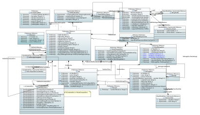

.. Copyright 2021
.. This file is licensed under the CREATIVE COMMONS ATTRIBUTION 4.0 INTERNATIONAL LICENSE
.. Full license text at https://creativecommons.org/licenses/by/4.0/legalcode

ONAP Vnfd Model
===============

.. contents::
   :depth: 3
..

Diagrams
--------

Vnfd View
~~~~~~~~~

Vnfd Topology View
~~~~~~~~~~~~~~~~~~

.. image:: VNFD-topo.png

Vnfd Deployment Flavor
~~~~~~~~~~~~~~~~~~~~~~

.. image:: VNFD-DF.png

VNF Datatypes 
~~~~~~~~~~~~~

Classes
-------

ChecksumData
~~~~~~~~~~~~

The ChecksumData information element supports providing information about the result of performing a checksum operation over some arbitrary data.

Applied stereotypes:

-  Reference

-  **reference: IFA011 v3.3.1**

-  Experimental

-  OpenModelClass

-  **support: MANDATORY**

================== ======== ========= ================================== ================================================================================================================================= ===========================================
**Attribute Name** **Type** **Mult.** **Stereotypes**                    **Description**                                                                                                                   **Defined in**
algorithm          String   1         OpenModelAttribute                 Species the algorithm used to obtain the checksum value.                                                                          Vnf::ObjectClasses::ChecksumData::algorithm
                                                                                                                                                                                                          
                                      -  isInvariant: false                                                                                                                                               
                                                                                                                                                                                                          
                                      -  valueRange: no range constraint                                                                                                                                  
                                                                                                                                                                                                          
                                      -  support: MANDATORY                                                                                                                                               
                                                                                                                                                                                                          
                                      Experimental                                                                                                                                                        
hash               String   1         OpenModelAttribute                 Contains the result of applying the algorithm indicated by the algorithm attribute to the data to which this ChecksumData refers. Vnf::ObjectClasses::ChecksumData::hash
                                                                                                                                                                                                          
                                      -  isInvariant: false                                                                                                                                               
                                                                                                                                                                                                          
                                      -  valueRange: no range constraint                                                                                                                                  
                                                                                                                                                                                                          
                                      -  support: MANDATORY                                                                                                                                               
                                                                                                                                                                                                          
                                      Experimental                                                                                                                                                        
================== ======== ========= ================================== ================================================================================================================================= ===========================================

InstantiationLevel
~~~~~~~~~~~~~~~~~~

The InstantiationLevel class describes a given level of resources to be instantiated within a DF in term of the number of VNFC instances to be created from each VDU.
All the VDUs referenced in the level shall be part of the corresponding DF and their number shall be within the range (min/max) for this DF.

Applied stereotypes:

-  Preliminary

-  Reference

-  **reference: IFA011 v3.3.1**

-  OpenModelClass

-  **support: MANDATORY**

======================= ======================= ========= ================================== ================================================================================================================================================================================================================================================================================================== ===============================================================
**Attribute Name**      **Type**                **Mult.** **Stereotypes**                    **Description**                                                                                                                                                                                                                                                                                    **Defined in**
levelId                 Identifier              1         OpenModelAttribute                 Uniquely identifies a level with the DF.                                                                                                                                                                                                                                                           Vnf::ObjectClasses::InstantiationLevel::levelId
                                                                                                                                                                                                                                                                                                                                                                                               
                                                          -  isInvariant: true                                                                                                                                                                                                                                                                                                                 
                                                                                                                                                                                                                                                                                                                                                                                               
                                                          -  valueRange: no range constraint                                                                                                                                                                                                                                                                                                   
                                                                                                                                                                                                                                                                                                                                                                                               
                                                          -  support: MANDATORY                                                                                                                                                                                                                                                                                                                
                                                                                                                                                                                                                                                                                                                                                                                               
                                                          Preliminary                                                                                                                                                                                                                                                                                                                          
description             String                  1         OpenModelAttribute                 Human readable description of the level.                                                                                                                                                                                                                                                           Vnf::ObjectClasses::InstantiationLevel::description
                                                                                                                                                                                                                                                                                                                                                                                               
                                                          -  isInvariant: false                                                                                                                                                                                                                                                                                                                
                                                                                                                                                                                                                                                                                                                                                                                               
                                                          -  valueRange: no range constraint                                                                                                                                                                                                                                                                                                   
                                                                                                                                                                                                                                                                                                                                                                                               
                                                          -  support: MANDATORY                                                                                                                                                                                                                                                                                                                
                                                                                                                                                                                                                                                                                                                                                                                               
                                                          Preliminary                                                                                                                                                                                                                                                                                                                          
scaleInfo               ScaleInfo               0..\*     OpenModelAttribute                 Represents for each aspect the scale level that corresponds to this instantiation level. scaleInfo shall be present if the VNF supports scaling.                                                                                                                                                   Vnf::ObjectClasses::InstantiationLevel::scaleInfo
                                                                                                                                                                                                                                                                                                                                                                                               
                                                          -  isInvariant: false                                                                                                                                                                                                                                                                                                                
                                                                                                                                                                                                                                                                                                                                                                                               
                                                          -  valueRange: no range constraint                                                                                                                                                                                                                                                                                                   
                                                                                                                                                                                                                                                                                                                                                                                               
                                                          -  support: MANDATORY                                                                                                                                                                                                                                                                                                                
                                                                                                                                                                                                                                                                                                                                                                                               
                                                          Preliminary                                                                                                                                                                                                                                                                                                                          
\_vduLevel              VduLevel                1..\*     OpenModelAttribute                 Indicates the number of instance of this VDU to deploy for this level.                                                                                                                                                                                                                             Vnf::ObjectClasses::InstantiationLevel::_vduLevel
                                                                                                                                                                                                                                                                                                                                                                                               
                                                          -  isInvariant: false                                                                                                                                                                                                                                                                                                                
                                                                                                                                                                                                                                                                                                                                                                                               
                                                          -  valueRange: no range constraint                                                                                                                                                                                                                                                                                                   
                                                                                                                                                                                                                                                                                                                                                                                               
                                                          -  support: MANDATORY                                                                                                                                                                                                                                                                                                                
                                                                                                                                                                                                                                                                                                                                                                                               
                                                          Preliminary                                                                                                                                                                                                                                                                                                                          
virtualLinkBitRateLevel VirtualLinkBitRateLevel 0..\*     OpenModelAttribute                 Specifies bitrate requirements applicable to virtual links created from particular virtual link descriptors for this level.                                                                                                                                                                        Vnf::ObjectClasses::InstantiationLevel::virtualLinkBitRateLevel
                                                                                             NOTE: If not present, it is assumed that the bitrate requirements can be derived from those specified in the VduCpd instances applicable to the internal VL. If present in both the InstantiationLevel and the VduCpd instances applicable to the internal VL, the highest value takes precedence.
                                                          -  isInvariant: false                                                                                                                                                                                                                                                                                                                
                                                                                                                                                                                                                                                                                                                                                                                               
                                                          -  valueRange: no range constraint                                                                                                                                                                                                                                                                                                   
                                                                                                                                                                                                                                                                                                                                                                                               
                                                          -  support: MANDATORY                                                                                                                                                                                                                                                                                                                
                                                                                                                                                                                                                                                                                                                                                                                               
                                                          Preliminary                                                                                                                                                                                                                                                                                                                          
======================= ======================= ========= ================================== ================================================================================================================================================================================================================================================================================================== ===============================================================

LogicalNodeRequirements
~~~~~~~~~~~~~~~~~~~~~~~

This information element describes compute, memory and I/O requirements that are to be associated with the logical node of infrastructure. The logical node requirements are a sub-component of the VDU level requirements. As an example for illustration purposes, a logical node correlates to the concept of a NUMA cell in libvirt terminology.

Applied stereotypes:

-  Preliminary

-  Reference

-  **reference: IFA011 v3.3.1**

-  OpenModelClass

-  **support: MANDATORY**

============================ ============ ========= ================================== =========================================================================================================================================================================================================================================================================== =========================================================================
**Attribute Name**           **Type**     **Mult.** **Stereotypes**                    **Description**                                                                                                                                                                                                                                                             **Defined in**
id                           Identifier   1         OpenModelAttribute                 Identifies this set of logical node requirements.                                                                                                                                                                                                                           Vnf::ObjectClasses::LogicalNodeRequirements::id
                                                                                                                                                                                                                                                                                                                                                                  
                                                    -  isInvariant: true                                                                                                                                                                                                                                                                                          
                                                                                                                                                                                                                                                                                                                                                                  
                                                    -  valueRange: no range constraint                                                                                                                                                                                                                                                                            
                                                                                                                                                                                                                                                                                                                                                                  
                                                    -  support: MANDATORY                                                                                                                                                                                                                                                                                         
                                                                                                                                                                                                                                                                                                                                                                  
                                                    Preliminary                                                                                                                                                                                                                                                                                                   
logicalNodeRequirementDetail KeyValuePair 1..\*     OpenModelAttribute                 The logical node-level compute, memory and I/O requirements. An array of key-value pairs that articulate the deployment requirements.                                                                                                                                       Vnf::ObjectClasses::LogicalNodeRequirements::logicalNodeRequirementDetail
                                                                                       This could include the number of CPU cores on this logical node, a memory configuration specific to a logical node (e.g. such as available in the Linux kernel via the libnuma library) or a requirement related to the association of an I/O device with the logical node.
                                                    -  isInvariant: false                                                                                                                                                                                                                                                                                         
                                                                                                                                                                                                                                                                                                                                                                  
                                                    -  valueRange: no range constraint                                                                                                                                                                                                                                                                            
                                                                                                                                                                                                                                                                                                                                                                  
                                                    -  support: MANDATORY                                                                                                                                                                                                                                                                                         
                                                                                                                                                                                                                                                                                                                                                                  
                                                    Preliminary                                                                                                                                                                                                                                                                                                   
============================ ============ ========= ================================== =========================================================================================================================================================================================================================================================================== =========================================================================

MciopProfile
~~~~~~~~~~~~

A Managed Container Infrastructure Object Package (MCIOP) is a hierarchical aggregate of information objects for OS container management and orchestration. Multiple MCIOPs can be included in a VNF Package. The MciopProfile information element provides properties of the MCIOP which are used during deployment of containerized workloads based on a MCIOP, associated to a VNF deployment flavour.

Applied stereotypes:

-  Reference

-  **reference: IFA011 v4.1.1**

-  Experimental

-  OpenModelClass

-  **support: MANDATORY**

============================= ========== ========= ================================== ===================================================================================================================================== ===============================================================
**Attribute Name**            **Type**   **Mult.** **Stereotypes**                    **Description**                                                                                                                       **Defined in**
mciopId                       Identifier 1         OpenModelAttribute                 Identifies the MCIOP in the VNF package.                                                                                              Vnf::ObjectClasses::MciopProfile::mciopId
                                                                                                                                                                                                                           
                                                   -  isInvariant: false                                                                                                                                                   
                                                                                                                                                                                                                           
                                                   -  valueRange: no range constraint                                                                                                                                      
                                                                                                                                                                                                                           
                                                   -  support: MANDATORY                                                                                                                                                   
deploymentOrder               Integer    0..1      OpenModelAttribute                 Indicates the order in which this MCIOP shall be deployed in relation to other MCIOPs. A lower value specifies an earlier deployment. Vnf::ObjectClasses::MciopProfile::deploymentOrder
                                                                                                                                                                                                                           
                                                   -  isInvariant: false                                                                                                                                                   
                                                                                                                                                                                                                           
                                                   -  valueRange: no range constraint                                                                                                                                      
                                                                                                                                                                                                                           
                                                   -  support: MANDATORY                                                                                                                                                   
affinityOrAntiAffinityGroupId Identifier 0..\*     OpenModelAttribute                 References the affinity or anti-affinity group(s) the MCIOP belongs to.                                                               Vnf::ObjectClasses::MciopProfile::affinityOrAntiAffinityGroupId
                                                                                                                                                                                                                           
                                                   -  isInvariant: false                                                                                                                                                   
                                                                                                                                                                                                                           
                                                   -  valueRange: no range constraint                                                                                                                                      
                                                                                                                                                                                                                           
                                                   -  support: MANDATORY                                                                                                                                                   
associatedVdu                 Identifier 0..\*     OpenModelAttribute                 List of VDUs which are associated to this MCIOP and which are deployed using this MCIOP.                                              Vnf::ObjectClasses::MciopProfile::associatedVdu
                                                                                                                                                                                                                           
                                                   -  isInvariant: false                                                                                                                                                   
                                                                                                                                                                                                                           
                                                   -  valueRange: no range constraint                                                                                                                                      
                                                                                                                                                                                                                           
                                                   -  support: MANDATORY                                                                                                                                                   
============================= ========== ========= ================================== ===================================================================================================================================== ===============================================================

OsContainerDesc
~~~~~~~~~~~~~~~

The OsContainerDesc information element describes the members properties of a set of co-located container compute resources when these are realizing a VDU.

Applied stereotypes:

-  Reference

-  **reference: IFA011 v4.1.1**

-  Experimental

-  OpenModelClass

-  **support: MANDATORY**

================================== =================== ========= ================================== ================================================================================================================================================================================================================================= =======================================================================
**Attribute Name**                 **Type**            **Mult.** **Stereotypes**                    **Description**                                                                                                                                                                                                                   **Defined in**
osContainerDescId                  Identifier          1         OpenModelAttribute                 Unique identifier of this OsContainerDesc in the VNFD.                                                                                                                                                                            Vnf::ObjectClasses::OsContainerDesc::osContainerDescId
                                                                                                                                                                                                                                                                                                                                     
                                                                 -  isInvariant: false                                                                                                                                                                                                                                               
                                                                                                                                                                                                                                                                                                                                     
                                                                 -  valueRange: no range constraint                                                                                                                                                                                                                                  
                                                                                                                                                                                                                                                                                                                                     
                                                                 -  support: MANDATORY                                                                                                                                                                                                                                               
requestedCpuResources              Integer             1         OpenModelAttribute                 Number of CPU resources requested for the container (e.g. in milli-CPU-s)                                                                                                                                                         Vnf::ObjectClasses::OsContainerDesc::requestedCpuResources
                                                                                                                                                                                                                                                                                                                                     
                                                                 -  isInvariant: false                                                                                                                                                                                                                                               
                                                                                                                                                                                                                                                                                                                                     
                                                                 -  valueRange: no range constraint                                                                                                                                                                                                                                  
                                                                                                                                                                                                                                                                                                                                     
                                                                 -  support: MANDATORY                                                                                                                                                                                                                                               
requestedMemoryResources           Number              1         OpenModelAttribute                 Amount of memory resources requested for the container (e.g. in MB).                                                                                                                                                              Vnf::ObjectClasses::OsContainerDesc::requestedMemoryResources
                                                                                                                                                                                                                                                                                                                                     
                                                                 -  isInvariant: false                                                                                                                                                                                                                                               
                                                                                                                                                                                                                                                                                                                                     
                                                                 -  valueRange: no range constraint                                                                                                                                                                                                                                  
                                                                                                                                                                                                                                                                                                                                     
                                                                 -  support: MANDATORY                                                                                                                                                                                                                                               
requestedEphemeralStorageResources Number              1         OpenModelAttribute                 Size of ephemeral storage resources requested for the container (e.g. in GB).                                                                                                                                                     Vnf::ObjectClasses::OsContainerDesc::requestedEphemeralStorageResources
                                                                                                                                                                                                                                                                                                                                     
                                                                 -  isInvariant: false                                                                                                                                                                                                                                               
                                                                                                                                                                                                                                                                                                                                     
                                                                 -  valueRange: no range constraint                                                                                                                                                                                                                                  
                                                                                                                                                                                                                                                                                                                                     
                                                                 -  support: MANDATORY                                                                                                                                                                                                                                               
extendedResourceRequests           KeyValuePair        1         OpenModelAttribute                 An array of key-value pairs of extended resources required by the container.                                                                                                                                                      Vnf::ObjectClasses::OsContainerDesc::extendedResourceRequests
                                                                                                                                                                                                                                                                                                                                     
                                                                 -  isInvariant: false                                                                                                                                                                                                                                               
                                                                                                                                                                                                                                                                                                                                     
                                                                 -  valueRange: no range constraint                                                                                                                                                                                                                                  
                                                                                                                                                                                                                                                                                                                                     
                                                                 -  support: MANDATORY                                                                                                                                                                                                                                               
cpuResourceLimit                   Integer             1         OpenModelAttribute                 Number of CPU resources the container can maximally use (e.g. in milli-CPU).                                                                                                                                                      Vnf::ObjectClasses::OsContainerDesc::cpuResourceLimit
                                                                                                                                                                                                                                                                                                                                     
                                                                 -  isInvariant: false                                                                                                                                                                                                                                               
                                                                                                                                                                                                                                                                                                                                     
                                                                 -  valueRange: no range constraint                                                                                                                                                                                                                                  
                                                                                                                                                                                                                                                                                                                                     
                                                                 -  support: MANDATORY                                                                                                                                                                                                                                               
memoryResourceLimit                Number              1         OpenModelAttribute                 Amount of memory resources the container can maximum use (e.g. in MB).                                                                                                                                                            Vnf::ObjectClasses::OsContainerDesc::memoryResourceLimit
                                                                                                                                                                                                                                                                                                                                     
                                                                 -  isInvariant: false                                                                                                                                                                                                                                               
                                                                                                                                                                                                                                                                                                                                     
                                                                 -  valueRange: no range constraint                                                                                                                                                                                                                                  
                                                                                                                                                                                                                                                                                                                                     
                                                                 -  support: MANDATORY                                                                                                                                                                                                                                               
ephemeralStorageResourceLimit      Number              1         OpenModelAttribute                 Size of ephemeral storage resources the container can maximum use (e.g. in GB).                                                                                                                                                   Vnf::ObjectClasses::OsContainerDesc::ephemeralStorageResourceLimit
                                                                                                                                                                                                                                                                                                                                     
                                                                 -  isInvariant: false                                                                                                                                                                                                                                               
                                                                                                                                                                                                                                                                                                                                     
                                                                 -  valueRange: no range constraint                                                                                                                                                                                                                                  
                                                                                                                                                                                                                                                                                                                                     
                                                                 -  support: MANDATORY                                                                                                                                                                                                                                               
swimageDesc                        SwImageDesc         1         OpenModelAttribute                 Describes the software image realizing this OS container.                                                                                                                                                                         Vnf::ObjectClasses::OsContainerDesc::swimageDesc
                                                                                                                                                                                                                                                                                                                                     
                                                                 -  isInvariant: false                                                                                                                                                                                                                                               
                                                                                                                                                                                                                                                                                                                                     
                                                                 -  valueRange: no range constraint                                                                                                                                                                                                                                  
                                                                                                                                                                                                                                                                                                                                     
                                                                 -  support: MANDATORY                                                                                                                                                                                                                                               
bootData                           String              1         OpenModelAttribute                 Contains a string or a URL to a file contained in the VNF package used to customize a container resource at boot time. The bootData may contain variable parts that are replaced by deployment specific values before being sent. Vnf::ObjectClasses::OsContainerDesc::bootData
                                                                                                                                                                                                                                                                                                                                     
                                                                 -  isInvariant: false                                                                                                                                                                                                                                               
                                                                                                                                                                                                                                                                                                                                     
                                                                 -  valueRange: no range constraint                                                                                                                                                                                                                                  
                                                                                                                                                                                                                                                                                                                                     
                                                                 -  support: MANDATORY                                                                                                                                                                                                                                               
virtualStorageDesc                 VirtualStorageDesc  0..\*     OpenModelAttribute                 Links to virtualStorageDesc-s of the Vdu. The storages represented by the linked VirtualStorageDesc-s are attached to the OS Container as volumes.                                                                                Vnf::ObjectClasses::OsContainerDesc::virtualStorageDesc
                                                                                                    Shall be present in case the OS container requires storage resources.                                                                                                                                                            
                                                                 -  isInvariant: false                                                                                                                                                                                                                                               
                                                                                                                                                                                                                                                                                                                                     
                                                                 -  valueRange: no range constraint                                                                                                                                                                                                                                  
                                                                                                                                                                                                                                                                                                                                     
                                                                 -  support: MANDATORY                                                                                                                                                                                                                                               
monitoringParameters               MonitoringParameter 1..\*     OpenModelAttribute                 Specifies the virtualised resource related performance metrics on the OsContainerDesc level to be tracked by the VNFM                                                                                                             Vnf::ObjectClasses::OsContainerDesc::monitoringParameters
                                                                                                                                                                                                                                                                                                                                     
                                                                 -  isInvariant: false                                                                                                                                                                                                                                               
                                                                                                                                                                                                                                                                                                                                     
                                                                 -  valueRange: no range constraint                                                                                                                                                                                                                                  
                                                                                                                                                                                                                                                                                                                                     
                                                                 -  support: MANDATORY                                                                                                                                                                                                                                               
================================== =================== ========= ================================== ================================================================================================================================================================================================================================= =======================================================================

ScalingAspect
~~~~~~~~~~~~~

The ScalingAspect class describes the details of an aspect used for horizontal scaling.

Applied stereotypes:

-  Reference

-  **reference: IFA011 v3.3.1**

-  Experimental

-  OpenModelClass

-  **support: MANDATORY**

================== ======== ========= ================================== ============================================= ==============================================
**Attribute Name** **Type** **Mult.** **Stereotypes**                    **Description**                               **Defined in**
id                 String   1         OpenModelAttribute                 Unique identifier of this aspect in the VNFD. Vnf::ObjectClasses::ScalingAspect::id
                                                                                                                      
                                      -  isInvariant: true                                                            
                                                                                                                      
                                      -  valueRange: no range constraint                                              
                                                                                                                      
                                      -  support: MANDATORY                                                           
                                                                                                                      
                                      Experimental                                                                    
name               String   1         OpenModelAttribute                 Human readable name of the aspect.            Vnf::ObjectClasses::ScalingAspect::name
                                                                                                                      
                                      -  isInvariant: false                                                           
                                                                                                                      
                                      -  valueRange: no range constraint                                              
                                                                                                                      
                                      -  support: MANDATORY                                                           
                                                                                                                      
                                      Experimental                                                                    
description        String   1         OpenModelAttribute                 Human readable description of the aspect.     Vnf::ObjectClasses::ScalingAspect::description
                                                                                                                      
                                      -  isInvariant: false                                                           
                                                                                                                      
                                      -  valueRange: no range constraint                                              
                                                                                                                      
                                      -  support: MANDATORY                                                           
                                                                                                                      
                                      Experimental                                                                    
================== ======== ========= ================================== ============================================= ==============================================

SecurityGroupRule
~~~~~~~~~~~~~~~~~

Security group rule specifies the matching criteria for the ingress and/or egress traffic to/from the visited connection points. If an ingress traffic is accepted, the corresponding egress response shall be allowed, regardless of the security group rules on the egress direction. If an egress traffic is allowed, the corresponding ingress response shall be accepted, regardless of the security group rules on the ingress direction. The design of security group rule follows a permissive model where all security group rules applied to a CP are dealt with in an "OR" logic fashion, i.e. the traffic is allowed if it matches any security group rule applied to this CP.

Applied stereotypes:

-  Preliminary

-  Reference

-  **reference: IFA011 V3.3.1**

-  OpenModelClass

-  **support: MANDATORY**

=================== ========== ========= ================================== ============================================================================================================================================================================================================================= ==========================================================
**Attribute Name**  **Type**   **Mult.** **Stereotypes**                    **Description**                                                                                                                                                                                                               **Defined in**
securityGroupRuleId Identifier 1         OpenModelAttribute                 Identifier of the security group rule.                                                                                                                                                                                        Vnf::ObjectClasses::SecurityGroupRule::securityGroupRuleId
                                                                                                                                                                                                                                                                                                         
                                         -  isInvariant: true                                                                                                                                                                                                                                            
                                                                                                                                                                                                                                                                                                         
                                         -  valueRange: no range constraint                                                                                                                                                                                                                              
                                                                                                                                                                                                                                                                                                         
                                         -  support: MANDATORY                                                                                                                                                                                                                                           
                                                                                                                                                                                                                                                                                                         
                                         Preliminary                                                                                                                                                                                                                                                     
description         String     0..1      OpenModelAttribute                 Human readable description of the security group rule                                                                                                                                                                         Vnf::ObjectClasses::SecurityGroupRule::description
                                                                                                                                                                                                                                                                                                         
                                         -  isInvariant: false                                                                                                                                                                                                                                           
                                                                                                                                                                                                                                                                                                         
                                         -  valueRange: no range constraint                                                                                                                                                                                                                              
                                                                                                                                                                                                                                                                                                         
                                         -  support: MANDATORY                                                                                                                                                                                                                                           
                                                                                                                                                                                                                                                                                                         
                                         Preliminary                                                                                                                                                                                                                                                     
direction           Direction  0..1      OpenModelAttribute                 The direction in which the security group rule is applied.                                                                                                                                                                    Vnf::ObjectClasses::SecurityGroupRule::direction
                                                                                                                                                                                                                                                                                                         
                                         -  isInvariant: false                                                                                                                                                                                                                                           
                                                                                                                                                                                                                                                                                                         
                                         -  valueRange: no range constraint                                                                                                                                                                                                                              
                                                                                                                                                                                                                                                                                                         
                                         -  support: MANDATORY                                                                                                                                                                                                                                           
                                                                                                                                                                                                                                                                                                         
                                         Preliminary                                                                                                                                                                                                                                                     
etherType           IpVersion  0..1      OpenModelAttribute                 Indicates the protocol carried over the Ethernet layer.                                                                                                                                                                       Vnf::ObjectClasses::SecurityGroupRule::etherType
                                                                                                                                                                                                                                                                                                         
                                         -  isInvariant: false                                                                                                                                                                                                                                           
                                                                                                                                                                                                                                                                                                         
                                         -  valueRange: no range constraint                                                                                                                                                                                                                              
                                                                                                                                                                                                                                                                                                         
                                         -  support: MANDATORY                                                                                                                                                                                                                                           
                                                                                                                                                                                                                                                                                                         
                                         Preliminary                                                                                                                                                                                                                                                     
protocol            String     0..1      OpenModelAttribute                 Indicates the protocol carried over the IP layer. Permitted values: any protocol defined in the IANA protocol registry, e.g. TCP, UDP, ICMP, etc.                                                                             Vnf::ObjectClasses::SecurityGroupRule::protocol
                                                                            See https://www.iana.org/assignments/protocol-numbers/protocol-numbers.xhtml                                                                                                                                                 
                                         -  isInvariant: false              Note: IFA011 defines this as an enum, but as the list is not complete, made this a string.                                                                                                                                   
                                                                                                                                                                                                                                                                                                         
                                         -  valueRange: no range constraint                                                                                                                                                                                                                              
                                                                                                                                                                                                                                                                                                         
                                         -  support: MANDATORY                                                                                                                                                                                                                                           
                                                                                                                                                                                                                                                                                                         
                                         Preliminary                                                                                                                                                                                                                                                     
portRangeMin        Integer    0..1      OpenModelAttribute                 Indicates minimum port number in the range that is matched by the security group rule. If a value is provided at design-time, this value may be overridden at run-time based on other deployment requirements or constraints. Vnf::ObjectClasses::SecurityGroupRule::portRangeMin
                                                                                                                                                                                                                                                                                                         
                                         -  isInvariant: false                                                                                                                                                                                                                                           
                                                                                                                                                                                                                                                                                                         
                                         -  valueRange: no range constraint                                                                                                                                                                                                                              
                                                                                                                                                                                                                                                                                                         
                                         -  support: MANDATORY                                                                                                                                                                                                                                           
                                                                                                                                                                                                                                                                                                         
                                         Preliminary                                                                                                                                                                                                                                                     
portRangeMax        Integer    0..1      OpenModelAttribute                 Indicates maximum port number in the range that is matched by the security group rule. If a value is provided at design-time, this value may be overridden at run-time based on other deployment requirements or constraints. Vnf::ObjectClasses::SecurityGroupRule::portRangeMax
                                                                                                                                                                                                                                                                                                         
                                         -  isInvariant: false                                                                                                                                                                                                                                           
                                                                                                                                                                                                                                                                                                         
                                         -  valueRange: no range constraint                                                                                                                                                                                                                              
                                                                                                                                                                                                                                                                                                         
                                         -  support: MANDATORY                                                                                                                                                                                                                                           
                                                                                                                                                                                                                                                                                                         
                                         Preliminary                                                                                                                                                                                                                                                     
=================== ========== ========= ================================== ============================================================================================================================================================================================================================= ==========================================================

SwImage
~~~~~~~

A software image

Applied stereotypes:

-  Preliminary

-  Reference

-  **reference: IFA011 v3.3.1**

-  OpenModelClass

-  **support: MANDATORY**

SwImageDesc
~~~~~~~~~~~

The SwImageDesc information element describes requested additional capability for a particular VDU. Such a capability may be for acceleration or specific tasks. Storage not necessarily related to the compute, may be Network Attached Storage (NAS)

Applied stereotypes:

-  Preliminary

-  Reference

-  **reference: IFA011 v3.3.1**

-  OpenModelClass

-  **support: MANDATORY**

================================== ============ ========= ================================== ============================================================================================================================================================================================================== ===================================================================
**Attribute Name**                 **Type**     **Mult.** **Stereotypes**                    **Description**                                                                                                                                                                                                **Defined in**
id                                 Identifier   1         OpenModelAttribute                 The identifier of this software image.                                                                                                                                                                         Vnf::ObjectClasses::SwImageDesc::id
                                                                                                                                                                                                                                                                                                           
                                                          -  isInvariant: false                                                                                                                                                                                                                            
                                                                                                                                                                                                                                                                                                           
                                                          -  valueRange: no range constraint                                                                                                                                                                                                               
                                                                                                                                                                                                                                                                                                           
                                                          -  support: MANDATORY                                                                                                                                                                                                                            
                                                                                                                                                                                                                                                                                                           
                                                          Preliminary                                                                                                                                                                                                                                      
name                               String       1         OpenModelAttribute                 The name of this software image.                                                                                                                                                                               Vnf::ObjectClasses::SwImageDesc::name
                                                                                                                                                                                                                                                                                                           
                                                          -  isInvariant: false                                                                                                                                                                                                                            
                                                                                                                                                                                                                                                                                                           
                                                          -  valueRange: no range constraint                                                                                                                                                                                                               
                                                                                                                                                                                                                                                                                                           
                                                          -  support: MANDATORY                                                                                                                                                                                                                            
                                                                                                                                                                                                                                                                                                           
                                                          Preliminary                                                                                                                                                                                                                                      
version                            Version      1         OpenModelAttribute                 The version of this software image.                                                                                                                                                                            Vnf::ObjectClasses::SwImageDesc::version
                                                                                                                                                                                                                                                                                                           
                                                          -  isInvariant: false                                                                                                                                                                                                                            
                                                                                                                                                                                                                                                                                                           
                                                          -  valueRange: no range constraint                                                                                                                                                                                                               
                                                                                                                                                                                                                                                                                                           
                                                          -  support: MANDATORY                                                                                                                                                                                                                            
                                                                                                                                                                                                                                                                                                           
                                                          Preliminary                                                                                                                                                                                                                                      
provider                           String       0..1      OpenModelAttribute                 The provider of this software image. If not present the provider of the software image is assumed to be same as the VNF provider.                                                                              Vnf::ObjectClasses::SwImageDesc::provider
                                                                                                                                                                                                                                                                                                           
                                                          -  isInvariant: false                                                                                                                                                                                                                            
                                                                                                                                                                                                                                                                                                           
                                                          -  valueRange: no range constraint                                                                                                                                                                                                               
                                                                                                                                                                                                                                                                                                           
                                                          -  support: MANDATORY                                                                                                                                                                                                                            
                                                                                                                                                                                                                                                                                                           
                                                          Experimental                                                                                                                                                                                                                                     
containerFormat                    String       1         OpenModelAttribute                 The container format describes the container file format in which software image is provided.                                                                                                                  Vnf::ObjectClasses::SwImageDesc::containerFormat
                                                                                                                                                                                                                                                                                                           
                                                          -  isInvariant: false                                                                                                                                                                                                                            
                                                                                                                                                                                                                                                                                                           
                                                          -  valueRange: no range constraint                                                                                                                                                                                                               
                                                                                                                                                                                                                                                                                                           
                                                          -  support: MANDATORY                                                                                                                                                                                                                            
                                                                                                                                                                                                                                                                                                           
                                                          Preliminary                                                                                                                                                                                                                                      
diskFormat                         String       1         OpenModelAttribute                 The disk format of a software image is the format of the underlying disk image.                                                                                                                                Vnf::ObjectClasses::SwImageDesc::diskFormat
                                                                                                                                                                                                                                                                                                           
                                                          -  isInvariant: false                                                                                                                                                                                                                            
                                                                                                                                                                                                                                                                                                           
                                                          -  valueRange: no range constraint                                                                                                                                                                                                               
                                                                                                                                                                                                                                                                                                           
                                                          -  support: MANDATORY                                                                                                                                                                                                                            
                                                                                                                                                                                                                                                                                                           
                                                          Preliminary                                                                                                                                                                                                                                      
minRam                             Number       0..1      OpenModelAttribute                 The minimal RAM requirement for this software image. The value of the "size" attribute of VirtualMemoryData of the Vdu referencing this SwImageDesc shall not be smaller than the value of minRam.             Vnf::ObjectClasses::SwImageDesc::minRam
                                                                                                                                                                                                                                                                                                           
                                                          -  isInvariant: false                                                                                                                                                                                                                            
                                                                                                                                                                                                                                                                                                           
                                                          -  valueRange: no range constraint                                                                                                                                                                                                               
                                                                                                                                                                                                                                                                                                           
                                                          -  support: MANDATORY                                                                                                                                                                                                                            
                                                                                                                                                                                                                                                                                                           
                                                          Preliminary                                                                                                                                                                                                                                      
minDisk                            Number       1         OpenModelAttribute                 The minimal disk size requirement for this software image. The value of the "size of storage" attribute of the VirtualStorageDesc referencing this SwImageDesc shall not be smaller than the value of minDisk. Vnf::ObjectClasses::SwImageDesc::minDisk
                                                                                                                                                                                                                                                                                                           
                                                          -  isInvariant: false                                                                                                                                                                                                                            
                                                                                                                                                                                                                                                                                                           
                                                          -  valueRange: no range constraint                                                                                                                                                                                                               
                                                                                                                                                                                                                                                                                                           
                                                          -  support: MANDATORY                                                                                                                                                                                                                            
                                                                                                                                                                                                                                                                                                           
                                                          Preliminary                                                                                                                                                                                                                                      
size                               Number       1         OpenModelAttribute                 The size of the software image.                                                                                                                                                                                Vnf::ObjectClasses::SwImageDesc::size
                                                                                                                                                                                                                                                                                                           
                                                          -  isInvariant: false                                                                                                                                                                                                                            
                                                                                                                                                                                                                                                                                                           
                                                          -  valueRange: no range constraint                                                                                                                                                                                                               
                                                                                                                                                                                                                                                                                                           
                                                          -  support: MANDATORY                                                                                                                                                                                                                            
                                                                                                                                                                                                                                                                                                           
                                                          Preliminary                                                                                                                                                                                                                                      
operatingSystem                    String       0..1      OpenModelAttribute                 Identifies the operating system used in the software image. This attribute may also identify if a 32 bit or 64 bit software image is used.                                                                     Vnf::ObjectClasses::SwImageDesc::operatingSystem
                                                                                                                                                                                                                                                                                                           
                                                          -  isInvariant: false                                                                                                                                                                                                                            
                                                                                                                                                                                                                                                                                                           
                                                          -  valueRange: no range constraint                                                                                                                                                                                                               
                                                                                                                                                                                                                                                                                                           
                                                          -  support: MANDATORY                                                                                                                                                                                                                            
                                                                                                                                                                                                                                                                                                           
                                                          Preliminary                                                                                                                                                                                                                                      
supportedVirtualisationEnvironment String       0..\*     OpenModelAttribute                 Identifies the virtualisation environments (e.g. hypervisor) compatible with this software image.                                                                                                              Vnf::ObjectClasses::SwImageDesc::supportedVirtualisationEnvironment
                                                                                                                                                                                                                                                                                                           
                                                          -  isInvariant: false                                                                                                                                                                                                                            
                                                                                                                                                                                                                                                                                                           
                                                          -  valueRange: no range constraint                                                                                                                                                                                                               
                                                                                                                                                                                                                                                                                                           
                                                          -  support: MANDATORY                                                                                                                                                                                                                            
                                                                                                                                                                                                                                                                                                           
                                                          Preliminary                                                                                                                                                                                                                                      
\_swImage                          SwImage      1         OpenModelAttribute                 This is a reference to the actual software image. The reference can be relative to the root of the VNF Package or can be a URL                                                                                 Vnf::ObjectClasses::SwImageDesc::_swImage
                                                                                                                                                                                                                                                                                                           
                                                          -  isInvariant: false                                                                                                                                                                                                                            
                                                                                                                                                                                                                                                                                                           
                                                          -  valueRange: no range constraint                                                                                                                                                                                                               
                                                                                                                                                                                                                                                                                                           
                                                          -  support: MANDATORY                                                                                                                                                                                                                            
                                                                                                                                                                                                                                                                                                           
                                                          Preliminary                                                                                                                                                                                                                                      
                                                                                                                                                                                                                                                                                                           
                                                          PassedByReference                                                                                                                                                                                                                                
checksumdata                       ChecksumData 1         OpenModelAttribute                                                                                                                                                                                                                                Vnf::ObjectClasses::SwImageDesc::checksumdata
                                                                                                                                                                                                                                                                                                           
                                                          -  isInvariant: false                                                                                                                                                                                                                            
                                                                                                                                                                                                                                                                                                           
                                                          -  valueRange: no range constraint                                                                                                                                                                                                               
                                                                                                                                                                                                                                                                                                           
                                                          -  support: MANDATORY                                                                                                                                                                                                                            
                                                                                                                                                                                                                                                                                                           
                                                          Experimental                                                                                                                                                                                                                                     
================================== ============ ========= ================================== ============================================================================================================================================================================================================== ===================================================================

Vdu
~~~

The Virtualisation Deployment Unit (VDU) is a construct supporting the description of the deployment and operational behavior of a VNFC.
A VNFC instance created based on the VDU maps to a single instance of atomic deployable unit, represented by a single VM for hypervisor-based virtualisation, or represented by one or a set of OS containers for OS virtualisation .
A VNFC will only be in one VNFDesc. If a vendor wants to use the VNFC in mupliple VNFDesc (their product) they can do so, but it will be 'repeated'.

Applied stereotypes:

-  Preliminary

-  Reference

-  **reference: IFA011 v4.1.1**

-  OpenModelClass

-  **support: MANDATORY**

====================== ========================== ========= ================================== ==================================================================================================================================================================================================================================================================================================================================================================================================================================================================================================================================================================================================================================================== ===============================================
**Attribute Name**     **Type**                   **Mult.** **Stereotypes**                    **Description**                                                                                                                                                                                                                                                                                                                                                                                                                                                                                                                                                                                                                                      **Defined in**
id                     Identifier                 1         OpenModelAttribute                 Unique identifier of this Vdu in VNFD.                                                                                                                                                                                                                                                                                                                                                                                                                                                                                                                                                                                                               Vnf::ObjectClasses::Vdu::id
                                                                                                                                                                                                                                                                                                                                                                                                                                                                                                                                                                                                                                                                                                                                                   
                                                            -  isInvariant: true                                                                                                                                                                                                                                                                                                                                                                                                                                                                                                                                                                                                                                                                   
                                                                                                                                                                                                                                                                                                                                                                                                                                                                                                                                                                                                                                                                                                                                                   
                                                            -  valueRange: no range constraint                                                                                                                                                                                                                                                                                                                                                                                                                                                                                                                                                                                                                                                     
                                                                                                                                                                                                                                                                                                                                                                                                                                                                                                                                                                                                                                                                                                                                                   
                                                            -  support: MANDATORY                                                                                                                                                                                                                                                                                                                                                                                                                                                                                                                                                                                                                                                                  
                                                                                                                                                                                                                                                                                                                                                                                                                                                                                                                                                                                                                                                                                                                                                   
                                                            Preliminary                                                                                                                                                                                                                                                                                                                                                                                                                                                                                                                                                                                                                                                                            
name                   String                     1         OpenModelAttribute                 Human readable name of the Vdu.                                                                                                                                                                                                                                                                                                                                                                                                                                                                                                                                                                                                                      Vnf::ObjectClasses::Vdu::name
                                                                                                                                                                                                                                                                                                                                                                                                                                                                                                                                                                                                                                                                                                                                                   
                                                            -  isInvariant: false                                                                                                                                                                                                                                                                                                                                                                                                                                                                                                                                                                                                                                                                  
                                                                                                                                                                                                                                                                                                                                                                                                                                                                                                                                                                                                                                                                                                                                                   
                                                            -  valueRange: no range constraint                                                                                                                                                                                                                                                                                                                                                                                                                                                                                                                                                                                                                                                     
                                                                                                                                                                                                                                                                                                                                                                                                                                                                                                                                                                                                                                                                                                                                                   
                                                            -  support: MANDATORY                                                                                                                                                                                                                                                                                                                                                                                                                                                                                                                                                                                                                                                                  
                                                                                                                                                                                                                                                                                                                                                                                                                                                                                                                                                                                                                                                                                                                                                   
                                                            Preliminary                                                                                                                                                                                                                                                                                                                                                                                                                                                                                                                                                                                                                                                                            
description            String                     1         OpenModelAttribute                 Human readable description of the Vdu.                                                                                                                                                                                                                                                                                                                                                                                                                                                                                                                                                                                                               Vnf::ObjectClasses::Vdu::description
                                                                                                                                                                                                                                                                                                                                                                                                                                                                                                                                                                                                                                                                                                                                                   
                                                            -  isInvariant: false                                                                                                                                                                                                                                                                                                                                                                                                                                                                                                                                                                                                                                                                  
                                                                                                                                                                                                                                                                                                                                                                                                                                                                                                                                                                                                                                                                                                                                                   
                                                            -  valueRange: no range constraint                                                                                                                                                                                                                                                                                                                                                                                                                                                                                                                                                                                                                                                     
                                                                                                                                                                                                                                                                                                                                                                                                                                                                                                                                                                                                                                                                                                                                                   
                                                            -  support: MANDATORY                                                                                                                                                                                                                                                                                                                                                                                                                                                                                                                                                                                                                                                                  
                                                                                                                                                                                                                                                                                                                                                                                                                                                                                                                                                                                                                                                                                                                                                   
                                                            Preliminary                                                                                                                                                                                                                                                                                                                                                                                                                                                                                                                                                                                                                                                                            
bootOrder              KeyValuePair               0..\*     OpenModelAttribute                 Boot order of valid boot devices. "key/name" indicates the the boot index "value" references a descriptor from which a valid boot device is created e.g. VirtualStorageDesc from which a VirtualStorage instance is created.                                                                                                                                                                                                                                                                                                                                                                                                                         Vnf::ObjectClasses::Vdu::bootOrder
                                                                                               NOTE: If no boot order is defined the default boot order defined in the VIM or NFVI shall be used.                                                                                                                                                                                                                                                                                                                                                                                                                                                                                                                                                  
                                                            -  isInvariant: false                                                                                                                                                                                                                                                                                                                                                                                                                                                                                                                                                                                                                                                                  
                                                                                                                                                                                                                                                                                                                                                                                                                                                                                                                                                                                                                                                                                                                                                   
                                                            -  valueRange: no range constraint                                                                                                                                                                                                                                                                                                                                                                                                                                                                                                                                                                                                                                                     
                                                                                                                                                                                                                                                                                                                                                                                                                                                                                                                                                                                                                                                                                                                                                   
                                                            -  support: MANDATORY                                                                                                                                                                                                                                                                                                                                                                                                                                                                                                                                                                                                                                                                  
                                                                                                                                                                                                                                                                                                                                                                                                                                                                                                                                                                                                                                                                                                                                                   
                                                            Preliminary                                                                                                                                                                                                                                                                                                                                                                                                                                                                                                                                                                                                                                                                            
nfviConstraint         KeyValuePair               0..\*     OpenModelAttribute                 Describes constraints on the NFVI for the VNFC instance(s) created from this Vdu. For example, aspects of a secure hosting environment for the VNFC instance that involve additional entities or processes. "key/name" includes "AvailabilityZone", "HostAggregates".                                                                                                                                                                                                                                                                                                                                                                                Vnf::ObjectClasses::Vdu::nfviConstraint
                                                                                               NOTE: These are constraints other than stipulating that a VNFC instance has access to a certain resource, as a prerequisite to instantiation. The attributes virtualComputeDesc and virtualStorageDesc define the resources required for instantiation of the VNFC instance.                                                                                                                                                                                                                                                                                                                                                                        
                                                            -  isInvariant: false                                                                                                                                                                                                                                                                                                                                                                                                                                                                                                                                                                                                                                                                  
                                                                                                                                                                                                                                                                                                                                                                                                                                                                                                                                                                                                                                                                                                                                                   
                                                            -  valueRange: no range constraint                                                                                                                                                                                                                                                                                                                                                                                                                                                                                                                                                                                                                                                     
                                                                                                                                                                                                                                                                                                                                                                                                                                                                                                                                                                                                                                                                                                                                                   
                                                            -  support: MANDATORY                                                                                                                                                                                                                                                                                                                                                                                                                                                                                                                                                                                                                                                                  
                                                                                                                                                                                                                                                                                                                                                                                                                                                                                                                                                                                                                                                                                                                                                   
                                                            Preliminary                                                                                                                                                                                                                                                                                                                                                                                                                                                                                                                                                                                                                                                                            
monitoringParameter    MonitoringParameter        0..\*     OpenModelAttribute                 Defines the virtualised resources monitoring parameters on VDU level.                                                                                                                                                                                                                                                                                                                                                                                                                                                                                                                                                                                Vnf::ObjectClasses::Vdu::monitoringParameter
                                                                                                                                                                                                                                                                                                                                                                                                                                                                                                                                                                                                                                                                                                                                                   
                                                            -  isInvariant: false                                                                                                                                                                                                                                                                                                                                                                                                                                                                                                                                                                                                                                                                  
                                                                                                                                                                                                                                                                                                                                                                                                                                                                                                                                                                                                                                                                                                                                                   
                                                            -  valueRange: no range constraint                                                                                                                                                                                                                                                                                                                                                                                                                                                                                                                                                                                                                                                     
                                                                                                                                                                                                                                                                                                                                                                                                                                                                                                                                                                                                                                                                                                                                                   
                                                            -  support: MANDATORY                                                                                                                                                                                                                                                                                                                                                                                                                                                                                                                                                                                                                                                                  
                                                                                                                                                                                                                                                                                                                                                                                                                                                                                                                                                                                                                                                                                                                                                   
                                                            Preliminary                                                                                                                                                                                                                                                                                                                                                                                                                                                                                                                                                                                                                                                                            
injectFiles            String                     0..\*     OpenModelAttribute                 Describes the information (e.g. URL) about the scripts, config drive metadata, etc. which can be used during Vdu booting process.                                                                                                                                                                                                                                                                                                                                                                                                                                                                                                                    Vnf::ObjectClasses::Vdu::injectFiles
                                                                                                                                                                                                                                                                                                                                                                                                                                                                                                                                                                                                                                                                                                                                                   
                                                            -  isInvariant: false                                                                                                                                                                                                                                                                                                                                                                                                                                                                                                                                                                                                                                                                  
                                                                                                                                                                                                                                                                                                                                                                                                                                                                                                                                                                                                                                                                                                                                                   
                                                            -  valueRange: no range constraint                                                                                                                                                                                                                                                                                                                                                                                                                                                                                                                                                                                                                                                     
                                                                                                                                                                                                                                                                                                                                                                                                                                                                                                                                                                                                                                                                                                                                                   
                                                            -  support: MANDATORY                                                                                                                                                                                                                                                                                                                                                                                                                                                                                                                                                                                                                                                                  
                                                                                                                                                                                                                                                                                                                                                                                                                                                                                                                                                                                                                                                                                                                                                   
                                                            Preliminary                                                                                                                                                                                                                                                                                                                                                                                                                                                                                                                                                                                                                                                                            
configurableProperties VnfcConfigurableProperties 0..1      OpenModelAttribute                 Describes the configurable properties of all VNFC instances based on this VDU.                                                                                                                                                                                                                                                                                                                                                                                                                                                                                                                                                                       Vnf::ObjectClasses::Vdu::configurableProperties
                                                                                                                                                                                                                                                                                                                                                                                                                                                                                                                                                                                                                                                                                                                                                   
                                                            -  isInvariant: false                                                                                                                                                                                                                                                                                                                                                                                                                                                                                                                                                                                                                                                                  
                                                                                                                                                                                                                                                                                                                                                                                                                                                                                                                                                                                                                                                                                                                                                   
                                                            -  valueRange: no range constraint                                                                                                                                                                                                                                                                                                                                                                                                                                                                                                                                                                                                                                                     
                                                                                                                                                                                                                                                                                                                                                                                                                                                                                                                                                                                                                                                                                                                                                   
                                                            -  support: MANDATORY                                                                                                                                                                                                                                                                                                                                                                                                                                                                                                                                                                                                                                                                  
                                                                                                                                                                                                                                                                                                                                                                                                                                                                                                                                                                                                                                                                                                                                                   
                                                            Experimental                                                                                                                                                                                                                                                                                                                                                                                                                                                                                                                                                                                                                                                                           
bootData               String                     0..1      OpenModelAttribute                 Contains a string or a URL to a file contained in the VNF package used to customize a virtualised compute resource at boot time. The bootData may contain variable parts that are replaced by deployment specific values before being sent to the VIM.                                                                                                                                                                                                                                                                                                                                                                                               Vnf::ObjectClasses::Vdu::bootData
                                                                                               NOTE: The parameters of each variable part shall be declared in the VnfLcmOperationsConfiguration information element as "volatile" parameters available to the bootData template during the respective VNF lifecycle management operation execution and/or in the extension attribute of the VnfInfoModifiableAttributes information element as "persistent" parameters available to the bootData template during the lifetime of the VNF instance. For VNF lifecycle management operations resulting in multiple VNFC instantiations, the VNFM supports the means to provide the appropriate parameters to appropriate VNFC instances Experimental
                                                            -  isInvariant: false                                                                                                                                                                                                                                                                                                                                                                                                                                                                                                                                                                                                                                                                  
                                                                                                                                                                                                                                                                                                                                                                                                                                                                                                                                                                                                                                                                                                                                                   
                                                            -  valueRange: no range constraint                                                                                                                                                                                                                                                                                                                                                                                                                                                                                                                                                                                                                                                     
                                                                                                                                                                                                                                                                                                                                                                                                                                                                                                                                                                                                                                                                                                                                                   
                                                            -  support: MANDATORY                                                                                                                                                                                                                                                                                                                                                                                                                                                                                                                                                                                                                                                                  
                                                                                                                                                                                                                                                                                                                                                                                                                                                                                                                                                                                                                                                                                                                                                   
                                                            Experimental                                                                                                                                                                                                                                                                                                                                                                                                                                                                                                                                                                                                                                                                           
intCpd                 VduCpd                     1         OpenModelAttribute                 Describes network connectivity between a VNFC instance (based on this Vdu) and an internal Virtual Link (VL).                                                                                                                                                                                                                                                                                                                                                                                                                                                                                                                                        Vnf::ObjectClasses::Vdu::intCpd
                                                                                                                                                                                                                                                                                                                                                                                                                                                                                                                                                                                                                                                                                                                                                   
                                                            -  isInvariant: false                                                                                                                                                                                                                                                                                                                                                                                                                                                                                                                                                                                                                                                                  
                                                                                                                                                                                                                                                                                                                                                                                                                                                                                                                                                                                                                                                                                                                                                   
                                                            -  valueRange: no range constraint                                                                                                                                                                                                                                                                                                                                                                                                                                                                                                                                                                                                                                                     
                                                                                                                                                                                                                                                                                                                                                                                                                                                                                                                                                                                                                                                                                                                                                   
                                                            -  support: MANDATORY                                                                                                                                                                                                                                                                                                                                                                                                                                                                                                                                                                                                                                                                  
                                                                                                                                                                                                                                                                                                                                                                                                                                                                                                                                                                                                                                                                                                                                                   
                                                            Preliminary                                                                                                                                                                                                                                                                                                                                                                                                                                                                                                                                                                                                                                                                            
virtualComputeDesc     VirtualComputeDesc         1..\*     OpenModelAttribute                 Describes CPU, Memory and acceleration requirements of the Virtualisation Container realising this Vdu.                                                                                                                                                                                                                                                                                                                                                                                                                                                                                                                                              Vnf::ObjectClasses::Vdu::virtualComputeDesc
                                                                                                                                                                                                                                                                                                                                                                                                                                                                                                                                                                                                                                                                                                                                                   
                                                            -  isInvariant: false                                                                                                                                                                                                                                                                                                                                                                                                                                                                                                                                                                                                                                                                  
                                                                                                                                                                                                                                                                                                                                                                                                                                                                                                                                                                                                                                                                                                                                                   
                                                            -  valueRange: no range constraint                                                                                                                                                                                                                                                                                                                                                                                                                                                                                                                                                                                                                                                     
                                                                                                                                                                                                                                                                                                                                                                                                                                                                                                                                                                                                                                                                                                                                                   
                                                            -  support: MANDATORY                                                                                                                                                                                                                                                                                                                                                                                                                                                                                                                                                                                                                                                                  
                                                                                                                                                                                                                                                                                                                                                                                                                                                                                                                                                                                                                                                                                                                                                   
                                                            Preliminary                                                                                                                                                                                                                                                                                                                                                                                                                                                                                                                                                                                                                                                                            
                                                                                                                                                                                                                                                                                                                                                                                                                                                                                                                                                                                                                                                                                                                                                   
                                                            PassedByReference                                                                                                                                                                                                                                                                                                                                                                                                                                                                                                                                                                                                                                                                      
osContainerdesc        OsContainerDesc            0..\*     OpenModelAttribute                 Describes CPU, memory requirements and limits, and software images of the OS Containers realizing this Vdu corresponding to OS Containers sharing the same host and same network namespace. Each unique identifier is referenced only once within one VDU.                                                                                                                                                                                                                                                                                                                                                                                           Vnf::ObjectClasses::Vdu::osContainerdesc
                                                                                                                                                                                                                                                                                                                                                                                                                                                                                                                                                                                                                                                                                                                                                   
                                                            -  isInvariant: false                                                                                                                                                                                                                                                                                                                                                                                                                                                                                                                                                                                                                                                                  
                                                                                                                                                                                                                                                                                                                                                                                                                                                                                                                                                                                                                                                                                                                                                   
                                                            -  valueRange: no range constraint                                                                                                                                                                                                                                                                                                                                                                                                                                                                                                                                                                                                                                                     
                                                                                                                                                                                                                                                                                                                                                                                                                                                                                                                                                                                                                                                                                                                                                   
                                                            -  support: MANDATORY                                                                                                                                                                                                                                                                                                                                                                                                                                                                                                                                                                                                                                                                  
                                                                                                                                                                                                                                                                                                                                                                                                                                                                                                                                                                                                                                                                                                                                                   
                                                            Reference                                                                                                                                                                                                                                                                                                                                                                                                                                                                                                                                                                                                                                                                              
                                                                                                                                                                                                                                                                                                                                                                                                                                                                                                                                                                                                                                                                                                                                                   
                                                            -  reference:IFA011 v4.1.1                                                                                                                                                                                                                                                                                                                                                                                                                                                                                                                                                                                                                                                             
                                                                                                                                                                                                                                                                                                                                                                                                                                                                                                                                                                                                                                                                                                                                                   
                                                            PassedByReference                                                                                                                                                                                                                                                                                                                                                                                                                                                                                                                                                                                                                                                                      
                                                                                                                                                                                                                                                                                                                                                                                                                                                                                                                                                                                                                                                                                                                                                   
                                                            Experimental                                                                                                                                                                                                                                                                                                                                                                                                                                                                                                                                                                                                                                                                           
virtualStorageDesc     VirtualStorageDesc         0..\*     OpenModelAttribute                 Describes storage requirements for a VirtualStorage instance attached to the virtualisation container created from virtualComputeDesc defined for this Vdu.                                                                                                                                                                                                                                                                                                                                                                                                                                                                                          Vnf::ObjectClasses::Vdu::virtualStorageDesc
                                                                                                                                                                                                                                                                                                                                                                                                                                                                                                                                                                                                                                                                                                                                                   
                                                            -  isInvariant: false                                                                                                                                                                                                                                                                                                                                                                                                                                                                                                                                                                                                                                                                  
                                                                                                                                                                                                                                                                                                                                                                                                                                                                                                                                                                                                                                                                                                                                                   
                                                            -  valueRange: no range constraint                                                                                                                                                                                                                                                                                                                                                                                                                                                                                                                                                                                                                                                     
                                                                                                                                                                                                                                                                                                                                                                                                                                                                                                                                                                                                                                                                                                                                                   
                                                            -  support: MANDATORY                                                                                                                                                                                                                                                                                                                                                                                                                                                                                                                                                                                                                                                                  
                                                                                                                                                                                                                                                                                                                                                                                                                                                                                                                                                                                                                                                                                                                                                   
                                                            Preliminary                                                                                                                                                                                                                                                                                                                                                                                                                                                                                                                                                                                                                                                                            
                                                                                                                                                                                                                                                                                                                                                                                                                                                                                                                                                                                                                                                                                                                                                   
                                                            PassedByReference                                                                                                                                                                                                                                                                                                                                                                                                                                                                                                                                                                                                                                                                      
swImageDesc            SwImageDesc                0..1      OpenModelAttribute                 Describes the software image which is directly loaded on the virtualisation container realising this Vdu.                                                                                                                                                                                                                                                                                                                                                                                                                                                                                                                                            Vnf::ObjectClasses::Vdu::swImageDesc
                                                                                               NOTE: More software images can be attached to the virtualisation container using VirtualStorage resources.                                                                                                                                                                                                                                                                                                                                                                                                                                                                                                                                          
                                                            -  isInvariant: false                                                                                                                                                                                                                                                                                                                                                                                                                                                                                                                                                                                                                                                                  
                                                                                                                                                                                                                                                                                                                                                                                                                                                                                                                                                                                                                                                                                                                                                   
                                                            -  valueRange: no range constraint                                                                                                                                                                                                                                                                                                                                                                                                                                                                                                                                                                                                                                                     
                                                                                                                                                                                                                                                                                                                                                                                                                                                                                                                                                                                                                                                                                                                                                   
                                                            -  support: MANDATORY                                                                                                                                                                                                                                                                                                                                                                                                                                                                                                                                                                                                                                                                  
                                                                                                                                                                                                                                                                                                                                                                                                                                                                                                                                                                                                                                                                                                                                                   
                                                            Preliminary                                                                                                                                                                                                                                                                                                                                                                                                                                                                                                                                                                                                                                                                            
                                                                                                                                                                                                                                                                                                                                                                                                                                                                                                                                                                                                                                                                                                                                                   
                                                            PassedByReference                                                                                                                                                                                                                                                                                                                                                                                                                                                                                                                                                                                                                                                                      
====================== ========================== ========= ================================== ==================================================================================================================================================================================================================================================================================================================================================================================================================================================================================================================================================================================================================================================== ===============================================

VduCpd
~~~~~~

A VduCpd information element is a type of Cpd and describes network connectivity between a VNFC instance (based on this VDU) and an internal VL.

**Parent class:** Cpd

Applied stereotypes:

-  Preliminary

-  Reference

-  **reference: IFA011 v3.3.1**

-  OpenModelClass

-  **support: MANDATORY**

===================================== =================================== ========= ================================== ==================================================================================================================================================================================================================================== =================================================================
**Attribute Name**                    **Type**                            **Mult.** **Stereotypes**                    **Description**                                                                                                                                                                                                                      **Defined in**
bitrateRequirement                    Number                              0..1      OpenModelAttribute                 Bitrate requirement on this CP.                                                                                                                                                                                                      Vnf::ObjectClasses::VduCpd ::bitrateRequirement
                                                                                                                                                                                                                                                                                                                                                           
                                                                                    -  isInvariant: false                                                                                                                                                                                                                                                  
                                                                                                                                                                                                                                                                                                                                                           
                                                                                    -  valueRange: no range constraint                                                                                                                                                                                                                                     
                                                                                                                                                                                                                                                                                                                                                           
                                                                                    -  support: MANDATORY                                                                                                                                                                                                                                                  
                                                                                                                                                                                                                                                                                                                                                           
                                                                                    Preliminary                                                                                                                                                                                                                                                            
vnicName                              String                              0..1      OpenModelAttribute                 Describes the name of the vNIC this CP attaches to, e.g. eth0. It will be configured during the Vdu booting process.                                                                                                                 Vnf::ObjectClasses::VduCpd ::vnicName
                                                                                                                                                                                                                                                                                                                                                           
                                                                                    -  isInvariant: false                                                                                                                                                                                                                                                  
                                                                                                                                                                                                                                                                                                                                                           
                                                                                    -  valueRange: no range constraint                                                                                                                                                                                                                                     
                                                                                                                                                                                                                                                                                                                                                           
                                                                                    -  support: MANDATORY                                                                                                                                                                                                                                                  
                                                                                                                                                                                                                                                                                                                                                           
                                                                                    Preliminary                                                                                                                                                                                                                                                            
vnicOrder                             String                              0..1      OpenModelAttribute                 Describes the order to create the vNIC within the scope of this Vdu.                                                                                                                                                                 Vnf::ObjectClasses::VduCpd ::vnicOrder
                                                                                                                                                                                                                                                                                                                                                           
                                                                                    -  isInvariant: false                                                                                                                                                                                                                                                  
                                                                                                                                                                                                                                                                                                                                                           
                                                                                    -  valueRange: no range constraint                                                                                                                                                                                                                                     
                                                                                                                                                                                                                                                                                                                                                           
                                                                                    -  support: MANDATORY                                                                                                                                                                                                                                                  
                                                                                                                                                                                                                                                                                                                                                           
                                                                                    Preliminary                                                                                                                                                                                                                                                            
vnicType                              VnicType                            0..1      OpenModelAttribute                 Describes the type of the virtual network interface realizing the CPs instantiated from this CPD. This is used to determine which mechanism driver(s) to be used to bind the port.                                                   Vnf::ObjectClasses::VduCpd ::vnicType
                                                                                                                       VALUES:                                                                                                                                                                                                                             
                                                                                    -  isInvariant: false              ? NORMAL                                                                                                                                                                                                                            
                                                                                                                       ? MACVTAP                                                                                                                                                                                                                           
                                                                                    -  valueRange: no range constraint ? DIRECT                                                                                                                                                                                                                            
                                                                                                                       ? BAREMETAL                                                                                                                                                                                                                         
                                                                                    -  support: MANDATORY              ? VIRTIO-FORWARDER                                                                                                                                                                                                                  
                                                                                                                       ? DIRECT-PHYSICAL                                                                                                                                                                                                                   
                                                                                    Preliminary                        ? SMART-NIC                                                                                                                                                                                                                         
                                                                                                                       Additional values of the attribute for VDUs realized by one or set of OS containers:                                                                                                                                                
                                                                                                                       ? BRIDGE                                                                                                                                                                                                                            
                                                                                                                       ? IPVLAN                                                                                                                                                                                                                            
                                                                                                                       ? LOOPBACK                                                                                                                                                                                                                          
                                                                                                                       ? MACVLAN                                                                                                                                                                                                                           
                                                                                                                       ? PTP                                                                                                                                                                                                                               
                                                                                                                       ? VLAN                                                                                                                                                                                                                              
                                                                                                                       ? HOST-DEVICE                                                                                                                                                                                                                       
\_virtualNetworkInterfaceRequirements VirtualNetworkInterfaceRequirements 0..\*     OpenModelAttribute                 Specifies requirements on a virtual network interface realising the CPs instantiated from this CPD.                                                                                                                                  Vnf::ObjectClasses::VduCpd ::_virtualNetworkInterfaceRequirements
                                                                                                                                                                                                                                                                                                                                                           
                                                                                    -  isInvariant: false                                                                                                                                                                                                                                                  
                                                                                                                                                                                                                                                                                                                                                           
                                                                                    -  valueRange: no range constraint                                                                                                                                                                                                                                     
                                                                                                                                                                                                                                                                                                                                                           
                                                                                    -  support: MANDATORY                                                                                                                                                                                                                                                  
                                                                                                                                                                                                                                                                                                                                                           
                                                                                    Preliminary                                                                                                                                                                                                                                                            
sriovAntiAffinityGroup                Identifier                          0..1      OpenModelAttribute                 Define the port anti-affinity group ID for each SR-IOV type vNIC. Multiple vNICs in the same anti-affinity group must belong to the same virtual network, and the number of vNICs in the same anti-affinity group cannot exceed two. Vnf::ObjectClasses::VduCpd ::sriovAntiAffinityGroup
                                                                                                                                                                                                                                                                                                                                                           
                                                                                    -  isInvariant: false                                                                                                                                                                                                                                                  
                                                                                                                                                                                                                                                                                                                                                           
                                                                                    -  valueRange: no range constraint                                                                                                                                                                                                                                     
                                                                                                                                                                                                                                                                                                                                                           
                                                                                    -  support: OPTIONAL                                                                                                                                                                                                                                                   
                                                                                                                                                                                                                                                                                                                                                           
                                                                                    Future                                                                                                                                                                                                                                                                 
securityGroups                        String                              0..\*     OpenModelAttribute                 VNFD needs to specify the security group name {security_groups} for each vNic.                                                                                                                                                       Vnf::ObjectClasses::VduCpd ::securityGroups
                                                                                                                                                                                                                                                                                                                                                           
                                                                                    -  isInvariant: false                                                                                                                                                                                                                                                  
                                                                                                                                                                                                                                                                                                                                                           
                                                                                    -  valueRange: no range constraint                                                                                                                                                                                                                                     
                                                                                                                                                                                                                                                                                                                                                           
                                                                                    -  support: MANDATORY                                                                                                                                                                                                                                                  
                                                                                                                                                                                                                                                                                                                                                           
                                                                                    Future                                                                                                                                                                                                                                                                 
portSecurityEnabled                   Boolean                             0..1      OpenModelAttribute                 VNFD needs to specify whether to enable security group for the vNic.                                                                                                                                                                 Vnf::ObjectClasses::VduCpd ::portSecurityEnabled
                                                                                                                                                                                                                                                                                                                                                           
                                                                                    -  isInvariant: false                                                                                                                                                                                                                                                  
                                                                                                                                                                                                                                                                                                                                                           
                                                                                    -  valueRange: no range constraint                                                                                                                                                                                                                                     
                                                                                                                                                                                                                                                                                                                                                           
                                                                                    -  support: MANDATORY                                                                                                                                                                                                                                                  
                                                                                                                                                                                                                                                                                                                                                           
                                                                                    Future                                                                                                                                                                                                                                                                 
qos                                   QoS                                 0..1      OpenModelAttribute                 Describe the Qos requirements of the VduCpd.                                                                                                                                                                                         Vnf::ObjectClasses::VduCpd ::qos
                                                                                                                                                                                                                                                                                                                                                           
                                                                                    -  isInvariant: false                                                                                                                                                                                                                                                  
                                                                                                                                                                                                                                                                                                                                                           
                                                                                    -  valueRange: no range constraint                                                                                                                                                                                                                                     
                                                                                                                                                                                                                                                                                                                                                           
                                                                                    -  support: MANDATORY                                                                                                                                                                                                                                                  
                                                                                                                                                                                                                                                                                                                                                           
                                                                                    Future                                                                                                                                                                                                                                                                 
\_intVirtualLinkDesc                  VnfVirtualLinkDesc                  0..1      OpenModelAttribute                 Reference(s) of the Virtual Link Descriptor to which this Connection Point Descriptor(s) connects.                                                                                                                                   Vnf::ObjectClasses::VduCpd ::_intVirtualLinkDesc
                                                                                                                                                                                                                                                                                                                                                           
                                                                                    -  isInvariant: false                                                                                                                                                                                                                                                  
                                                                                                                                                                                                                                                                                                                                                           
                                                                                    -  valueRange: no range constraint                                                                                                                                                                                                                                     
                                                                                                                                                                                                                                                                                                                                                           
                                                                                    -  support: MANDATORY                                                                                                                                                                                                                                                  
                                                                                                                                                                                                                                                                                                                                                           
                                                                                    PassedByReference                                                                                                                                                                                                                                                      
                                                                                                                                                                                                                                                                                                                                                           
                                                                                    Experimental                                                                                                                                                                                                                                                           
allowedAddressData                    AddressData                         0..\*     OpenModelAttribute                 For specifying floating IP(s) to be shared among Cpds, which are reserved for vnfReservedCpd described in the VNFD.                                                                                                                  Vnf::ObjectClasses::VduCpd ::allowedAddressData
                                                                                                                                                                                                                                                                                                                                                           
                                                                                    -  isInvariant: false                                                                                                                                                                                                                                                  
                                                                                                                                                                                                                                                                                                                                                           
                                                                                    -  valueRange: no range constraint                                                                                                                                                                                                                                     
                                                                                                                                                                                                                                                                                                                                                           
                                                                                    -  support: MANDATORY                                                                                                                                                                                                                                                  
                                                                                                                                                                                                                                                                                                                                                           
                                                                                    Preliminary                                                                                                                                                                                                                                                            
cpdId                                 Identifier                          1         OpenModelAttribute                 Identifier of this Cpd information element.                                                                                                                                                                                          Common::Network::NetworkObjectClasses::Cpd ::cpdId
                                                                                                                                                                                                                                                                                                                                                           
                                                                                    -  isInvariant: true                                                                                                                                                                                                                                                   
                                                                                                                                                                                                                                                                                                                                                           
                                                                                    -  valueRange: no range constraint                                                                                                                                                                                                                                     
                                                                                                                                                                                                                                                                                                                                                           
                                                                                    -  support: MANDATORY                                                                                                                                                                                                                                                  
                                                                                                                                                                                                                                                                                                                                                           
                                                                                    Preliminary                                                                                                                                                                                                                                                            
cpdRole                               String                              0..1      OpenModelAttribute                 Identifies the role of the port in the context of the traffic flow patterns in the VNF or parent NS.                                                                                                                                 Common::Network::NetworkObjectClasses::Cpd ::cpdRole
                                                                                                                       For example a VNF with a tree flow pattern within the VNF will have legal cpRoles of ROOT and LEAF.                                                                                                                                 
                                                                                    -  isInvariant: false                                                                                                                                                                                                                                                  
                                                                                                                                                                                                                                                                                                                                                           
                                                                                    -  valueRange: no range constraint                                                                                                                                                                                                                                     
                                                                                                                                                                                                                                                                                                                                                           
                                                                                    -  support: MANDATORY                                                                                                                                                                                                                                                  
                                                                                                                                                                                                                                                                                                                                                           
                                                                                    Preliminary                                                                                                                                                                                                                                                            
description                           String                              0..1      OpenModelAttribute                 Provides human-readable information on the purpose of the CP (e.g. CP for control plane traffic).                                                                                                                                    Common::Network::NetworkObjectClasses::Cpd ::description
                                                                                                                                                                                                                                                                                                                                                           
                                                                                    -  isInvariant: false                                                                                                                                                                                                                                                  
                                                                                                                                                                                                                                                                                                                                                           
                                                                                    -  valueRange: no range constraint                                                                                                                                                                                                                                     
                                                                                                                                                                                                                                                                                                                                                           
                                                                                    -  support: MANDATORY                                                                                                                                                                                                                                                  
                                                                                                                                                                                                                                                                                                                                                           
                                                                                    Preliminary                                                                                                                                                                                                                                                            
cpProtocol                            CpProtocolData                      0..\*     OpenModelAttribute                 Identifies the protocol layering information the CP uses for connectivity purposes and associated information. There shall be one cpProtocol for each layer protocol as indicated by the attribute layerProtocol.                    Common::Network::NetworkObjectClasses::Cpd ::cpProtocol
                                                                                                                       Editor's note: the attribute "layerProtocol" still needs further discussion and not included in this table.                                                                                                                         
                                                                                    -  isInvariant: false                                                                                                                                                                                                                                                  
                                                                                                                                                                                                                                                                                                                                                           
                                                                                    -  valueRange: no range constraint                                                                                                                                                                                                                                     
                                                                                                                                                                                                                                                                                                                                                           
                                                                                    -  support: MANDATORY                                                                                                                                                                                                                                                  
                                                                                                                                                                                                                                                                                                                                                           
                                                                                    Experimental                                                                                                                                                                                                                                                           
trunkMode                             Boolean                             0..1      OpenModelAttribute                 Information about whether the CP instantiated from this CPD is in Trunk mode (802.1Q or other).                                                                                                                                      Common::Network::NetworkObjectClasses::Cpd ::trunkMode
                                                                                                                                                                                                                                                                                                                                                           
                                                                                    -  isInvariant: false                                                                                                                                                                                                                                                  
                                                                                                                                                                                                                                                                                                                                                           
                                                                                    -  valueRange: no range constraint                                                                                                                                                                                                                                     
                                                                                                                                                                                                                                                                                                                                                           
                                                                                    -  support: MANDATORY                                                                                                                                                                                                                                                  
                                                                                                                                                                                                                                                                                                                                                           
                                                                                    Experimental                                                                                                                                                                                                                                                           
layerProtocol                         LayerProtocol                       1..\*     OpenModelAttribute                 Identifies which protocol the CP uses for connectivity purposes (Ethernet, MPLS, ODU2, IPV4, IPV6, Pseudo-Wire, etc.).                                                                                                               Common::Network::NetworkObjectClasses::Cpd ::layerProtocol
                                                                                                                                                                                                                                                                                                                                                           
                                                                                    -  isInvariant: false                                                                                                                                                                                                                                                  
                                                                                                                                                                                                                                                                                                                                                           
                                                                                    -  valueRange: no range constraint                                                                                                                                                                                                                                     
                                                                                                                                                                                                                                                                                                                                                           
                                                                                    -  support: MANDATORY                                                                                                                                                                                                                                                  
                                                                                                                                                                                                                                                                                                                                                           
                                                                                    Experimental                                                                                                                                                                                                                                                           
securityGroupRuleId                   Identifier                          0..\*     OpenModelAttribute                 Reference of the security group rules bound to this CPD.                                                                                                                                                                             Common::Network::NetworkObjectClasses::Cpd ::securityGroupRuleId
                                                                                                                                                                                                                                                                                                                                                           
                                                                                    -  isInvariant: false                                                                                                                                                                                                                                                  
                                                                                                                                                                                                                                                                                                                                                           
                                                                                    -  valueRange: no range constraint                                                                                                                                                                                                                                     
                                                                                                                                                                                                                                                                                                                                                           
                                                                                    -  support: MANDATORY                                                                                                                                                                                                                                                  
                                                                                                                                                                                                                                                                                                                                                           
                                                                                    Experimental                                                                                                                                                                                                                                                           
===================================== =================================== ========= ================================== ==================================================================================================================================================================================================================================== =================================================================

VduLevel
~~~~~~~~

The VduLevel information element indicates for a given VDU in a given level the number of instances to deploy.

Applied stereotypes:

-  Preliminary

-  Reference

-  **reference: IFA011 v3.3.1**

-  OpenModelClass

-  **support: MANDATORY**

================== ======== ========= ================================== ========================================================================================================== ===============================================
**Attribute Name** **Type** **Mult.** **Stereotypes**                    **Description**                                                                                            **Defined in**
numberOfInstances  Integer  1         OpenModelAttribute                 Number of instances of VNFC based on this VDU to deploy for an instantiation level or for a scaling delta. Vnf::ObjectClasses::VduLevel::numberOfInstances
                                                                                                                                                                                   
                                      -  isInvariant: false                                                                                                                        
                                                                                                                                                                                   
                                      -  valueRange: no range constraint                                                                                                           
                                                                                                                                                                                   
                                      -  support: MANDATORY                                                                                                                        
                                                                                                                                                                                   
                                      Preliminary                                                                                                                                  
\_vduId            Vdu      1         OpenModelAttribute                 Uniquely identifies a VDU.                                                                                 Vnf::ObjectClasses::VduLevel::_vduId
                                                                                                                                                                                   
                                      -  isInvariant: false                                                                                                                        
                                                                                                                                                                                   
                                      -  valueRange: no range constraint                                                                                                           
                                                                                                                                                                                   
                                      -  support: MANDATORY                                                                                                                        
                                                                                                                                                                                   
                                      PassedByReference                                                                                                                            
                                                                                                                                                                                   
                                      Experimental                                                                                                                                 
================== ======== ========= ================================== ========================================================================================================== ===============================================

VduProfile
~~~~~~~~~~

The VduProfile describes additional instantiation data for a given VDU used in a DF.

Applied stereotypes:

-  Preliminary

-  Reference

-  **reference: IFA011 v3.3.1**

-  OpenModelClass

-  **support: MANDATORY**

=============================== =============================== ========= ================================== ==================================================================================================================================================================================================================================================================================================================================================================================================================================================================== ===============================================================
**Attribute Name**              **Type**                        **Mult.** **Stereotypes**                    **Description**                                                                                                                                                                                                                                                                                                                                                                                                                                                      **Defined in**
minNumberOfInstances            Integer                         1         OpenModelAttribute                 Minimum number of instances of the VNFC based on this VDU that is permitted to exist for this flavour. Shall be zero or greater.                                                                                                                                                                                                                                                                                                                                     Vnf::ObjectClasses::VduProfile::minNumberOfInstances
                                                                                                                                                                                                                                                                                                                                                                                                                                                                                                                                                                                 
                                                                          -  isInvariant: false                                                                                                                                                                                                                                                                                                                                                                                                                                                                                  
                                                                                                                                                                                                                                                                                                                                                                                                                                                                                                                                                                                 
                                                                          -  valueRange: no range constraint                                                                                                                                                                                                                                                                                                                                                                                                                                                                     
                                                                                                                                                                                                                                                                                                                                                                                                                                                                                                                                                                                 
                                                                          -  support: MANDATORY                                                                                                                                                                                                                                                                                                                                                                                                                                                                                  
                                                                                                                                                                                                                                                                                                                                                                                                                                                                                                                                                                                 
                                                                          Preliminary                                                                                                                                                                                                                                                                                                                                                                                                                                                                                            
maxNumberOfInstances            Integer                         1         OpenModelAttribute                 Maximum number of instances of the VNFC based on this VDU that is permitted to exist for this flavour. Shall be zero or greater.                                                                                                                                                                                                                                                                                                                                     Vnf::ObjectClasses::VduProfile::maxNumberOfInstances
                                                                                                                                                                                                                                                                                                                                                                                                                                                                                                                                                                                 
                                                                          -  isInvariant: false                                                                                                                                                                                                                                                                                                                                                                                                                                                                                  
                                                                                                                                                                                                                                                                                                                                                                                                                                                                                                                                                                                 
                                                                          -  valueRange: no range constraint                                                                                                                                                                                                                                                                                                                                                                                                                                                                     
                                                                                                                                                                                                                                                                                                                                                                                                                                                                                                                                                                                 
                                                                          -  support: MANDATORY                                                                                                                                                                                                                                                                                                                                                                                                                                                                                  
                                                                                                                                                                                                                                                                                                                                                                                                                                                                                                                                                                                 
                                                                          Preliminary                                                                                                                                                                                                                                                                                                                                                                                                                                                                                            
localAffinityOrAntiAffinityRule LocalAffinityOrAntiAffinityRule 0..\*     OpenModelAttribute                 Specifies affinity or anti-affinity rules applicable between the virtualization containers (e.g. virtual machines) to be created based on this VDU. When the cardinality is greater than 1, both affinity rule(s) and anti-affinity rule(s) with different scopes (e.g. "Affinity with the scope resource zone and anti-affinity with the scope NFVI node") are applicable to the virtualization containers (e.g. virtual machines) to be created based on this VDU. Vnf::ObjectClasses::VduProfile::localAffinityOrAntiAffinityRule
                                                                                                             When the cardinality is greater than 1, both affinity rule(s) and anti-affinity rule(s) with different scopes (e.g. "Affinity with the scope resource zone and anti-affinity with the scope NFVI node") are applicable to the virtualization containers (e.g. virtual machines) to be created based on this VDU.                                                                                                                                                    
                                                                          -  isInvariant: false                                                                                                                                                                                                                                                                                                                                                                                                                                                                                  
                                                                                                                                                                                                                                                                                                                                                                                                                                                                                                                                                                                 
                                                                          -  valueRange: no range constraint                                                                                                                                                                                                                                                                                                                                                                                                                                                                     
                                                                                                                                                                                                                                                                                                                                                                                                                                                                                                                                                                                 
                                                                          -  support: MANDATORY                                                                                                                                                                                                                                                                                                                                                                                                                                                                                  
                                                                                                                                                                                                                                                                                                                                                                                                                                                                                                                                                                                 
                                                                          Preliminary                                                                                                                                                                                                                                                                                                                                                                                                                                                                                            
affinityOrAntiAffinityGroupId   Identifier                      0..\*     OpenModelAttribute                 Identifier(s) of the affinity or anti-affinity group(s) the VDU belongs to.                                                                                                                                                                                                                                                                                                                                                                                          Vnf::ObjectClasses::VduProfile::affinityOrAntiAffinityGroupId
                                                                                                             NOTE: Each identifier references an affinity or anti-affinity group which expresses affinity or anti-affinity relationships between the virtualisation container(s) (e.g. virtual machine(s)) to be created using this VDU and the virtualisation container(s) (e.g. virtual machine(s)) to be created using other VDU(s) in the same group.                                                                                                                        
                                                                          -  isInvariant: false                                                                                                                                                                                                                                                                                                                                                                                                                                                                                  
                                                                                                                                                                                                                                                                                                                                                                                                                                                                                                                                                                                 
                                                                          -  valueRange: no range constraint                                                                                                                                                                                                                                                                                                                                                                                                                                                                     
                                                                                                                                                                                                                                                                                                                                                                                                                                                                                                                                                                                 
                                                                          -  support: MANDATORY                                                                                                                                                                                                                                                                                                                                                                                                                                                                                  
                                                                                                                                                                                                                                                                                                                                                                                                                                                                                                                                                                                 
                                                                          Preliminary                                                                                                                                                                                                                                                                                                                                                                                                                                                                                            
watchdog                        String                          0..1      OpenModelAttribute                 Watchdog action to be triggered by the VIM for the VNF in case the heart beat fails, e.g. reset or hard shutdown, etc.                                                                                                                                                                                                                                                                                                                                               Vnf::ObjectClasses::VduProfile::watchdog
                                                                                                                                                                                                                                                                                                                                                                                                                                                                                                                                                                                 
                                                                          -  isInvariant: false                                                                                                                                                                                                                                                                                                                                                                                                                                                                                  
                                                                                                                                                                                                                                                                                                                                                                                                                                                                                                                                                                                 
                                                                          -  valueRange: no range constraint                                                                                                                                                                                                                                                                                                                                                                                                                                                                     
                                                                                                                                                                                                                                                                                                                                                                                                                                                                                                                                                                                 
                                                                          -  support: MANDATORY                                                                                                                                                                                                                                                                                                                                                                                                                                                                                  
                                                                                                                                                                                                                                                                                                                                                                                                                                                                                                                                                                                 
                                                                          Preliminary                                                                                                                                                                                                                                                                                                                                                                                                                                                                                            
vmBootUpTimeOut                 Integer                         0..1      OpenModelAttribute                 Timeout value for the VNFM to wait before the successful booting up of the VDU.                                                                                                                                                                                                                                                                                                                                                                                      Vnf::ObjectClasses::VduProfile::vmBootUpTimeOut
                                                                                                                                                                                                                                                                                                                                                                                                                                                                                                                                                                                 
                                                                          -  isInvariant: false                                                                                                                                                                                                                                                                                                                                                                                                                                                                                  
                                                                                                                                                                                                                                                                                                                                                                                                                                                                                                                                                                                 
                                                                          -  valueRange: no range constraint                                                                                                                                                                                                                                                                                                                                                                                                                                                                     
                                                                                                                                                                                                                                                                                                                                                                                                                                                                                                                                                                                 
                                                                          -  support: MANDATORY                                                                                                                                                                                                                                                                                                                                                                                                                                                                                  
                                                                                                                                                                                                                                                                                                                                                                                                                                                                                                                                                                                 
                                                                          Preliminary                                                                                                                                                                                                                                                                                                                                                                                                                                                                                            
securityGroups                  String                          0..\*     OpenModelAttribute                 VNFD needs to specify the security group name {security_groups} for each VDU.                                                                                                                                                                                                                                                                                                                                                                                        Vnf::ObjectClasses::VduProfile::securityGroups
                                                                                                                                                                                                                                                                                                                                                                                                                                                                                                                                                                                 
                                                                          -  isInvariant: false                                                                                                                                                                                                                                                                                                                                                                                                                                                                                  
                                                                                                                                                                                                                                                                                                                                                                                                                                                                                                                                                                                 
                                                                          -  valueRange: no range constraint                                                                                                                                                                                                                                                                                                                                                                                                                                                                     
                                                                                                                                                                                                                                                                                                                                                                                                                                                                                                                                                                                 
                                                                          -  support: MANDATORY                                                                                                                                                                                                                                                                                                                                                                                                                                                                                  
                                                                                                                                                                                                                                                                                                                                                                                                                                                                                                                                                                                 
                                                                          Future                                                                                                                                                                                                                                                                                                                                                                                                                                                                                                 
flavorExtraSpecs                KeyValuePair                    0..\*     OpenModelAttribute                 Additional expansion requirements for Infrastructure layer, e.g. HA property (Host Aggregate ).                                                                                                                                                                                                                                                                                                                                                                      Vnf::ObjectClasses::VduProfile::flavorExtraSpecs
                                                                                                                                                                                                                                                                                                                                                                                                                                                                                                                                                                                 
                                                                          -  isInvariant: false                                                                                                                                                                                                                                                                                                                                                                                                                                                                                  
                                                                                                                                                                                                                                                                                                                                                                                                                                                                                                                                                                                 
                                                                          -  valueRange: no range constraint                                                                                                                                                                                                                                                                                                                                                                                                                                                                     
                                                                                                                                                                                                                                                                                                                                                                                                                                                                                                                                                                                 
                                                                          -  support: MANDATORY                                                                                                                                                                                                                                                                                                                                                                                                                                                                                  
                                                                                                                                                                                                                                                                                                                                                                                                                                                                                                                                                                                 
                                                                          Future                                                                                                                                                                                                                                                                                                                                                                                                                                                                                                 
\_vduId                         Vdu                             1         OpenModelAttribute                                                                                                                                                                                                                                                                                                                                                                                                                                                                                      Vnf::ObjectClasses::VduProfile::_vduId
                                                                                                                                                                                                                                                                                                                                                                                                                                                                                                                                                                                 
                                                                          -  isInvariant: false                                                                                                                                                                                                                                                                                                                                                                                                                                                                                  
                                                                                                                                                                                                                                                                                                                                                                                                                                                                                                                                                                                 
                                                                          -  valueRange: no range constraint                                                                                                                                                                                                                                                                                                                                                                                                                                                                     
                                                                                                                                                                                                                                                                                                                                                                                                                                                                                                                                                                                 
                                                                          -  support: MANDATORY                                                                                                                                                                                                                                                                                                                                                                                                                                                                                  
                                                                                                                                                                                                                                                                                                                                                                                                                                                                                                                                                                                 
                                                                          Preliminary                                                                                                                                                                                                                                                                                                                                                                                                                                                                                            
                                                                                                                                                                                                                                                                                                                                                                                                                                                                                                                                                                                 
                                                                          PassedByReference                                                                                                                                                                                                                                                                                                                                                                                                                                                                                      
=============================== =============================== ========= ================================== ==================================================================================================================================================================================================================================================================================================================================================================================================================================================================== ===============================================================

VirtualComputeDesc
~~~~~~~~~~~~~~~~~~

The VirtualComputeDesc information element supports the specification of requirements related to virtual compute resources.

Applied stereotypes:

-  Preliminary

-  Reference

-  **reference: IFA011 v3.3.1**

-  OpenModelClass

-  **support: MANDATORY**

============================= ================================= ========= ================================== =========================================================================================================================================== ======================================================================
**Attribute Name**            **Type**                          **Mult.** **Stereotypes**                    **Description**                                                                                                                             **Defined in**
virtualComputeDescId          Identifier                        1         OpenModelAttribute                 Unique identifier of this VirtualComputeDesc in the VNFD                                                                                    Vnf::ObjectClasses::VirtualComputeDesc ::virtualComputeDescId
                                                                                                                                                                                                                                                        
                                                                          -  isInvariant: false                                                                                                                                                         
                                                                                                                                                                                                                                                        
                                                                          -  valueRange: no range constraint                                                                                                                                            
                                                                                                                                                                                                                                                        
                                                                          -  support: MANDATORY                                                                                                                                                         
                                                                                                                                                                                                                                                        
                                                                          Preliminary                                                                                                                                                                   
requestAdditionalCapabilities RequestedAdditionalCapabilityData 0..\*     OpenModelAttribute                 Specifies requirements for additional capabilities. These may be for a range of purposes. One example is acceleration related capabilities. Vnf::ObjectClasses::VirtualComputeDesc ::requestAdditionalCapabilities
                                                                                                                                                                                                                                                        
                                                                          -  isInvariant: false                                                                                                                                                         
                                                                                                                                                                                                                                                        
                                                                          -  valueRange: no range constraint                                                                                                                                            
                                                                                                                                                                                                                                                        
                                                                          -  support: MANDATORY                                                                                                                                                         
                                                                                                                                                                                                                                                        
                                                                          Deprecated                                                                                                                                                                    
computeRequirements           KeyValuePair                      0..\*     OpenModelAttribute                 Specifies compute requirements.                                                                                                             Vnf::ObjectClasses::VirtualComputeDesc ::computeRequirements
                                                                                                                                                                                                                                                        
                                                                          -  isInvariant: false                                                                                                                                                         
                                                                                                                                                                                                                                                        
                                                                          -  valueRange: no range constraint                                                                                                                                            
                                                                                                                                                                                                                                                        
                                                                          -  support: MANDATORY                                                                                                                                                         
                                                                                                                                                                                                                                                        
                                                                          Preliminary                                                                                                                                                                   
virtualMemory                 VirtualMemoryData                 1         OpenModelAttribute                 The virtual memory of the virtualised compute.                                                                                              Vnf::ObjectClasses::VirtualComputeDesc ::virtualMemory
                                                                                                                                                                                                                                                        
                                                                          -  isInvariant: false                                                                                                                                                         
                                                                                                                                                                                                                                                        
                                                                          -  valueRange: no range constraint                                                                                                                                            
                                                                                                                                                                                                                                                        
                                                                          -  support: MANDATORY                                                                                                                                                         
                                                                                                                                                                                                                                                        
                                                                          Preliminary                                                                                                                                                                   
virtualCpu                    VirtualCpuData                    1         OpenModelAttribute                 The virtual CPU(s) of the virtualised compute.                                                                                              Vnf::ObjectClasses::VirtualComputeDesc ::virtualCpu
                                                                                                                                                                                                                                                        
                                                                          -  isInvariant: false                                                                                                                                                         
                                                                                                                                                                                                                                                        
                                                                          -  valueRange: no range constraint                                                                                                                                            
                                                                                                                                                                                                                                                        
                                                                          -  support: MANDATORY                                                                                                                                                         
                                                                                                                                                                                                                                                        
                                                                          Preliminary                                                                                                                                                                   
\_logicalNodeRequirements     LogicalNodeRequirements           0..\*     OpenModelAttribute                 The associated logical node requirements.                                                                                                   Vnf::ObjectClasses::VirtualComputeDesc ::_logicalNodeRequirements
                                                                                                                                                                                                                                                        
                                                                          -  isInvariant: false                                                                                                                                                         
                                                                                                                                                                                                                                                        
                                                                          -  valueRange: no range constraint                                                                                                                                            
                                                                                                                                                                                                                                                        
                                                                          -  support: MANDATORY                                                                                                                                                         
                                                                                                                                                                                                                                                        
                                                                          Experimental                                                                                                                                                                  
virtualDisk                   BlockStorageData                  0..\*     OpenModelAttribute                 The local or ephemeral disk(s) of the virtualised compute.                                                                                  Vnf::ObjectClasses::VirtualComputeDesc ::virtualDisk
                                                                                                                                                                                                                                                        
                                                                          -  isInvariant: false                                                                                                                                                         
                                                                                                                                                                                                                                                        
                                                                          -  valueRange: no range constraint                                                                                                                                            
                                                                                                                                                                                                                                                        
                                                                          -  support: MANDATORY                                                                                                                                                         
                                                                                                                                                                                                                                                        
                                                                          Experimental                                                                                                                                                                  
============================= ================================= ========= ================================== =========================================================================================================================================== ======================================================================

VirtualCpd
~~~~~~~~~~

A VirtualCpd is a type of Cpd and describes a requirement to create a virtual connection point allowing the access to a number of VNFC instances (based on their respective VDUs).

**Parent class:** Cpd

Applied stereotypes:

-  Reference

-  **reference: IFA011 v4.1.1**

-  Experimental

-  OpenModelClass

-  **support: MANDATORY**

===================== ===================== ========= ================================== ================================================================================================================================================================================================================= ================================================================
**Attribute Name**    **Type**              **Mult.** **Stereotypes**                    **Description**                                                                                                                                                                                                   **Defined in**
vdu                   Identifier            1..\*     OpenModelAttribute                 References the VDU(s) which implement this service.                                                                                                                                                               Vnf::ObjectClasses::VirtualCpd::vdu
                                                                                                                                                                                                                                                                                                          
                                                      -  isInvariant: false                                                                                                                                                                                                                               
                                                                                                                                                                                                                                                                                                          
                                                      -  valueRange: no range constraint                                                                                                                                                                                                                  
                                                                                                                                                                                                                                                                                                          
                                                      -  support: MANDATORY                                                                                                                                                                                                                               
additionalServiceData AdditionalServiceData 0..\*     OpenModelAttribute                 Additional service identification data of the VirtualCp exposed to NFV-MANO.                                                                                                                                      Vnf::ObjectClasses::VirtualCpd::additionalServiceData
                                                                                                                                                                                                                                                                                                          
                                                      -  isInvariant: false                                                                                                                                                                                                                               
                                                                                                                                                                                                                                                                                                          
                                                      -  valueRange: no range constraint                                                                                                                                                                                                                  
                                                                                                                                                                                                                                                                                                          
                                                      -  support: MANDATORY                                                                                                                                                                                                                               
cpdId                 Identifier            1         OpenModelAttribute                 Identifier of this Cpd information element.                                                                                                                                                                       Common::Network::NetworkObjectClasses::Cpd ::cpdId
                                                                                                                                                                                                                                                                                                          
                                                      -  isInvariant: true                                                                                                                                                                                                                                
                                                                                                                                                                                                                                                                                                          
                                                      -  valueRange: no range constraint                                                                                                                                                                                                                  
                                                                                                                                                                                                                                                                                                          
                                                      -  support: MANDATORY                                                                                                                                                                                                                               
                                                                                                                                                                                                                                                                                                          
                                                      Preliminary                                                                                                                                                                                                                                         
cpdRole               String                0..1      OpenModelAttribute                 Identifies the role of the port in the context of the traffic flow patterns in the VNF or parent NS.                                                                                                              Common::Network::NetworkObjectClasses::Cpd ::cpdRole
                                                                                         For example a VNF with a tree flow pattern within the VNF will have legal cpRoles of ROOT and LEAF.                                                                                                              
                                                      -  isInvariant: false                                                                                                                                                                                                                               
                                                                                                                                                                                                                                                                                                          
                                                      -  valueRange: no range constraint                                                                                                                                                                                                                  
                                                                                                                                                                                                                                                                                                          
                                                      -  support: MANDATORY                                                                                                                                                                                                                               
                                                                                                                                                                                                                                                                                                          
                                                      Preliminary                                                                                                                                                                                                                                         
description           String                0..1      OpenModelAttribute                 Provides human-readable information on the purpose of the CP (e.g. CP for control plane traffic).                                                                                                                 Common::Network::NetworkObjectClasses::Cpd ::description
                                                                                                                                                                                                                                                                                                          
                                                      -  isInvariant: false                                                                                                                                                                                                                               
                                                                                                                                                                                                                                                                                                          
                                                      -  valueRange: no range constraint                                                                                                                                                                                                                  
                                                                                                                                                                                                                                                                                                          
                                                      -  support: MANDATORY                                                                                                                                                                                                                               
                                                                                                                                                                                                                                                                                                          
                                                      Preliminary                                                                                                                                                                                                                                         
cpProtocol            CpProtocolData        0..\*     OpenModelAttribute                 Identifies the protocol layering information the CP uses for connectivity purposes and associated information. There shall be one cpProtocol for each layer protocol as indicated by the attribute layerProtocol. Common::Network::NetworkObjectClasses::Cpd ::cpProtocol
                                                                                         Editor's note: the attribute "layerProtocol" still needs further discussion and not included in this table.                                                                                                      
                                                      -  isInvariant: false                                                                                                                                                                                                                               
                                                                                                                                                                                                                                                                                                          
                                                      -  valueRange: no range constraint                                                                                                                                                                                                                  
                                                                                                                                                                                                                                                                                                          
                                                      -  support: MANDATORY                                                                                                                                                                                                                               
                                                                                                                                                                                                                                                                                                          
                                                      Experimental                                                                                                                                                                                                                                        
trunkMode             Boolean               0..1      OpenModelAttribute                 Information about whether the CP instantiated from this CPD is in Trunk mode (802.1Q or other).                                                                                                                   Common::Network::NetworkObjectClasses::Cpd ::trunkMode
                                                                                                                                                                                                                                                                                                          
                                                      -  isInvariant: false                                                                                                                                                                                                                               
                                                                                                                                                                                                                                                                                                          
                                                      -  valueRange: no range constraint                                                                                                                                                                                                                  
                                                                                                                                                                                                                                                                                                          
                                                      -  support: MANDATORY                                                                                                                                                                                                                               
                                                                                                                                                                                                                                                                                                          
                                                      Experimental                                                                                                                                                                                                                                        
layerProtocol         LayerProtocol         1..\*     OpenModelAttribute                 Identifies which protocol the CP uses for connectivity purposes (Ethernet, MPLS, ODU2, IPV4, IPV6, Pseudo-Wire, etc.).                                                                                            Common::Network::NetworkObjectClasses::Cpd ::layerProtocol
                                                                                                                                                                                                                                                                                                          
                                                      -  isInvariant: false                                                                                                                                                                                                                               
                                                                                                                                                                                                                                                                                                          
                                                      -  valueRange: no range constraint                                                                                                                                                                                                                  
                                                                                                                                                                                                                                                                                                          
                                                      -  support: MANDATORY                                                                                                                                                                                                                               
                                                                                                                                                                                                                                                                                                          
                                                      Experimental                                                                                                                                                                                                                                        
securityGroupRuleId   Identifier            0..\*     OpenModelAttribute                 Reference of the security group rules bound to this CPD.                                                                                                                                                          Common::Network::NetworkObjectClasses::Cpd ::securityGroupRuleId
                                                                                                                                                                                                                                                                                                          
                                                      -  isInvariant: false                                                                                                                                                                                                                               
                                                                                                                                                                                                                                                                                                          
                                                      -  valueRange: no range constraint                                                                                                                                                                                                                  
                                                                                                                                                                                                                                                                                                          
                                                      -  support: MANDATORY                                                                                                                                                                                                                               
                                                                                                                                                                                                                                                                                                          
                                                      Experimental                                                                                                                                                                                                                                        
===================== ===================== ========= ================================== ================================================================================================================================================================================================================= ================================================================

VirtualLinkDescFlavour
~~~~~~~~~~~~~~~~~~~~~~

The VirtualLinkDescFlavour describes additional instantiation data for a given internal VL used in a DF.

Applied stereotypes:

-  Preliminary

-  Reference

-  **reference: IFA011 v3.3.1**

-  OpenModelClass

-  **support: MANDATORY**

================== ========== ========= ================================== ================================================= =====================================================
**Attribute Name** **Type**   **Mult.** **Stereotypes**                    **Description**                                   **Defined in**
qos                VnfQoS     0..1      OpenModelAttribute                 QoS of the VL.                                    Vnf::ObjectClasses::VirtualLinkDescFlavour::qos
                                                                                                                            
                                        -  isInvariant: false                                                               
                                                                                                                            
                                        -  valueRange: no range constraint                                                  
                                                                                                                            
                                        -  support: MANDATORY                                                               
                                                                                                                            
                                        Preliminary                                                                         
flavourId          Identifier 1         OpenModelAttribute                 Identifies a flavour within a VnfVirtualLinkDesc. Vnf::ObjectClasses::VirtualLinkDescFlavour::flavourId
                                                                                                                            
                                        -  isInvariant: false                                                               
                                                                                                                            
                                        -  valueRange: no range constraint                                                  
                                                                                                                            
                                        -  support: MANDATORY                                                               
                                                                                                                            
                                        Preliminary                                                                         
================== ========== ========= ================================== ================================================= =====================================================

VirtualLinkProfile
~~~~~~~~~~~~~~~~~~

The VirtualLinkProfile describes additional instantiation data for a given VL used in a DF.

Applied stereotypes:

-  Preliminary

-  Reference

-  **reference: IFA011 v3.3.1**

-  OpenModelClass

-  **support: MANDATORY**

=============================== =============================== ========= ================================== ============================================================================================================================================================================================================================================== =======================================================================
**Attribute Name**              **Type**                        **Mult.** **Stereotypes**                    **Description**                                                                                                                                                                                                                                **Defined in**
virtualLinkProfileId            Identifier                      1         OpenModelAttribute                 Uniquely identifies this VirtualLinkProfile class                                                                                                                                                                                              Vnf::ObjectClasses::VirtualLinkProfile::virtualLinkProfileId
                                                                                                                                                                                                                                                                                                                                                           
                                                                          -  isInvariant: true                                                                                                                                                                                                                                                             
                                                                                                                                                                                                                                                                                                                                                           
                                                                          -  valueRange: no range constraint                                                                                                                                                                                                                                               
                                                                                                                                                                                                                                                                                                                                                           
                                                                          -  support: MANDATORY                                                                                                                                                                                                                                                            
                                                                                                                                                                                                                                                                                                                                                           
                                                                          Experimental                                                                                                                                                                                                                                                                     
localAffinityOrAntiAffinityRule LocalAffinityOrAntiAffinityRule 0..\*     OpenModelAttribute                 Specifies affinity or anti-affinity rules applicable between the VLs based on this VnfVirtualLinkDesc.                                                                                                                                         Vnf::ObjectClasses::VirtualLinkProfile::localAffinityOrAntiAffinityRule
                                                                                                             When the cardinality is greater than 1, both affinity rule(s) and anti-affinity rule(s) with different scopes are applicable to the VLs based on this VnfVirtualLinkDesc.                                                                     
                                                                          -  isInvariant: false                                                                                                                                                                                                                                                            
                                                                                                                                                                                                                                                                                                                                                           
                                                                          -  valueRange: no range constraint                                                                                                                                                                                                                                               
                                                                                                                                                                                                                                                                                                                                                           
                                                                          -  support: MANDATORY                                                                                                                                                                                                                                                            
                                                                                                                                                                                                                                                                                                                                                           
                                                                          Preliminary                                                                                                                                                                                                                                                                      
maxBitRateRequirements          LinkBitrateRequirements         1         OpenModelAttribute                 Specifies the minimum bitrate requirements for a VL instantiated according to this profile.                                                                                                                                                    Vnf::ObjectClasses::VirtualLinkProfile::maxBitRateRequirements
                                                                                                                                                                                                                                                                                                                                                           
                                                                          -  isInvariant: false                                                                                                                                                                                                                                                            
                                                                                                                                                                                                                                                                                                                                                           
                                                                          -  valueRange: no range constraint                                                                                                                                                                                                                                               
                                                                                                                                                                                                                                                                                                                                                           
                                                                          -  support: MANDATORY                                                                                                                                                                                                                                                            
                                                                                                                                                                                                                                                                                                                                                           
                                                                          Preliminary                                                                                                                                                                                                                                                                      
minBitRateRequirements          LinkBitrateRequirements         1         OpenModelAttribute                 Specifies the minimum bitrate requirements for a VL instantiated according to this profile.                                                                                                                                                    Vnf::ObjectClasses::VirtualLinkProfile::minBitRateRequirements
                                                                                                                                                                                                                                                                                                                                                           
                                                                          -  isInvariant: false                                                                                                                                                                                                                                                            
                                                                                                                                                                                                                                                                                                                                                           
                                                                          -  valueRange: no range constraint                                                                                                                                                                                                                                               
                                                                                                                                                                                                                                                                                                                                                           
                                                                          -  support: MANDATORY                                                                                                                                                                                                                                                            
                                                                                                                                                                                                                                                                                                                                                           
                                                                          Preliminary                                                                                                                                                                                                                                                                      
\_flavourId                     VirtualLinkDescFlavour          1         OpenModelAttribute                 Identifies a flavour within the VnfVirtualLinkDesc.                                                                                                                                                                                            Vnf::ObjectClasses::VirtualLinkProfile::_flavourId
                                                                                                                                                                                                                                                                                                                                                           
                                                                          -  isInvariant: false                                                                                                                                                                                                                                                            
                                                                                                                                                                                                                                                                                                                                                           
                                                                          -  valueRange: no range constraint                                                                                                                                                                                                                                               
                                                                                                                                                                                                                                                                                                                                                           
                                                                          -  support: MANDATORY                                                                                                                                                                                                                                                            
                                                                                                                                                                                                                                                                                                                                                           
                                                                          Preliminary                                                                                                                                                                                                                                                                      
\_affinityOrAntiAffinityGroupId AffinityOrAntiAffinityGroup     0..\*     OpenModelAttribute                 Identifies an affinity or anti-affinity group the VLs instantiated according to the VlProfile belong to.                                                                                                                                       Vnf::ObjectClasses::VirtualLinkProfile::_affinityOrAntiAffinityGroupId
                                                                                                             NOTE : Each identifier references an affinity or anti-affinity group which expresses affinity or anti-affinity relationship between the VL(s) using this VirtualLinkProfile and the VL(s) using other VirtualLinkProfile(s) in the same group.
                                                                          -  isInvariant: false                                                                                                                                                                                                                                                            
                                                                                                                                                                                                                                                                                                                                                           
                                                                          -  valueRange: no range constraint                                                                                                                                                                                                                                               
                                                                                                                                                                                                                                                                                                                                                           
                                                                          -  support: MANDATORY                                                                                                                                                                                                                                                            
                                                                                                                                                                                                                                                                                                                                                           
                                                                          PassedByReference                                                                                                                                                                                                                                                                
                                                                                                                                                                                                                                                                                                                                                           
                                                                          Experimental                                                                                                                                                                                                                                                                     
\_vnfVirtualLinkDescId          VnfVirtualLinkDesc              1         OpenModelAttribute                 Uniquely references a VLD.                                                                                                                                                                                                                     Vnf::ObjectClasses::VirtualLinkProfile::_vnfVirtualLinkDescId
                                                                                                                                                                                                                                                                                                                                                           
                                                                          -  isInvariant: false                                                                                                                                                                                                                                                            
                                                                                                                                                                                                                                                                                                                                                           
                                                                          -  valueRange: no range constraint                                                                                                                                                                                                                                               
                                                                                                                                                                                                                                                                                                                                                           
                                                                          -  support: MANDATORY                                                                                                                                                                                                                                                            
                                                                                                                                                                                                                                                                                                                                                           
                                                                          Preliminary                                                                                                                                                                                                                                                                      
                                                                                                                                                                                                                                                                                                                                                           
                                                                          PassedByReference                                                                                                                                                                                                                                                                
virtualLinkProtocolData         VirtualLinkProtocolData         0..\*     OpenModelAttribute                 Specifies the protocol data for a VL instantiated according to this profile. Cardinality 0 is used when no protocol data needs to be specified.                                                                                                Vnf::ObjectClasses::VirtualLinkProfile::virtualLinkProtocolData
                                                                                                                                                                                                                                                                                                                                                           
                                                                          -  isInvariant: false                                                                                                                                                                                                                                                            
                                                                                                                                                                                                                                                                                                                                                           
                                                                          -  valueRange: no range constraint                                                                                                                                                                                                                                               
                                                                                                                                                                                                                                                                                                                                                           
                                                                          -  support: MANDATORY                                                                                                                                                                                                                                                            
                                                                                                                                                                                                                                                                                                                                                           
                                                                          Preliminary                                                                                                                                                                                                                                                                      
=============================== =============================== ========= ================================== ============================================================================================================================================================================================================================================== =======================================================================

VirtualNetworkInterfaceRequirements
~~~~~~~~~~~~~~~~~~~~~~~~~~~~~~~~~~~

This class specifies requirements on a virtual network interface.

Applied stereotypes:

-  Preliminary

-  Reference

-  **reference: IFA011 v3.3.1**

-  OpenModelClass

-  **support: MANDATORY**

============================ ======================= ========= ================================== ========================================================================================================================================================================================================================================================================================================================================== =====================================================================================
**Attribute Name**           **Type**                **Mult.** **Stereotypes**                    **Description**                                                                                                                                                                                                                                                                                                                            **Defined in**
name                         String                  0..1      OpenModelAttribute                 Provides a human readable name for the requirement.                                                                                                                                                                                                                                                                                        Vnf::ObjectClasses::VirtualNetworkInterfaceRequirements::name
                                                                                                                                                                                                                                                                                                                                                                                                                                            
                                                               -  isInvariant: false                                                                                                                                                                                                                                                                                                                                                        
                                                                                                                                                                                                                                                                                                                                                                                                                                            
                                                               -  valueRange: no range constraint                                                                                                                                                                                                                                                                                                                                           
                                                                                                                                                                                                                                                                                                                                                                                                                                            
                                                               -  support: MANDATORY                                                                                                                                                                                                                                                                                                                                                        
                                                                                                                                                                                                                                                                                                                                                                                                                                            
                                                               Preliminary                                                                                                                                                                                                                                                                                                                                                                  
description                  String                  0..1      OpenModelAttribute                 Provides a human readable description of the requirement.                                                                                                                                                                                                                                                                                  Vnf::ObjectClasses::VirtualNetworkInterfaceRequirements::description
                                                                                                                                                                                                                                                                                                                                                                                                                                            
                                                               -  isInvariant: false                                                                                                                                                                                                                                                                                                                                                        
                                                                                                                                                                                                                                                                                                                                                                                                                                            
                                                               -  valueRange: no range constraint                                                                                                                                                                                                                                                                                                                                           
                                                                                                                                                                                                                                                                                                                                                                                                                                            
                                                               -  support: MANDATORY                                                                                                                                                                                                                                                                                                                                                        
                                                                                                                                                                                                                                                                                                                                                                                                                                            
                                                               Preliminary                                                                                                                                                                                                                                                                                                                                                                  
supportMandatory             Boolean                 1         OpenModelAttribute                 Indicates whether fulfilling the constraint is mandatory (TRUE) for successful operation or desirable (FALSE).                                                                                                                                                                                                                             Vnf::ObjectClasses::VirtualNetworkInterfaceRequirements::supportMandatory
                                                                                                                                                                                                                                                                                                                                                                                                                                            
                                                               -  isInvariant: false                                                                                                                                                                                                                                                                                                                                                        
                                                                                                                                                                                                                                                                                                                                                                                                                                            
                                                               -  valueRange: no range constraint                                                                                                                                                                                                                                                                                                                                           
                                                                                                                                                                                                                                                                                                                                                                                                                                            
                                                               -  support: MANDATORY                                                                                                                                                                                                                                                                                                                                                        
                                                                                                                                                                                                                                                                                                                                                                                                                                            
                                                               Preliminary                                                                                                                                                                                                                                                                                                                                                                  
                                                                                                                                                                                                                                                                                                                                                                                                                                            
                                                               Deprecated                                                                                                                                                                                                                                                                                                                                                                   
networkInterfaceRequirements KeyValuePair            0..\*     OpenModelAttribute                 The network interface requirements. An element from an array of key-value pairs that articulate the network interface deployment requirements                                                                                                                                                                                              Vnf::ObjectClasses::VirtualNetworkInterfaceRequirements::networkInterfaceRequirements
                                                                                                                                                                                                                                                                                                                                                                                                                                            
                                                               -  isInvariant: false                                                                                                                                                                                                                                                                                                                                                        
                                                                                                                                                                                                                                                                                                                                                                                                                                            
                                                               -  valueRange: no range constraint                                                                                                                                                                                                                                                                                                                                           
                                                                                                                                                                                                                                                                                                                                                                                                                                            
                                                               -  support: MANDATORY                                                                                                                                                                                                                                                                                                                                                        
                                                                                                                                                                                                                                                                                                                                                                                                                                            
                                                               Preliminary                                                                                                                                                                                                                                                                                                                                                                  
\_nicIoRequirements          LogicalNodeRequirements 0..1      OpenModelAttribute                 This references (couples) the CPD with any logical node I/O requirements (for network devices) that may have been created. Linking these attributes is necessary so that so that I/O requirements that need to be articulated at the logical node level can be associated with the network interface requirements associated with the CPD. Vnf::ObjectClasses::VirtualNetworkInterfaceRequirements::_nicIoRequirements
                                                                                                                                                                                                                                                                                                                                                                                                                                            
                                                               -  isInvariant: false                                                                                                                                                                                                                                                                                                                                                        
                                                                                                                                                                                                                                                                                                                                                                                                                                            
                                                               -  valueRange: no range constraint                                                                                                                                                                                                                                                                                                                                           
                                                                                                                                                                                                                                                                                                                                                                                                                                            
                                                               -  support: MANDATORY                                                                                                                                                                                                                                                                                                                                                        
                                                                                                                                                                                                                                                                                                                                                                                                                                            
                                                               PassedByReference                                                                                                                                                                                                                                                                                                                                                            
============================ ======================= ========= ================================== ========================================================================================================================================================================================================================================================================================================================================== =====================================================================================

VirtualStorageDesc
~~~~~~~~~~~~~~~~~~

The VirtualStorageDesc information element supports the specifications of requirements related to persistent virtual storage resources. Ephemeral virtual storage is specified in VirtualComputeDesc information element.

Applied stereotypes:

-  Preliminary

-  Reference

-  **reference: IFA011 v4.1.1**

-  OpenModelClass

-  **support: MANDATORY**

================== ================= ========= ================================== =============================================================================================================================================================================================================================== =========================================================
**Attribute Name** **Type**          **Mult.** **Stereotypes**                    **Description**                                                                                                                                                                                                                 **Defined in**
id                 Identifier        1         OpenModelAttribute                 Unique identifier of this VirtualStorageDesc in the VNFD.                                                                                                                                                                       Vnf::ObjectClasses::VirtualStorageDesc::id
                                                                                                                                                                                                                                                                                                                 
                                               -  isInvariant: false                                                                                                                                                                                                                                             
                                                                                                                                                                                                                                                                                                                 
                                               -  valueRange: no range constraint                                                                                                                                                                                                                                
                                                                                                                                                                                                                                                                                                                 
                                               -  support: MANDATORY                                                                                                                                                                                                                                             
                                                                                                                                                                                                                                                                                                                 
                                               Preliminary                                                                                                                                                                                                                                                       
typeOfStorage      String            1         OpenModelAttribute                 Type of virtualised storage resource (BLOCK, OBJECT, FILE).                                                                                                                                                                     Vnf::ObjectClasses::VirtualStorageDesc::typeOfStorage
                                                                                                                                                                                                                                                                                                                 
                                               -  isInvariant: false                                                                                                                                                                                                                                             
                                                                                                                                                                                                                                                                                                                 
                                               -  valueRange: no range constraint                                                                                                                                                                                                                                
                                                                                                                                                                                                                                                                                                                 
                                               -  support: MANDATORY                                                                                                                                                                                                                                             
                                                                                                                                                                                                                                                                                                                 
                                               Preliminary                                                                                                                                                                                                                                                       
sizeOfStorage      Number            1         OpenModelAttribute                 Size of virtualised storage resource                                                                                                                                                                                            Vnf::ObjectClasses::VirtualStorageDesc::sizeOfStorage
                                                                                  (e.g. size of volume, in GB).                                                                                                                                                                                                  
                                               -  isInvariant: false                                                                                                                                                                                                                                             
                                                                                                                                                                                                                                                                                                                 
                                               -  valueRange: no range constraint                                                                                                                                                                                                                                
                                                                                                                                                                                                                                                                                                                 
                                               -  support: MANDATORY                                                                                                                                                                                                                                             
                                                                                                                                                                                                                                                                                                                 
                                               Preliminary                                                                                                                                                                                                                                                       
blockStorageData   BlockStorageData  0..1      OpenModelAttribute                 Specifies the details of block storage. It shall be present when the "typeOfStorage" attribute is set to "BLOCK". It shall be absent otherwise.                                                                                 Vnf::ObjectClasses::VirtualStorageDesc::blockStorageData
                                                                                                                                                                                                                                                                                                                 
                                               -  isInvariant: false                                                                                                                                                                                                                                             
                                                                                                                                                                                                                                                                                                                 
                                               -  valueRange: no range constraint                                                                                                                                                                                                                                
                                                                                                                                                                                                                                                                                                                 
                                               -  support: MANDATORY                                                                                                                                                                                                                                             
                                                                                                                                                                                                                                                                                                                 
                                               Preliminary                                                                                                                                                                                                                                                       
objectStorageData  ObjectStorageData 0..1      OpenModelAttribute                 Specifies the details of object storage. It shall be present when the "typeOfStorage" attribute is set to "OBJECT". It shall be absent                                                                                          Vnf::ObjectClasses::VirtualStorageDesc::objectStorageData
                                                                                                                                                                                                                                                                                                                 
                                               -  isInvariant: false                                                                                                                                                                                                                                             
                                                                                                                                                                                                                                                                                                                 
                                               -  valueRange: no range constraint                                                                                                                                                                                                                                
                                                                                                                                                                                                                                                                                                                 
                                               -  support: MANDATORY                                                                                                                                                                                                                                             
                                                                                                                                                                                                                                                                                                                 
                                               Preliminary                                                                                                                                                                                                                                                       
fileStorageData    FileStorageData   0..1      OpenModelAttribute                 Specifies the details of file storage. It shall be present when the "typeOfStorage" attribute is set to "FILE". It shall be absent otherwise.                                                                                   Vnf::ObjectClasses::VirtualStorageDesc::fileStorageData
                                                                                                                                                                                                                                                                                                                 
                                               -  isInvariant: false                                                                                                                                                                                                                                             
                                                                                                                                                                                                                                                                                                                 
                                               -  valueRange: no range constraint                                                                                                                                                                                                                                
                                                                                                                                                                                                                                                                                                                 
                                               -  support: MANDATORY                                                                                                                                                                                                                                             
                                                                                                                                                                                                                                                                                                                 
                                               Preliminary                                                                                                                                                                                                                                                       
multiAttach        Boolean           0..1      OpenModelAttribute                 Indicating whether a vDisk is a shared volume in VNFD.                                                                                                                                                                          Vnf::ObjectClasses::VirtualStorageDesc::multiAttach
                                                                                                                                                                                                                                                                                                                 
                                               -  isInvariant: false                                                                                                                                                                                                                                             
                                                                                                                                                                                                                                                                                                                 
                                               -  valueRange: no range constraint                                                                                                                                                                                                                                
                                                                                                                                                                                                                                                                                                                 
                                               -  support: MANDATORY                                                                                                                                                                                                                                             
                                                                                                                                                                                                                                                                                                                 
                                               Future                                                                                                                                                                                                                                                            
storageQos         StorageQos        0..1      OpenModelAttribute                 Describe storage Qos requirements.                                                                                                                                                                                              Vnf::ObjectClasses::VirtualStorageDesc::storageQos
                                                                                                                                                                                                                                                                                                                 
                                               -  isInvariant: false                                                                                                                                                                                                                                             
                                                                                                                                                                                                                                                                                                                 
                                               -  valueRange: no range constraint                                                                                                                                                                                                                                
                                                                                                                                                                                                                                                                                                                 
                                               -  support: MANDATORY                                                                                                                                                                                                                                             
                                                                                                                                                                                                                                                                                                                 
                                               Future                                                                                                                                                                                                                                                            
volumeType         VolumeType        0..1      OpenModelAttribute                 Describe volume type.                                                                                                                                                                                                           Vnf::ObjectClasses::VirtualStorageDesc::volumeType
                                                                                                                                                                                                                                                                                                                 
                                               -  isInvariant: false                                                                                                                                                                                                                                             
                                                                                                                                                                                                                                                                                                                 
                                               -  valueRange: no range constraint                                                                                                                                                                                                                                
                                                                                                                                                                                                                                                                                                                 
                                               -  support: MANDATORY                                                                                                                                                                                                                                             
                                                                                                                                                                                                                                                                                                                 
                                               Future                                                                                                                                                                                                                                                            
volumeTemplate     Boolean           0..1      OpenModelAttribute                 Indicates whether the virtual storage descriptor shall be used as template, i.e. if the virtual storage resource shall be instantiated per VNFC instance.                                                                       Vnf::ObjectClasses::VirtualStorageDesc::volumeTemplate
                                                                                  If the value is true (default), a persistent virtual storage resource shall be instantiated for each VNFC instance that is based on a VDU referring to this virtual storage descriptor.                                        
                                               -  isInvariant: false              If the value is false, a single persistent virtual storage resource shall be instantiated with a lifetime independent of the lifetime of individual VNFC instances based on a VDU referring to this virtual storage descriptor.
                                                                                                                                                                                                                                                                                                                 
                                               -  valueRange: no range constraint                                                                                                                                                                                                                                
                                                                                                                                                                                                                                                                                                                 
                                               -  support: MANDATORY                                                                                                                                                                                                                                             
================== ================= ========= ================================== =============================================================================================================================================================================================================================== =========================================================

VnfDf
~~~~~

The VnfDf describes a specific deployment version of a VNF.

Applied stereotypes:

-  Preliminary

-  Reference

-  **reference: IFA011 v4.1.1**

-  OpenModelClass

-  **support: MANDATORY**

============================= =========================== ========= ================================== ===================================================================================================================================================================================================================================================================================================== ========================================================
**Attribute Name**            **Type**                    **Mult.** **Stereotypes**                    **Description**                                                                                                                                                                                                                                                                                       **Defined in**
flavorId                      Identifier                  1         OpenModelAttribute                 Identifier of this DF within the VNFD.                                                                                                                                                                                                                                                                Vnf::ObjectClasses::VnfDf ::flavorId
                                                                                                                                                                                                                                                                                                                                                                                                            
                                                                    -  isInvariant: true                                                                                                                                                                                                                                                                                                                    
                                                                                                                                                                                                                                                                                                                                                                                                            
                                                                    -  valueRange: no range constraint                                                                                                                                                                                                                                                                                                      
                                                                                                                                                                                                                                                                                                                                                                                                            
                                                                    -  support: MANDATORY                                                                                                                                                                                                                                                                                                                   
                                                                                                                                                                                                                                                                                                                                                                                                            
                                                                    Preliminary                                                                                                                                                                                                                                                                                                                             
description                   String                      1         OpenModelAttribute                 Human readable description of the DF.                                                                                                                                                                                                                                                                 Vnf::ObjectClasses::VnfDf ::description
                                                                                                                                                                                                                                                                                                                                                                                                            
                                                                    -  isInvariant: false                                                                                                                                                                                                                                                                                                                   
                                                                                                                                                                                                                                                                                                                                                                                                            
                                                                    -  valueRange: no range constraint                                                                                                                                                                                                                                                                                                      
                                                                                                                                                                                                                                                                                                                                                                                                            
                                                                    -  support: MANDATORY                                                                                                                                                                                                                                                                                                                   
                                                                                                                                                                                                                                                                                                                                                                                                            
                                                                    Preliminary                                                                                                                                                                                                                                                                                                                             
defaultInstantiationLevel     Identifier                  0..1      OpenModelAttribute                 This attribute references the "instantiationLevel" entry which defines the default instantiation level for this DF. It shall be present if there are multiple "instantiationLevel" entries.                                                                                                           Vnf::ObjectClasses::VnfDf ::defaultInstantiationLevel
                                                                                                                                                                                                                                                                                                                                                                                                            
                                                                    -  isInvariant: false                                                                                                                                                                                                                                                                                                                   
                                                                                                                                                                                                                                                                                                                                                                                                            
                                                                    -  valueRange: no range constraint                                                                                                                                                                                                                                                                                                      
                                                                                                                                                                                                                                                                                                                                                                                                            
                                                                    -  support: MANDATORY                                                                                                                                                                                                                                                                                                                   
                                                                                                                                                                                                                                                                                                                                                                                                            
                                                                    Experimental                                                                                                                                                                                                                                                                                                                            
monitoringParameter           MonitoringParameter         0..\*     OpenModelAttribute                 Specifies the virtualised resource related performance metrics to be tracked by the VNFM.                                                                                                                                                                                                             Vnf::ObjectClasses::VnfDf ::monitoringParameter
                                                                                                                                                                                                                                                                                                                                                                                                            
                                                                    -  isInvariant: false                                                                                                                                                                                                                                                                                                                   
                                                                                                                                                                                                                                                                                                                                                                                                            
                                                                    -  valueRange: no range constraint                                                                                                                                                                                                                                                                                                      
                                                                                                                                                                                                                                                                                                                                                                                                            
                                                                    -  support: MANDATORY                                                                                                                                                                                                                                                                                                                   
                                                                                                                                                                                                                                                                                                                                                                                                            
                                                                    Experimental                                                                                                                                                                                                                                                                                                                            
\_virtuaLlinkProfile          VirtualLinkProfile          0..\*     OpenModelAttribute                 Defines the internal VLD along with additional data which is used in this DF.                                                                                                                                                                                                                         Vnf::ObjectClasses::VnfDf ::_virtuaLlinkProfile
                                                                                                       NOTE 1: This allows for different VNF internal topologies between DFs.                                                                                                                                                                                                                               
                                                                    -  isInvariant: false              NOTE 2: virtualLinkProfile needs to be provided for all VLs that the CPs of the VDUs in the VDU profiles connect to.                                                                                                                                                                                 
                                                                                                                                                                                                                                                                                                                                                                                                            
                                                                    -  valueRange: no range constraint                                                                                                                                                                                                                                                                                                      
                                                                                                                                                                                                                                                                                                                                                                                                            
                                                                    -  support: MANDATORY                                                                                                                                                                                                                                                                                                                   
                                                                                                                                                                                                                                                                                                                                                                                                            
                                                                    Preliminary                                                                                                                                                                                                                                                                                                                             
\_instantiationLevel          InstantiationLevel          1..\*     OpenModelAttribute                 Describes the various levels of resources that can be used to instantiate the VNF using this flavour.                                                                                                                                                                                                 Vnf::ObjectClasses::VnfDf ::_instantiationLevel
                                                                                                       Examples: Small, Medium, Large.                                                                                                                                                                                                                                                                      
                                                                    -  isInvariant: false              If there is only one "instantiationLevel" entry, it shall be treated as the default instantiation level for this DF.                                                                                                                                                                                 
                                                                                                                                                                                                                                                                                                                                                                                                            
                                                                    -  valueRange: no range constraint                                                                                                                                                                                                                                                                                                      
                                                                                                                                                                                                                                                                                                                                                                                                            
                                                                    -  support: MANDATORY                                                                                                                                                                                                                                                                                                                   
                                                                                                                                                                                                                                                                                                                                                                                                            
                                                                    Preliminary                                                                                                                                                                                                                                                                                                                             
\_affinityOrAntiAffinityGroup AffinityOrAntiAffinityGroup 0..\*     OpenModelAttribute                 Specifies affinity or anti-affinity relationship applicable between the virtualisation containers (e.g. virtual machines) to be created using different VDUs or internal VLs to be created using different VnfVirtualLinkDesc(s) in the same affinity or anti-affinity group.                         Vnf::ObjectClasses::VnfDf ::_affinityOrAntiAffinityGroup
                                                                                                       NOTE: In the present specification, including either VDU(s) or VnfVirtualLinkDesc(s) into the same affinity or anti-affinity group is supported. Extension to support including both VDU(s) and VnfVirtualLinkDesc(s) into the same affinity or anti-affinity group is left for future specification.
                                                                    -  isInvariant: false                                                                                                                                                                                                                                                                                                                   
                                                                                                                                                                                                                                                                                                                                                                                                            
                                                                    -  valueRange: no range constraint                                                                                                                                                                                                                                                                                                      
                                                                                                                                                                                                                                                                                                                                                                                                            
                                                                    -  support: MANDATORY                                                                                                                                                                                                                                                                                                                   
                                                                                                                                                                                                                                                                                                                                                                                                            
                                                                    Preliminary                                                                                                                                                                                                                                                                                                                             
\_scalingAspect               ScalingAspect               0..\*     OpenModelAttribute                 The scaling aspects supported by this DF of the VNF. scalingAspect shall be present if the VNF supports scaling.                                                                                                                                                                                      Vnf::ObjectClasses::VnfDf ::_scalingAspect
                                                                                                                                                                                                                                                                                                                                                                                                            
                                                                    -  isInvariant: false                                                                                                                                                                                                                                                                                                                   
                                                                                                                                                                                                                                                                                                                                                                                                            
                                                                    -  valueRange: no range constraint                                                                                                                                                                                                                                                                                                      
                                                                                                                                                                                                                                                                                                                                                                                                            
                                                                    -  support: MANDATORY                                                                                                                                                                                                                                                                                                                   
                                                                                                                                                                                                                                                                                                                                                                                                            
                                                                    Preliminary                                                                                                                                                                                                                                                                                                                             
\_vduProfile                  VduProfile                  1..\*     OpenModelAttribute                 Describes additional instantiation data for the VDUs used in this flavor.                                                                                                                                                                                                                             Vnf::ObjectClasses::VnfDf ::_vduProfile
                                                                                                                                                                                                                                                                                                                                                                                                            
                                                                    -  isInvariant: false                                                                                                                                                                                                                                                                                                                   
                                                                                                                                                                                                                                                                                                                                                                                                            
                                                                    -  valueRange: no range constraint                                                                                                                                                                                                                                                                                                      
                                                                                                                                                                                                                                                                                                                                                                                                            
                                                                    -  support: MANDATORY                                                                                                                                                                                                                                                                                                                   
                                                                                                                                                                                                                                                                                                                                                                                                            
                                                                    Preliminary                                                                                                                                                                                                                                                                                                                             
vnfIndicator                  VnfIndicator                0..\*     OpenModelAttribute                 Declares the VNF indicators that are supported by this VNF (specific to this DF).                                                                                                                                                                                                                     Vnf::ObjectClasses::VnfDf ::vnfIndicator
                                                                                                                                                                                                                                                                                                                                                                                                            
                                                                    -  isInvariant: false                                                                                                                                                                                                                                                                                                                   
                                                                                                                                                                                                                                                                                                                                                                                                            
                                                                    -  valueRange: no range constraint                                                                                                                                                                                                                                                                                                      
                                                                                                                                                                                                                                                                                                                                                                                                            
                                                                    -  support: MANDATORY                                                                                                                                                                                                                                                                                                                   
                                                                                                                                                                                                                                                                                                                                                                                                            
                                                                    Experimental                                                                                                                                                                                                                                                                                                                            
supportedVnfInterface         VnfInterfaceDetails         0..\*     OpenModelAttribute                 Indicates which interfaces the VNF produces and provides additional details on how to access the interface endpoints.                                                                                                                                                                                 Vnf::ObjectClasses::VnfDf ::supportedVnfInterface
                                                                                                                                                                                                                                                                                                                                                                                                            
                                                                    -  isInvariant: false                                                                                                                                                                                                                                                                                                                   
                                                                                                                                                                                                                                                                                                                                                                                                            
                                                                    -  valueRange: no range constraint                                                                                                                                                                                                                                                                                                      
                                                                                                                                                                                                                                                                                                                                                                                                            
                                                                    -  support: MANDATORY                                                                                                                                                                                                                                                                                                                   
                                                                                                                                                                                                                                                                                                                                                                                                            
                                                                    Experimental                                                                                                                                                                                                                                                                                                                            
mciopProfile                  MciopProfile                0..\*     OpenModelAttribute                 Describes additional instantiation data for the MCIOPs used in this deployment flavour.                                                                                                                                                                                                               Vnf::ObjectClasses::VnfDf ::mciopProfile
                                                                                                       This attribute shall be present if the DF references (via the vduProfile) containerized workloads based on a MCIOP.                                                                                                                                                                                  
                                                                    -  isInvariant: false                                                                                                                                                                                                                                                                                                                   
                                                                                                                                                                                                                                                                                                                                                                                                            
                                                                    -  valueRange: no range constraint                                                                                                                                                                                                                                                                                                      
                                                                                                                                                                                                                                                                                                                                                                                                            
                                                                    -  support: MANDATORY                                                                                                                                                                                                                                                                                                                   
                                                                                                                                                                                                                                                                                                                                                                                                            
                                                                    Reference                                                                                                                                                                                                                                                                                                                               
                                                                                                                                                                                                                                                                                                                                                                                                            
                                                                    -  reference:IFA011 v4.1.1                                                                                                                                                                                                                                                                                                              
                                                                                                                                                                                                                                                                                                                                                                                                            
                                                                    Experimental                                                                                                                                                                                                                                                                                                                            
============================= =========================== ========= ================================== ===================================================================================================================================================================================================================================================================================================== ========================================================

VnfExtCp
~~~~~~~~

Describes an external CP exposed by a VNF.

**Parent class:** Cp

Applied stereotypes:

-  OpenModelClass

-  **support: MANDATORY**

VnfExtCpd
~~~~~~~~~

A VnfExtCpd is a type of Cpd and describes an external interface, a.k.a external CP, exposed by this VNF enabling connection with a VL.
When the VnfExtCpd is mapped to a VduCpd, the values for the attributes type, subType and description shall be identical for both elements.

Applied stereotypes:

-  Preliminary

-  Reference

-  **reference: IFA011 v4.1.1**

-  OpenModelClass

-  **support: MANDATORY**

=================================== =================================== ========= ================================================================== =========================================================================================================================================================================================================================================================================== ===================================================================
**Attribute Name**                  **Type**                            **Mult.** **Stereotypes**                                                    **Description**                                                                                                                                                                                                                                                             **Defined in**
\_intVirtualLinkDesc                VnfVirtualLinkDesc                  0..1      OpenModelAttribute                                                 References the internal Virtual Link Descriptor (VLD) to which CPs instantiated from this external CP Descriptor (CPD) connect.                                                                                                                                             Vnf::ObjectClasses::VnfExtCpd ::_intVirtualLinkDesc
                                                                                                                                                     One and only one of the following attributes shall be present: intVirtualLinkDesc or intCpd or vipCpd.                                                                                                                                                                     
                                                                                  -  isInvariant: false                                                                                                                                                                                                                                                                                                                         
                                                                                                                                                                                                                                                                                                                                                                                                                                
                                                                                  -  valueRange: no range constraint                                                                                                                                                                                                                                                                                                            
                                                                                                                                                                                                                                                                                                                                                                                                                                
                                                                                  -  support: CONDITIONAL_MANDATORY                                                                                                                                                                                                                                                                                                             
                                                                                                                                                                                                                                                                                                                                                                                                                                
                                                                                  -  condition:Either intVirtualLinkDesc or intCpd shall be present.                                                                                                                                                                                                                                                                            
                                                                                                                                                                                                                                                                                                                                                                                                                                
                                                                                  PassedByReference                                                                                                                                                                                                                                                                                                                             
                                                                                                                                                                                                                                                                                                                                                                                                                                
                                                                                  Experimental                                                                                                                                                                                                                                                                                                                                  
\_intCpd                            VduCpd                              0..1      OpenModelAttribute                                                 References the internal VDU CPD which is used to instantiate internal CPs. These internal CPs are, in turn, exposed as external CPs defined by this external CPD.                                                                                                           Vnf::ObjectClasses::VnfExtCpd ::_intCpd
                                                                                                                                                     One and only one of the following attributes shall be present: intVirtualLinkDesc or intCpd or vipCpd.                                                                                                                                                                     
                                                                                  -  isInvariant: false                                                                                                                                                                                                                                                                                                                         
                                                                                                                                                                                                                                                                                                                                                                                                                                
                                                                                  -  valueRange: no range constraint                                                                                                                                                                                                                                                                                                            
                                                                                                                                                                                                                                                                                                                                                                                                                                
                                                                                  -  support: CONDITIONAL_MANDATORY                                                                                                                                                                                                                                                                                                             
                                                                                                                                                                                                                                                                                                                                                                                                                                
                                                                                  -  condition:Either intVirtualLinkDesc or intCpd shall be present.                                                                                                                                                                                                                                                                            
                                                                                                                                                                                                                                                                                                                                                                                                                                
                                                                                  Preliminary                                                                                                                                                                                                                                                                                                                                   
                                                                                                                                                                                                                                                                                                                                                                                                                                
                                                                                  PassedByReference                                                                                                                                                                                                                                                                                                                             
vipCpd                              Identifier                          0..1      OpenModelAttribute                                                 References the VIP CPD which is used to instantiate CPs to hold virtual IP addresses. These CPs are, in turn, exposed as external CPs defined by this external CPD. One and only one of the following attributes shall be present: intVirtualLinkDesc or intCpd or vipCpd . Vnf::ObjectClasses::VnfExtCpd ::vipCpd
                                                                                                                                                                                                                                                                                                                                                                                                                                
                                                                                  -  isInvariant: false                                                                                                                                                                                                                                                                                                                         
                                                                                                                                                                                                                                                                                                                                                                                                                                
                                                                                  -  valueRange: no range constraint                                                                                                                                                                                                                                                                                                            
                                                                                                                                                                                                                                                                                                                                                                                                                                
                                                                                  -  support: MANDATORY                                                                                                                                                                                                                                                                                                                         
                                                                                                                                                                                                                                                                                                                                                                                                                                
                                                                                  PassedByReference                                                                                                                                                                                                                                                                                                                             
                                                                                                                                                                                                                                                                                                                                                                                                                                
                                                                                  Experimental                                                                                                                                                                                                                                                                                                                                  
virtualNetworkInterfaceRequirements VirtualNetworkInterfaceRequirements 0..\*     OpenModelAttribute                                                 Specifies requirements on a virtual network interface realising the CPs instantiated from this CPD.                                                                                                                                                                         Vnf::ObjectClasses::VnfExtCpd ::virtualNetworkInterfaceRequirements
                                                                                                                                                     NOTE: In case of referencing an intCpd via its identifier, the virtualNetworkInterfaceRequirements attribute of the referenced intCpd applies.                                                                                                                             
                                                                                  -  isInvariant: false                                                                                                                                                                                                                                                                                                                         
                                                                                                                                                                                                                                                                                                                                                                                                                                
                                                                                  -  valueRange: no range constraint                                                                                                                                                                                                                                                                                                            
                                                                                                                                                                                                                                                                                                                                                                                                                                
                                                                                  -  support: MANDATORY                                                                                                                                                                                                                                                                                                                         
                                                                                                                                                                                                                                                                                                                                                                                                                                
                                                                                  Preliminary                                                                                                                                                                                                                                                                                                                                   
virtualCpd                          Identifier                          0..1      OpenModelAttribute                                                 References the Virtual CPD which is used to describe a virtual connection point allowing to access a set of VNFC instances (based on their respective VDUs).                                                                                                                Vnf::ObjectClasses::VnfExtCpd ::virtualCpd
                                                                                                                                                                                                                                                                                                                                                                                                                                
                                                                                  -  isInvariant: false                                                                                                                                                                                                                                                                                                                         
                                                                                                                                                                                                                                                                                                                                                                                                                                
                                                                                  -  valueRange: no range constraint                                                                                                                                                                                                                                                                                                            
                                                                                                                                                                                                                                                                                                                                                                                                                                
                                                                                  -  support: MANDATORY                                                                                                                                                                                                                                                                                                                         
                                                                                                                                                                                                                                                                                                                                                                                                                                
                                                                                  Reference                                                                                                                                                                                                                                                                                                                                     
                                                                                                                                                                                                                                                                                                                                                                                                                                
                                                                                  -  reference:IFA011 v4.1.1                                                                                                                                                                                                                                                                                                                    
                                                                                                                                                                                                                                                                                                                                                                                                                                
                                                                                  Experimental                                                                                                                                                                                                                                                                                                                                  
=================================== =================================== ========= ================================================================== =========================================================================================================================================================================================================================================================================== ===================================================================

VnfIndicator
~~~~~~~~~~~~

The VnfIndicator information element defines the indicator the VNF supports.

Applied stereotypes:

-  Preliminary

-  Reference

-  **reference: IFA011 v3.3.1**

-  OpenModelClass

-  **support: MANDATORY**

================== ========== ========= ================================== ===================================================================================================== ================================================
**Attribute Name** **Type**   **Mult.** **Stereotypes**                    **Description**                                                                                       **Defined in**
id                 Identifier 1         OpenModelAttribute                 Unique identifier.                                                                                    Vnf::ObjectClasses::VnfIndicator::id
                                                                                                                                                                                
                                        -  isInvariant: true                                                                                                                    
                                                                                                                                                                                
                                        -  valueRange: no range constraint                                                                                                      
                                                                                                                                                                                
                                        -  support: MANDATORY                                                                                                                   
                                                                                                                                                                                
                                        Preliminary                                                                                                                             
name               String     0..1      OpenModelAttribute                 The human readable name of the VnfIndicator.                                                          Vnf::ObjectClasses::VnfIndicator::name
                                                                                                                                                                                
                                        -  isInvariant: false                                                                                                                   
                                                                                                                                                                                
                                        -  valueRange: no range constraint                                                                                                      
                                                                                                                                                                                
                                        -  support: MANDATORY                                                                                                                   
                                                                                                                                                                                
                                        Preliminary                                                                                                                             
indicatorValue     String     1..\*     OpenModelAttribute                 Defines the allowed values or value ranges of this indicator.                                         Vnf::ObjectClasses::VnfIndicator::indicatorValue
                                                                                                                                                                                
                                        -  isInvariant: false                                                                                                                   
                                                                                                                                                                                
                                        -  valueRange: no range constraint                                                                                                      
                                                                                                                                                                                
                                        -  support: MANDATORY                                                                                                                   
                                                                                                                                                                                
                                        Preliminary                                                                                                                             
source             VnfSource  1         OpenModelAttribute                 Describe the source of the indicator. This tells the consumer where to send the subscription request. Vnf::ObjectClasses::VnfIndicator::source
                                                                                                                                                                                
                                        -  isInvariant: false                                                                                                                   
                                                                                                                                                                                
                                        -  valueRange: no range constraint                                                                                                      
                                                                                                                                                                                
                                        -  support: MANDATORY                                                                                                                   
                                                                                                                                                                                
                                        Preliminary                                                                                                                             
================== ========== ========= ================================== ===================================================================================================== ================================================

VnfInterfaceDetails
~~~~~~~~~~~~~~~~~~~

The VnfInterfaceDetails information element specifies the details of an interface produced by the VNF on the Ve-Vnfm reference point.

Applied stereotypes:

-  Reference

-  **reference: IFA011 v3.3.1**

-  Experimental

-  OpenModelClass

-  **support: MANDATORY**

================== ========== ========= ================================== ================================================================================================================================================ =========================================================
**Attribute Name** **Type**   **Mult.** **Stereotypes**                    **Description**                                                                                                                                  **Defined in**
cpdid              Identifier 1..\*     OpenModelAttribute                 References one or more CPDs from which to instantiate external CPs through which interface endpoints on the VNF side can be reached by the VNFM. Vnf::ObjectClasses::VnfInterfaceDetails::cpdid
                                                                                                                                                                                                                           
                                        -  isInvariant: false                                                                                                                                                              
                                                                                                                                                                                                                           
                                        -  valueRange: no range constraint                                                                                                                                                 
                                                                                                                                                                                                                           
                                        -  support: MANDATORY                                                                                                                                                              
                                                                                                                                                                                                                           
                                        Experimental                                                                                                                                                                       
interfacedetails   invalid    0..1      OpenModelAttribute                 Provide additional data to access the interface endpoint (e.g. API URI prefix).                                                                  Vnf::ObjectClasses::VnfInterfaceDetails::interfacedetails
                                                                                                                                                                                                                           
                                        -  isInvariant: false                                                                                                                                                              
                                                                                                                                                                                                                           
                                        -  valueRange: no range constraint                                                                                                                                                 
                                                                                                                                                                                                                           
                                        -  support: MANDATORY                                                                                                                                                              
                                                                                                                                                                                                                           
                                        Experimental                                                                                                                                                                       
================== ========== ========= ================================== ================================================================================================================================================ =========================================================

VnfLcmOperationCoordination
~~~~~~~~~~~~~~~~~~~~~~~~~~~

This information element defines the sets of information needed for a coordination action in a VNF lifecycle
management operation.

Applied stereotypes:

-  Reference

-  **reference: IFA011 v3.3.1**

-  Experimental

-  OpenModelClass

-  **support: MANDATORY**

====================== ============ ========= ================================== ====================================================================================================================================================================== =======================================================================
**Attribute Name**     **Type**     **Mult.** **Stereotypes**                    **Description**                                                                                                                                                        **Defined in**
vnfLcmOpCoordinationId Identifier   1         OpenModelAttribute                 Identifies the specific VNF LCM operation coordination action.                                                                                                         Vnf::ObjectClasses::VnfLcmOperationCoordination::vnfLcmOpCoordinationId
                                                                                                                                                                                                                                                       
                                              -  isInvariant: false                                                                                                                                                                                    
                                                                                                                                                                                                                                                       
                                              -  valueRange: no range constraint                                                                                                                                                                       
                                                                                                                                                                                                                                                       
                                              -  support: MANDATORY                                                                                                                                                                                    
description            String       1         OpenModelAttribute                 Human readable description of the coordination action.                                                                                                                 Vnf::ObjectClasses::VnfLcmOperationCoordination::description
                                                                                                                                                                                                                                                       
                                              -  isInvariant: false                                                                                                                                                                                    
                                                                                                                                                                                                                                                       
                                              -  valueRange: no range constraint                                                                                                                                                                       
                                                                                                                                                                                                                                                       
                                              -  support: MANDATORY                                                                                                                                                                                    
endpointType           EndpointType 1         OpenModelAttribute                 Specifies the type of the endpoint exposing the LCM operation coordination such as other operations supporting or management systems (e.g. an EM) or the VNF instance. Vnf::ObjectClasses::VnfLcmOperationCoordination::endpointType
                                                                                 Allowed values:                                                                                                                                                       
                                              -  isInvariant: false              ? MGMT: coordination with other operation supporting management systems.                                                                                              
                                                                                 ? VNF: coordination with the VNF instance.                                                                                                                            
                                              -  valueRange: no range constraint                                                                                                                                                                       
                                                                                                                                                                                                                                                       
                                              -  support: MANDATORY                                                                                                                                                                                    
coordinationStage      invalid      0..1      OpenModelAttribute                 Indicates the coordination stage during the VNF LCM operation.                                                                                                         Vnf::ObjectClasses::VnfLcmOperationCoordination::coordinationStage
                                                                                                                                                                                                                                                       
                                              -  isInvariant: false                                                                                                                                                                                    
                                                                                                                                                                                                                                                       
                                              -  valueRange: no range constraint                                                                                                                                                                       
                                                                                                                                                                                                                                                       
                                              -  support: MANDATORY                                                                                                                                                                                    
coordinationParams     invalid      0..1      OpenModelAttribute                 Input information needed by the external coordinating entity.                                                                                                          Vnf::ObjectClasses::VnfLcmOperationCoordination::coordinationParams
                                                                                                                                                                                                                                                       
                                              -  isInvariant: false                                                                                                                                                                                    
                                                                                                                                                                                                                                                       
                                              -  valueRange: no range constraint                                                                                                                                                                       
                                                                                                                                                                                                                                                       
                                              -  support: MANDATORY                                                                                                                                                                                    
====================== ============ ========= ================================== ====================================================================================================================================================================== =======================================================================

VnfPackageChangeInfo
~~~~~~~~~~~~~~~~~~~~

A VnfPackageChangeInfo information element describes the processes and rules to be used for performing the resource related tasks while assisting the "change current VNF Package" to change a VNF instance to a different VNF Package (destination package).
When creating a VNF package, the VNF vendor can include VnfPackageChangeInfo information elements in the package which allow the package to act as a source package or as a destination package for a modification in relation to another package, which has been created earlier or at the same time.
To populate a VnfPackageChangeInfo information element and the underlying related information elements, knowledge of both the source package and the destination package is required.

Applied stereotypes:

-  Reference

-  **reference: IFA011 v3.3.1**

-  Experimental

-  OpenModelClass

-  **support: MANDATORY**

================================= ===================== ========= ================================== =================================================================================================================================================================== ===========================================================================
**Attribute Name**                **Type**              **Mult.** **Stereotypes**                    **Description**                                                                                                                                                     **Defined in**
selector                          VersionSelector       1         OpenModelAttribute                 Information to identify the source and destination VNFD for the change, and the related deployment flavours.                                                        Vnf::ObjectClasses::VnfPackageChangeInfo::selector
                                                                                                                                                                                                                                                                        
                                                                  -  isInvariant: false                                                                                                                                                                                 
                                                                                                                                                                                                                                                                        
                                                                  -  valueRange: no range constraint                                                                                                                                                                    
                                                                                                                                                                                                                                                                        
                                                                  -  support: MANDATORY                                                                                                                                                                                 
additionalParamsId                Identifier            0..1      OpenModelAttribute                 References the ChangeCurrentVnfPackageOpConfig information element that defines the valid additional parameters for the change.                                     Vnf::ObjectClasses::VnfPackageChangeInfo::additionalParamsId
                                                                                                                                                                                                                                                                        
                                                                  -  isInvariant: false                                                                                                                                                                                 
                                                                                                                                                                                                                                                                        
                                                                  -  valueRange: no range constraint                                                                                                                                                                    
                                                                                                                                                                                                                                                                        
                                                                  -  support: MANDATORY                                                                                                                                                                                 
modificationQualifier             ModificationQualifier 1         OpenModelAttribute                 Specifies the type of modification resulting from transitioning from srcVnfdId to dstVnfdId. The possible values are:                                               Vnf::ObjectClasses::VnfPackageChangeInfo::modificationQualifier
                                                                                                     UP - indicating that the destination VNF version is newer than the source version,                                                                                 
                                                                  -  isInvariant: false              DOWN - indicating that the destination VNF version is older than the source version.                                                                               
                                                                                                                                                                                                                                                                        
                                                                  -  valueRange: no range constraint                                                                                                                                                                    
                                                                                                                                                                                                                                                                        
                                                                  -  support: MANDATORY                                                                                                                                                                                 
additionalModificationDescription String                0..\*     OpenModelAttribute                 A VNF provider may define additional information to qualify further the change between the two versions, such as "VNF upgrade", "VNF update", "VNF downgrade", etc. Vnf::ObjectClasses::VnfPackageChangeInfo::additionalModificationDescription
                                                                                                                                                                                                                                                                        
                                                                  -  isInvariant: false                                                                                                                                                                                 
                                                                                                                                                                                                                                                                        
                                                                  -  valueRange: no range constraint                                                                                                                                                                    
                                                                                                                                                                                                                                                                        
                                                                  -  support: MANDATORY                                                                                                                                                                                 
componentMapping                  ComponentMapping      0..\*     OpenModelAttribute                 Mapping information related to identifiers of components in source VNFD and destination VNFD that concern to the change process.                                    Vnf::ObjectClasses::VnfPackageChangeInfo::componentMapping
                                                                                                                                                                                                                                                                        
                                                                  -  isInvariant: false                                                                                                                                                                                 
                                                                                                                                                                                                                                                                        
                                                                  -  valueRange: no range constraint                                                                                                                                                                    
                                                                                                                                                                                                                                                                        
                                                                  -  support: MANDATORY                                                                                                                                                                                 
lcmScriptId                       Identifier            1         OpenModelAttribute                 References a lifecycle management script that is executed as part of this "change current VNF Package" process.                                                     Vnf::ObjectClasses::VnfPackageChangeInfo::lcmScriptId
                                                                                                                                                                                                                                                                        
                                                                  -  isInvariant: false                                                                                                                                                                                 
                                                                                                                                                                                                                                                                        
                                                                  -  valueRange: no range constraint                                                                                                                                                                    
                                                                                                                                                                                                                                                                        
                                                                  -  support: MANDATORY                                                                                                                                                                                 
coordinationId                    Identifier            0..\*     OpenModelAttribute                 References applicable VNF LCM operation coordination actions.                                                                                                       Vnf::ObjectClasses::VnfPackageChangeInfo::coordinationId
                                                                                                                                                                                                                                                                        
                                                                  -  isInvariant: false                                                                                                                                                                                 
                                                                                                                                                                                                                                                                        
                                                                  -  valueRange: no range constraint                                                                                                                                                                    
                                                                                                                                                                                                                                                                        
                                                                  -  support: MANDATORY                                                                                                                                                                                 
dstFlavourId                      Identifier            1         OpenModelAttribute                 Identifies the deployment flavour in the destination VNF package for which this change applies. The flavour ID is defined in the destination VNF package.           Vnf::ObjectClasses::VnfPackageChangeInfo::dstFlavourId
                                                                                                                                                                                                                                                                        
                                                                  -  isInvariant: false                                                                                                                                                                                 
                                                                                                                                                                                                                                                                        
                                                                  -  valueRange: no range constraint                                                                                                                                                                    
                                                                                                                                                                                                                                                                        
                                                                  -  support: MANDATORY                                                                                                                                                                                 
================================= ===================== ========= ================================== =================================================================================================================================================================== ===========================================================================

VnfVirtualLink
~~~~~~~~~~~~~~

**Parent class:** VirtualLink

Applied stereotypes:

-  OpenModelClass

-  **support: MANDATORY**

VnfVirtualLinkDesc
~~~~~~~~~~~~~~~~~~

Represents the type of network connectivity mandated by the VNF vendor between two or more Connection Points which includes at least one Internal Connection Point.

**Parent class:** VirtualLinkDesc

Applied stereotypes:

-  Reference

-  **reference: IFA011 v3.3.1**

-  Experimental

-  OpenModelClass

-  **support: MANDATORY**

======================== ====================== ========= ================================== ====================================================================================================================================================================================================================================================================================================================================================================== =========================================================================
**Attribute Name**       **Type**               **Mult.** **Stereotypes**                    **Description**                                                                                                                                                                                                                                                                                                                                                        **Defined in**
monitoringParameter      MonitoringParameter    0..\*     OpenModelAttribute                 Specifies the virtualised resource related performance metrics on VLD level to be tracked by the VNFM.                                                                                                                                                                                                                                                                 Vnf::ObjectClasses::VnfVirtualLinkDesc::monitoringParameter
                                                                                                                                                                                                                                                                                                                                                                                                                                                                   
                                                          -  isInvariant: false                                                                                                                                                                                                                                                                                                                                                                                    
                                                                                                                                                                                                                                                                                                                                                                                                                                                                   
                                                          -  valueRange: no range constraint                                                                                                                                                                                                                                                                                                                                                                       
                                                                                                                                                                                                                                                                                                                                                                                                                                                                   
                                                          -  support: MANDATORY                                                                                                                                                                                                                                                                                                                                                                                    
                                                                                                                                                                                                                                                                                                                                                                                                                                                                   
                                                          Experimental                                                                                                                                                                                                                                                                                                                                                                                             
\_virtualLinkDescFlavour VirtualLinkDescFlavour 1..\*     OpenModelAttribute                 Describes a specific flavour of the VL with specific bitrate requirements.                                                                                                                                                                                                                                                                                             Vnf::ObjectClasses::VnfVirtualLinkDesc::_virtualLinkDescFlavour
                                                                                                                                                                                                                                                                                                                                                                                                                                                                   
                                                          -  isInvariant: false                                                                                                                                                                                                                                                                                                                                                                                    
                                                                                                                                                                                                                                                                                                                                                                                                                                                                   
                                                          -  valueRange: no range constraint                                                                                                                                                                                                                                                                                                                                                                       
                                                                                                                                                                                                                                                                                                                                                                                                                                                                   
                                                          -  support: MANDATORY                                                                                                                                                                                                                                                                                                                                                                                    
                                                                                                                                                                                                                                                                                                                                                                                                                                                                   
                                                          Preliminary                                                                                                                                                                                                                                                                                                                                                                                              
virtualLinkDescId        Identifier             1         OpenModelAttribute                 Uniquely identifies a VLD in the parent descriptor.                                                                                                                                                                                                                                                                                                                    Common::Network::NetworkObjectClasses::VirtualLinkDesc::virtualLinkDescId
                                                                                             For VnfVirtualLinkDesc, the parent descriptor is the VNFD.                                                                                                                                                                                                                                                                                                            
                                                          -  isInvariant: false              For NsVirtualLinkDesc, the parent descriptor is the NSD.                                                                                                                                                                                                                                                                                                              
                                                                                             Note: the description of this class are different in ETSI GS NFV IFA 011 and ETSI GS NFV IFA 014. The present definition merges the 2 definitions.                                                                                                                                                                                                                    
                                                          -  valueRange: no range constraint                                                                                                                                                                                                                                                                                                                                                                       
                                                                                                                                                                                                                                                                                                                                                                                                                                                                   
                                                          -  support: MANDATORY                                                                                                                                                                                                                                                                                                                                                                                    
                                                                                                                                                                                                                                                                                                                                                                                                                                                                   
                                                          Preliminary                                                                                                                                                                                                                                                                                                                                                                                              
connectivityType         ConnectivityType       1         OpenModelAttribute                 Specifies the protocol exposed by a VL and the flow pattern supported by the VL.                                                                                                                                                                                                                                                                                       Common::Network::NetworkObjectClasses::VirtualLinkDesc::connectivityType
                                                                                                                                                                                                                                                                                                                                                                                                                                                                   
                                                          -  isInvariant: false                                                                                                                                                                                                                                                                                                                                                                                    
                                                                                                                                                                                                                                                                                                                                                                                                                                                                   
                                                          -  valueRange: no range constraint                                                                                                                                                                                                                                                                                                                                                                       
                                                                                                                                                                                                                                                                                                                                                                                                                                                                   
                                                          -  support: MANDATORY                                                                                                                                                                                                                                                                                                                                                                                    
                                                                                                                                                                                                                                                                                                                                                                                                                                                                   
                                                          Preliminary                                                                                                                                                                                                                                                                                                                                                                                              
description              String                 0..1      OpenModelAttribute                 Provides human-readable information on the purpose of the VL (e.g. control plane traffic).                                                                                                                                                                                                                                                                             Common::Network::NetworkObjectClasses::VirtualLinkDesc::description
                                                                                                                                                                                                                                                                                                                                                                                                                                                                   
                                                          -  isInvariant: false                                                                                                                                                                                                                                                                                                                                                                                    
                                                                                                                                                                                                                                                                                                                                                                                                                                                                   
                                                          -  valueRange: no range constraint                                                                                                                                                                                                                                                                                                                                                                       
                                                                                                                                                                                                                                                                                                                                                                                                                                                                   
                                                          -  support: MANDATORY                                                                                                                                                                                                                                                                                                                                                                                    
                                                                                                                                                                                                                                                                                                                                                                                                                                                                   
                                                          Preliminary                                                                                                                                                                                                                                                                                                                                                                                              
validFor                 TimePeriod             0..1      OpenModelAttribute                 The period during which the design entity is valid.                                                                                                                                                                                                                                                                                                                    Common::Root::RootObjectClasses::DesignEntity::validFor
                                                                                                                                                                                                                                                                                                                                                                                                                                                                   
                                                          -  isInvariant: false                                                                                                                                                                                                                                                                                                                                                                                    
                                                                                                                                                                                                                                                                                                                                                                                                                                                                   
                                                          -  valueRange: no range constraint                                                                                                                                                                                                                                                                                                                                                                       
                                                                                                                                                                                                                                                                                                                                                                                                                                                                   
                                                          -  support: MANDATORY                                                                                                                                                                                                                                                                                                                                                                                    
                                                                                                                                                                                                                                                                                                                                                                                                                                                                   
                                                          Preliminary                                                                                                                                                                                                                                                                                                                                                                                              
status                   String                 1         OpenModelAttribute                 The condition of the specification, such s active, inactive, or planned.                                                                                                                                                                                                                                                                                               Common::Root::RootObjectClasses::DesignEntity::status
                                                                                                                                                                                                                                                                                                                                                                                                                                                                   
                                                          -  isInvariant: false                                                                                                                                                                                                                                                                                                                                                                                    
                                                                                                                                                                                                                                                                                                                                                                                                                                                                   
                                                          -  valueRange: no range constraint                                                                                                                                                                                                                                                                                                                                                                       
                                                                                                                                                                                                                                                                                                                                                                                                                                                                   
                                                          -  support: MANDATORY                                                                                                                                                                                                                                                                                                                                                                                    
                                                                                                                                                                                                                                                                                                                                                                                                                                                                   
                                                          Preliminary                                                                                                                                                                                                                                                                                                                                                                                              
name                     String                 1         OpenModelAttribute                 Represents a user-friendly identifier of an object. It is a (possibly ambiguous) name by which the object is commonly known in some limited scope (such as an organization) and conforms to the naming conventions of the country or culture with which it is associated. It is NOT used as a naming attribute (i.e., to uniquely identify an instance of the object). Common::Root::RootObjectClasses::DesignEntity::name
                                                                                                                                                                                                                                                                                                                                                                                                                                                                   
                                                          -  isInvariant: false                                                                                                                                                                                                                                                                                                                                                                                    
                                                                                                                                                                                                                                                                                                                                                                                                                                                                   
                                                          -  valueRange: no range constraint                                                                                                                                                                                                                                                                                                                                                                       
                                                                                                                                                                                                                                                                                                                                                                                                                                                                   
                                                          -  support: MANDATORY                                                                                                                                                                                                                                                                                                                                                                                    
                                                                                                                                                                                                                                                                                                                                                                                                                                                                   
                                                          Preliminary                                                                                                                                                                                                                                                                                                                                                                                              
description              String                 1         OpenModelAttribute                 Defines a textual free-form description of the object.                                                                                                                                                                                                                                                                                                                 Common::Root::RootObjectClasses::DesignEntity::description
                                                                                                                                                                                                                                                                                                                                                                                                                                                                   
                                                          -  isInvariant: false                                                                                                                                                                                                                                                                                                                                                                                    
                                                                                                                                                                                                                                                                                                                                                                                                                                                                   
                                                          -  valueRange: no range constraint                                                                                                                                                                                                                                                                                                                                                                       
                                                                                                                                                                                                                                                                                                                                                                                                                                                                   
                                                          -  support: MANDATORY                                                                                                                                                                                                                                                                                                                                                                                    
                                                                                                                                                                                                                                                                                                                                                                                                                                                                   
                                                          Preliminary                                                                                                                                                                                                                                                                                                                                                                                              
id                       Identifier             1         OpenModelAttribute                 Identifier of this information element. This attribute shall be globally unique.                                                                                                                                                                                                                                                                                       Common::Root::RootObjectClasses::RootEntity::id
                                                                                                                                                                                                                                                                                                                                                                                                                                                                   
                                                          -  isInvariant: false              Unambiguously distinguishes different object instances. It is the naming attribute of the object.                                                                                                                                                                                                                                                                     
                                                                                                                                                                                                                                                                                                                                                                                                                                                                   
                                                          -  valueRange: no range constraint                                                                                                                                                                                                                                                                                                                                                                       
                                                                                                                                                                                                                                                                                                                                                                                                                                                                   
                                                          -  support: MANDATORY                                                                                                                                                                                                                                                                                                                                                                                    
                                                                                                                                                                                                                                                                                                                                                                                                                                                                   
                                                          Preliminary                                                                                                                                                                                                                                                                                                                                                                                              
======================== ====================== ========= ================================== ====================================================================================================================================================================================================================================================================================================================================================================== =========================================================================

VnfcCp
~~~~~~

**Parent class:** Cp

Applied stereotypes:

-  Experimental

-  OpenModelClass

-  **support: MANDATORY**

Vnfd
~~~~

A Vnfd, or VNF Descriptor, is template which describes a VNF in terms of deployment and operational behaviour requirements. It also contains connectivity, interface and virtualised resource requirements.

**Parent class:** NetworkFunctionDesc

Applied stereotypes:

-  Preliminary

-  Reference

-  **reference: IFA011 v4.1.1**

-  OpenModelClass

-  **support: MANDATORY**

=========================== ============================ ========= ================================================================================================= ====================================================================================================================================================================================================================================================================================================================================================================== ==========================================================
**Attribute Name**          **Type**                     **Mult.** **Stereotypes**                                                                                   **Description**                                                                                                                                                                                                                                                                                                                                                        **Defined in**
vnfdId                      Identifier                   1         OpenModelAttribute                                                                                Identifier of this VNFD information element. This attribute shall be globally unique.                                                                                                                                                                                                                                                                                  Vnf::ObjectClasses::Vnfd::vnfdId
                                                                                                                                                                     NOTE: The VNFD Identifier shall be used as the unique identifier of the VNF Package that contains this VNFD.                                                                                                                                                                                                                                                          
                                                                   -  isInvariant: true                                                                              Any modification of the content of the VNFD or the VNF Package shall result in a new VNFD Identifier.                                                                                                                                                                                                                                                                 
                                                                                                                                                                                                                                                                                                                                                                                                                                                                                                                                           
                                                                   -  valueRange: no range constraint                                                                                                                                                                                                                                                                                                                                                                                                                                      
                                                                                                                                                                                                                                                                                                                                                                                                                                                                                                                                           
                                                                   -  support: MANDATORY                                                                                                                                                                                                                                                                                                                                                                                                                                                   
                                                                                                                                                                                                                                                                                                                                                                                                                                                                                                                                           
                                                                   Preliminary                                                                                                                                                                                                                                                                                                                                                                                                                                                             
vnfProvider                 String                       1         OpenModelAttribute                                                                                Provider of the VNF and of the VNFD.                                                                                                                                                                                                                                                                                                                                   Vnf::ObjectClasses::Vnfd::vnfProvider
                                                                                                                                                                                                                                                                                                                                                                                                                                                                                                                                           
                                                                   -  isInvariant: false                                                                                                                                                                                                                                                                                                                                                                                                                                                   
                                                                                                                                                                                                                                                                                                                                                                                                                                                                                                                                           
                                                                   -  valueRange: no range constraint                                                                                                                                                                                                                                                                                                                                                                                                                                      
                                                                                                                                                                                                                                                                                                                                                                                                                                                                                                                                           
                                                                   -  support: MANDATORY                                                                                                                                                                                                                                                                                                                                                                                                                                                   
                                                                                                                                                                                                                                                                                                                                                                                                                                                                                                                                           
                                                                   Preliminary                                                                                                                                                                                                                                                                                                                                                                                                                                                             
vnfProductName              String                       1         OpenModelAttribute                                                                                Name to identify the VNF Product. Invariant for the VNF Product lifetime.                                                                                                                                                                                                                                                                                              Vnf::ObjectClasses::Vnfd::vnfProductName
                                                                                                                                                                                                                                                                                                                                                                                                                                                                                                                                           
                                                                   -  isInvariant: true                                                                                                                                                                                                                                                                                                                                                                                                                                                    
                                                                                                                                                                                                                                                                                                                                                                                                                                                                                                                                           
                                                                   -  valueRange: no range constraint                                                                                                                                                                                                                                                                                                                                                                                                                                      
                                                                                                                                                                                                                                                                                                                                                                                                                                                                                                                                           
                                                                   -  support: MANDATORY                                                                                                                                                                                                                                                                                                                                                                                                                                                   
                                                                                                                                                                                                                                                                                                                                                                                                                                                                                                                                           
                                                                   Preliminary                                                                                                                                                                                                                                                                                                                                                                                                                                                             
vnfSoftwareVersion          Version                      1         OpenModelAttribute                                                                                Software version of the VNF. This is changed when there is any change to the software that is included in the VNF Package.                                                                                                                                                                                                                                             Vnf::ObjectClasses::Vnfd::vnfSoftwareVersion
                                                                                                                                                                                                                                                                                                                                                                                                                                                                                                                                           
                                                                   -  isInvariant: false                                                                                                                                                                                                                                                                                                                                                                                                                                                   
                                                                                                                                                                                                                                                                                                                                                                                                                                                                                                                                           
                                                                   -  valueRange: no range constraint                                                                                                                                                                                                                                                                                                                                                                                                                                      
                                                                                                                                                                                                                                                                                                                                                                                                                                                                                                                                           
                                                                   -  support: MANDATORY                                                                                                                                                                                                                                                                                                                                                                                                                                                   
                                                                                                                                                                                                                                                                                                                                                                                                                                                                                                                                           
                                                                   Preliminary                                                                                                                                                                                                                                                                                                                                                                                                                                                             
vnfdVersion                 Version                      1         OpenModelAttribute                                                                                Identifies the version of the VNFD.                                                                                                                                                                                                                                                                                                                                    Vnf::ObjectClasses::Vnfd::vnfdVersion
                                                                                                                                                                                                                                                                                                                                                                                                                                                                                                                                           
                                                                   -  isInvariant: false                                                                                                                                                                                                                                                                                                                                                                                                                                                   
                                                                                                                                                                                                                                                                                                                                                                                                                                                                                                                                           
                                                                   -  valueRange: no range constraint                                                                                                                                                                                                                                                                                                                                                                                                                                      
                                                                                                                                                                                                                                                                                                                                                                                                                                                                                                                                           
                                                                   -  support: MANDATORY                                                                                                                                                                                                                                                                                                                                                                                                                                                   
                                                                                                                                                                                                                                                                                                                                                                                                                                                                                                                                           
                                                                   Preliminary                                                                                                                                                                                                                                                                                                                                                                                                                                                             
vnfProductInfoName          String                       0..1      OpenModelAttribute                                                                                Human readable name for the VNF Product. Can change during the VNF Product lifetime.                                                                                                                                                                                                                                                                                   Vnf::ObjectClasses::Vnfd::vnfProductInfoName
                                                                                                                                                                                                                                                                                                                                                                                                                                                                                                                                           
                                                                   -  isInvariant: false                                                                                                                                                                                                                                                                                                                                                                                                                                                   
                                                                                                                                                                                                                                                                                                                                                                                                                                                                                                                                           
                                                                   -  valueRange: no range constraint                                                                                                                                                                                                                                                                                                                                                                                                                                      
                                                                                                                                                                                                                                                                                                                                                                                                                                                                                                                                           
                                                                   -  support: MANDATORY                                                                                                                                                                                                                                                                                                                                                                                                                                                   
                                                                                                                                                                                                                                                                                                                                                                                                                                                                                                                                           
                                                                   Preliminary                                                                                                                                                                                                                                                                                                                                                                                                                                                             
vnfProductInfoDescription   String                       0..1      OpenModelAttribute                                                                                Human readable description of the VNF Product. Can change during the VNF Product lifetime.                                                                                                                                                                                                                                                                             Vnf::ObjectClasses::Vnfd::vnfProductInfoDescription
                                                                                                                                                                                                                                                                                                                                                                                                                                                                                                                                           
                                                                   -  isInvariant: false                                                                                                                                                                                                                                                                                                                                                                                                                                                   
                                                                                                                                                                                                                                                                                                                                                                                                                                                                                                                                           
                                                                   -  valueRange: no range constraint                                                                                                                                                                                                                                                                                                                                                                                                                                      
                                                                                                                                                                                                                                                                                                                                                                                                                                                                                                                                           
                                                                   -  support: MANDATORY                                                                                                                                                                                                                                                                                                                                                                                                                                                   
                                                                                                                                                                                                                                                                                                                                                                                                                                                                                                                                           
                                                                   Preliminary                                                                                                                                                                                                                                                                                                                                                                                                                                                             
vnfmInfo                    String                       0..\*     OpenModelAttribute                                                                                Identifies VNFM(s) compatible with the VNF described in this version of the VNFD. Use the name of micro-service of the vnfm drive. For vendor specific VNFM, the value composes of "vendorname" and "vnfmdriver", e.g. "mycompanyvnfmdriver"; for generic VNFM, the value is "gvnfmdriver".                                                                            Vnf::ObjectClasses::Vnfd::vnfmInfo
                                                                                                                                                                                                                                                                                                                                                                                                                                                                                                                                           
                                                                   -  isInvariant: false                                                                                                                                                                                                                                                                                                                                                                                                                                                   
                                                                                                                                                                                                                                                                                                                                                                                                                                                                                                                                           
                                                                   -  valueRange: no range constraint                                                                                                                                                                                                                                                                                                                                                                                                                                      
                                                                                                                                                                                                                                                                                                                                                                                                                                                                                                                                           
                                                                   -  support: MANDATORY                                                                                                                                                                                                                                                                                                                                                                                                                                                   
                                                                                                                                                                                                                                                                                                                                                                                                                                                                                                                                           
                                                                   Preliminary                                                                                                                                                                                                                                                                                                                                                                                                                                                             
localizationLanguage        String                       0..\*     OpenModelAttribute                                                                                Information about localization languages of the VNF (includes e.g. strings in the VNFD). Refer to ISO936 https://www.iso.org/iso-639-language-codes.html                                                                                                                                                                                                               Vnf::ObjectClasses::Vnfd::localizationLanguage
                                                                                                                                                                     NOTE: This allows to provide one or more localization languages to support selecting a specific localization language at VNF instantiation time.                                                                                                                                                                                                                      
                                                                   -  isInvariant: false                                                                                                                                                                                                                                                                                                                                                                                                                                                   
                                                                                                                                                                                                                                                                                                                                                                                                                                                                                                                                           
                                                                   -  valueRange: no range constraint                                                                                                                                                                                                                                                                                                                                                                                                                                      
                                                                                                                                                                                                                                                                                                                                                                                                                                                                                                                                           
                                                                   -  support: MANDATORY                                                                                                                                                                                                                                                                                                                                                                                                                                                   
                                                                                                                                                                                                                                                                                                                                                                                                                                                                                                                                           
                                                                   Preliminary                                                                                                                                                                                                                                                                                                                                                                                                                                                             
defaultLocalizationLanguage String                       0..1      OpenModelAttribute                                                                                Information about localization languages of the VNF (includes e.g. strings in the VNFD). Refer to ISO936 https://www.iso.org/iso-639-language-codes.html                                                                                                                                                                                                               Vnf::ObjectClasses::Vnfd::defaultLocalizationLanguage
                                                                                                                                                                     NOTE: This allows to provide one or more localization languages to support selecting a specific localization language at VNF instantiation time.                                                                                                                                                                                                                      
                                                                   -  isInvariant: false                                                                                                                                                                                                                                                                                                                                                                                                                                                   
                                                                                                                                                                                                                                                                                                                                                                                                                                                                                                                                           
                                                                   -  valueRange: no range constraint                                                                                                                                                                                                                                                                                                                                                                                                                                      
                                                                                                                                                                                                                                                                                                                                                                                                                                                                                                                                           
                                                                   -  support: CONDITIONAL_MANDATORY                                                                                                                                                                                                                                                                                                                                                                                                                                       
                                                                                                                                                                                                                                                                                                                                                                                                                                                                                                                                           
                                                                   -  condition:Shall be present if "localizationLanguage" is present and shall be absent otherwise.                                                                                                                                                                                                                                                                                                                                                                       
                                                                                                                                                                                                                                                                                                                                                                                                                                                                                                                                           
                                                                   Preliminary                                                                                                                                                                                                                                                                                                                                                                                                                                                             
vdu                         Vdu                          1..\*     OpenModelAttribute                                                                                Virtualisation Deployment Unit.                                                                                                                                                                                                                                                                                                                                        Vnf::ObjectClasses::Vnfd::vdu
                                                                                                                                                                                                                                                                                                                                                                                                                                                                                                                                           
                                                                   -  isInvariant: false                                                                                                                                                                                                                                                                                                                                                                                                                                                   
                                                                                                                                                                                                                                                                                                                                                                                                                                                                                                                                           
                                                                   -  valueRange: no range constraint                                                                                                                                                                                                                                                                                                                                                                                                                                      
                                                                                                                                                                                                                                                                                                                                                                                                                                                                                                                                           
                                                                   -  support: MANDATORY                                                                                                                                                                                                                                                                                                                                                                                                                                                   
                                                                                                                                                                                                                                                                                                                                                                                                                                                                                                                                           
                                                                   Preliminary                                                                                                                                                                                                                                                                                                                                                                                                                                                             
virtualComputeDesc          VirtualComputeDesc           0..\*     OpenModelAttribute                                                                                Defines descriptors of virtual compute resources to be used by the VNF when each of the VNFC instances of the VNF is intended to be deployed in a single VM.                                                                                                                                                                                                           Vnf::ObjectClasses::Vnfd::virtualComputeDesc
                                                                                                                                                                                                                                                                                                                                                                                                                                                                                                                                           
                                                                   -  isInvariant: false                                                                                                                                                                                                                                                                                                                                                                                                                                                   
                                                                                                                                                                                                                                                                                                                                                                                                                                                                                                                                           
                                                                   -  valueRange: no range constraint                                                                                                                                                                                                                                                                                                                                                                                                                                      
                                                                                                                                                                                                                                                                                                                                                                                                                                                                                                                                           
                                                                   -  support: MANDATORY                                                                                                                                                                                                                                                                                                                                                                                                                                                   
                                                                                                                                                                                                                                                                                                                                                                                                                                                                                                                                           
                                                                   Preliminary                                                                                                                                                                                                                                                                                                                                                                                                                                                             
virtualStorageDesc          VirtualStorageDesc           0..\*     OpenModelAttribute                                                                                Defines descriptors of virtual storage resources to be used by the VNF.                                                                                                                                                                                                                                                                                                Vnf::ObjectClasses::Vnfd::virtualStorageDesc
                                                                                                                                                                                                                                                                                                                                                                                                                                                                                                                                           
                                                                   -  isInvariant: false                                                                                                                                                                                                                                                                                                                                                                                                                                                   
                                                                                                                                                                                                                                                                                                                                                                                                                                                                                                                                           
                                                                   -  valueRange: no range constraint                                                                                                                                                                                                                                                                                                                                                                                                                                      
                                                                                                                                                                                                                                                                                                                                                                                                                                                                                                                                           
                                                                   -  support: MANDATORY                                                                                                                                                                                                                                                                                                                                                                                                                                                   
                                                                                                                                                                                                                                                                                                                                                                                                                                                                                                                                           
                                                                   Preliminary                                                                                                                                                                                                                                                                                                                                                                                                                                                             
osContainerDesc             OsContainerDesc              0..\*     OpenModelAttribute                                                                                Defines descriptors of container compute resources to be used by the VNF when the VDUs of the VNF are realized by a set of OS Containers sharing the same host and same networking namespace.                                                                                                                                                                          Vnf::ObjectClasses::Vnfd::osContainerDesc
                                                                                                                                                                                                                                                                                                                                                                                                                                                                                                                                           
                                                                   -  isInvariant: false                                                                                                                                                                                                                                                                                                                                                                                                                                                   
                                                                                                                                                                                                                                                                                                                                                                                                                                                                                                                                           
                                                                   -  valueRange: no range constraint                                                                                                                                                                                                                                                                                                                                                                                                                                      
                                                                                                                                                                                                                                                                                                                                                                                                                                                                                                                                           
                                                                   -  support: MANDATORY                                                                                                                                                                                                                                                                                                                                                                                                                                                   
                                                                                                                                                                                                                                                                                                                                                                                                                                                                                                                                           
                                                                   Reference                                                                                                                                                                                                                                                                                                                                                                                                                                                               
                                                                                                                                                                                                                                                                                                                                                                                                                                                                                                                                           
                                                                   -  reference:IFA011 v4.1.1                                                                                                                                                                                                                                                                                                                                                                                                                                              
                                                                                                                                                                                                                                                                                                                                                                                                                                                                                                                                           
                                                                   Experimental                                                                                                                                                                                                                                                                                                                                                                                                                                                            
swImageDesc                 SwImageDesc                  0..\*     OpenModelAttribute                                                                                Defines descriptors of software images to be used by the VNF.                                                                                                                                                                                                                                                                                                          Vnf::ObjectClasses::Vnfd::swImageDesc
                                                                                                                                                                     NOTE: This shall be used to describe both the software image loaded on the virtualization container used to realize a VDU and the software images to be stored on VirtualStorage resources (e.g., volumes) attached to a virtualization container.                                                                                                                    
                                                                   -  isInvariant: false                                                                                                                                                                                                                                                                                                                                                                                                                                                   
                                                                                                                                                                                                                                                                                                                                                                                                                                                                                                                                           
                                                                   -  valueRange: no range constraint                                                                                                                                                                                                                                                                                                                                                                                                                                      
                                                                                                                                                                                                                                                                                                                                                                                                                                                                                                                                           
                                                                   -  support: MANDATORY                                                                                                                                                                                                                                                                                                                                                                                                                                                   
                                                                                                                                                                                                                                                                                                                                                                                                                                                                                                                                           
                                                                   Preliminary                                                                                                                                                                                                                                                                                                                                                                                                                                                             
intVirtualLinkDesc          VnfVirtualLinkDesc           0..\*     OpenModelAttribute                                                                                Represents the type of network connectivity mandated by the VNF provider between two or more CPs which includes at least one internal CP.                                                                                                                                                                                                                              Vnf::ObjectClasses::Vnfd::intVirtualLinkDesc
                                                                                                                                                                                                                                                                                                                                                                                                                                                                                                                                           
                                                                   -  isInvariant: false                                                                                                                                                                                                                                                                                                                                                                                                                                                   
                                                                                                                                                                                                                                                                                                                                                                                                                                                                                                                                           
                                                                   -  valueRange: no range constraint                                                                                                                                                                                                                                                                                                                                                                                                                                      
                                                                                                                                                                                                                                                                                                                                                                                                                                                                                                                                           
                                                                   -  support: MANDATORY                                                                                                                                                                                                                                                                                                                                                                                                                                                   
                                                                                                                                                                                                                                                                                                                                                                                                                                                                                                                                           
                                                                   Preliminary                                                                                                                                                                                                                                                                                                                                                                                                                                                             
securityGroupRule           SecurityGroupRule            0..\*     OpenModelAttribute                                                                                Defines security group rules to be used by the VNF.                                                                                                                                                                                                                                                                                                                    Vnf::ObjectClasses::Vnfd::securityGroupRule
                                                                                                                                                                                                                                                                                                                                                                                                                                                                                                                                           
                                                                   -  isInvariant: false                                                                                                                                                                                                                                                                                                                                                                                                                                                   
                                                                                                                                                                                                                                                                                                                                                                                                                                                                                                                                           
                                                                   -  valueRange: no range constraint                                                                                                                                                                                                                                                                                                                                                                                                                                      
                                                                                                                                                                                                                                                                                                                                                                                                                                                                                                                                           
                                                                   -  support: MANDATORY                                                                                                                                                                                                                                                                                                                                                                                                                                                   
                                                                                                                                                                                                                                                                                                                                                                                                                                                                                                                                           
                                                                   Experimental                                                                                                                                                                                                                                                                                                                                                                                                                                                            
vnfExtCpd                   VnfExtCpd                    1..\*     OpenModelAttribute                                                                                Describes external interface(s) exposed by this VNF enabling connection with a VL.                                                                                                                                                                                                                                                                                     Vnf::ObjectClasses::Vnfd::vnfExtCpd
                                                                                                                                                                                                                                                                                                                                                                                                                                                                                                                                           
                                                                   -  isInvariant: false                                                                                                                                                                                                                                                                                                                                                                                                                                                   
                                                                                                                                                                                                                                                                                                                                                                                                                                                                                                                                           
                                                                   -  valueRange: no range constraint                                                                                                                                                                                                                                                                                                                                                                                                                                      
                                                                                                                                                                                                                                                                                                                                                                                                                                                                                                                                           
                                                                   -  support: MANDATORY                                                                                                                                                                                                                                                                                                                                                                                                                                                   
                                                                                                                                                                                                                                                                                                                                                                                                                                                                                                                                           
                                                                   Preliminary                                                                                                                                                                                                                                                                                                                                                                                                                                                             
vipcpd                      vipCpd                       0..\*     OpenModelAttribute                                                                                Describes virtual IP addresses to be shared among instances of connection points.                                                                                                                                                                                                                                                                                      Vnf::ObjectClasses::Vnfd::vipcpd
                                                                                                                                                                                                                                                                                                                                                                                                                                                                                                                                           
                                                                   -  isInvariant: false                                                                                                                                                                                                                                                                                                                                                                                                                                                   
                                                                                                                                                                                                                                                                                                                                                                                                                                                                                                                                           
                                                                   -  valueRange: no range constraint                                                                                                                                                                                                                                                                                                                                                                                                                                      
                                                                                                                                                                                                                                                                                                                                                                                                                                                                                                                                           
                                                                   -  support: MANDATORY                                                                                                                                                                                                                                                                                                                                                                                                                                                   
                                                                                                                                                                                                                                                                                                                                                                                                                                                                                                                                           
                                                                   Experimental                                                                                                                                                                                                                                                                                                                                                                                                                                                            
virtualCpd                  VirtualCpd                   0..\*     OpenModelAttribute                                                                                Describes a virtual connection point allowing to access a set of VNFC instances (based on their respective VDUs).                                                                                                                                                                                                                                                      Vnf::ObjectClasses::Vnfd::virtualCpd
                                                                                                                                                                                                                                                                                                                                                                                                                                                                                                                                           
                                                                   -  isInvariant: false                                                                                                                                                                                                                                                                                                                                                                                                                                                   
                                                                                                                                                                                                                                                                                                                                                                                                                                                                                                                                           
                                                                   -  valueRange: no range constraint                                                                                                                                                                                                                                                                                                                                                                                                                                      
                                                                                                                                                                                                                                                                                                                                                                                                                                                                                                                                           
                                                                   -  support: MANDATORY                                                                                                                                                                                                                                                                                                                                                                                                                                                   
                                                                                                                                                                                                                                                                                                                                                                                                                                                                                                                                           
                                                                   Reference                                                                                                                                                                                                                                                                                                                                                                                                                                                               
                                                                                                                                                                                                                                                                                                                                                                                                                                                                                                                                           
                                                                   -  reference:IFA011 v4.1.1                                                                                                                                                                                                                                                                                                                                                                                                                                              
                                                                                                                                                                                                                                                                                                                                                                                                                                                                                                                                           
                                                                   Experimental                                                                                                                                                                                                                                                                                                                                                                                                                                                            
deploymentFlavour           VnfDf                        1..\*     OpenModelAttribute                                                                                Describes specific DF(s) of a VNF with specific requirements for capacity and performance.                                                                                                                                                                                                                                                                             Vnf::ObjectClasses::Vnfd::deploymentFlavour
                                                                                                                                                                                                                                                                                                                                                                                                                                                                                                                                           
                                                                   -  isInvariant: false                                                                                                                                                                                                                                                                                                                                                                                                                                                   
                                                                                                                                                                                                                                                                                                                                                                                                                                                                                                                                           
                                                                   -  valueRange: no range constraint                                                                                                                                                                                                                                                                                                                                                                                                                                      
                                                                                                                                                                                                                                                                                                                                                                                                                                                                                                                                           
                                                                   -  support: MANDATORY                                                                                                                                                                                                                                                                                                                                                                                                                                                   
                                                                                                                                                                                                                                                                                                                                                                                                                                                                                                                                           
                                                                   Preliminary                                                                                                                                                                                                                                                                                                                                                                                                                                                             
configurableProperties      VnfConfigurableProperties    0..1      OpenModelAttribute                                                                                Describes the configurable properties of the VNF (e.g. related to auto scaling and auto healing).                                                                                                                                                                                                                                                                      Vnf::ObjectClasses::Vnfd::configurableProperties
                                                                                                                                                                                                                                                                                                                                                                                                                                                                                                                                           
                                                                   -  isInvariant: false                                                                                                                                                                                                                                                                                                                                                                                                                                                   
                                                                                                                                                                                                                                                                                                                                                                                                                                                                                                                                           
                                                                   -  valueRange: no range constraint                                                                                                                                                                                                                                                                                                                                                                                                                                      
                                                                                                                                                                                                                                                                                                                                                                                                                                                                                                                                           
                                                                   -  support: MANDATORY                                                                                                                                                                                                                                                                                                                                                                                                                                                   
                                                                                                                                                                                                                                                                                                                                                                                                                                                                                                                                           
                                                                   Preliminary                                                                                                                                                                                                                                                                                                                                                                                                                                                             
modifiableAttributes        VnfInfoModifiableAttributes  0..1      OpenModelAttribute                                                                                Defines the VNF-specific extension and metadata attributes of the VnfInfo that are writeable via the ModifyVnfInfo operation.                                                                                                                                                                                                                                          Vnf::ObjectClasses::Vnfd::modifiableAttributes
                                                                                                                                                                                                                                                                                                                                                                                                                                                                                                                                           
                                                                   -  isInvariant: false                                                                                                                                                                                                                                                                                                                                                                                                                                                   
                                                                                                                                                                                                                                                                                                                                                                                                                                                                                                                                           
                                                                   -  valueRange: no range constraint                                                                                                                                                                                                                                                                                                                                                                                                                                      
                                                                                                                                                                                                                                                                                                                                                                                                                                                                                                                                           
                                                                   -  support: MANDATORY                                                                                                                                                                                                                                                                                                                                                                                                                                                   
                                                                                                                                                                                                                                                                                                                                                                                                                                                                                                                                           
                                                                   Preliminary                                                                                                                                                                                                                                                                                                                                                                                                                                                             
lifecycleManagementScript   VnfLifecycleManagementScript 0..\*     OpenModelAttribute                                                                                Includes a list of events and corresponding management scripts performed for the VNF.                                                                                                                                                                                                                                                                                  Vnf::ObjectClasses::Vnfd::lifecycleManagementScript
                                                                                                                                                                                                                                                                                                                                                                                                                                                                                                                                           
                                                                   -  isInvariant: false                                                                                                                                                                                                                                                                                                                                                                                                                                                   
                                                                                                                                                                                                                                                                                                                                                                                                                                                                                                                                           
                                                                   -  valueRange: no range constraint                                                                                                                                                                                                                                                                                                                                                                                                                                      
                                                                                                                                                                                                                                                                                                                                                                                                                                                                                                                                           
                                                                   -  support: MANDATORY                                                                                                                                                                                                                                                                                                                                                                                                                                                   
                                                                                                                                                                                                                                                                                                                                                                                                                                                                                                                                           
                                                                   Preliminary                                                                                                                                                                                                                                                                                                                                                                                                                                                             
vnfIndicator                VnfIndicator                 0..\*     OpenModelAttribute                                                                                Declares the VNF indicators that are supported by this VNF.                                                                                                                                                                                                                                                                                                            Vnf::ObjectClasses::Vnfd::vnfIndicator
                                                                                                                                                                                                                                                                                                                                                                                                                                                                                                                                           
                                                                   -  isInvariant: false                                                                                                                                                                                                                                                                                                                                                                                                                                                   
                                                                                                                                                                                                                                                                                                                                                                                                                                                                                                                                           
                                                                   -  valueRange: no range constraint                                                                                                                                                                                                                                                                                                                                                                                                                                      
                                                                                                                                                                                                                                                                                                                                                                                                                                                                                                                                           
                                                                   -  support: MANDATORY                                                                                                                                                                                                                                                                                                                                                                                                                                                   
                                                                                                                                                                                                                                                                                                                                                                                                                                                                                                                                           
                                                                   Preliminary                                                                                                                                                                                                                                                                                                                                                                                                                                                             
autoScale                   Rule                         0..\*     OpenModelAttribute                                                                                Rule that determines when a scaling action needs to be triggered on a VNF instance e.g. based on certain VNF indicator values or VNF indicator value changes or a combination of VNF indicator value(s) and monitoring parameter(s).                                                                                                                                   Vnf::ObjectClasses::Vnfd::autoScale
                                                                                                                                                                                                                                                                                                                                                                                                                                                                                                                                           
                                                                   -  isInvariant: false                                                                                                                                                                                                                                                                                                                                                                                                                                                   
                                                                                                                                                                                                                                                                                                                                                                                                                                                                                                                                           
                                                                   -  valueRange: no range constraint                                                                                                                                                                                                                                                                                                                                                                                                                                      
                                                                                                                                                                                                                                                                                                                                                                                                                                                                                                                                           
                                                                   -  support: MANDATORY                                                                                                                                                                                                                                                                                                                                                                                                                                                   
                                                                                                                                                                                                                                                                                                                                                                                                                                                                                                                                           
                                                                   Reference                                                                                                                                                                                                                                                                                                                                                                                                                                                               
                                                                                                                                                                                                                                                                                                                                                                                                                                                                                                                                           
                                                                   -  reference:IFA011 v3.3.1                                                                                                                                                                                                                                                                                                                                                                                                                                              
                                                                                                                                                                                                                                                                                                                                                                                                                                                                                                                                           
                                                                   Experimental                                                                                                                                                                                                                                                                                                                                                                                                                                                            
vnfpackagechangeinfo        VnfPackageChangeInfo         0..\*     OpenModelAttribute                                                                                Information used for performing the change of the current VNF Package. More than one VNF Package Change Info construct is possible to cater the possibility that changes of the current VNF Package can be performed for different source VNFDs.                                                                                                                       Vnf::ObjectClasses::Vnfd::vnfpackagechangeinfo
                                                                                                                                                                                                                                                                                                                                                                                                                                                                                                                                           
                                                                   -  isInvariant: false                                                                                                                                                                                                                                                                                                                                                                                                                                                   
                                                                                                                                                                                                                                                                                                                                                                                                                                                                                                                                           
                                                                   -  valueRange: no range constraint                                                                                                                                                                                                                                                                                                                                                                                                                                      
                                                                                                                                                                                                                                                                                                                                                                                                                                                                                                                                           
                                                                   -  support: MANDATORY                                                                                                                                                                                                                                                                                                                                                                                                                                                   
                                                                                                                                                                                                                                                                                                                                                                                                                                                                                                                                           
                                                                   Reference                                                                                                                                                                                                                                                                                                                                                                                                                                                               
                                                                                                                                                                                                                                                                                                                                                                                                                                                                                                                                           
                                                                   -  reference:IFA011 v3.3.1                                                                                                                                                                                                                                                                                                                                                                                                                                              
                                                                                                                                                                                                                                                                                                                                                                                                                                                                                                                                           
                                                                   Experimental                                                                                                                                                                                                                                                                                                                                                                                                                                                            
lcmOperationCoordination    VnfLcmOperationCoordination  0..\*     OpenModelAttribute                                                                                Provides information used for the coordination in VNF LCM operations.                                                                                                                                                                                                                                                                                                  Vnf::ObjectClasses::Vnfd::lcmOperationCoordination
                                                                                                                                                                                                                                                                                                                                                                                                                                                                                                                                           
                                                                   -  isInvariant: false                                                                                                                                                                                                                                                                                                                                                                                                                                                   
                                                                                                                                                                                                                                                                                                                                                                                                                                                                                                                                           
                                                                   -  valueRange: no range constraint                                                                                                                                                                                                                                                                                                                                                                                                                                      
                                                                                                                                                                                                                                                                                                                                                                                                                                                                                                                                           
                                                                   -  support: MANDATORY                                                                                                                                                                                                                                                                                                                                                                                                                                                   
                                                                                                                                                                                                                                                                                                                                                                                                                                                                                                                                           
                                                                   Reference                                                                                                                                                                                                                                                                                                                                                                                                                                                               
                                                                                                                                                                                                                                                                                                                                                                                                                                                                                                                                           
                                                                   -  reference:IFA011 v3.3.1                                                                                                                                                                                                                                                                                                                                                                                                                                              
                                                                                                                                                                                                                                                                                                                                                                                                                                                                                                                                           
                                                                   Experimental                                                                                                                                                                                                                                                                                                                                                                                                                                                            
mciopId                     Identifier                   0..\*     OpenModelAttribute                                                                                Identifies the MCIOP(s) in the VNF package, used in containerized workload management, when the VNF is realized by a set of OS containers.                                                                                                                                                                                                                             Vnf::ObjectClasses::Vnfd::mciopId
                                                                                                                                                                                                                                                                                                                                                                                                                                                                                                                                           
                                                                   -  isInvariant: false                                                                                                                                                                                                                                                                                                                                                                                                                                                   
                                                                                                                                                                                                                                                                                                                                                                                                                                                                                                                                           
                                                                   -  valueRange: no range constraint                                                                                                                                                                                                                                                                                                                                                                                                                                      
                                                                                                                                                                                                                                                                                                                                                                                                                                                                                                                                           
                                                                   -  support: MANDATORY                                                                                                                                                                                                                                                                                                                                                                                                                                                   
                                                                                                                                                                                                                                                                                                                                                                                                                                                                                                                                           
                                                                   Reference                                                                                                                                                                                                                                                                                                                                                                                                                                                               
                                                                                                                                                                                                                                                                                                                                                                                                                                                                                                                                           
                                                                   -  reference:IFA011 v4.1.1                                                                                                                                                                                                                                                                                                                                                                                                                                              
                                                                                                                                                                                                                                                                                                                                                                                                                                                                                                                                           
                                                                   Experimental                                                                                                                                                                                                                                                                                                                                                                                                                                                            
isSharable                  Boolean                      1         OpenModelAttribute                                                                                Indicates whether the NetworkFunction can be shared.                                                                                                                                                                                                                                                                                                                   Nf::ObjectClasses::NetworkFunctionDesc::isSharable
                                                                                                                                                                                                                                                                                                                                                                                                                                                                                                                                           
                                                                   -  isInvariant: false                                                                                                                                                                                                                                                                                                                                                                                                                                                   
                                                                                                                                                                                                                                                                                                                                                                                                                                                                                                                                           
                                                                   -  valueRange: no range constraint                                                                                                                                                                                                                                                                                                                                                                                                                                      
                                                                                                                                                                                                                                                                                                                                                                                                                                                                                                                                           
                                                                   -  support: MANDATORY                                                                                                                                                                                                                                                                                                                                                                                                                                                   
                                                                                                                                                                                                                                                                                                                                                                                                                                                                                                                                           
                                                                   Experimental                                                                                                                                                                                                                                                                                                                                                                                                                                                            
validFor                    TimePeriod                   0..1      OpenModelAttribute                                                                                The period during which the design entity is valid.                                                                                                                                                                                                                                                                                                                    Common::Root::RootObjectClasses::DesignEntity::validFor
                                                                                                                                                                                                                                                                                                                                                                                                                                                                                                                                           
                                                                   -  isInvariant: false                                                                                                                                                                                                                                                                                                                                                                                                                                                   
                                                                                                                                                                                                                                                                                                                                                                                                                                                                                                                                           
                                                                   -  valueRange: no range constraint                                                                                                                                                                                                                                                                                                                                                                                                                                      
                                                                                                                                                                                                                                                                                                                                                                                                                                                                                                                                           
                                                                   -  support: MANDATORY                                                                                                                                                                                                                                                                                                                                                                                                                                                   
                                                                                                                                                                                                                                                                                                                                                                                                                                                                                                                                           
                                                                   Preliminary                                                                                                                                                                                                                                                                                                                                                                                                                                                             
status                      String                       1         OpenModelAttribute                                                                                The condition of the specification, such s active, inactive, or planned.                                                                                                                                                                                                                                                                                               Common::Root::RootObjectClasses::DesignEntity::status
                                                                                                                                                                                                                                                                                                                                                                                                                                                                                                                                           
                                                                   -  isInvariant: false                                                                                                                                                                                                                                                                                                                                                                                                                                                   
                                                                                                                                                                                                                                                                                                                                                                                                                                                                                                                                           
                                                                   -  valueRange: no range constraint                                                                                                                                                                                                                                                                                                                                                                                                                                      
                                                                                                                                                                                                                                                                                                                                                                                                                                                                                                                                           
                                                                   -  support: MANDATORY                                                                                                                                                                                                                                                                                                                                                                                                                                                   
                                                                                                                                                                                                                                                                                                                                                                                                                                                                                                                                           
                                                                   Preliminary                                                                                                                                                                                                                                                                                                                                                                                                                                                             
name                        String                       1         OpenModelAttribute                                                                                Represents a user-friendly identifier of an object. It is a (possibly ambiguous) name by which the object is commonly known in some limited scope (such as an organization) and conforms to the naming conventions of the country or culture with which it is associated. It is NOT used as a naming attribute (i.e., to uniquely identify an instance of the object). Common::Root::RootObjectClasses::DesignEntity::name
                                                                                                                                                                                                                                                                                                                                                                                                                                                                                                                                           
                                                                   -  isInvariant: false                                                                                                                                                                                                                                                                                                                                                                                                                                                   
                                                                                                                                                                                                                                                                                                                                                                                                                                                                                                                                           
                                                                   -  valueRange: no range constraint                                                                                                                                                                                                                                                                                                                                                                                                                                      
                                                                                                                                                                                                                                                                                                                                                                                                                                                                                                                                           
                                                                   -  support: MANDATORY                                                                                                                                                                                                                                                                                                                                                                                                                                                   
                                                                                                                                                                                                                                                                                                                                                                                                                                                                                                                                           
                                                                   Preliminary                                                                                                                                                                                                                                                                                                                                                                                                                                                             
description                 String                       1         OpenModelAttribute                                                                                Defines a textual free-form description of the object.                                                                                                                                                                                                                                                                                                                 Common::Root::RootObjectClasses::DesignEntity::description
                                                                                                                                                                                                                                                                                                                                                                                                                                                                                                                                           
                                                                   -  isInvariant: false                                                                                                                                                                                                                                                                                                                                                                                                                                                   
                                                                                                                                                                                                                                                                                                                                                                                                                                                                                                                                           
                                                                   -  valueRange: no range constraint                                                                                                                                                                                                                                                                                                                                                                                                                                      
                                                                                                                                                                                                                                                                                                                                                                                                                                                                                                                                           
                                                                   -  support: MANDATORY                                                                                                                                                                                                                                                                                                                                                                                                                                                   
                                                                                                                                                                                                                                                                                                                                                                                                                                                                                                                                           
                                                                   Preliminary                                                                                                                                                                                                                                                                                                                                                                                                                                                             
id                          Identifier                   1         OpenModelAttribute                                                                                Identifier of this information element. This attribute shall be globally unique.                                                                                                                                                                                                                                                                                       Common::Root::RootObjectClasses::RootEntity::id
                                                                                                                                                                                                                                                                                                                                                                                                                                                                                                                                           
                                                                   -  isInvariant: false                                                                             Unambiguously distinguishes different object instances. It is the naming attribute of the object.                                                                                                                                                                                                                                                                     
                                                                                                                                                                                                                                                                                                                                                                                                                                                                                                                                           
                                                                   -  valueRange: no range constraint                                                                                                                                                                                                                                                                                                                                                                                                                                      
                                                                                                                                                                                                                                                                                                                                                                                                                                                                                                                                           
                                                                   -  support: MANDATORY                                                                                                                                                                                                                                                                                                                                                                                                                                                   
                                                                                                                                                                                                                                                                                                                                                                                                                                                                                                                                           
                                                                   Preliminary                                                                                                                                                                                                                                                                                                                                                                                                                                                             
=========================== ============================ ========= ================================================================================================= ====================================================================================================================================================================================================================================================================================================================================================================== ==========================================================

vipCpd
~~~~~~

A VipCpd is a type of Cpd and describes a requirement to allocate one or a set of virtual IP addresses.
A VipCpd inherits from the Cpd Class . All attributes of the Cpd are also attributes of the VipCpd.
When intCpds are indicated, instances of VduCps created from those intCpds share the addresses created from the VipCpd.
When vnfExtCpds are indicated, instances of VnfExtCps created from those vnfExtCpds share the addresses created from the VipCpd.

**Parent class:** Cpd

Applied stereotypes:

-  Reference

-  **reference: IFA011 v3.3.1**

-  Experimental

-  OpenModelClass

-  **support: MANDATORY**

=================== ============== ========= ================================== ================================================================================================================================================================================================================= ================================================================
**Attribute Name**  **Type**       **Mult.** **Stereotypes**                    **Description**                                                                                                                                                                                                   **Defined in**
intCpd              Identifier     0..\*     OpenModelAttribute                 References the internal VDU CPD which is used to instantiate internal CPs. These internal CPs share the virtual IP addresses allocated when a VipCp instance is created from the VipCpd.                          Vnf::ObjectClasses::vipCpd::intCpd
                                                                                                                                                                                                                                                                                                 
                                             -  isInvariant: false                                                                                                                                                                                                                               
                                                                                                                                                                                                                                                                                                 
                                             -  valueRange: no range constraint                                                                                                                                                                                                                  
                                                                                                                                                                                                                                                                                                 
                                             -  support: MANDATORY                                                                                                                                                                                                                               
                                                                                                                                                                                                                                                                                                 
                                             PassedByReference                                                                                                                                                                                                                                   
                                                                                                                                                                                                                                                                                                 
                                             Experimental                                                                                                                                                                                                                                        
vnfExtCpd           Identifier     0..\*     OpenModelAttribute                 References the VNF external CPD which is used to instantiate external CPs. These external CPs share the virtual IP addresses allocated when a VipCp instance is created from the VipCpd.                          Vnf::ObjectClasses::vipCpd::vnfExtCpd
                                                                                                                                                                                                                                                                                                 
                                             -  isInvariant: false                                                                                                                                                                                                                               
                                                                                                                                                                                                                                                                                                 
                                             -  valueRange: no range constraint                                                                                                                                                                                                                  
                                                                                                                                                                                                                                                                                                 
                                             -  support: MANDATORY                                                                                                                                                                                                                               
                                                                                                                                                                                                                                                                                                 
                                             PassedByReference                                                                                                                                                                                                                                   
cpdId               Identifier     1         OpenModelAttribute                 Identifier of this Cpd information element.                                                                                                                                                                       Common::Network::NetworkObjectClasses::Cpd ::cpdId
                                                                                                                                                                                                                                                                                                 
                                             -  isInvariant: true                                                                                                                                                                                                                                
                                                                                                                                                                                                                                                                                                 
                                             -  valueRange: no range constraint                                                                                                                                                                                                                  
                                                                                                                                                                                                                                                                                                 
                                             -  support: MANDATORY                                                                                                                                                                                                                               
                                                                                                                                                                                                                                                                                                 
                                             Preliminary                                                                                                                                                                                                                                         
cpdRole             String         0..1      OpenModelAttribute                 Identifies the role of the port in the context of the traffic flow patterns in the VNF or parent NS.                                                                                                              Common::Network::NetworkObjectClasses::Cpd ::cpdRole
                                                                                For example a VNF with a tree flow pattern within the VNF will have legal cpRoles of ROOT and LEAF.                                                                                                              
                                             -  isInvariant: false                                                                                                                                                                                                                               
                                                                                                                                                                                                                                                                                                 
                                             -  valueRange: no range constraint                                                                                                                                                                                                                  
                                                                                                                                                                                                                                                                                                 
                                             -  support: MANDATORY                                                                                                                                                                                                                               
                                                                                                                                                                                                                                                                                                 
                                             Preliminary                                                                                                                                                                                                                                         
description         String         0..1      OpenModelAttribute                 Provides human-readable information on the purpose of the CP (e.g. CP for control plane traffic).                                                                                                                 Common::Network::NetworkObjectClasses::Cpd ::description
                                                                                                                                                                                                                                                                                                 
                                             -  isInvariant: false                                                                                                                                                                                                                               
                                                                                                                                                                                                                                                                                                 
                                             -  valueRange: no range constraint                                                                                                                                                                                                                  
                                                                                                                                                                                                                                                                                                 
                                             -  support: MANDATORY                                                                                                                                                                                                                               
                                                                                                                                                                                                                                                                                                 
                                             Preliminary                                                                                                                                                                                                                                         
cpProtocol          CpProtocolData 0..\*     OpenModelAttribute                 Identifies the protocol layering information the CP uses for connectivity purposes and associated information. There shall be one cpProtocol for each layer protocol as indicated by the attribute layerProtocol. Common::Network::NetworkObjectClasses::Cpd ::cpProtocol
                                                                                Editor's note: the attribute "layerProtocol" still needs further discussion and not included in this table.                                                                                                      
                                             -  isInvariant: false                                                                                                                                                                                                                               
                                                                                                                                                                                                                                                                                                 
                                             -  valueRange: no range constraint                                                                                                                                                                                                                  
                                                                                                                                                                                                                                                                                                 
                                             -  support: MANDATORY                                                                                                                                                                                                                               
                                                                                                                                                                                                                                                                                                 
                                             Experimental                                                                                                                                                                                                                                        
trunkMode           Boolean        0..1      OpenModelAttribute                 Information about whether the CP instantiated from this CPD is in Trunk mode (802.1Q or other).                                                                                                                   Common::Network::NetworkObjectClasses::Cpd ::trunkMode
                                                                                                                                                                                                                                                                                                 
                                             -  isInvariant: false                                                                                                                                                                                                                               
                                                                                                                                                                                                                                                                                                 
                                             -  valueRange: no range constraint                                                                                                                                                                                                                  
                                                                                                                                                                                                                                                                                                 
                                             -  support: MANDATORY                                                                                                                                                                                                                               
                                                                                                                                                                                                                                                                                                 
                                             Experimental                                                                                                                                                                                                                                        
layerProtocol       LayerProtocol  1..\*     OpenModelAttribute                 Identifies which protocol the CP uses for connectivity purposes (Ethernet, MPLS, ODU2, IPV4, IPV6, Pseudo-Wire, etc.).                                                                                            Common::Network::NetworkObjectClasses::Cpd ::layerProtocol
                                                                                                                                                                                                                                                                                                 
                                             -  isInvariant: false                                                                                                                                                                                                                               
                                                                                                                                                                                                                                                                                                 
                                             -  valueRange: no range constraint                                                                                                                                                                                                                  
                                                                                                                                                                                                                                                                                                 
                                             -  support: MANDATORY                                                                                                                                                                                                                               
                                                                                                                                                                                                                                                                                                 
                                             Experimental                                                                                                                                                                                                                                        
securityGroupRuleId Identifier     0..\*     OpenModelAttribute                 Reference of the security group rules bound to this CPD.                                                                                                                                                          Common::Network::NetworkObjectClasses::Cpd ::securityGroupRuleId
                                                                                                                                                                                                                                                                                                 
                                             -  isInvariant: false                                                                                                                                                                                                                               
                                                                                                                                                                                                                                                                                                 
                                             -  valueRange: no range constraint                                                                                                                                                                                                                  
                                                                                                                                                                                                                                                                                                 
                                             -  support: MANDATORY                                                                                                                                                                                                                               
                                                                                                                                                                                                                                                                                                 
                                             Experimental                                                                                                                                                                                                                                        
=================== ============== ========= ================================== ================================================================================================================================================================================================================= ================================================================

Associations
------------

VnfdUsesVirtualComputeDesc
~~~~~~~~~~~~~~~~~~~~~~~~~~

Defines descriptors of virtual compute resources to be used by the VNF.

Applied stereotypes:

================== =========== ========== ================== ========= ============================================================================================================================================================
**Attribute Name** **Aggreg.** **Navig.** **Type**           **Mult.** **Description**
virtualComputeDesc shared      Navig.     VirtualComputeDesc 0..\*     Defines descriptors of virtual compute resources to be used by the VNF when each of the VNFC instances of the VNF is intended to be deployed in a single VM.
vnfd               none        Not navig. Vnfd               1        
================== =========== ========== ================== ========= ============================================================================================================================================================

VnfdHasVdu
~~~~~~~~~~

References to Vdus that are part of this group.

Applied stereotypes:

================== =========== ========== ======== ========= ===============================
**Attribute Name** **Aggreg.** **Navig.** **Type** **Mult.** **Description**
vdu                composite   Navig.     Vdu      1..\*     Virtualisation Deployment Unit.
\_vnfd             none        Not navig. Vnfd     1        
================== =========== ========== ======== ========= ===============================

VnfdHasVnfDf
~~~~~~~~~~~~

Applied stereotypes:

================== =========== ========== ======== ========= ==========================================================================================
**Attribute Name** **Aggreg.** **Navig.** **Type** **Mult.** **Description**
deploymentFlavour  composite   Navig.     VnfDf    1..\*     Describes specific DF(s) of a VNF with specific requirements for capacity and performance.
\_vnfd             none        Not navig. Vnfd     1        
================== =========== ========== ======== ========= ==========================================================================================

VnfdHasExtCpd
~~~~~~~~~~~~~

Describes external interface(s) exposed by this VNF enabling connection with a VL.

Applied stereotypes:

================== =========== ========== ========= ========= ==================================================================================
**Attribute Name** **Aggreg.** **Navig.** **Type**  **Mult.** **Description**
\_vnfd             none        Not navig. Vnfd      0..1     
vnfExtCpd          composite   Navig.     VnfExtCpd 1..\*     Describes external interface(s) exposed by this VNF enabling connection with a VL.
================== =========== ========== ========= ========= ==================================================================================

VnfdHasVnfIndicator
~~~~~~~~~~~~~~~~~~~

Applied stereotypes:

================== =========== ========== ============ ========= ===========================================================
**Attribute Name** **Aggreg.** **Navig.** **Type**     **Mult.** **Description**
\_vnfd             none        Not navig. Vnfd         1        
vnfIndicator       shared      Navig.     VnfIndicator 0..\*     Declares the VNF indicators that are supported by this VNF.
================== =========== ========== ============ ========= ===========================================================

VnfdHasVSDesc
~~~~~~~~~~~~~

Applied stereotypes:

================== =========== ========== ================== ========= =======================================================================
**Attribute Name** **Aggreg.** **Navig.** **Type**           **Mult.** **Description**
virtualStorageDesc shared      Navig.     VirtualStorageDesc 0..\*     Defines descriptors of virtual storage resources to be used by the VNF.
\_vnfd             none        Not navig. Vnfd               1        
================== =========== ========== ================== ========= =======================================================================

VduHasInternalVduCpd
~~~~~~~~~~~~~~~~~~~~

Applied stereotypes:

================== =========== ========== ======== ========= =============================================================================================================
**Attribute Name** **Aggreg.** **Navig.** **Type** **Mult.** **Description**
intCpd             shared      Navig.     VduCpd   1         Describes network connectivity between a VNFC instance (based on this Vdu) and an internal Virtual Link (VL).
\_vdu              none        Not navig. Vdu      1        
================== =========== ========== ======== ========= =============================================================================================================

VduHasVCDesc
~~~~~~~~~~~~

Describes CPU, Memory and acceleration requirements of the Virtualisation Container realising this Vdu.

Applied stereotypes:

================== =========== ========== ================== ========= =======================================================================================================
**Attribute Name** **Aggreg.** **Navig.** **Type**           **Mult.** **Description**
virtualComputeDesc shared      Navig.     VirtualComputeDesc 1..\*     Describes CPU, Memory and acceleration requirements of the Virtualisation Container realising this Vdu.
\_vdu              none        Not navig. Vdu                1        
================== =========== ========== ================== ========= =======================================================================================================

VduHasVSDesc
~~~~~~~~~~~~

Describes storage requirements for a VirtualStorage instance attached to the virtualisation container created from virtualComputeDesc defined for this Vdu. support:

Applied stereotypes:

================== =========== ========== ================== ========= ===========================================================================================================================================================
**Attribute Name** **Aggreg.** **Navig.** **Type**           **Mult.** **Description**
\_vdu              none        Not navig. Vdu                0..\*    
virtualStorageDesc shared      Navig.     VirtualStorageDesc 0..\*     Describes storage requirements for a VirtualStorage instance attached to the virtualisation container created from virtualComputeDesc defined for this Vdu.
================== =========== ========== ================== ========= ===========================================================================================================================================================

VduHasSwImageDesc
~~~~~~~~~~~~~~~~~

Describes the software image which is directly loaded on the virtualisation container realising this Vdu.
NOTE: More software images can be attached to the virtualisation container using VirtualStorage resources.

Applied stereotypes:

================== =========== ========== =========== ========= ==========================================================================================================
**Attribute Name** **Aggreg.** **Navig.** **Type**    **Mult.** **Description**
swImageDesc        shared      Navig.     SwImageDesc 0..1      Describes the software image which is directly loaded on the virtualisation container realising this Vdu.
                                                                NOTE: More software images can be attached to the virtualisation container using VirtualStorage resources.
\_vdu              none        Not navig. Vdu         1..\*    
================== =========== ========== =========== ========= ==========================================================================================================

SwImageLoadedOnVS
~~~~~~~~~~~~~~~~~

Applied stereotypes:

================== =========== ========== ================== ========= ===============
**Attribute Name** **Aggreg.** **Navig.** **Type**           **Mult.** **Description**
swimagedesc        none        Not navig. SwImageDesc        0..1     
virtualstoragedesc none        Not navig. VirtualStorageDesc 0..\*    
================== =========== ========== ================== ========= ===============

VnfExtCpdMapstoVduCpd
~~~~~~~~~~~~~~~~~~~~~

Applied stereotypes:

================== =========== ========== ========= ========= =================================================================================================================================================================
**Attribute Name** **Aggreg.** **Navig.** **Type**  **Mult.** **Description**
\_intCpd           none        Navig.     VduCpd    0..1      References the internal VDU CPD which is used to instantiate internal CPs. These internal CPs are, in turn, exposed as external CPs defined by this external CPD.
                                                              One and only one of the following attributes shall be present: intVirtualLinkDesc or intCpd or vipCpd.
\_vnfExtCpd        none        Not navig. VnfExtCpd 0..1     
================== =========== ========== ========= ========= =================================================================================================================================================================

VLProfileHasVLDescFlavour
~~~~~~~~~~~~~~~~~~~~~~~~~

Identifies a flavour within a VnfVirtualLinkDesc.

Applied stereotypes:

================== =========== ========== ====================== ========= ===================================================
**Attribute Name** **Aggreg.** **Navig.** **Type**               **Mult.** **Description**
\_flavourId        shared      Navig.     VirtualLinkDescFlavour 1         Identifies a flavour within the VnfVirtualLinkDesc.
virtuallinkprofile none        Not navig. VirtualLinkProfile     1        
================== =========== ========== ====================== ========= ===================================================

VduCpdHasVNIR
~~~~~~~~~~~~~

Applied stereotypes:

===================================== =========== ========== =================================== ========= ===================================================================================================
**Attribute Name**                    **Aggreg.** **Navig.** **Type**                            **Mult.** **Description**
\_virtualNetworkInterfaceRequirements composite   Navig.     VirtualNetworkInterfaceRequirements 0..\*     Specifies requirements on a virtual network interface realising the CPs instantiated from this CPD.
\_vducpd                              none        Not navig. VduCpd                              1        
===================================== =========== ========== =================================== ========= ===================================================================================================

VnfDfHasAorAAGroup
~~~~~~~~~~~~~~~~~~

Applied stereotypes:

============================= =========== ========== =========================== ========= =====================================================================================================================================================================================================================================================================================================
**Attribute Name**            **Aggreg.** **Navig.** **Type**                    **Mult.** **Description**
\_affinityOrAntiAffinityGroup shared      Navig.     AffinityOrAntiAffinityGroup 0..\*     Specifies affinity or anti-affinity relationship applicable between the virtualisation containers (e.g. virtual machines) to be created using different VDUs or internal VLs to be created using different VnfVirtualLinkDesc(s) in the same affinity or anti-affinity group.
                                                                                           NOTE: In the present specification, including either VDU(s) or VnfVirtualLinkDesc(s) into the same affinity or anti-affinity group is supported. Extension to support including both VDU(s) and VnfVirtualLinkDesc(s) into the same affinity or anti-affinity group is left for future specification.
\_vnfDf                       none        Not navig. VnfDf                       1..\*    
============================= =========== ========== =========================== ========= =====================================================================================================================================================================================================================================================================================================

VnfDfHasIL
~~~~~~~~~~

Applied stereotypes:

==================== =========== ========== ================== ========= ====================================================================================================================
**Attribute Name**   **Aggreg.** **Navig.** **Type**           **Mult.** **Description**
\_instantiationLevel shared      Navig.     InstantiationLevel 1..\*     Describes the various levels of resources that can be used to instantiate the VNF using this flavour.
                                                                         Examples: Small, Medium, Large.
                                                                         If there is only one "instantiationLevel" entry, it shall be treated as the default instantiation level for this DF.
\_vnfDf              none        Not navig. VnfDf              1        
==================== =========== ========== ================== ========= ====================================================================================================================

VnfDfHasScalingAspect
~~~~~~~~~~~~~~~~~~~~~

Applied stereotypes:

================== =========== ========== ============= ========= ================================================================================================================
**Attribute Name** **Aggreg.** **Navig.** **Type**      **Mult.** **Description**
\_scalingAspect    shared      Navig.     ScalingAspect 0..\*     The scaling aspects supported by this DF of the VNF. scalingAspect shall be present if the VNF supports scaling.
\_vnfDf            none        Not navig. VnfDf         1..\*    
================== =========== ========== ============= ========= ================================================================================================================

VnfDfHasVLProfile
~~~~~~~~~~~~~~~~~

Defines the internal VLD along with additional data which is used in this DF.
NOTE 1: This allows for different VNF internal topologies between DFs.
NOTE 2: virtualLinkProfile needs to be provided for all VLs that the CPs of the VDUs in the VDU profiles connect to.

Applied stereotypes:

==================== =========== ========== ================== ========= ====================================================================================================================
**Attribute Name**   **Aggreg.** **Navig.** **Type**           **Mult.** **Description**
\_virtuaLlinkProfile shared      Navig.     VirtualLinkProfile 0..\*     Defines the internal VLD along with additional data which is used in this DF.
                                                                         NOTE 1: This allows for different VNF internal topologies between DFs.
                                                                         NOTE 2: virtualLinkProfile needs to be provided for all VLs that the CPs of the VDUs in the VDU profiles connect to.
\_vnfDf              none        Not navig. VnfDf              1..\*    
==================== =========== ========== ================== ========= ====================================================================================================================

VnfExtCdpHasVNIR
~~~~~~~~~~~~~~~~

Applied stereotypes:

=================================== =========== ========== =================================== ========= ==============================================================================================================================================
**Attribute Name**                  **Aggreg.** **Navig.** **Type**                            **Mult.** **Description**
virtualNetworkInterfaceRequirements composite   Navig.     VirtualNetworkInterfaceRequirements 0..\*     Specifies requirements on a virtual network interface realising the CPs instantiated from this CPD.
                                                                                                         NOTE: In case of referencing an intCpd via its identifier, the virtualNetworkInterfaceRequirements attribute of the referenced intCpd applies.
\_vnfExtCpd                         none        Not navig. VnfExtCpd                           1        
=================================== =========== ========== =================================== ========= ==============================================================================================================================================

ILHasVduLevel
~~~~~~~~~~~~~

Applied stereotypes:

==================== =========== ========== ================== ========= ======================================================================
**Attribute Name**   **Aggreg.** **Navig.** **Type**           **Mult.** **Description**
\_vduLevel           composite   Navig.     VduLevel           1..\*     Indicates the number of instance of this VDU to deploy for this level.
\_instantiationLevel none        Not navig. InstantiationLevel 1        
==================== =========== ========== ================== ========= ======================================================================

VnfDfHasVduProfile
~~~~~~~~~~~~~~~~~~

Applied stereotypes:

================== =========== ========== ========== ========= =========================================================================
**Attribute Name** **Aggreg.** **Navig.** **Type**   **Mult.** **Description**
\_vduProfile       shared      Navig.     VduProfile 1..\*     Describes additional instantiation data for the VDUs used in this flavor.
vnfdf              none        Not navig. VnfDf      1..\*    
================== =========== ========== ========== ========= =========================================================================

VnfcDeployedUsingVdu
~~~~~~~~~~~~~~~~~~~~

Applied stereotypes:

=================== =========== ========== ======== ========= ====================
**Attribute Name**  **Aggreg.** **Navig.** **Type** **Mult.** **Description**
\_vdu               none        Navig.     Vdu      1         Reference to the VDU
vnfc (vnfcinstance) none        Not navig. Vnfc     0..\*    
=================== =========== ========== ======== ========= ====================

VnfProfileReferencesVnfDf
~~~~~~~~~~~~~~~~~~~~~~~~~

Applied stereotypes:

================== =========== ========== ========== ========= =====================================
**Attribute Name** **Aggreg.** **Navig.** **Type**   **Mult.** **Description**
flavourId          none        Navig.     VnfDf      1         Identifies a flavour within the VNFD.
\_vnfProfile       none        Not navig. VnfProfile 0..\*    
================== =========== ========== ========== ========= =====================================

VnfProfileReferencesVnfd
~~~~~~~~~~~~~~~~~~~~~~~~

Applied stereotypes:

================== =========== ========== ========== ========= ======================
**Attribute Name** **Aggreg.** **Navig.** **Type**   **Mult.** **Description**
vnfdId             none        Navig.     Vnfd       0..1      Reference to the VNFD.
\_vnfProfile       none        Not navig. VnfProfile 0..\*    
================== =========== ========== ========== ========= ======================

VnfdHasSwImageDesc
~~~~~~~~~~~~~~~~~~

Applied stereotypes:

================== =========== ========== =========== ========= ==================================================================================================================================================================================================================================================
**Attribute Name** **Aggreg.** **Navig.** **Type**    **Mult.** **Description**
swImageDesc        composite   Navig.     SwImageDesc 0..\*     Defines descriptors of software images to be used by the VNF.
                                                                NOTE: This shall be used to describe both the software image loaded on the virtualization container used to realize a VDU and the software images to be stored on VirtualStorage resources (e.g., volumes) attached to a virtualization container.
\_vnfd             none        Not navig. Vnfd        1        
================== =========== ========== =========== ========= ==================================================================================================================================================================================================================================================

SwImageDescHasSwImage
~~~~~~~~~~~~~~~~~~~~~

Applied stereotypes:

================== =========== ========== =========== ========= ==============================================================================================================================
**Attribute Name** **Aggreg.** **Navig.** **Type**    **Mult.** **Description**
\_swImage          none        Navig.     SwImage     1         This is a reference to the actual software image. The reference can be relative to the root of the VNF Package or can be a URL
\_swImageDesc      none        Not navig. SwImageDesc 1        
================== =========== ========== =========== ========= ==============================================================================================================================

VCDHasLNRequirements
~~~~~~~~~~~~~~~~~~~~

Applied stereotypes:

========================= =========== ========== ======================= ========= =========================================
**Attribute Name**        **Aggreg.** **Navig.** **Type**                **Mult.** **Description**
\_logicalNodeRequirements composite   Navig.     LogicalNodeRequirements 0..\*     The associated logical node requirements.
\_virtualComputeDesc      none        Not navig. VirtualComputeDesc      1        
========================= =========== ========== ======================= ========= =========================================

VnfdHasInternalVnfVLDesc
~~~~~~~~~~~~~~~~~~~~~~~~

Applied stereotypes:

================== =========== ========== ================== ========= =========================================================================================================================================
**Attribute Name** **Aggreg.** **Navig.** **Type**           **Mult.** **Description**
intVirtualLinkDesc none        Navig.     VnfVirtualLinkDesc 0..\*     Represents the type of network connectivity mandated by the VNF provider between two or more CPs which includes at least one internal CP.
\_vnfd             none        Not navig. Vnfd               1        
================== =========== ========== ================== ========= =========================================================================================================================================

VirtualLinkProfileHasDescId
~~~~~~~~~~~~~~~~~~~~~~~~~~~

Uniquely references a VLD.

Applied stereotypes:

====================== =========== ========== ================== ========= ==========================
**Attribute Name**     **Aggreg.** **Navig.** **Type**           **Mult.** **Description**
\_vnfVirtualLinkDescId none        Navig.     VnfVirtualLinkDesc 1         Uniquely references a VLD.
\_virtualLinkProfile   none        Not navig. VirtualLinkProfile 1        
====================== =========== ========== ================== ========= ==========================

VduCpdHasInternvalVnfVLDesc
~~~~~~~~~~~~~~~~~~~~~~~~~~~

Applied stereotypes:

==================== =========== ========== ================== ========= ==================================================================================================
**Attribute Name**   **Aggreg.** **Navig.** **Type**           **Mult.** **Description**
\_intVirtualLinkDesc none        Navig.     VnfVirtualLinkDesc 0..1      Reference(s) of the Virtual Link Descriptor to which this Connection Point Descriptor(s) connects.
\_vduCpd             none        Not navig. VduCpd             1        
==================== =========== ========== ================== ========= ==================================================================================================

VnfVLDescHasVLDescFlavour
~~~~~~~~~~~~~~~~~~~~~~~~~

Applied stereotypes:

======================== =========== ========== ====================== ========= ==========================================================================
**Attribute Name**       **Aggreg.** **Navig.** **Type**               **Mult.** **Description**
\_virtualLinkDescFlavour composite   Navig.     VirtualLinkDescFlavour 1..\*     Describes a specific flavour of the VL with specific bitrate requirements.
\_vnfVirtualLinkDesc     none        Not navig. VnfVirtualLinkDesc     1        
======================== =========== ========== ====================== ========= ==========================================================================

VnfExtCpdHasVLDesc
~~~~~~~~~~~~~~~~~~

Reference to the internal Virtual Link Descriptor (VLD) to which CPs instantiated from this external CP Descriptor (CPD) connect.

Applied stereotypes:

==================== =========== ========== ================== ========= ===============================================================================================================================
**Attribute Name**   **Aggreg.** **Navig.** **Type**           **Mult.** **Description**
\_intVirtualLinkDesc none        Navig.     VnfVirtualLinkDesc 0..1      References the internal Virtual Link Descriptor (VLD) to which CPs instantiated from this external CP Descriptor (CPD) connect.
                                                                         One and only one of the following attributes shall be present: intVirtualLinkDesc or intCpd or vipCpd.
\_vnfExtCpd          none        Not navig. VnfExtCpd          1        
==================== =========== ========== ================== ========= ===============================================================================================================================

VduProfileReferencesVdu
~~~~~~~~~~~~~~~~~~~~~~~

Applied stereotypes:

================== =========== ========== ========== ========= ===============
**Attribute Name** **Aggreg.** **Navig.** **Type**   **Mult.** **Description**
\_vduId            shared      Navig.     Vdu        1        
\_vduProfile       none        Not navig. VduProfile 0..\*    
================== =========== ========== ========== ========= ===============

VnfDfHasVnfIndicator
~~~~~~~~~~~~~~~~~~~~

Applied stereotypes:

================== =========== ========== ============ ========= =================================================================================
**Attribute Name** **Aggreg.** **Navig.** **Type**     **Mult.** **Description**
vnfIndicator       none        Navig.     VnfIndicator 0..\*     Declares the VNF indicators that are supported by this VNF (specific to this DF).
\_vnfDf            none        Not navig. VnfDf        1        
================== =========== ========== ============ ========= =================================================================================

VlProfileHasAffOrAntiAffGroup
~~~~~~~~~~~~~~~~~~~~~~~~~~~~~

Applied stereotypes:

=============================== =========== ========== =========================== ========= ==============================================================================================================================================================================================================================================
**Attribute Name**              **Aggreg.** **Navig.** **Type**                    **Mult.** **Description**
\_affinityOrAntiAffinityGroupId none        Navig.     AffinityOrAntiAffinityGroup 0..\*     Identifies an affinity or anti-affinity group the VLs instantiated according to the VlProfile belong to.
                                                                                             NOTE : Each identifier references an affinity or anti-affinity group which expresses affinity or anti-affinity relationship between the VL(s) using this VirtualLinkProfile and the VL(s) using other VirtualLinkProfile(s) in the same group.
virtuallinkprofile              none        Not navig. VirtualLinkProfile          0..\*    
=============================== =========== ========== =========================== ========= ==============================================================================================================================================================================================================================================

VduLevelHasVdu
~~~~~~~~~~~~~~

Applied stereotypes:

================== =========== ========== ======== ========= ==========================
**Attribute Name** **Aggreg.** **Navig.** **Type** **Mult.** **Description**
\_vduId            none        Navig.     Vdu      1         Uniquely identifies a VDU.
vdulevel           none        Not navig. VduLevel 1        
================== =========== ========== ======== ========= ==========================

VnfdDefinesSecurityGroupRule
~~~~~~~~~~~~~~~~~~~~~~~~~~~~

Applied stereotypes:

================== =========== ========== ================= ========= ===================================================
**Attribute Name** **Aggreg.** **Navig.** **Type**          **Mult.** **Description**
securityGroupRule  none        Navig.     SecurityGroupRule 0..\*     Defines security group rules to be used by the VNF.
\_vnfd             none        Not navig. Vnfd              1        
================== =========== ========== ================= ========= ===================================================

VNIRHasLNR
~~~~~~~~~~

Applied stereotypes:

===================================== =========== ========== =================================== ========= ==========================================================================================================================================================================================================================================================================================================================================
**Attribute Name**                    **Aggreg.** **Navig.** **Type**                            **Mult.** **Description**
\_nicIoRequirements                   none        Navig.     LogicalNodeRequirements             0..1      This references (couples) the CPD with any logical node I/O requirements (for network devices) that may have been created. Linking these attributes is necessary so that so that I/O requirements that need to be articulated at the logical node level can be associated with the network interface requirements associated with the CPD.
\_virtualNetworkInterfaceRequirements none        Not navig. VirtualNetworkInterfaceRequirements 1        
===================================== =========== ========== =================================== ========= ==========================================================================================================================================================================================================================================================================================================================================

VnfdhasVipCpd
~~~~~~~~~~~~~

Applied stereotypes:

================== =========== ========== ======== ========= =================================================================================
**Attribute Name** **Aggreg.** **Navig.** **Type** **Mult.** **Description**
vipcpd             composite   Navig.     vipCpd   0..\*     Describes virtual IP addresses to be shared among instances of connection points.
vnfd               none        Not navig. Vnfd     1        
================== =========== ========== ======== ========= =================================================================================

VnfDfHasSupportedVnfInterface
~~~~~~~~~~~~~~~~~~~~~~~~~~~~~

Applied stereotypes:

===================== =========== ========== =================== ========= =====================================================================================================================
**Attribute Name**    **Aggreg.** **Navig.** **Type**            **Mult.** **Description**
vnfdf                 none        Not navig. VnfDf               1        
supportedVnfInterface composite   Navig.     VnfInterfaceDetails 0..\*     Indicates which interfaces the VNF produces and provides additional details on how to access the interface endpoints.
===================== =========== ========== =================== ========= =====================================================================================================================

SwImageDescHasCheckSumData
~~~~~~~~~~~~~~~~~~~~~~~~~~

Applied stereotypes:

================== =========== ========== ============ ========= ===============
**Attribute Name** **Aggreg.** **Navig.** **Type**     **Mult.** **Description**
checksumdata       none        Navig.     ChecksumData 1        
swimagedesc        none        Not navig. SwImageDesc  1        
================== =========== ========== ============ ========= ===============

VnfdHasVnfPackageChangeInfo
~~~~~~~~~~~~~~~~~~~~~~~~~~~

Applied stereotypes:

==================== =========== ========== ==================== ========= ================================================================================================================================================================================================================================================
**Attribute Name**   **Aggreg.** **Navig.** **Type**             **Mult.** **Description**
vnfpackagechangeinfo composite   Navig.     VnfPackageChangeInfo 0..\*     Information used for performing the change of the current VNF Package. More than one VNF Package Change Info construct is possible to cater the possibility that changes of the current VNF Package can be performed for different source VNFDs.
vnfd                 none        Not navig. Vnfd                 1        
==================== =========== ========== ==================== ========= ================================================================================================================================================================================================================================================

VnfdHasLcmOpCoordination
~~~~~~~~~~~~~~~~~~~~~~~~

Applied stereotypes:

======================== =========== ========== =========================== ========= =====================================================================
**Attribute Name**       **Aggreg.** **Navig.** **Type**                    **Mult.** **Description**
lcmOperationCoordination composite   Navig.     VnfLcmOperationCoordination 0..\*     Provides information used for the coordination in VNF LCM operations.
vnfd                     none        Not navig. Vnfd                        1        
======================== =========== ========== =========================== ========= =====================================================================

VnfdHasOsContainerDesc
~~~~~~~~~~~~~~~~~~~~~~

Applied stereotypes:

================== =========== ========== =============== ========= =============================================================================================================================================================================================
**Attribute Name** **Aggreg.** **Navig.** **Type**        **Mult.** **Description**
osContainerDesc    composite   Navig.     OsContainerDesc 0..\*     Defines descriptors of container compute resources to be used by the VNF when the VDUs of the VNF are realized by a set of OS Containers sharing the same host and same networking namespace.
vnfd               none        Not navig. Vnfd            1        
================== =========== ========== =============== ========= =============================================================================================================================================================================================

VnfDfHasMciopProfile
~~~~~~~~~~~~~~~~~~~~

Applied stereotypes:

================== =========== ========== ============ ========= ===================================================================================================================
**Attribute Name** **Aggreg.** **Navig.** **Type**     **Mult.** **Description**
mciopProfile       composite   Navig.     MciopProfile 0..\*     Describes additional instantiation data for the MCIOPs used in this deployment flavour.
                                                                 This attribute shall be present if the DF references (via the vduProfile) containerized workloads based on a MCIOP.
vnfdf              none        Not navig. VnfDf        1        
================== =========== ========== ============ ========= ===================================================================================================================

VduRefOsContainerDesc
~~~~~~~~~~~~~~~~~~~~~

Applied stereotypes:

================== =========== ========== =============== ========= ==========================================================================================================================================================================================================================================================
**Attribute Name** **Aggreg.** **Navig.** **Type**        **Mult.** **Description**
osContainerdesc    none        Navig.     OsContainerDesc 0..\*     Describes CPU, memory requirements and limits, and software images of the OS Containers realizing this Vdu corresponding to OS Containers sharing the same host and same network namespace. Each unique identifier is referenced only once within one VDU.
vdu                none        Not navig. Vdu             1        
================== =========== ========== =============== ========= ==========================================================================================================================================================================================================================================================

Data Types
----------

AdditionalServiceData
~~~~~~~~~~~~~~~~~~~~~

This information element describes the additional service data of the VirtualCp used to expose properties of the VirtualCp to NFV-MANO.
If the VirtualCp is exposed by a VNF component realized by one or a set of OS containers, the properties are mirrored from the declarative descriptor of the corresponding MCIO where available.

Applied stereotypes:

-  Reference

-  **reference: IFA011 v4.1.1**

-  Experimental

================== =============== ========= ========== ================================== =========================================================================================================================================================================================================================================================================================================================
**Attribute Name** **Type**        **Mult.** **Access** **Stereotypes**                    **Description**
portData           ServicePortData 1..\*     RW         OpenModelAttribute                 Service port numbers exposed by the VirtualCp.
                                                                                          
                                                        -  isInvariant: false             
                                                                                          
                                                        -  valueRange: no range constraint
                                                                                          
                                                        -  support: MANDATORY             
serviceData        invalid         0..1      RW         OpenModelAttribute                 Service matching information exposed by the VirtualCp
                                                                                           NOTE: This attribute shall only be present if additional information is needed to identify the service termination within the VNF, such as for example a url path information in an HTTP request required to allow a single VirtualCp IP address to be used for several HTTP based services that use the same portnumber.
                                                        -  isInvariant: false             
                                                                                          
                                                        -  valueRange: no range constraint
                                                                                          
                                                        -  support: MANDATORY             
================== =============== ========= ========== ================================== =========================================================================================================================================================================================================================================================================================================================

BlockStorageData
~~~~~~~~~~~~~~~~

Specifies the details of the block storage resource.

Applied stereotypes:

-  Preliminary

-  Reference

-  **reference: IFA011 v3.3.1**

====================== ============ ========= ========== ================================== ====================================================================================================
**Attribute Name**     **Type**     **Mult.** **Access** **Stereotypes**                    **Description**
sizeOfStorage          Number       1         RW         OpenModelAttribute                 Size of virtualised storage resource in GB.
                                                                                           
                                                         -  isInvariant: false             
                                                                                           
                                                         -  valueRange: no range constraint
                                                                                           
                                                         -  support: MANDATORY             
                                                                                           
                                                         Preliminary                       
vduStorageRequirements KeyValuePair 0..\*     RW         OpenModelAttribute                 An array of key-value pairs that articulate the storage deployment requirements.
                                                                                           
                                                         -  isInvariant: false             
                                                                                           
                                                         -  valueRange: no range constraint
                                                                                           
                                                         -  support: MANDATORY             
                                                                                           
                                                         Preliminary                       
rdmaEnabled            Boolean      0..1      RW         OpenModelAttribute                 Indicates if the storage supports rdma.
                                                                                           
                                                         -  isInvariant: false             
                                                                                           
                                                         -  valueRange: no range constraint
                                                                                           
                                                         -  support: MANDATORY             
                                                                                           
                                                         Obsolete                          
swImageDesc            SwImageDesc  0..1      RW         OpenModelAttribute                 Software image to be loaded on the VirtualStorage resource created based on this VirtualStorageDesc.
                                                                                            Shall be absent when used for virtual disks.
                                                         -  isInvariant: false             
                                                                                           
                                                         -  valueRange: no range constraint
                                                                                           
                                                         -  support: MANDATORY             
                                                                                           
                                                         Preliminary                       
====================== ============ ========= ========== ================================== ====================================================================================================

ComponentMapping
~~~~~~~~~~~~~~~~

With respect to a "change current VNF Package" process, a ComponentMapping information element defines a mapping between the identifier of a components or property in the source VNFD and the identifier of the corresponding component or property in the destination VNFD. Examples for components are VDUs, VLDs, etc., and an example for a property is a scaling aspect of the VNF.

Applied stereotypes:

-  Reference

-  **reference: IFA011 v3.3.1**

-  Experimental

================== ========== ========= ========== ================================== =====================================================================================================================================================
**Attribute Name** **Type**   **Mult.** **Access** **Stereotypes**                    **Description**
componentType      invalid    1         RW         OpenModelAttribute                 The type of component or property.
                                                                                      Possible values differentiate whether changes concern to some VNF component (e.g. VDU, internal VLD, etc.) or property (e.g. a Scaling Aspect, etc.).
                                                   -  isInvariant: false             
                                                                                     
                                                   -  valueRange: no range constraint
                                                                                     
                                                   -  support: MANDATORY             
sourceDescId       Identifier 1         RW         OpenModelAttribute                 Identifier of the component or property in the source VNFD.
                                                                                     
                                                   -  isInvariant: false             
                                                                                     
                                                   -  valueRange: no range constraint
                                                                                     
                                                   -  support: MANDATORY             
dstDescId          Identifier 1         RW         OpenModelAttribute                 Identifier of the component or property in the destination VNFD.
                                                                                     
                                                   -  isInvariant: false             
                                                                                     
                                                   -  valueRange: no range constraint
                                                                                     
                                                   -  support: MANDATORY             
description        EString    0..1      RW         OpenModelAttribute                 Human readable description of the
                                                                                      component changes.
                                                   -  isInvariant: false             
                                                                                     
                                                   -  valueRange: no range constraint
                                                                                     
                                                   -  support: MANDATORY             
================== ========== ========= ========== ================================== =====================================================================================================================================================

FileStorageData
~~~~~~~~~~~~~~~

The FileStorageData information element specifies the details of file storage resource.

Applied stereotypes:

-  Preliminary

-  Reference

-  **reference: IFA011 v3.3.1**

================== ================== ========= ========== ================================== ==================================================================
**Attribute Name** **Type**           **Mult.** **Access** **Stereotypes**                    **Description**
sizeOfStorage      Number             1         RW         OpenModelAttribute                 Size of virtualised storage resource in GB.
                                                                                             
                                                           -  isInvariant: false             
                                                                                             
                                                           -  valueRange: no range constraint
                                                                                             
                                                           -  support: MANDATORY             
                                                                                             
                                                           Preliminary                       
fileSystemProtocol String             1         RW         OpenModelAttribute                 The shared file system protocol (e.g. NFS, CIFS).
                                                                                             
                                                           -  isInvariant: false             
                                                                                             
                                                           -  valueRange: no range constraint
                                                                                             
                                                           -  support: MANDATORY             
                                                                                             
                                                           Preliminary                       
intVirtualLinkDesc VnfVirtualLinkDesc 1         RW         OpenModelAttribute                 Reference of the internal VLD which this file storage connects to.
                                                                                              The attached VDUs shall connect to the same internal VLD.
                                                           -  isInvariant: false             
                                                                                             
                                                           -  valueRange: no range constraint
                                                                                             
                                                           -  support: MANDATORY             
                                                                                             
                                                           Preliminary                       
                                                                                             
                                                           PassedByReference                 
================== ================== ========= ========== ================================== ==================================================================

MonitoringParameter
~~~~~~~~~~~~~~~~~~~

Specifies the virtualized resource related performance metric to be tracked by the VNFM, e.g. for auto-scaling purposes. The VNFM collects the values of performance metrics identified by this information element from the VIM(s) using one or more locally initiated PM Jobs. These values can be used as inputs to auto-scaling rules.

Applied stereotypes:

-  Preliminary

-  Reference

-  **reference: IFA011 v3.3.1**

=============================== =============================== ========= ========== ================================== ============================================================================================
**Attribute Name**              **Type**                        **Mult.** **Access** **Stereotypes**                    **Description**
id                              Identifier                      1         RW         OpenModelAttribute                 Unique identifier of the monitoring parameter.
                                                                                                                       
                                                                                     -  isInvariant: false             
                                                                                                                       
                                                                                     -  valueRange: no range constraint
                                                                                                                       
                                                                                     -  support: MANDATORY             
                                                                                                                       
                                                                                     Preliminary                       
name                            String                          0..1      RW         OpenModelAttribute                 Human readable name of the monitoring parameter.
                                                                                                                       
                                                                                     -  isInvariant: false             
                                                                                                                       
                                                                                     -  valueRange: no range constraint
                                                                                                                       
                                                                                     -  support: MANDATORY             
                                                                                                                       
                                                                                     Preliminary                       
performanceMetric               String                          1         RW         OpenModelAttribute                 Identifies the virtualized resource performance metric.
                                                                                                                       
                                                                                     -  isInvariant: false             
                                                                                                                       
                                                                                     -  valueRange: no range constraint
                                                                                                                       
                                                                                     -  support: MANDATORY             
                                                                                                                       
                                                                                     Preliminary                       
collectionPeriod                CollectionPeriod                0..1      RW         OpenModelAttribute                 An attribute that describes the periodicity at which to collect the performance information.
                                                                                                                       
                                                                                     -  isInvariant: false             
                                                                                                                       
                                                                                     -  valueRange: no range constraint
                                                                                                                       
                                                                                     -  support: MANDATORY             
                                                                                                                       
                                                                                     Preliminary                       
localAffinityOrAntiAffinityRule LocalAffinityOrAntiAffinityRule 0..1      RW         OpenModelAttribute                
                                                                                                                       
                                                                                     -  isInvariant: false             
                                                                                                                       
                                                                                     -  valueRange: no range constraint
                                                                                                                       
                                                                                     -  support: MANDATORY             
                                                                                                                       
                                                                                     Future                            
=============================== =============================== ========= ========== ================================== ============================================================================================

ObjectStorageData
~~~~~~~~~~~~~~~~~

The ObjectStorageData information element specifies the details of object storage resource.

Applied stereotypes:

-  Preliminary

-  Reference

-  **reference: IFA011 v3.3.1**

================== ======== ========= ========== ================================== ===============================================
**Attribute Name** **Type** **Mult.** **Access** **Stereotypes**                    **Description**
maxSizeOfStorage   Number   0..1      RW         OpenModelAttribute                 Max size of virtualised storage resource in GB.
                                                                                   
                                                 -  isInvariant: false             
                                                                                   
                                                 -  valueRange: no range constraint
                                                                                   
                                                 -  support: MANDATORY             
                                                                                   
                                                 Preliminary                       
================== ======== ========= ========== ================================== ===============================================

RequestedAdditionalCapabilityData
~~~~~~~~~~~~~~~~~~~~~~~~~~~~~~~~~

This information element describes requested additional capability for a particular VDU. Such a capability may be for acceleration or specific tasks.

Applied stereotypes:

-  Obsolete

============================================= ============ ========= ========== ================================== ============================================================================================
**Attribute Name**                            **Type**     **Mult.** **Access** **Stereotypes**                    **Description**
supportMandatory                              Boolean      1         RW         OpenModelAttribute                 Indicates whether the requested additional capability is mandatory for successful operation.
                                                                                                                  
                                                                                -  isInvariant: false             
                                                                                                                  
                                                                                -  valueRange: no range constraint
                                                                                                                  
                                                                                -  support: MANDATORY             
                                                                                                                  
                                                                                Obsolete                          
requestedAdditionalCapabilityName             String       1         RW         OpenModelAttribute                 Identifies a requested additional capability for the VDU.
                                                                                                                  
                                                                                -  isInvariant: false             
                                                                                                                  
                                                                                -  valueRange: no range constraint
                                                                                                                  
                                                                                -  support: MANDATORY             
                                                                                                                  
                                                                                Obsolete                          
minRequestedAdditionalCapabilityVersion       Version      0..1      RW         OpenModelAttribute                 Identifies the minimum version of the requested additional capability.
                                                                                                                  
                                                                                -  isInvariant: false             
                                                                                                                  
                                                                                -  valueRange: no range constraint
                                                                                                                  
                                                                                -  support: MANDATORY             
                                                                                                                  
                                                                                Obsolete                          
preferredRequestedAdditionalCapabilityVersion Version      0..1      RW         OpenModelAttribute                 Identifies the preferred version of the requested additional capability.
                                                                                                                  
                                                                                -  isInvariant: false             
                                                                                                                  
                                                                                -  valueRange: no range constraint
                                                                                                                  
                                                                                -  support: MANDATORY             
                                                                                                                  
                                                                                Obsolete                          
targetPerformanceParameters                   KeyValuePair 1..\*     RW         OpenModelAttribute                 Identifies specific attributes, dependent on the requested additional capability type.
                                                                                                                  
                                                                                -  isInvariant: false             
                                                                                                                  
                                                                                -  valueRange: no range constraint
                                                                                                                  
                                                                                -  support: MANDATORY             
                                                                                                                  
                                                                                Obsolete                          
============================================= ============ ========= ========== ================================== ============================================================================================

ScaleInfo
~~~~~~~~~

The ScaleInfo information element represents a scale level for a particular scaling aspect.

Applied stereotypes:

-  Preliminary

-  Reference

-  **reference: IFA011 v3.3.1**

================== ============= ========= ========== ================================== ===========================================
**Attribute Name** **Type**      **Mult.** **Access** **Stereotypes**                    **Description**
aspectId           ScalingAspect 1         RW         OpenModelAttribute                 Reference to the scaling aspect.
                                                                                        
                                                      -  isInvariant: false             
                                                                                        
                                                      -  valueRange: no range constraint
                                                                                        
                                                      -  support: MANDATORY             
                                                                                        
                                                      Preliminary                       
                                                                                        
                                                      PassedByReference                 
scaleLevel         Integer       1         RW         OpenModelAttribute                 The scale level, greater than or equal to 0
                                                                                        
                                                      -  isInvariant: false             
                                                                                        
                                                      -  valueRange: no range constraint
                                                                                        
                                                      -  support: MANDATORY             
                                                                                        
                                                      Preliminary                       
================== ============= ========= ========== ================================== ===========================================

ServicePortData
~~~~~~~~~~~~~~~

This information element describes the service identifying port properties exposed by the VirtualCp.

Applied stereotypes:

-  Reference

-  **reference: IFA011 v4.1.1**

-  Experimental

================== ======== ========= ========== ================================== =========================================================================
**Attribute Name** **Type** **Mult.** **Access** **Stereotypes**                    **Description**
name               String   1         RW         OpenModelAttribute                 The name of the port exposed by the VirtualCp.
                                                                                   
                                                 -  isInvariant: false             
                                                                                   
                                                 -  valueRange: no range constraint
                                                                                   
                                                 -  support: MANDATORY             
protocol           Integer  1         RW         OpenModelAttribute                 The L4 protocol for this port exposed by the VirtualCp.
                                                                                    VALUES:
                                                 -  isInvariant: false              ? TCP
                                                                                    ? UDP
                                                 -  valueRange: no range constraint ? SCTP
                                                                                   
                                                 -  support: MANDATORY             
port               Integer  1         RW         OpenModelAttribute                 The L4 port number exposed by the VirtualCp.
                                                                                   
                                                 -  isInvariant: false             
                                                                                   
                                                 -  valueRange: no range constraint
                                                                                   
                                                 -  support: MANDATORY             
portConfigurable   Boolean  1         RW         OpenModelAttribute                 Specifies whether the port attribute value is allowed to be configurable.
                                                                                   
                                                 -  isInvariant: false             
                                                                                   
                                                 -  valueRange: no range constraint
                                                                                   
                                                 -  support: MANDATORY             
================== ======== ========= ========== ================================== =========================================================================

StorageQos
~~~~~~~~~~

Applied stereotypes:

-  Future

================== ============= ========= ========== ================================== ===========================================================
**Attribute Name** **Type**      **Mult.** **Access** **Stereotypes**                    **Description**
qosId              Identifier    1         RW         OpenModelAttribute                 Unique identifier of the storage Qos in VNFD.
                                                                                        
                                                      -  isInvariant: false             
                                                                                        
                                                      -  valueRange: no range constraint
                                                                                        
                                                      -  support: MANDATORY             
                                                                                        
                                                      Future                            
qosName            String        1         RW         OpenModelAttribute                 Name of storage QoS.
                                                                                        
                                                      -  isInvariant: false             
                                                                                        
                                                      -  valueRange: no range constraint
                                                                                        
                                                      -  support: MANDATORY             
                                                                                        
                                                      Future                            
consumer           ConsumerScope 1         RW         OpenModelAttribute                 Consumer type.
                                                                                        
                                                      -  isInvariant: false             
                                                                                        
                                                      -  valueRange: no range constraint
                                                                                        
                                                      -  support: MANDATORY             
                                                                                        
                                                      Future                            
qosSpecs           KeyValuePair  0..\*     RW         OpenModelAttribute                 Describe qualities of Qostotal_bytes_sectotal_iops_sec.
                                                                                        
                                                      -  isInvariant: false             
                                                                                        
                                                      -  valueRange: no range constraint
                                                                                        
                                                      -  support: MANDATORY             
                                                                                        
                                                      Future                            
================== ============= ========= ========== ================================== ===========================================================

VersionSelector
~~~~~~~~~~~~~~~

The VersionSelector information element allows to identify the source and destination VNFDs (and implicitly, VNF packages) for a "change current VNF Package", as well as the applicable source deployment flavour. The triplet (srcVnfdId, srcFlavourId, dstVnfdId) uniquely determines a change.

Applied stereotypes:

-  Reference

-  **reference: IFA011 v3.3.1**

-  Experimental

================== ========== ========= ========== ================================== ===================================================================================================
**Attribute Name** **Type**   **Mult.** **Access** **Stereotypes**                    **Description**
srcVnfId           Identifier 1         RW         OpenModelAttribute                 Identifier of the source VNFD and the source VNF package.
                                                                                     
                                                   -  isInvariant: false             
                                                                                     
                                                   -  valueRange: no range constraint
                                                                                     
                                                   -  support: MANDATORY             
dstVnfId           Identifier 1         RW         OpenModelAttribute                 Identifier of the destination VNFD and the destination VNF package
                                                                                     
                                                   -  isInvariant: false             
                                                                                     
                                                   -  valueRange: no range constraint
                                                                                     
                                                   -  support: MANDATORY             
srcFlavourId       Identifier 1         RW         OpenModelAttribute                 Identifier of the deployment flavour in the source VNF package for which this modification applies.
                                                                                     
                                                   -  isInvariant: false             
                                                                                     
                                                   -  valueRange: no range constraint
                                                                                     
                                                   -  support: MANDATORY             
================== ========== ========= ========== ================================== ===================================================================================================

VirtualCpuData
~~~~~~~~~~~~~~

The VirtualCpuData information element supports the specification of requirements related to virtual CPU(s) of a virtual compute resource.

Applied stereotypes:

-  Preliminary

-  Reference

-  **reference: IFA011 v3.3.1**

================================ ===================== ========= ========== ================================== =======================================================================================================================================================================================================
**Attribute Name**               **Type**              **Mult.** **Access** **Stereotypes**                    **Description**
cpuArchitecture                  String                0..1      RW         OpenModelAttribute                 CPU architecture type. Examples are x86, ARM. The cardinality can be 0 during the allocation request, if no particular CPU architecture type is requested.
                                                                                                              
                                                                            -  isInvariant: false             
                                                                                                              
                                                                            -  valueRange: no range constraint
                                                                                                              
                                                                            -  support: MANDATORY             
                                                                                                              
                                                                            Preliminary                       
numVirtualCpu                    Integer               1         RW         OpenModelAttribute                 Number of virtual CPUs.
                                                                                                              
                                                                            -  isInvariant: false             
                                                                                                              
                                                                            -  valueRange: no range constraint
                                                                                                              
                                                                            -  support: MANDATORY             
                                                                                                              
                                                                            Preliminary                       
virtualCpuClock                  Number                0..1      RW         OpenModelAttribute                 Minimum virtual CPU clock rate (e.g. in MHz). The cardinality can be 0 during the allocation request, if no particular value is requested.
                                                                                                              
                                                                            -  isInvariant: false             
                                                                                                              
                                                                            -  valueRange: no range constraint
                                                                                                              
                                                                            -  support: MANDATORY             
                                                                                                              
                                                                            Preliminary                       
virtualCpuOversubscriptionPolicy String                0..1      RW         OpenModelAttribute                 The CPU core oversubscription policy e.g. the relation of virtual CPU cores to physical CPU cores/threads. The cardinality can be 0 during the allocation request, if no particular value is requested.
                                                                                                              
                                                                            -  isInvariant: false             
                                                                                                              
                                                                            -  valueRange: no range constraint
                                                                                                              
                                                                            -  support: MANDATORY             
                                                                                                              
                                                                            Obsolete                          
vduCpuRequirements               KeyValuePair          0..\*     RW         OpenModelAttribute                 Array of key-value pair requirements on the Compute (CPU) for the VDU.
                                                                                                              
                                                                            -  isInvariant: false             
                                                                                                              
                                                                            -  valueRange: no range constraint
                                                                                                              
                                                                            -  support: MANDATORY             
                                                                                                              
                                                                            Preliminary                       
virtualCpuPinning                VirtualCpuPinningData 0..1      RW         OpenModelAttribute                 The virtual CPU pinning configuration for the virtualised compute resource.
                                                                                                              
                                                                            -  isInvariant: false             
                                                                                                              
                                                                            -  valueRange: no range constraint
                                                                                                              
                                                                            -  support: MANDATORY             
                                                                                                              
                                                                            Obsolete                          
================================ ===================== ========= ========== ================================== =======================================================================================================================================================================================================

VirtualCpuPinningData
~~~~~~~~~~~~~~~~~~~~~

The VirtualCpuPinningData information element supports the specification of requirements related to the virtual CPU pinning configuration of a virtual compute resource.

Applied stereotypes:

-  Obsolete

======================= ============= ========= ========== ================================== =========================================================================================================================================================================================================================================================================================================================================================================
**Attribute Name**      **Type**      **Mult.** **Access** **Stereotypes**                    **Description**
virtualCpuPinningPolicy PinningPolicy 0..1      RW         OpenModelAttribute                 The policy can take values of "static" or "dynamic". In case of "static" the virtual CPU cores are requested to be allocated to logical CPU cores according to the rules defined in virtualCpuPinningRules. In case of "dynamic" the allocation of virtual CPU cores to logical CPU cores is decided by the VIM. (e.g.: SMT (Simultaneous Multi-Threading) requirements).
                                                                                             
                                                           -  isInvariant: false             
                                                                                             
                                                           -  valueRange: no range constraint
                                                                                             
                                                           -  support: MANDATORY             
                                                                                             
                                                           Obsolete                          
virtualCpuPinningRule   invalid       0..1      RW         OpenModelAttribute                 A list of rules that should be considered during the allocation of the virtual CPUs to logical CPUs in case of "static" virtualCpuPinningPolicy.
                                                                                             
                                                           -  isInvariant: false             
                                                                                             
                                                           -  valueRange: no range constraint
                                                                                             
                                                           -  support: MANDATORY             
                                                                                             
                                                           Obsolete                          
======================= ============= ========= ========== ================================== =========================================================================================================================================================================================================================================================================================================================================================================

VirtualLinkBitRateLevel
~~~~~~~~~~~~~~~~~~~~~~~

The VirtualLinkBitRateLevel information element specifies bitrate requirements applicable to a virtual link instantiated from a particular VnfVirtualLinkDesc.

Applied stereotypes:

-  Preliminary

-  Reference

-  **reference: IFA011 v3.3.1**

==================== ======================= ========= ========== ================================== ====================================================================================
**Attribute Name**   **Type**                **Mult.** **Access** **Stereotypes**                    **Description**
vnfVirtualLinkDescId VnfVirtualLinkDesc      1         RW         OpenModelAttribute                 Uniquely identifies a VnfVirtualLinkDesc
                                                                                                    
                                                                  -  isInvariant: false             
                                                                                                    
                                                                  -  valueRange: no range constraint
                                                                                                    
                                                                  -  support: MANDATORY             
                                                                                                    
                                                                  Preliminary                       
                                                                                                    
                                                                  PassedByReference                 
bitrateRequirements  LinkBitrateRequirements 1         RW         OpenModelAttribute                 Bitrate requirements for an instantiation level or bitrate delta for a scaling step.
                                                                                                    
                                                                  -  isInvariant: false             
                                                                                                    
                                                                  -  valueRange: no range constraint
                                                                                                    
                                                                  -  support: MANDATORY             
                                                                                                    
                                                                  Preliminary                       
==================== ======================= ========= ========== ================================== ====================================================================================

VirtualLinkProtocolData
~~~~~~~~~~~~~~~~~~~~~~~

The VirtualLinkProtocolData describes the protocol layer and associated protocol data for a virtual link

Applied stereotypes:

-  Preliminary

-  Reference

-  **reference: IFA011 v3.3.1**

======================= ============== ========= ========== ================================== ========================================================================================================================================================================
**Attribute Name**      **Type**       **Mult.** **Access** **Stereotypes**                    **Description**
associatedLayerProtocol LayerProtocol  1         RW         OpenModelAttribute                 One of the values of the attribute layerProtocol of the ConnectivityType IE.
                                                                                              
                                                            -  isInvariant: false             
                                                                                              
                                                            -  valueRange: no range constraint
                                                                                              
                                                            -  support: MANDATORY             
                                                                                              
                                                            Preliminary                       
l2ProtocolData          L2ProtocolData 0..1      RW         OpenModelAttribute                 Specifies the L2 protocol data for this virtual link. Shall be present when the associatedLayerProtocol attribute indicates a L2 protocol and shall be absent otherwise.
                                                                                              
                                                            -  isInvariant: false             
                                                                                              
                                                            -  valueRange: no range constraint
                                                                                              
                                                            -  support: MANDATORY             
                                                                                              
                                                            Preliminary                       
l3ProtocolData          L3ProtocolData 0..1      RW         OpenModelAttribute                 Specifies the L3 protocol data for this virtual link. Shall be present when the associatedLayerProtocol attribute indicates a L3 protocol and shall be absent otherwise.
                                                                                              
                                                            -  isInvariant: false             
                                                                                              
                                                            -  valueRange: no range constraint
                                                                                              
                                                            -  support: MANDATORY             
                                                                                              
                                                            Preliminary                       
======================= ============== ========= ========== ================================== ========================================================================================================================================================================

VirtualMemoryData
~~~~~~~~~~~~~~~~~

The VirtualMemoryData information element supports the specification of requirements related to virtual memory of a virtual compute resource.

Applied stereotypes:

-  Preliminary

-  Reference

-  **reference: IFA011 v3.3.1**

================================ ============ ========= ========== ================================== ===================================================================================================================================================================================================
**Attribute Name**               **Type**     **Mult.** **Access** **Stereotypes**                    **Description**
virtualMemSize                   Number       1         RW         OpenModelAttribute                 Amount of virtual Memory (e.g. in MB).
                                                                                                     
                                                                   -  isInvariant: false             
                                                                                                     
                                                                   -  valueRange: no range constraint
                                                                                                     
                                                                   -  support: MANDATORY             
                                                                                                     
                                                                   Preliminary                       
virtualMemOversubscriptionPolicy String       0..1      RW         OpenModelAttribute                 The memory core oversubscription policy in terms of virtual memory to physical memory on the platform. The cardinality can be 0 during the allocation request, if no particular value is requested.
                                                                                                     
                                                                   -  isInvariant: false             
                                                                                                     
                                                                   -  valueRange: no range constraint
                                                                                                     
                                                                   -  support: MANDATORY             
                                                                                                     
                                                                   Obsolete                          
vduMemRequirements               KeyValuePair 0..\*     RW         OpenModelAttribute                 Array of key-value pair requirements on the memory for the VDU.
                                                                                                     
                                                                   -  isInvariant: false             
                                                                                                     
                                                                   -  valueRange: no range constraint
                                                                                                     
                                                                   -  support: MANDATORY             
                                                                                                     
                                                                   Preliminary                       
numaEnabled                      Boolean      0..1      RW         OpenModelAttribute                 It specifies the memory allocation to be cognisant of the relevant process/core allocation. The cardinality can be 0 during the allocation request, if no particular value is requested.
                                                                                                     
                                                                   -  isInvariant: false             
                                                                                                     
                                                                   -  valueRange: no range constraint
                                                                                                     
                                                                   -  support: MANDATORY             
                                                                                                     
                                                                   Obsolete                          
================================ ============ ========= ========== ================================== ===================================================================================================================================================================================================

VnfConfigurableProperties
~~~~~~~~~~~~~~~~~~~~~~~~~

This information element provides a means to define in the VNFD attributes that represent the configurable properties of a VNF. Configurable properties can be standardized as listed below (e.g. related to auto scaling, auto healing and interface configuration), or can be VNF-specific as defined by the VNF provider.
For a VNF instance, the value of these properties can be queried and modified through the VNFM, using the Query VNF and Modify VNF Information operations. Modifying these values affects directly the configuration of an existing VNF instance. If a configurable property is defined in the VNFD, an initial value may be defined as well.

Applied stereotypes:

-  Preliminary

-  Reference

-  **reference: IFA011 v3.3.1**

============================== ======== ========= ========== ================================== ========================================================================================================================================================================================================================================================
**Attribute Name**             **Type** **Mult.** **Access** **Stereotypes**                    **Description**
isAutoscaleEnabled             Boolean  0..1      RW         OpenModelAttribute                 It permits to enable (TRUE)/disable (FALSE) the auto-scaling functionality.
                                                                                                NOTE: A cardinality of "0" indicates that configuring this present VNF property is not supported.
                                                             -  isInvariant: false             
                                                                                               
                                                             -  valueRange: no range constraint
                                                                                               
                                                             -  support: MANDATORY             
                                                                                               
                                                             Preliminary                       
isAutohealEnabled              Boolean  0..1      RW         OpenModelAttribute                 It permits to enable (TRUE)/disable (FALSE) the auto-healing functionality.
                                                                                                NOTE: A cardinality of "0" indicates that configuring this present VNF property is not supported.
                                                             -  isInvariant: false             
                                                                                               
                                                             -  valueRange: no range constraint
                                                                                               
                                                             -  support: MANDATORY             
                                                                                               
                                                             Preliminary                       
vnfmInterfaceInfo              invalid  0..1      RW         OpenModelAttribute                 Contains information enabling access to the NFV-MANO interfaces produced by the VNFM (e.g. URIs and credentials)
                                                                                               
                                                             -  isInvariant: false             
                                                                                               
                                                             -  valueRange: no range constraint
                                                                                               
                                                             -  support: MANDATORY             
                                                                                               
                                                             Experimental                      
vnfmOauthServerInfo            invalid  0..1      RW         OpenModelAttribute                 Contains information to enable discovery of the authorization server protecting access to VNFM interface
                                                                                               
                                                             -  isInvariant: false             
                                                                                               
                                                             -  valueRange: no range constraint
                                                                                               
                                                             -  support: MANDATORY             
                                                                                               
                                                             Experimental                      
vnfOauthServerInfo             invalid  0..1      RW         OpenModelAttribute                 Contains information to enable discovery of the authorization server to validate the access tokens provided by the VNFM when the VNFM accesses the VNF interfaces, if that functionality (token introspection) is supported by the authorization server.
                                                                                               
                                                             -  isInvariant: false             
                                                                                               
                                                             -  valueRange: no range constraint
                                                                                               
                                                             -  support: MANDATORY             
                                                                                               
                                                             Experimental                      
additionalConfigurableProperty String   0..\*     RW         OpenModelAttribute                
                                                                                               
                                                             -  isInvariant: false             
                                                                                               
                                                             -  valueRange: no range constraint
                                                                                               
                                                             -  support: MANDATORY             
                                                                                               
                                                             Preliminary                       
============================== ======== ========= ========== ================================== ========================================================================================================================================================================================================================================================

VnfIndicatorData
~~~~~~~~~~~~~~~~

The VnfIndicatorData datatype identifies a VNF indicator in a VNFD.

Applied stereotypes:

-  Preliminary

-  Reference

-  **reference: IFA011 v3.3.1**

================== ============ ========= ========== ================================== ===========================================
**Attribute Name** **Type**     **Mult.** **Access** **Stereotypes**                    **Description**
vnfdId             Vnfd         1         RW         OpenModelAttribute                 Identifies a VNFD.
                                                                                       
                                                     -  isInvariant: false             
                                                                                       
                                                     -  valueRange: no range constraint
                                                                                       
                                                     -  support: MANDATORY             
                                                                                       
                                                     Preliminary                       
vnfIndicator       VnfIndicator 1         RW         OpenModelAttribute                 Identifies a VNF indicator within the VNFD.
                                                                                       
                                                     -  isInvariant: false             
                                                                                       
                                                     -  valueRange: no range constraint
                                                                                       
                                                     -  support: MANDATORY             
                                                                                       
                                                     Preliminary                       
================== ============ ========= ========== ================================== ===========================================

VnfInfoModifiableAttributes
~~~~~~~~~~~~~~~~~~~~~~~~~~~

This datatype defines the VNF-specific extension and metadata attributes of the VnfInfo that are writeable via the ModifyVnfInfo operation.

Applied stereotypes:

-  Preliminary

-  Reference

-  **reference: IFA011 v3.3.1**

================== ======== ========= ========== ================================== ===================================================================================================================================================================================================================================================================================
**Attribute Name** **Type** **Mult.** **Access** **Stereotypes**                    **Description**
extension          invalid  0..\*     RW         OpenModelAttribute                 All additional VNF-specific attributes of VnfInfo that affect the lifecycle management of a VNF instance. For each VNF instance, these attributes are stored persistently by the VNFM and can be queried and modified through the VNFM.
                                                                                    These attributes are intended to be consumed by the VNFM or by the lifecycle management scripts during the execution of VNF lifecycle management operations.
                                                 -  isInvariant: false              Modifying these values has no direct effect on the VNF instance; however, modified values can be considered during subsequent VNF lifecycle management operations, which means that the modified values can indirectly affect the configuration of the VNF instance.
                                                                                   
                                                 -  valueRange: no range constraint
                                                                                   
                                                 -  support: MANDATORY             
                                                                                   
                                                 Experimental                      
metadata           invalid  0..\*     RW         OpenModelAttribute                 Additional VNF-specific attributes of VnfInfo that provide metadata describing the VNF instance and that are defined by the VNF provider. See note 2. For each VNF instance, these attributes are stored persistently by the VNFM and can be queried and modified through the VNFM.
                                                                                    These attributes are intended to provide information to functional blocks external to the VNFM and will not be used by the VNFM or the VNF lifecycle management scripts when executing lifecycle management operations.
                                                 -  isInvariant: false              Modifying these attributes has no effect on the VNF instance. It only affects the attribute values stored by the VNFM.
                                                                                   
                                                 -  valueRange: no range constraint
                                                                                   
                                                 -  support: MANDATORY             
                                                                                   
                                                 Experimental                      
================== ======== ========= ========== ================================== ===================================================================================================================================================================================================================================================================================

VnfLcmOperationsConfiguration
~~~~~~~~~~~~~~~~~~~~~~~~~~~~~

This information element is a cont operations, structured by operation.

Applied stereotypes:

-  Reference

-  **reference: IFA011 v3.3.1**

-  Experimental

VnfLifecycleManagementScript
~~~~~~~~~~~~~~~~~~~~~~~~~~~~

Applied stereotypes:

-  Preliminary

-  Reference

-  **reference: IFA011 v3.3.1**

================== ============ ========= ========== =========================================================================================== ==================================================================================================================================================================================
**Attribute Name** **Type**     **Mult.** **Access** **Stereotypes**                                                                             **Description**
event              LcmEvent     0..\*     RW         OpenModelAttribute                                                                          Describes VNF lifecycle event(s) or an external stimulus detected on a VNFM reference point.
                                                                                                                                                
                                                     -  isInvariant: false                                                                      
                                                                                                                                                
                                                     -  valueRange: no range constraint                                                         
                                                                                                                                                
                                                     -  support: CONDITIONAL_MANDATORY                                                          
                                                                                                                                                
                                                     -  condition:At least one of the 2 attributes event or lcmTransitionEvent shall be included
                                                                                                                                                
                                                     Preliminary                                                                                
icmTransitionEvent String       0..\*     RW         OpenModelAttribute                                                                          Describes the transition VNF lifecycle event(s) that cannot be mapped to any of the enumerated values defined for the event attribute.
                                                                                                                                                 NOTE: At least one of these two attributes shall be included.
                                                     -  isInvariant: false                                                                      
                                                                                                                                                
                                                     -  valueRange: no range constraint                                                         
                                                                                                                                                
                                                     -  support: MANDATORY                                                                      
                                                                                                                                                
                                                     Preliminary                                                                                
script             String       1         RW         OpenModelAttribute                                                                          Information to locate a VNF LCM script (e.g. written in a DSL as specified in requirement VNF_PACK.LCM.001) triggered to react to one of the events listed in the event attribute.
                                                                                                                                                
                                                     -  isInvariant: false                                                                      
                                                                                                                                                
                                                     -  valueRange: no range constraint                                                         
                                                                                                                                                
                                                     -  support: MANDATORY                                                                      
                                                                                                                                                
                                                     Preliminary                                                                                
scriptDsl          String       1         RW         OpenModelAttribute                                                                          Defines the domain specific language (i.e. the type) of script that is provided. Types of scripts could include bash, python, etc.
                                                                                                                                                
                                                     -  isInvariant: false                                                                      
                                                                                                                                                
                                                     -  valueRange: no range constraint                                                         
                                                                                                                                                
                                                     -  support: MANDATORY                                                                      
                                                                                                                                                
                                                     Preliminary                                                                                
scriptInput        KeyValuePair 0..\*     RW         OpenModelAttribute                                                                          Array of KVP requirements with the key as the parameter name and the value as the parameter that need to be passed as an input to the script.
                                                                                                                                                 NOTE: The scriptInput values are passed to the scripts in addition to the parameters received in the operation invocation request or indicator value change.
                                                     -  isInvariant: false                                                                      
                                                                                                                                                
                                                     -  valueRange: no range constraint                                                         
                                                                                                                                                
                                                     -  support: MANDATORY                                                                      
                                                                                                                                                
                                                     Preliminary                                                                                
================== ============ ========= ========== =========================================================================================== ==================================================================================================================================================================================

VnfQoS
~~~~~~

The QoS as applied to the vnf.

Applied stereotypes:

-  Preliminary

-  Reference

-  **reference: IFA011 v3.3.1**

VnfcConfigurableProperties
~~~~~~~~~~~~~~~~~~~~~~~~~~

This information element provides a means to define additional VNF-specific attributes that represent the configurable properties of a VNFC. For a VNFC instance, the values of these properties can be queried and modified through the VNFM. Modifying these values affects directly the configuration of an existing VNFC instance.

Applied stereotypes:

-  Preliminary

-  Reference

-  **reference: IFA011 v3.3.1**

================================== ======== ========= ========== ================================== ================================================================================================
**Attribute Name**                 **Type** **Mult.** **Access** **Stereotypes**                    **Description**
additionalVnfcConfigurableProperty String   0..\*     RW         OpenModelAttribute                 It provides VNFC configurable properties that can be modified using the ModifyVnfInfo operation.
                                                                                                   
                                                                 -  isInvariant: false             
                                                                                                   
                                                                 -  valueRange: no range constraint
                                                                                                   
                                                                 -  support: MANDATORY             
                                                                                                   
                                                                 Preliminary                       
================================== ======== ========= ========== ================================== ================================================================================================

VolumeType
~~~~~~~~~~

Applied stereotypes:

-  Future

================== ========== ========= ========== ================================== =========================================
**Attribute Name** **Type**   **Mult.** **Access** **Stereotypes**                    **Description**
volumeTypeId       Identifier 1         RW         OpenModelAttribute                 Unique identifier of volume type in VNFD.
                                                                                     
                                                   -  isInvariant: false             
                                                                                     
                                                   -  valueRange: no range constraint
                                                                                     
                                                   -  support: MANDATORY             
                                                                                     
                                                   Future                            
volumeTypeName     String     1         RW         OpenModelAttribute                 Name of volume type.
                                                                                     
                                                   -  isInvariant: false             
                                                                                     
                                                   -  valueRange: no range constraint
                                                                                     
                                                   -  support: MANDATORY             
                                                                                     
                                                   Future                            
backendName        String     1         RW         OpenModelAttribute                 Backend volume name of cinder.
                                                                                     
                                                   -  isInvariant: false             
                                                                                     
                                                   -  valueRange: no range constraint
                                                                                     
                                                   -  support: MANDATORY             
                                                                                     
                                                   Future                            
================== ========== ========= ========== ================================== =========================================

Enumerations
------------

CollectionPeriod
~~~~~~~~~~~~~~~~

Specifies the periodicity at which the producer will collect performance information. Note: at the end of each reportingPeriod, the producer will inform the consumer about availability of the performance data collected for each completed collection period during this reportingPeriod. While the exact definition of the types for collectionPeriod and reportingPeriod is left for further specification, it is recommended that the reportingPeriod be equal or a multiple of the collectionPeriod. In the latter case, the performance data for the collection periods within one reporting period would be reported together.

Contains Enumeration Literals:

ConsumerScope
~~~~~~~~~~~~~

Contains Enumeration Literals:

-  BACK_END:

Direction
~~~~~~~~~

Ingress or egress traffic

Contains Enumeration Literals:

-  INGRESS:

-  EGRESS:

EndpointType
~~~~~~~~~~~~

Contains Enumeration Literals:

-  MGMT:

-  VNF:

HomingStrategy
~~~~~~~~~~~~~~

Contains Enumeration Literals:

-  Colocation:

-  isolation:

InterfaceName
~~~~~~~~~~~~~

Specifies an interface produced by the VNF.

Contains Enumeration Literals:

-  VNF_CONFIGURATION:

-  VNF_INDICATOR:

LcmEvent
~~~~~~~~

Describes VNF lifecycle event(s) or an external stimulus detected on a VNFM reference point.

Contains Enumeration Literals:

-  EVENT_START_INSTANTIATION:

-  EVENT_END_INSTANTIATION:

-  EVENT_START_SCALING:

-  EVENT_END_SCALING:

-  EVENT_START_SCALING_TO_LEVEL:

-  EVENT_END_SCALING_TO_LEVEL:

-  EVENT_START_HEALING:

-  EVENT_END_HEALING:

-  EVENT_START_TERMINATION:

-  EVENT_END_TERMINATION:

-  EVENT_START_VNF_FLAVOR_CHANGE:

-  EVENT_END_VNF_FLAVOR_CHANGE:

-  EVENT_START_VNF_OPERATION_CHANGE:

-  EVENT_END_VNF_OPERATION_CHANGE:

-  EVENT_START_VNF_EXT_CONN_CHANGE:

-  EVENT_END_VNF_EXT_CONN_CHANGE:

-  EVENT_START_VNFINFO_MODIFICATION:

-  EVENT_END_VNFINFO_MODIFICATION:

ModificationQualifier
~~~~~~~~~~~~~~~~~~~~~

Contains Enumeration Literals:

-  UP:

-  DOWN:

OperationalStatus
~~~~~~~~~~~~~~~~~

Indicator for whether the resource is considered operational. Valid values are in-service-path and out-of-service-path.

Contains Enumeration Literals:

-  IN_SERVICE:

-  OUT_OF_SERVICE:

OrchestrationStatus
~~~~~~~~~~~~~~~~~~~

Contains Enumeration Literals:

-  INVENTORIED:

-  ASSIGNED:

-  CREATED:

-  ACTIVE:

PinningPolicy
~~~~~~~~~~~~~

Defines the CPU pinning policy.

Contains Enumeration Literals:

-  STATIC:

-  DYNAMIC:

PlacementStrategy
~~~~~~~~~~~~~~~~~

Contains Enumeration Literals:

-  COLOCATION:

-  ISOLATION:

-  EXCLUSIVITY:

ProvStatus
~~~~~~~~~~

Provisioning status, used as a trigger for operational monitoring of this resource by service assurance systems.

Contains Enumeration Literals:

-  PROVISIONED:

-  PREPROVISIONED:

-  CAPPED:

VnfSource
~~~~~~~~~

Describes the source of the indicator.

Contains Enumeration Literals:

-  VNF:

-  EM:

-  BOTH:

VnicType
~~~~~~~~

Describes the type of VNIC to which a CP attaches.

Contains Enumeration Literals:

-  NORMAL:

-  MACVTAP:

-  DIRECT:

-  BAREMETAL:

-  DIRECT_PHYSICAL:

-  VIRTIO_FORWARDER:

-  SMART-NIC:

-  BRIDGE:

-  IPVLAN:

-  LOOPBACK:

-  MACVLAN:

-  PTP:

-  VLAN:

-  HOST-DEVICE:

vipFunction
~~~~~~~~~~~

It indicates the function the virtual IP address is used for.

Contains Enumeration Literals:

-  HIGH_AVAILABILITY:

-  LOAD_BALANCING:
