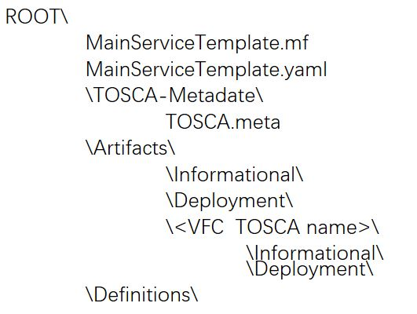
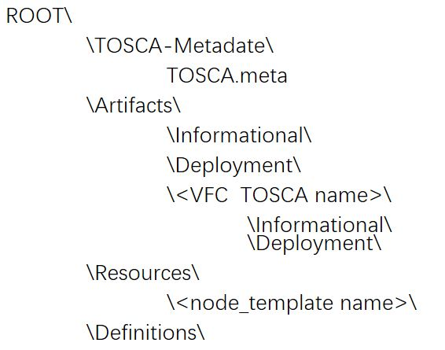
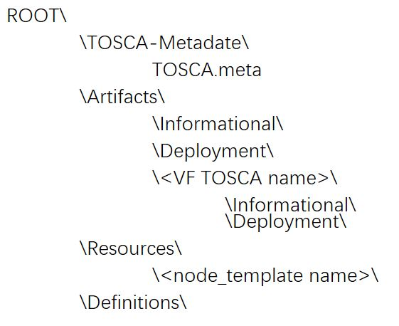

.. Copyright 2017 (China Mobile)
.. This file is licensed under the CREATIVE COMMONS ATTRIBUTION 4.0 INTERNATIONAL LICENSE
.. Full license text at https://creativecommons.org/licenses/by/4.0/legalcode

===================================
ONAP CSAR Specification (Amsterdam)
===================================

CSAR for VNF Onboarding
-----------------------
This is the currently expected structure supported by SDC, which is provided by VNF Vendor directly or via VNF Market (through VNF SDK) to SDC for VNF onboarding in design time.

|image0|

\ **Figure 1. CSAR for VNF Onboarding**

The files/directories under the root of CSAR include:

* **MainServiceTemplate.mf** is a map representing the different parts of the CSAR structure.
* **MainServiceTemplate.yaml** is a copy of the main service template located under Definitions directory.
* **TOSCA-Metadate** is a directory which contains **TOSCA.meta** file, the metadata regarding the CSAR structure.
* **Artifacts** is a directory which contains all the recoginzable artifacts (except those of type *Other*). It should be noted that images are not supported in ONAP Amsterdam as artifacts in CSAR. And all the artifacts are further classified as either *Informational* or *Deployment*, and are located in the sub-directories respectively. Artifacts located in the root directory or un-recognized folders will be classified as *Other*.
* **Definitions** is a directory which contains all the TOSCA YAML files.

The files/directories under the *Artifacts* directory further include:

* **Informational** directory which holds all the informative artifacts supported directly by SDC.
* **Deployment** directory which holds all the deployment artifacts supported directly by SDC.
* (Optional) **VFC TOSCA <name>** directory for each VFC (i.e. VF Component) which holds all the artifacts for the VFC **<name>**.

The files/directories under each **VFC TOSCA <name>** sub-directory further include:

* **Informational** directory which holds all the informative artifacts at the VFC level.
* **Deployment**  directory which holds all the deployment artifacts at the VFC level.

CSAR for VNF Life Cycle Management
----------------------------------
This section describes the CSAR generated by SDC for VNF and to be consumed by SO/VF-C/etc. for VNF life cycle management in run-time.

|image1|

\ **Figure 2. CSAR for VNF LCM**

The files/directories under the root of CSAR include:

* **TOSCA-Metadate** is a directory which contains **TOSCA.meta** file, the metadata regarding the CSAR structure.
* **Artifacts** is a directory which contains all the recoginzable artifacts (except those of type *Other*). All the artifacts are further classified as either *Informational* or *Deployment*, and are located in the sub-directories respectively. Artifacts located in the root directory or un-recognized folders will be classified as *Other*.
* **Resources** is a directory which contains a sub-directory **node_template <name>** per each node_template that has specific artifacts (artifacts that were added to the instance/customized for the instance or generated for the instance. This folder should **NOT** include artifacts of the type of the instance. (e.g. HEAT should be in the folder of the VF and not in the folder of the VF instance, HEAT_ENV will be in the folder of the instance.)
* **Definitions** is a directory which contains all the TOSCA yaml files.

The files/directories under the *Artifacts* directory further include:

* **Informational** directory which holds all the informative artifacts supported directly by SDC.
* **Deployment** directory which holds all the deployment artifacts supported directly by SDC.
* (Optional) **VFC TOSCA <name>** directory for each VFC (i.e. VF Component) which holds all the artifacts for the VFC **<name>**.

The files/directories under each **VFC TOSCA <name>** sub-directory further include:

* **Informational** directory which holds all the informative artifacts at the VFC level.
* **Deployment**  directory which holds all the deployment artifacts at the VFC level.

CSAR for Service Life Cyclem Management
---------------------------------------
This section describes the CSAR generated by SDC for Network Service or End-to-End Service orchestration in run time.

|image2|

\ **Figure 3. CSAR for Service LCM**

The files/directories under the root of CSAR include:

* **TOSCA-Metadate** is a directory which contains **TOSCA.meta** file, the metadata regarding the CSAR structure.
* **Artifacts** is a directory which contains all the recoginzable artifacts (except those of type *Other*). All the artifacts are further classified as either *Informational* or *Deployment*, and are located in the sub-directories respectively. Artifacts located in the root directory or un-recognized folders will be classified as *Other*.
* **Resources** is a directory which contains a sub-directory **node_template <name>** per each node_template that has specific artifacts (artifacts that were added to the instance/customized for the instance or generated for the instance. This folder should **NOT** include artifacts of the type of the instance. (e.g. HEAT should be in the folder of the VF and not in the folder of the VF instance, HEAT_ENV will be in the folder of the instance.)
* **Definitions** is a directory which contains all the TOSCA YAML files.

The files/directories under the *Artifacts* directory further include:

* **Informational** directory which holds all the informative artifacts supported directly by SDC.
* **Deployment** directory which holds all the deployment artifacts supported directly by SDC.
* (Optional) **VF TOSCA <name>** directory for each VF which holds all the artifacts for the VF **<name>**.

The files/directories under each **VF TOSCA <name>** sub-directory further include:

* **Informational** directory which holds all the informative artifacts at the VF level.
* **Deployment**  directory which holds all the deployment artifacts at the VF level.

Artifacts supported by SDC
--------------------------
This section enumerates the artifacts types supported by SDC.
Artifacts at the root directory or unrecognized folder(s) will be classified as type Other.

+------------------------+-------------+---------------------------------+------------------+
|       Type             | Category    |         Description             |Component Types   |
+========================+=============+=================================+==================+
|  HEAT                  | Deployment  | HEAT Base Template (YAML)       |      VF          |
+------------------------+-------------+---------------------------------+------------------+
|  HEAT_VOL              | Deployment  | HEAT Template for volumes (YAML)|      VF          |
+------------------------+-------------+---------------------------------+------------------+
|  HEAT_NET              | Deployment  | HEAT Template for network (YAML)|      VF          |
+------------------------+-------------+---------------------------------+------------------+
|  HEAT_ENV              | Deployment  |HEAT Environment artifacts (YAML)|      VF          |
+------------------------+-------------+---------------------------------+------------------+
|  HEAT_ARTIFACT         | Deployment  | Supplementary artifacts in HEAT |      VF          |
+------------------------+-------------+---------------------------------+------------------+
|  HEAT_NESTED           | Deployment  | HEAT refered by another HEAT    |      VF          |
+------------------------+-------------+---------------------------------+------------------+
|  YANG_XML              |Informational| YANG asset based XML            |Service/VF/VFC    |
+------------------------+-------------+---------------------------------+------------------+
|  VNF_CATALOG           |Informational| YANG asset based XML            |Service/VF/VFC    |
+------------------------+-------------+---------------------------------+------------------+
|MODEL_INVENTORY_PROFILE |Informational| Inventory asset (XML)           |Service/VF/VFC    |
+------------------------+-------------+---------------------------------+------------------+
|MODEL_INVENTORY_PROFILE |Informational| Inventory asset named query spec|Service/VF/VFC    |
+------------------------+-------------+---------------------------------+------------------+
|  VF_LICENSE            |Informational| VF License artifact             |      VF          |
+------------------------+-------------+---------------------------------+------------------+
|  VENDOR_LICENSE        |Informational| Vendor License artifact         |      VF          |
+------------------------+-------------+---------------------------------+------------------+
|  APPC_CONFIG           |Informational| Configuration artifact for APPC |      VF          |
+------------------------+-------------+---------------------------------+------------------+
|  VF_MODULES_METADATA   |Informational| JSON artifact for VF Modules    |Component instance|
+------------------------+-------------+---------------------------------+------------------+
|  DCAE_TOSCA            |Deployment   | DCAE TOSCA Template (YAML)      |    VF/VFCMT      |
+------------------------+-------------+---------------------------------+------------------+
|  DCAE_JSON             |Deployment   | JSON for DCAE component/template|    VF/VFCMT      |
+------------------------+-------------+---------------------------------+------------------+
|     Other              |             | Artifacts at the Root or other  | Service/VF/VFC   |
|                        |             | unrecognized folders.           |                  |
+------------------------+-------------+---------------------------------+------------------+

